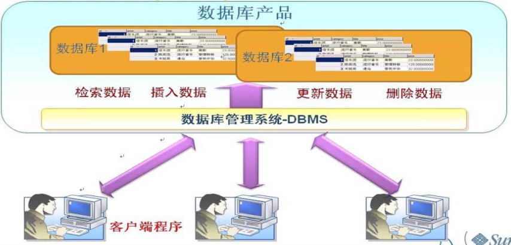

# 介绍

## 优点

- 实现数据持久化 
- 使用完整的管理系统统一管理，易于查询

## 数据库概念

### DB

- database
- 数据库
- 存储数据的仓库
- 保存了一系列有组织的数据

### DBMS

- Database Management System
- 数据库管理系统
  - 基于共享文件系统
    - access
  - 基于客户机-服务器
    - mySql，oracle，sqlServer
- 数据库通过DBMS创建和操作的容器

- 常见的数据库管理系统

  - MySQL
    - 开源免费
    - 甲骨文公司产品
    - 性能高
    - 简单，容易安装
  - Oracle
    - 甲骨文公司产品
  - DB2
    - IBM
    - 适合处理海量数据
  - SqlServer
    - 微软
    - 只能按照在window系统上

  

### SQL

- Structure Query Language
- 结构化查询语言
- 专门用来与数据库通信的语言

#### 优点

- 几乎所有的DBMS都支持SQL
- 简单易学
- 灵活使用其语言元素
- 可以进行复杂和高级的数据库操作

### 特点

- 将数据放到表中，表再放到库中 

- 一个数据库中可以有多个表，每个表都有一个的名字，用来 标识自己。表名具有唯一性。 

- 表具有一些特性，这些特性定义了数据在表中如何存储，类 似java中 “类”的设计。 

- 表由列组成，我们也称为字段。所有表都是由一个或多个列 组成的，每一列类似java 中的”属性” 

- 表中的数据是按行存储的，每一行类似于java中的“对象”。

  

## SQL语言分类

### 数据操纵语言（DML）

- Data Manipulation Language 

  - 添加
  - 删除
  - 修改
  - 查询数据库记录 （有的也称为DQL）

  - 检查数据完整性

- SQL语句

  - INSERT

    - 添加数据到数据库中

  - UPDATE

    - 修改数据库中的数据

  - DELETE

    - 删除数据库中的数据

  - **SELECT**

    - 选择数据，查询数据

    - 重点掌握

      

### 数据定义语言（DDL）

- Data Definition Language

- 用于数据库和表的
  - 创建
  - 删除
  - 修改

- SQL语句
  - **CREATE** TABLE
    - 创建数据库表
  - **ALTER** TABLE
    - 更改表结构，添加，删除，修改列的长度
  - **DROP** TABLE
    - 删除表
  - CREATE INDEX
    - 在表上建立索引
  - DROP INDEX
    - 删除索引

### 数据控制语言（DCL）

- Data Control Language 
- 定义用户的
  - 访问权限
  - 安全级别

- SQL语句
  - CRANT
    - 授予访问权限
  - REVOKE
    - 撤销访问权限
  - **COMMIT**
    - 提交事务处理
  - **ROLLBACK**
    - 事务处理回退
  - **SAVEPOINT**
    - 设置保存点
  - LOCK
    - 对数据库的特定部分进行锁定

# 语法规范

- 不区分大小写，建议关键字大写，列名，表名小写

- 每句话用 `;` 或 `\g` 结尾 

- 各子句一般分行写 

- 关键字不能缩写也不能分行 

- 用缩进提高语句的可读性
- 注释
  - 单行注释：#注释文字
  - 单行注释：-- 注释文字，注意有空格
  - 多行注释：/* 注释文字*/

# 执行顺序

