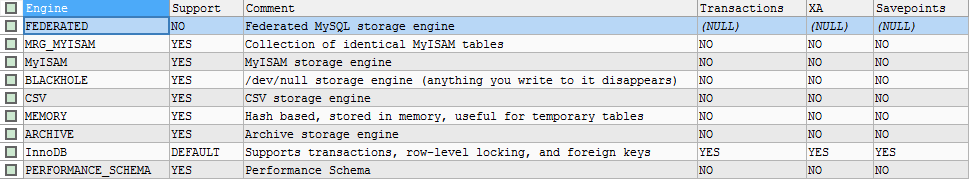

# `show databases;` 显示所有数据库

```bash
mysql> show databases;
+--------------------+
| Database           |
+--------------------+
| information_schema |
| mysql              |
| performance_schema |
| test               |
+--------------------+
4 rows in set (0.00 sec)
```

- mysql 保存用户信息
- information_schema 保存原数据信息
- performance_schema 保存性能数据信息
- test 空数据库，用于测试


# `use <databaseName>;` 使用数据库

```bash
mysql> use test
Database changed
```


# `show tables;` 显示当前数据库表

```bash
mysql> use mysql;
Database changed
mysql> show tables;
+---------------------------+
| Tables_in_mysql           |
+---------------------------+
| columns_priv              |
| db                        |
| event                     |
...略
| user                      |
+---------------------------+
24 rows in set (0.01 sec)
```

添加from参数，查看其他数据库表

```bash
mysql> show tables from performance_schema;
+----------------------------------------------+
| Tables_in_performance_schema                 |
+----------------------------------------------+
| cond_instances                               |
| events_waits_current                         |
...略
| setup_instruments                            |
| setup_timers                                 |
| threads                                      |
+----------------------------------------------+
17 rows in set (0.00 sec)
```


# `select database();` 查询当前所在库

```bash
mysql> select database();
+------------+
| database() |
+------------+
| mysql      |
+------------+
1 row in set (0.00 sec)
```


# `select version();` 查看mysql版本

```bash
mysql> select version();
+-----------+
| version() |
+-----------+
| 5.5.62    |
+-----------+
1 row in set (0.00 sec)
```

- 在cmd中使用`mysql --version`或者`mysql --V`也可以查询得到


# `desc table_name;` 显示表结构

```sql
DESC departments;


Field            Type        Null    Key     Default  Extra           
---------------  ----------  ------  ------  -------  ----------------
department_id    int(4)      NO      PRI     (NULL)   auto_increment  
department_name  varchar(3)  YES             (NULL)                   
manager_id       int(6)      YES             (NULL)                   
location_id      int(4)      YES     MUL     (NULL)                   
```


# 查看字符集

```sql
show variables like '%char%'

Variable_name             Value                                 
------------------------  --------------------------------------
character_set_client      utf8                                  
character_set_connection  utf8                                  
character_set_database    gb2312                                
character_set_filesystem  binary                                
character_set_results     utf8                                  
character_set_server      utf8                                  
character_set_system      utf8                                  
character_sets_dir        D:\dev-soft\mysql5.5\share\charsets\  
```


# 查看存储引擎

```sql
SHOW ENGINES;
```



- mysql5.5之前使用的是MyISAM，之后默认的是InnoDB


# 查看变量

- 示例

```sql
SHOW VARIABLES LIKE 'autocommit'
```


# 查看索引

```sql
show index from xxx;
```

