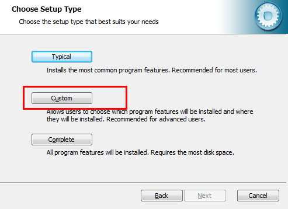
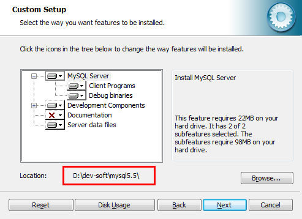
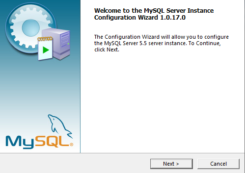
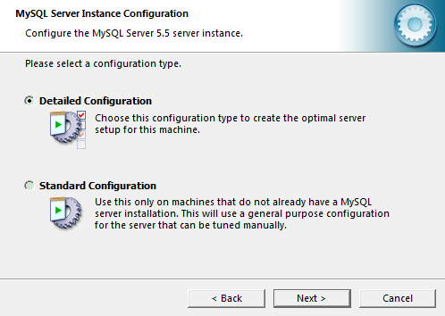
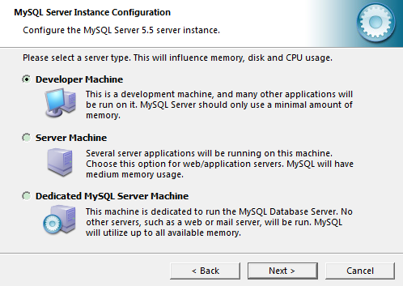
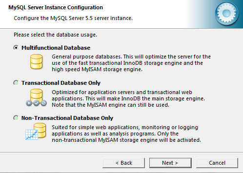
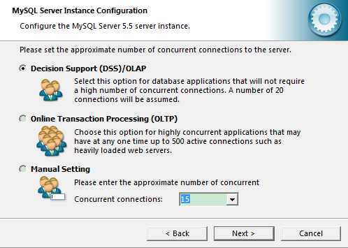
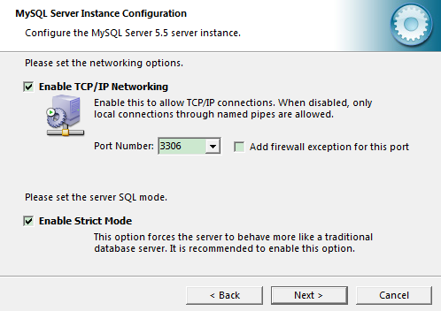
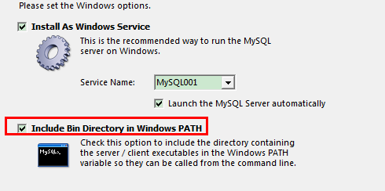

# 介绍


## 优点

- 实现数据持久化 
- 使用完整的管理系统统一管理，易于查询


## 数据库概念


### DB

- database
- 数据库
- 存储数据的仓库
- 保存了一系列有组织的数据


### DBMS

- Database Management System
- 数据库管理系统
  - 基于共享文件系统
    - access
  - 基于客户机-服务器
    - mySql，oracle，sqlServer
- 数据库通过DBMS创建和操作的容器


- 常见的数据库管理系统

  - MySQL
    - 开源免费
    - 甲骨文公司产品
    - 性能高
    - 简单，容易安装
  - Oracle
    - 甲骨文公司产品
  - DB2
    - IBM
    - 适合处理海量数据
  - SqlServer
    - 微软
    - 只能按照在window系统上

  

### SQL

- Structure Query Language
- 结构化查询语言
- 专门用来与数据库通信的语言


#### 优点

- 几乎所有的DBMS都支持SQL
- 简单易学
- 灵活使用其语言元素
- 可以进行复杂和高级的数据库操作


### 特点

- 将数据放到表中，表再放到库中 

- 一个数据库中可以有多个表，每个表都有一个的名字，用来 标识自己。表名具有唯一性。 

- 表具有一些特性，这些特性定义了数据在表中如何存储，类 似java中 “类”的设计。 

- 表由列组成，我们也称为字段。所有表都是由一个或多个列 组成的，每一列类似java 中的”属性” 

- 表中的数据是按行存储的，每一行类似于java中的“对象”。

  

## SQL语言分类

### 数据操纵语言（DML）

- Data Manipulation Language 

  - 添加
  - 删除
  - 修改
  - 查询数据库记录 （有的也称为DQL）

  - 检查数据完整性

- SQL语句

  - INSERT

    - 添加数据到数据库中

  - UPDATE

    - 修改数据库中的数据

  - DELETE

    - 删除数据库中的数据

  - **SELECT**

    - 选择数据，查询数据

    - 重点掌握

      

### 数据定义语言（DDL）

- Data Definition Language

- 用于数据库和表的
  - 创建
  - 删除
  - 修改

- SQL语句
  - **CREATE** TABLE
    - 创建数据库表
  - **ALTER** TABLE
    - 更改表结构，添加，删除，修改列的长度
  - **DROP** TABLE
    - 删除表
  - CREATE INDEX
    - 在表上建立索引
  - DROP INDEX
    - 删除索引


### 数据控制语言（DCL）

- Data Control Language 
- 定义用户的
  - 访问权限
  - 安全级别

- SQL语句
  - CRANT
    - 授予访问权限
  - REVOKE
    - 撤销访问权限
  - **COMMIT**
    - 提交事务处理
  - **ROLLBACK**
    - 事务处理回退
  - **SAVEPOINT**
    - 设置保存点
  - LOCK
    - 对数据库的特定部分进行锁定


# 安装

- 版本
  - 社区版，免费
  - 企业版，收费
- 下载，使用5.5版本
  - https://dev.mysql.com/downloads/mysql/5.5.html#downloads

- 关于卸载
  - 在控制面板中找到mysql进行卸载
  - 在安装的目录将残留文件进行删除
  - C盘中的programData（隐藏文件）找到mysql进行删除


## window安装

### 安装

- 选择自定义安装
  - 经典安装：含有服务端和客户端
  - 自定义安装
  - 完全安装



- 选择相应的文件目录，注意不要有中文和空格



### 配置

- 安装完成进入配置向导
  - 注意：安装完成后有配置向导，如果关闭后需要手动打开配置向导，进入安装目录下\bin，找到`MySQLInstanceConfig.exe` 执行文件双击即可



- 有精确配置和标准配置，这里选择精确配置



#### 服务器配置

- 选择服务器类型
  - 开发机，这里学习使用选择开发机
  - 服务器
  - 专用服务器



#### 数据库配置

- 选择数据库实例配置，用于配置使用的数据库引擎
  - 多功能型数据库，当前选择
  - 仅事务型数据库
  - 非事务型数据库



- 设置连接并发数
  - DSS，20个连接，学习使用，当前选择
  - OLTP，在线事务型，500个连接
  - 手动，自己设置




- 网络设置
  - 端口号设置，在实际生产中该端口号（3306）需要改变，防止攻击
    - 学习阶段可以不改



- 字符集设置
  - 标注字符集，适合英语国家
  - 多字符集，支持大部分国家，使用utf-8字符集
  - 自定义选择，选择utf8字符集


- 设置window配置项
  - 设置服务名称
  - 设置服务开机自启动
  - 是否配置mysql的环境变量



- 权限配置
  - 设置root用户密码
  - 设置是否可以远程访问该数据库服务
  - 暂时不创建其他用户


- 最后执行


#### 环境变量配置

- 一般安装选择安装环境变量，会自动安装，如果没有环境变量，也可以手动配置

- 选择计算机：属性：高级设置：环境变量：path：编辑
  - 在最前面添加mysql的安装目录bin的路径
  - 在cmd中输入mysql，查看命令是否生效


## 图形化客户端安装

- SQLyog
- Nevicat


# 目录结构

- D:\dev-soft\mysql5.5\bin
  - 所有MySQL命令集合
- D:\dev-soft\mysql5.5\data
  - mysql存放数据文件夹


## 配置文件

- my.ini
  - mysql的配置文件
  - 修改之后需要重启数据库服务

```ini
[client]
port=3306

[mysql]
default-character-set=utf8

# SERVER SECTION
# ----------------------------------------------------------------------
#
# The following options will be read by the MySQL Server. Make sure that
# you have installed the server correctly (see above) so it reads this 
# file.
#
[mysqld]
# 服务端监听的端口号
# The TCP/IP Port the MySQL Server will listen on
port=3306

# 当前的安装目录
#Path to installation directory. All paths are usually resolved relative to this.
basedir="D:/dev-soft/mysql5.5/"

# 数据库存储数据的文件目录
#Path to the database root
datadir="C:/ProgramData/MySQL/MySQL Server 5.5/Data/"

# 使用的字符集
character-set-server=utf8

# 使用的默认的数据库引擎
default-storage-engine=INNODB

# SQL语句的语法格式
# Set the SQL mode to strict
sql-mode="STRICT_TRANS_TABLES,NO_AUTO_CREATE_USER,NO_ENGINE_SUBSTITUTION"

# The maximum amount of concurrent sessions the MySQL server will
# allow. One of these connections will be reserved for a user with
# SUPER privileges to allow the administrator to login even if the
# connection limit has been reached.
max_connections=100

# Query cache is used to cache SELECT results and later return them
# without actual executing the same query once again. Having the query
# cache enabled may result in significant speed improvements, if your
# have a lot of identical queries and rarely changing tables. See the
# "Qcache_lowmem_prunes" status variable to check if the current value
# is high enough for your load.
# Note: In case your tables change very often or if your queries are
# textually different every time, the query cache may result in a
# slowdown instead of a performance improvement.
query_cache_size=0

# The number of open tables for all threads. Increasing this value
# increases the number of file descriptors that mysqld requires.
# Therefore you have to make sure to set the amount of open files
# allowed to at least 4096 in the variable "open-files-limit" in
# section [mysqld_safe]
table_cache=256

# Maximum size for internal (in-memory) temporary tables. If a table
# grows larger than this value, it is automatically converted to disk
# based table This limitation is for a single table. There can be many
# of them.
tmp_table_size=35M

# How many threads we should keep in a cache for reuse. When a client
# disconnects, the client's threads are put in the cache if there aren't
# more than thread_cache_size threads from before.  This greatly reduces
# the amount of thread creations needed if you have a lot of new
# connections. (Normally this doesn't give a notable performance
# improvement if you have a good thread implementation.)
thread_cache_size=8

#*** MyISAM Specific options

# The maximum size of the temporary file MySQL is allowed to use while
# recreating the index (during REPAIR, ALTER TABLE or LOAD DATA INFILE.
# If the file-size would be bigger than this, the index will be created
# through the key cache (which is slower).
myisam_max_sort_file_size=100G

# If the temporary file used for fast index creation would be bigger
# than using the key cache by the amount specified here, then prefer the
# key cache method.  This is mainly used to force long character keys in
# large tables to use the slower key cache method to create the index.
myisam_sort_buffer_size=69M

# Size of the Key Buffer, used to cache index blocks for MyISAM tables.
# Do not set it larger than 30% of your available memory, as some memory
# is also required by the OS to cache rows. Even if you're not using
# MyISAM tables, you should still set it to 8-64M as it will also be
# used for internal temporary disk tables.
key_buffer_size=55M

# Size of the buffer used for doing full table scans of MyISAM tables.
# Allocated per thread, if a full scan is needed.
read_buffer_size=64K
read_rnd_buffer_size=256K

# This buffer is allocated when MySQL needs to rebuild the index in
# REPAIR, OPTIMZE, ALTER table statements as well as in LOAD DATA INFILE
# into an empty table. It is allocated per thread so be careful with
# large settings.
sort_buffer_size=256K


#*** INNODB Specific options ***

# Use this option if you have a MySQL server with InnoDB support enabled
# but you do not plan to use it. This will save memory and disk space
# and speed up some things.
#skip-innodb

# Additional memory pool that is used by InnoDB to store metadata
# information.  If InnoDB requires more memory for this purpose it will
# start to allocate it from the OS.  As this is fast enough on most
# recent operating systems, you normally do not need to change this
# value. SHOW INNODB STATUS will display the current amount used.
innodb_additional_mem_pool_size=3M

# If set to 1, InnoDB will flush (fsync) the transaction logs to the
# disk at each commit, which offers full ACID behavior. If you are
# willing to compromise this safety, and you are running small
# transactions, you may set this to 0 or 2 to reduce disk I/O to the
# logs. Value 0 means that the log is only written to the log file and
# the log file flushed to disk approximately once per second. Value 2
# means the log is written to the log file at each commit, but the log
# file is only flushed to disk approximately once per second.
innodb_flush_log_at_trx_commit=1

# The size of the buffer InnoDB uses for buffering log data. As soon as
# it is full, InnoDB will have to flush it to disk. As it is flushed
# once per second anyway, it does not make sense to have it very large
# (even with long transactions).
innodb_log_buffer_size=2M

# InnoDB, unlike MyISAM, uses a buffer pool to cache both indexes and
# row data. The bigger you set this the less disk I/O is needed to
# access data in tables. On a dedicated database server you may set this
# parameter up to 80% of the machine physical memory size. Do not set it
# too large, though, because competition of the physical memory may
# cause paging in the operating system.  Note that on 32bit systems you
# might be limited to 2-3.5G of user level memory per process, so do not
# set it too high.
innodb_buffer_pool_size=107M

# Size of each log file in a log group. You should set the combined size
# of log files to about 25%-100% of your buffer pool size to avoid
# unneeded buffer pool flush activity on log file overwrite. However,
# note that a larger logfile size will increase the time needed for the
# recovery process.
innodb_log_file_size=54M

# Number of threads allowed inside the InnoDB kernel. The optimal value
# depends highly on the application, hardware as well as the OS
# scheduler properties. A too high value may lead to thread thrashing.
innodb_thread_concurrency=10
```


# 启动和停止MySQL服务


## 通过计算机管理方式

- 计算机-管理-服务
  - 找到MySQL相应的服务
    - 可以修改启动类型
    - 可以手动关闭和停止


## 通过命令方式

- 使用管理员的方式启动cmd
- 使用服务的名称作为参数

### 启动

- net start MySQL服务名

```bash
C:\Windows\system32>net start MySQL001
MySQL001 服务正在启动 .
MySQL001 服务已经启动成功。
```


### 停止

- net stop MySQL服务名

```bash
C:\Windows\system32>net stop MySQL001
MySQL001 服务正在停止.
MySQL001 服务已成功停止。
```


# 基本操作


## 登录

```bash
mysql -h <hostIp> -P <port> -u <username> -p[password] 
# -P port 表示端口号,大写的P
# -h host 表示主机名
# -u usernamee 表示用户名
# -p password 表示密码，小写的p，如果后面不添加密码，回车后再输入
```

```bash
C:\Users\Administrator>mysql -h localhost -P 3306 -u root -p
Enter password: ******
Welcome to the MySQL monitor.  Commands end with ; or \g.
Your MySQL connection id is 4
Server version: 5.5.62 MySQL Community Server (GPL)

Copyright (c) 2000, 2018, Oracle and/or its affiliates. All rights reserved.

Oracle is a registered trademark of Oracle Corporation and/or its
affiliates. Other names may be trademarks of their respective
owners.

Type 'help;' or '\h' for help. Type '\c' to clear the current input statement.

mysql>
```

注意：如果-p后面添加空格在输入密码，那会把密码误当做选择的数据库，从而报错，因此如果-p后面要添加密码，不要加空格

- 如果是本机的ip以及端口号就是3306，那么命令可以简化为只要填`-u`和`-p`

```bash
C:\Users\Administrator>mysql -u root -p123456
```


## 退出

```bash
exit
```


# 语法规范

- 不区分大小写，建议关键字大写，列名，表名小写

- 每句话用 `;` 或 `\g` 结尾 

- 各子句一般分行写 

- 关键字不能缩写也不能分行 

- 用缩进提高语句的可读性
- 注释
  - 单行注释：#注释文字
  - 单行注释：-- 注释文字，注意有空格
  - 多行注释：/* 注释文字*/


# 常用命令


## `show databases;` 显示所有数据库


```bash
mysql> show databases;
+--------------------+
| Database           |
+--------------------+
| information_schema |
| mysql              |
| performance_schema |
| test               |
+--------------------+
4 rows in set (0.00 sec)
```

- mysql 保存用户信息
- information_schema 保存原数据信息
- performance_schema 保存性能数据信息
- test 空数据库，用于测试


## `use <databaseName>;` 使用数据库

```bash
mysql> use test
Database changed
```


## `show tables;` 显示当前数据库表

```bash
mysql> use mysql;
Database changed
mysql> show tables;
+---------------------------+
| Tables_in_mysql           |
+---------------------------+
| columns_priv              |
| db                        |
| event                     |
...略
| user                      |
+---------------------------+
24 rows in set (0.01 sec)
```

添加from参数，查看其他数据库表

```bash
mysql> show tables from  performance_schema;
+----------------------------------------------+
| Tables_in_performance_schema                 |
+----------------------------------------------+
| cond_instances                               |
| events_waits_current                         |
...略
| setup_instruments                            |
| setup_timers                                 |
| threads                                      |
+----------------------------------------------+
17 rows in set (0.00 sec)
```


## `select database();` 查询当前所在库

```bash
mysql> select database();
+------------+
| database() |
+------------+
| mysql      |
+------------+
1 row in set (0.00 sec)
```


## `select version();` 查看mysql版本

```bash
mysql> select version();
+-----------+
| version() |
+-----------+
| 5.5.62    |
+-----------+
1 row in set (0.00 sec)
```

- 在cmd中使用`mysql --version`或者`mysql --V`也可以查询得到


# 图形客户端导入SQL脚本

- 选择对象
  - 右击：执行SQL脚本
  - 选择脚本
  - 点击执行
  - 点击刷新查看


## 表结构


### departments

```sql
CREATE TABLE `departments` (
  `department_id` int(4) NOT NULL AUTO_INCREMENT,
  `department_name` varchar(3) DEFAULT NULL,
  `manager_id` int(6) DEFAULT NULL,
  `location_id` int(4) DEFAULT NULL,
  PRIMARY KEY (`department_id`),
  KEY `loc_id_fk` (`location_id`),
  CONSTRAINT `loc_id_fk` FOREIGN KEY (`location_id`) REFERENCES `locations` (`location_id`)
) ENGINE=InnoDB AUTO_INCREMENT=271 DEFAULT CHARSET=gb2312
```

### employees

```sql
CREATE TABLE `employees` (
  `employee_id` int(6) NOT NULL AUTO_INCREMENT,
  `first_name` varchar(20) DEFAULT NULL,
  `last_name` varchar(25) DEFAULT NULL,
  `email` varchar(25) DEFAULT NULL,
  `phone_number` varchar(20) DEFAULT NULL,
  `job_id` varchar(10) DEFAULT NULL,
  `salary` double(10,2) DEFAULT NULL,
  `commission_pct` double(4,2) DEFAULT NULL,
  `manager_id` int(6) DEFAULT NULL,
  `department_id` int(4) DEFAULT NULL,
  `hiredate` datetime DEFAULT NULL,
  PRIMARY KEY (`employee_id`),
  KEY `dept_id_fk` (`department_id`),
  KEY `job_id_fk` (`job_id`),
  CONSTRAINT `dept_id_fk` FOREIGN KEY (`department_id`) REFERENCES `departments` (`department_id`),
  CONSTRAINT `job_id_fk` FOREIGN KEY (`job_id`) REFERENCES `jobs` (`job_id`)
) ENGINE=InnoDB AUTO_INCREMENT=207 DEFAULT CHARSET=gb2312
```
### jobs

```sql
CREATE TABLE `jobs` (
  `job_id` varchar(10) NOT NULL,
  `job_title` varchar(35) DEFAULT NULL,
  `min_salary` int(6) DEFAULT NULL,
  `max_salary` int(6) DEFAULT NULL,
  PRIMARY KEY (`job_id`)
) ENGINE=InnoDB DEFAULT CHARSET=gb2312
```
### locations

```sql
CREATE TABLE `locations` (
  `location_id` int(11) NOT NULL AUTO_INCREMENT,
  `street_address` varchar(40) DEFAULT NULL,
  `postal_code` varchar(12) DEFAULT NULL,
  `city` varchar(30) DEFAULT NULL,
  `state_province` varchar(25) DEFAULT NULL,
  `country_id` varchar(2) DEFAULT NULL,
  PRIMARY KEY (`location_id`)
) ENGINE=InnoDB AUTO_INCREMENT=3201 DEFAULT CHARSET=gb2312
```

