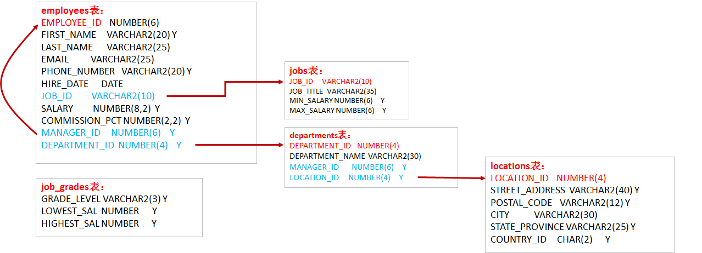

# 图形客户端导入SQL脚本

- 选择对象
  - 右击：执行SQL脚本
  - 选择脚本
  - 点击执行
  - 点击刷新查看


## 表结构




### departments

```sql
CREATE TABLE `departments` (
  `department_id` int(4) NOT NULL AUTO_INCREMENT,
  `department_name` varchar(3) DEFAULT NULL,
  `manager_id` int(6) DEFAULT NULL,
  `location_id` int(4) DEFAULT NULL,
  PRIMARY KEY (`department_id`),
  KEY `loc_id_fk` (`location_id`),
  CONSTRAINT `loc_id_fk` FOREIGN KEY (`location_id`) REFERENCES `locations` (`location_id`)
) ENGINE=InnoDB AUTO_INCREMENT=271 DEFAULT CHARSET=gb2312
```

### employees

```sql
CREATE TABLE `employees` (
  `employee_id` int(6) NOT NULL AUTO_INCREMENT,
  `first_name` varchar(20) DEFAULT NULL,
  `last_name` varchar(25) DEFAULT NULL,
  `email` varchar(25) DEFAULT NULL,
  `phone_number` varchar(20) DEFAULT NULL,
  `job_id` varchar(10) DEFAULT NULL,
  `salary` double(10,2) DEFAULT NULL,
  `commission_pct` double(4,2) DEFAULT NULL,
  `manager_id` int(6) DEFAULT NULL,
  `department_id` int(4) DEFAULT NULL,
  `hiredate` datetime DEFAULT NULL,
  PRIMARY KEY (`employee_id`),
  KEY `dept_id_fk` (`department_id`),
  KEY `job_id_fk` (`job_id`),
  CONSTRAINT `dept_id_fk` FOREIGN KEY (`department_id`) REFERENCES `departments` (`department_id`),
  CONSTRAINT `job_id_fk` FOREIGN KEY (`job_id`) REFERENCES `jobs` (`job_id`)
) ENGINE=InnoDB AUTO_INCREMENT=207 DEFAULT CHARSET=gb2312
```

### jobs

```sql
CREATE TABLE `jobs` (
  `job_id` varchar(10) NOT NULL,
  `job_title` varchar(35) DEFAULT NULL,
  `min_salary` int(6) DEFAULT NULL,
  `max_salary` int(6) DEFAULT NULL,
  PRIMARY KEY (`job_id`)
) ENGINE=InnoDB DEFAULT CHARSET=gb2312
```

### locations

```sql
CREATE TABLE `locations` (
  `location_id` int(11) NOT NULL AUTO_INCREMENT,
  `street_address` varchar(40) DEFAULT NULL,
  `postal_code` varchar(12) DEFAULT NULL,
  `city` varchar(30) DEFAULT NULL,
  `state_province` varchar(25) DEFAULT NULL,
  `country_id` varchar(2) DEFAULT NULL,
  PRIMARY KEY (`location_id`)
) ENGINE=InnoDB AUTO_INCREMENT=3201 DEFAULT CHARSET=gb2312
```

