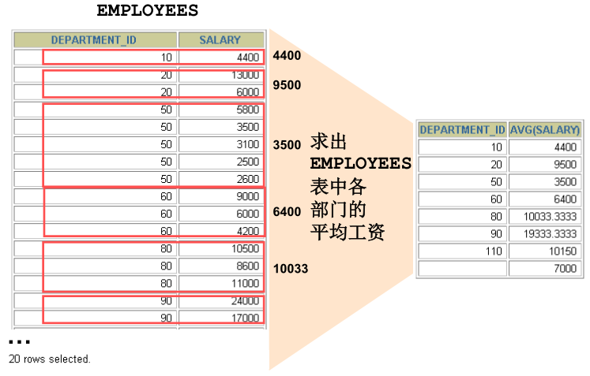
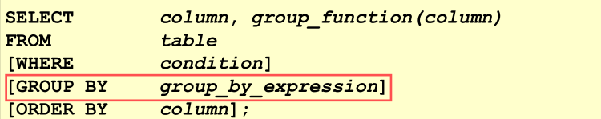

# 概述



- 对部门进行分组



- 使用GROUP BY 子句将表中的数据分成若干组

- 语法
  - 注意，查询列表特殊，要求是分组函数和group by后出现的字段

```sql
select 分组函数，列（要求出现在group by的后面）
from 表
【where 筛选条件】
group by 分组的列表
【order by 字句】
```


## 特点

- 分组查询中的筛选条件分为2类

| 分类       | 数据源       | 位置              | 关键字 | 注意                         |
| ---------- | ------------ | ----------------- | ------ | ---------------------------- |
| 分组前筛选 | 原始表       | group by 子句前面 | where  | where子句中不能使用分组函数  |
| 分组后筛选 | 分组后结果集 | group by 子句后面 | having | having子句中可以使用分组函数 |

- 分组函数做条件一定放在having子句中
- 可使用分组前筛选的，优先考虑分组前筛选，提升性能
- having和where后可以放别名，但是在oracle中是不支持的

- group by 子句支持单个字段分组，也支持多个字段分组（多个字段用逗号隔开，没有顺序要求），支持表达式或函数（使用较少）
- order by 放在整个分组查询的最后


# 简单案例

- 查询每个工种的最高工资

```sql
SELECT
  MAX(salary),
  job_id
FROM
  employees
GROUP BY job_id
```

- 查询每个位置上的部门个数

```sql
SELECT
  COUNT(1),
  location_id
FROM
  departments
GROUP BY location_id
```


# 按多个字段分组

- 查询按每个部门每个工种的员工的平均工资

```select
SELECT
  AVG(salary),
  department_id,
  job_id
FROM
  employees
GROUP BY department_id,
  job_id
```


# 添加分组前筛选

- 查询邮箱中包含a字符的，每个部门的平均工资

```sql
SELECT
  AVG(salary),
  department_id
FROM
  employees
WHERE email LIKE '%a%'
GROUP BY department_id;
```

- 查询有奖金的每个领导手下员工的最高工资

```sql
SELECT
  MAX(salary),
  manager_id
FROM
  employees
WHERE commission_pct IS NOT NULL
GROUP BY manager_id
```


# 添加分组后筛选 [having]

- 查询哪个部门的员工个数>2
  - 查询每个部门的员工个数
  - 根据上个查询结果进行筛选，查询哪个部门的员工个数>2

```sql
SELECT
  COUNT(1) AS "count",
  department_id
FROM
  employees
GROUP BY department_id
HAVING count> 2
```

- 查询每个工种有奖金的员工的最高工资>12000的工种编号和最高工资

```sql
SELECT
  MAX(salary),
  job_id
FROM
  employees
WHERE commission_pct IS NOT NULL
GROUP BY job_id
HAVING MAX(salary)> 12000
```

- 查询领导编号>102的每个领导手下的最低工资>5000的领导编号是哪个，以及最低工资

```sql
SELECT
  MIN(salary),
  manager_id
FROM
  employees
WHERE manager_id > 102
GROUP BY manager_id
HAVING MIN(salary) > 5000
```


# 按函数or表达式分组

- 按员工姓名的长度分组，查询每一组的员工个数，筛选员工个数>5的

```sql
SELECT
  LENGTH(last_name),
  COUNT(1)
FROM
  employees
GROUP BY LENGTH(last_name)
HAVING COUNT(1) > 5
```


# 添加排序

- 查询每个部门每个工种的平均工资，并且按照平均工资的高低显示
  - 添加平均工资高于10000的条件

```sql
SELECT
  AVG(salary) a,
  department_id,
  job_id
FROM
  employees
where department_id is not null
GROUP BY department_id,job_id
having a > 10000
ORDER BY AVG(salary) desc
```


# [测试]

- 查询各 job_id 的员工工资的最大值，最小值，平均值，总和，并按 job_id 升序

```sql
SELECT
  job_id,
  MAX(salary),
  MIN(salary),
  AVG(salary),
  SUM(salary)
FROM
  employees
GROUP BY job_id
ORDER BY job_id ASC
```

- 查询员工最高工资和最低工资的差距（DIFFERENCE）

```sql
SELECT
  MAX(salary) - MIN(salary) AS DIFFERENCE
FROM
  employees
```

- 查询各个管理者手下员工的最低工资，其中最低工资不能低于 6000，没有管理者的员
  工不计算在内

```sql
SELECT
  MIN(salary),
  manager_id
FROM
  employees
WHERE manager_id IS NOT NULL
GROUP BY manager_id
HAVING MIN(salary) >= 6000
```

- 查询所有部门的编号，员工数量和工资平均值,并按平均工资降序

```sql
SELECT
  department_id,
  COUNT(1),
  AVG(salary)
FROM
  employees
GROUP BY department_id
ORDER BY AVG(salary) DESC
```

- 选择具有各个 job_id 的员工人数

```sql
SELECT
  COUNT(1),
  job_id
FROM
  employees
GROUP BY job_id
```