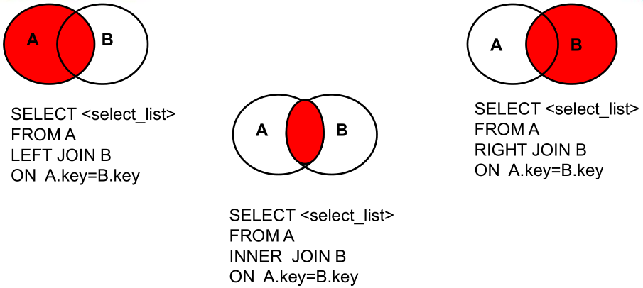
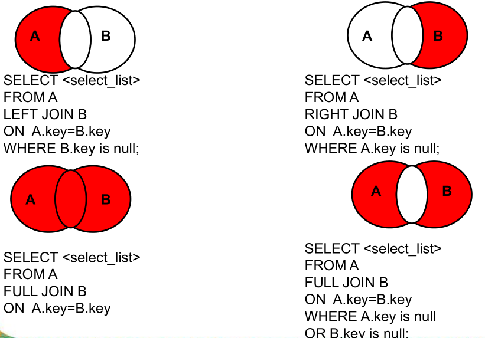

# 概述

- 多表查询，连接查询
- 当查询的字段来源于多个表时使用


## 按连接分类

- 内连接

  - 等值连接
  - 非等值连接
  - 自连接

- 外连接

  - 左外连接
  - 右外连接
  - 全外连接

- 交叉连接

  

## 按年代分类

- sql92标准
  - mysql中
    - ==只支持内连接==
  - 多表的等值连接的结果为多表的交集部分
  - n表连接，至少需要n-1个连接条件
  - 多表连接没有顺序要求
  - 一般需要为表起别名
  - 可以搭配所有查询子句，如排序，分组，筛选
- sql99标准
  - 推荐
  - mysql中
    - 支持内连接，外连接（左外+右外），交叉连接


# sql92语法


## 笛卡尔积

- 产生条件
  - 省略连接条件
  - 连接条件无效
  - 所有表中的所有行互相连接

```sql
SELECT
  last_name,
  department_name
FROM
  employees,
  departments
```


## 内连接


### 等值连接

- 查询员工名和对应的部门名

```sql
SELECT
  last_name,
  department_name
FROM
  employees,
  departments
WHERE employees.department_id = departments.department_id
```

- 查询员工名，工种号，工种名
  - 给表起别名

```sql
SELECT
  last_name,
  j.job_id,
  job_title
FROM
  employees e,
  jobs j
WHERE e.job_id = j.job_id
```

- where子句中的连接条件顺序没有要求

- 查询有奖金的员工名，部门名

```sql
SELECT
  last_name,
  department_name,
  commission_pct
FROM
  employees e,
  departments d
WHERE e.department_id = d.department_id
  AND e.commission_pct IS NOT NULL
```

- 查询城市名第二个字符为o的部门名和城市名

```sql
SELECT
  department_name,
  city
FROM
  departments d,
  locations l
WHERE d.location_id = l.location_id AND city LIKE '_o%'
```

- 添加分组
  - 查询每个城市的部门个数

```sql
SELECT
  COUNT(1),
  city
FROM
  departments d,
  locations l
WHERE d.location_id = l.location_id
GROUP BY city
```

- 查询有奖金的每个部门的部门名和部门的领导编号和该部门的最低工资

```sql
SELECT
  MIN(salary),
  department_name,
  d.manager_id
FROM
  employees e,
  departments d
WHERE e.department_id = d.department_id
  AND commission_pct IS NOT NULL
GROUP BY department_name,d.manager_id
```

- 添加排序
  - 查询每个工种的工种名和员工个数，按员工个数降序

```sql
SELECT
  COUNT(1),
  last_name,
  job_title
FROM
  employees e,
  jobs j
WHERE e.job_id = j.job_id
GROUP BY job_title
ORDER BY COUNT(1) DESC
```

- 3表连接
  - 查询员工名，部门名，所在城市

```sql
SELECT
  last_name,
  department_name,
  city
FROM
  employees e,
  departments d,
  locations l
WHERE e.department_id = d.department_id
  AND d.location_id = l.location_id
```


### 非等值连接

- where子句中是非等值判断条件

- 查询员工的工资和工资级别

```sql
SELECT
  salary,
  grade_level
FROM
  employees e,
  job_grades g
WHERE salary BETWEEN g.lowest_sal
  AND g.highest_sal
```


### 自连接

- 本表与本表关联
  - 查询员工名和领导名

```sql
SELECT
  e.last_name,
  m.last_name manager_name
FROM
  employees e,
  employees m
WHERE e.manager_id = m.employee_id
```


# sql99语法

- 语法

```sql
select 查询列表
from 表1 别名 【连接类型】
join 表2 别名
on 连接条件
【where 筛选条件】
【group by 分组】
【having 筛选条件】
【order by 排序列表】
```

- 分类
  - 内连接
    - inner
    - inner 可以省略
  - 左外
    - left 【outer】
    - outer 可以省略
  - 右外
    - right 【outer】
    - outer 可以省略
  - 全外
    - full 【outer】
    - outer 可以省略
  - 交叉
    - cross






## 内连接 [inner join]

- 语法

```sql
select 查询列表
from 表1 别名
inner join 表2 别名
on 连接条件
...
```

- 特点
  - 添加排序，分组，筛选
  - ==inner可以省略==
  - 筛选条件放在where子句，连接条件放在了on子句后面，提高了分离性
    - 便于阅读
  - inner join和sql92 效果一致，都是查询交集部分


### 等值

- 查询员工名，部门名

```sql
SELECT
  last_name,
  department_name
FROM
  employees e
  INNER JOIN departments d
    ON e.department_id = d.department_id
```

- 添加筛选
  - 查询名字包含2的员工名和工种名

```sql
SELECT
  last_name,
  job_title
FROM
  employees e
  INNER JOIN jobs j
    ON e.job_id = j.job_id
WHERE last_name LIKE '%e%'
```

- 分组+筛选
  - 查询部门个数>3的城市名和部门个数

```sql
SELECT
  COUNT(1) c,
  city
FROM
  departments d
  INNER JOIN locations l
    ON d.location_id = l.location_id
GROUP BY city
HAVING c > 3
```

- 添加排序
  - 查询哪个部门的员工个数>3的部门名和员工个数，并按照个数降序

```sql
SELECT
  COUNT(1),
  department_name
FROM
  employees e
  INNER JOIN departments d
    ON e.department_id = d.department_id
GROUP BY department_name
HAVING COUNT(1) > 3
ORDER BY COUNT(1) desc
```

- 查询员工名，部门名，工种名，并按照部门名降序

```sql
SELECT
  last_name,
  department_name,
  job_title
FROM
  employees e
  INNER JOIN departments d
    ON e.department_id = d.department_id
  INNER JOIN jobs j
    ON e.job_id = j.job_id
ORDER BY department_name DESC
```


### 非等值

- 查询工资级别个数>2 ,按工资级别降序

```sql
SELECT
  COUNT(1),
  grade_level
FROM
  employees e
INNER JOIN job_grades g
    ON e.salary BETWEEN g.lowest_sal AND g.highest_sal
GROUP BY grade_level
HAVING COUNT(1) > 2
ORDER BY grade_level DESC
```


### 自连接

- 本表与本表关联
  - 查询员工名和领导名

```sql
SELECT
  e.last_name,
  m.last_name
FROM
  employees e
  INNER JOIN employees m
    ON e.manager_id = m.employee_id
```


## 外连接 [outer join]

- 应用场景
  - 查询一个表中有，另一个表中没有的记录
- 特点
  - 外连接的查询结果为主表中的所有记录
    - 从表中有和它匹配的，显示匹配的值
    - 从表中没有和它匹配的，显示为null
    - 外连接的查询结果= 内连接的结果+主表中有而从表中没有的记录
  - 左外连接
    - left join 左边的是主表
  - 右外连接
    - right join 右边的是主表
  - 左外和右外交换两个表的顺序，可以实现同样的效果
  - 全外连接=内连接结果+表1中有但表2中没有+表2中有单表1中没有的结果

### 左外连接 [left join]

- 左边表作为主表，右边的表作为从表
- 主表在从表中没有匹配的项，用null表示

- 示例
  - 查询哪个部门没有员工

```sql
SELECT
  d.*,
  e.employee_id
FROM
  departments d
  LEFT JOIN employees e
    ON d.department_id = e.department_id
WHERE e.employee_id IS NULL
```


### 右外连接 [right join]

- 同上例

```sql
SELECT
  d.*,
  e.employee_id
FROM
 employees e
  right JOIN departments d ON d.department_id = e.department_id
WHERE e.employee_id IS NULL
```


### 全外连接 [full join]

- mysql不支持

```sql
select d.*,e.employee_id
from departments d
full join employees e
on d.department_id = e.department_id
```


## 交叉连接 [cross join]（笛卡尔积）

- 使用sql99语法实现笛卡尔积


# 注意

- 如果给表起了别名，原先的表名不能使用


# [测试]

- 显示所有员工的姓名，部门号和部门名称

```sql
SELECT
  last_name,
  d.department_id,
  department_name
FROM
  employees e,
  departments d
WHERE e.department_id = d.department_id
```

2.  查询 90 号部门员工的 job_id 和 90 号部门的 location_id 

```sql
SELECT
  job_id,
  location_id
FROM
  employees e,
  departments d
WHERE e.department_id = 90
  AND e.department_id = d.department_id
```

- 选择所有有奖金的员工的 last_name , department_name , location_id , city

```sql
SELECT
  last_name,
  department_name,
  l.location_id,
  city
FROM
  employees e,
  departments d,
  locations l
WHERE commission_pct IS NOT NULL
  AND e.department_id = d.department_id
  AND d.location_id = l.location_id
```

- 选择city在Toronto工作的员工的 last_name , job_id , department_id , department_name

```sql
SELECT
  last_name,
  job_id,
  d.department_id,
  department_name
FROM
  employees e,
  departments d,
  locations l
WHERE l.city = "Toronto"
  AND e.department_id = d.department_id
  AND d.location_id = l.location_id
```

- 查询每个工种、每个部门的部门名、工种名和最低工资

```sql
SELECT
  MIN(salary),
  department_name,
  job_title
FROM
  employees e,
  departments d,
  jobs j
WHERE e.department_id = d.department_id
  AND e.job_id = j.job_id
GROUP BY job_title,department_name
```

- 查询每个国家下的部门个数大于 2 的国家编号

```sql
SELECT
  country_id,
  COUNT(1)
FROM
  departments d,
  locations l
WHERE d.location_id = l.location_id
GROUP BY country_id
HAVING COUNT(1) > 2
```

- 查询哪个城市没有部门

```sql
SELECT
  city
FROM
  locations l
  LEFT JOIN departments d
    ON l.location_id = d.location_id
WHERE d.department_id IS NULL
```

- 查询部门名为SAL或IT的员工信息

```sql
SELECT
  e.*,
  department_name
FROM
  employees e
  LEFT JOIN departments d
    ON e.department_id = d.department_id
WHERE department_name IN ("SAL", "IT")
```


