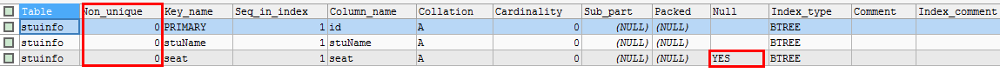
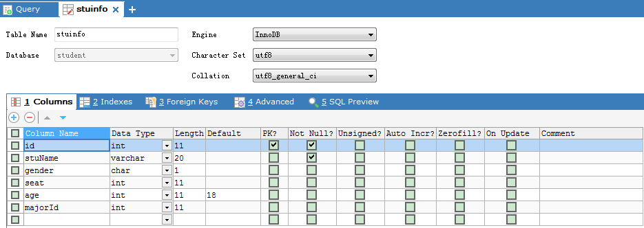
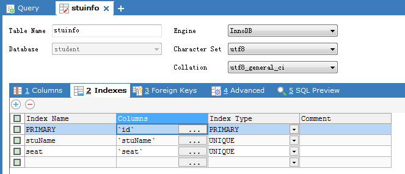
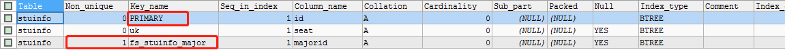

# 常见约束

- 含义
  - 一种限制，用于限制表中的数据，为了保证表中的数据的准确和可靠性


## 分类

六大约束

- NOT NULL
  - 非空，用于保证该字段的值不能为空
  - 如姓名、学号等
- DEFAULT
  - 默认，用于保证该字段有默认值
  - 如性别
- PRIMARY KEY
  - 主键，用于保证该字段的值具有唯一性
  - ==非空==
  - 如学号、员工编号等
- UNIQUE
  - 唯一，用于保证该字段的值具有唯一性
  - ==可为空==
  - 如座位号
- CHECK
  - 检查约束
  - mysql中不支持，oracle支持
    - 从oracle数据库转移到mysql不会报错
  - 如年龄（年龄的范围）、性别（只能是男，女二选一）
- FOREIGN KEY
  - 外键，用于限制两个表的关系，用于保证该字段的值必须来自于主表的关联列的值
  - 在从表添加外键约束，用于引用主表中某列的值
  - 如学生表的专业编号，员工表的部门编号，员工表的工种编号


## 添加约束的时机

- 创建表时
- 修改表时
  	

## 约束的添加分类

- 语法

```sql
CREATE TABLE 表名(
	字段名 字段类型 列级约束,
	字段名 字段类型,
	表级约束
)
```

- 列级约束
  - 不支持外键约束，其他约束都支持
- 表级约束
  - 不支持非空，默认，其他约束都支持
  - 支持外键约束


## 主键和唯一对比

|        | 唯一性 | 允许null           | 是否多个     | 是否允许组合 |
| ------ | ------ | ------------------ | ------------ | ------------ |
| 主键   | 是     | 否                 | 至多一个主键 | 是，但不推荐 |
| 唯一键 | 是     | 是，但是只能有一个 | 可多个唯一键 | 是，但不推荐 |
|        |        |                    |              |              |


## 外键

- 要求在==从表设置外键关系==

- 从表的外键列的类型和主表的关联列的类型要求一致或兼容，名称无要求

- 主表的关联列必须是一个key（一般是主键或唯一）

- 插入数据时
  
  - 先插入主表，再插入从表
  
- 删除数据时
  
  - 先删除从表，再删除主表
  - 使用级联删除
  
  ```sql
  alter table xxx add 
  ```
  
  


# 创建表时添加约束


## 添加列级约束

- 语法
  - 直接在字段名和类型后面追加 约束类型即可
  - 只支持
    - 默认
    - 非空
    - 主键
    - 唯一

示例

- 创建stuinfo,major表

```sql
CREATE DATABASE students;

USE students;

DROP TABLE stuinfo;

CREATE TABLE stuinfo(
	id INT PRIMARY KEY,			#主键
	stuName VARCHAR(20) NOT NULL UNIQUE,	#非空
	gender CHAR(1) CHECK(gender='男' OR gender ='女'),	#检查，无效
	seat INT UNIQUE,   			#唯一
	age INT DEFAULT 18,  	 	#默认约束
	majorId INT REFERENCES major(id)	#外键，无效
);

CREATE TABLE major(
	id INT PRIMARY KEY,
	majorName VARCHAR(20)
);
```

- 查看stuinfo中的所有索引，包括主键、外键、唯一
  - 注意：外键majorId失效，gender的check约束失效

```sql
show index from stuinfo;
```



- 查看表信息






## 添加表级约束

- 语法
  - 在各个字段的最下面
  - 【constraint 约束名】 约束类型(字段名) 
    - constraint可以省略

示例

```sql
DROP TABLE IF EXISTS stuinfo;

CREATE TABLE stuinfo(
	id INT,
	stuname VARCHAR(20),
	gender CHAR(1),
	seat INT,
	age INT,
	majorid INT,
	CONSTRAINT pk PRIMARY KEY(id),				#主键
	CONSTRAINT uq UNIQUE(seat),					#唯一键
	CONSTRAINT ck CHECK(gender ='男' OR gender = '女'),	#检查，不生效
	CONSTRAINT fk_stuinfo_major FOREIGN KEY(majorid) REFERENCES major(id)	#外键
);
```

- 显示索引
  - 外键生效
  - CHECK无效
  - 主键名pk无效，mysql保持默认PRIMARY为主键名称

```sql
SHOW INDEX FROM stuinfo;
```




## 通用的写法

```sql
CREATE TABLE IF NOT EXISTS stuinfo(
	id INT PRIMARY KEY,
	stuname VARCHAR(20),
	sex CHAR(1),
	age INT DEFAULT 18,
	seat INT UNIQUE,
	majorid INT,
	CONSTRAINT fk_stuinfo_major FOREIGN KEY(majorid) REFERENCES major(id)
);
```


## 联合约束

- 多个字段合并成一个约束

```sql
DROP TABLE IF EXISTS stuinfo;

CREATE TABLE stuinfo(
	id INT,
	stuname VARCHAR(20),
	gender CHAR(1),
	seat INT,
	age INT,
	majorid INT,
	CONSTRAINT pk PRIMARY KEY(id,stuname),		#主键，联合约束
	CONSTRAINT uq UNIQUE(seat),					#唯一键
	CONSTRAINT fk_stuinfo_major FOREIGN KEY(majorid) REFERENCES major(id)	#外键
);
```


# 修改表时添加约束


## 添加列级约束

```sql
alter table 表名 modify column 字段名 字段类型 新约束;
```


## 添加表级约束

```sql
alter table 表名 add 【constraint 约束名】 约束类型(字段名) 【外键的引用】;
```


## 示例

```sql
DROP TABLE IF EXISTS stuinfo;
CREATE TABLE stuinfo(
	id INT,
	stuname VARCHAR(20),
	gender CHAR(1),
	seat INT,
	age INT,
	majorid INT
)
DESC stuinfo;
```

- 添加非空约束

```sql
ALTER TABLE stuinfo MODIFY COLUMN stuname VARCHAR(20)  NOT NULL;
```

- 添加默认约束

```sql
ALTER TABLE stuinfo MODIFY COLUMN age INT DEFAULT 18;
```

- 添加主键

  - 列级约束

  ```sql
  ALTER TABLE stuinfo MODIFY COLUMN id INT PRIMARY KEY;
  ```

  - 表级约束

  ```sql
  ALTER TABLE stuinfo ADD PRIMARY KEY(id);
  ```

- 添加唯一

  - 列级约束

  ```sql
  ALTER TABLE stuinfo MODIFY COLUMN seat INT UNIQUE;
  ```

  - 表级约束

  ```sql
  ALTER TABLE stuinfo ADD UNIQUE(seat);
  ```

- 添加外键

```sql
ALTER TABLE stuinfo ADD CONSTRAINT fk_stuinfo_major FOREIGN KEY(majorid) REFERENCES major(id); 
```

- 添加外键，带有级联删除
  - 删除从表数据，可以级联删除主表数据

```sql
ALTER TABLE stuinfo ADD CONSTRAINT fk_stuinfo_major FOREIGN KEY(majorid) REFERENCES major(id) on delete cascade;
```

- 添加外键，级联置空
  - 删除从表数据，主表外键连接字段设置为null

```sql
ALTER TABLE stuinfo ADD CONSTRAINT fk_stuinfo_major FOREIGN KEY(majorid) REFERENCES major(id) on delete set null;
```


# 修改表时删除约束

- 删除非空约束

```sql
ALTER TABLE stuinfo MODIFY COLUMN stuname VARCHAR(20) NULL;
```

- 删除默认约束

```sql
ALTER TABLE stuinfo MODIFY COLUMN age INT ;
```

- 删除主键

```sql
ALTER TABLE stuinfo DROP PRIMARY KEY;
```

- 删除唯一

```sql
ALTER TABLE stuinfo DROP INDEX seat;
```

- 删除外键

```sql
ALTER TABLE stuinfo DROP FOREIGN KEY fk_stuinfo_major;
SHOW INDEX FROM stuinfo;
```


# [测试]

#1.向表emp2的id列中添加PRIMARY KEY约束（my_emp_id_pk）

ALTER TABLE emp2 MODIFY COLUMN id INT PRIMARY KEY;
ALTER TABLE emp2 ADD CONSTRAINT my_emp_id_pk PRIMARY KEY(id);

#2.	向表dept2的id列中添加PRIMARY KEY约束（my_dept_id_pk）

#3.	向表emp2中添加列dept_id，并在其中定义FOREIGN KEY约束，与之相关联的列是dept2表中的id列。
ALTER TABLE emp2 ADD COLUMN dept_id INT;
ALTER TABLE emp2 ADD CONSTRAINT fk_emp2_dept2 FOREIGN KEY(dept_id) REFERENCES dept2(id);

				位置		支持的约束类型			是否可以起约束名
	列级约束：	列的后面	语法都支持，但外键没有效果	不可以
	表级约束：	所有列的下面	默认和非空不支持，其他支持	可以（主键没有效果）