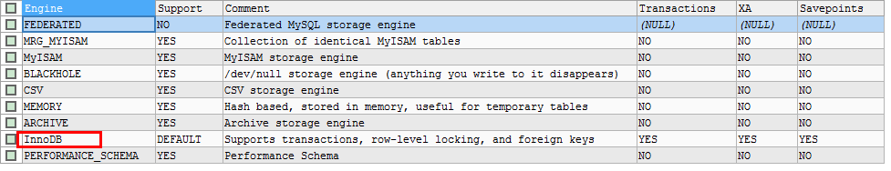

# TCL

- Transaction Control Language
  
- 事务控制语言
  
- 事务

  - 一个或一组sql语句组成一个执行单元
  - 这个执行单元要么全部执行，要么全部不执行

  

- 案例：转账

```text
张三丰  1000
郭襄	1000

update 表 set 张三丰的余额=500 where name='张三丰'
意外
update 表 set 郭襄的余额=1500 where name='郭襄'
```


# 关于存储引擎

- 使用show engines查看
- 默认使用InnoDB，支持事务
  - 其他存储引擎 MyISAM和Memory不支持


# 事务的特性

- 以第一个 DML 语句的执行作为开始
- 以下面的其中之一作为结束
  - COMMIT  或 ROLLBACK  语句
  - DDL 或 DCL 语句（自动提交）
  - 用户会话正常结束
  - 系统异常终了

## ACID

- 原子性：一个事务不可再分割，要么都执行要么都不执行
- 一致性：一个事务执行会使数据从一个一致状态切换到另外一个一致状态
- 隔离性：一个事务的执行不受其他事务的干扰
- 持久性：一个事务一旦提交，则会永久的改变数据库的数据.


# 事务的创建


## 分类

- 隐式事务
  - 事务没有明显的开启和结束的标记
    - 如insert、update、delete语句 
      - delete from 表 where id =1;

- 显式事务

  - 事务具有明显的开启和结束的标记
  - 查看事务是否开启 `SHOW VARIABLES LIKE 'autocommit'`
  - 前提
    - 必须先设置自动提交功能为禁用`set autocommit=0;`
      - ==只针对当前会话有效==

  

## 步骤

```sql
# 开启事务
set autocommit=0;
start transaction;  # 可选的

# 编写事务中的sql语句(select insert update delete)
语句1;
语句2;
...

#设置保存点
savepoint 节点名;

# 结束事务
commit;		# 提交事务
rollback;	# 回滚事务
```

- 示例

```sql
#开启事务
SET autocommit=0;
START TRANSACTION;
#编写一组事务的语句
UPDATE account SET balance = 1000 WHERE username='张无忌';
UPDATE account SET balance = 1000 WHERE username='赵敏';

#结束事务
ROLLBACK; #或 commit;

SELECT * FROM account;
```


# 事务并发出现的问题

- 对于同时运行的多个事务，当这些事务访问数据库中相同的数据时，如果没有采取必要的隔离机制, 就会导致各种并发问题


## 脏读

- 更新操作产生
- 对于两个事务 T1, T2
- T1 读取已经被 T2 更新字段值A（原先是B），但T2还没有被提交的字段
  - T2更改后，T1读取到
- 之后若 T2 回滚（恢复成B）, T1读取的内容（读取到A）就是临时且无效的

## 不可重复读

- 更新操作产生
- 对于两个事务T1，T2
- T1 读取了一个字段（此时值为A），然后 T2 更新了该字段（更改为B）
  - T2更改前，T1读取到
- 之后，T1再次读取同一个字段（读取到B）, 值就不同了
  - T1事务没有结束，但连续2次读取的值发生了变化

## 幻读

- 插入操作时产生
- 对于两个事务T1, T2
- T1 从一个表中读取了一个字段, 然后 T2 在该表中 插入了一些新的行
  - T2增加前，T1读取到
- 之后，如果 T1 再次读取同一个表, 就会多出几行


# 数据库事务的隔离性

- 数据库系统必须具有==隔离并发运行各个事务==的能力，使它们不会相互影响，避免各种并发问题


# 隔离级别

- 一个事务与其他事务隔离的程度称为隔离级别
- 数据库规定了多种事务隔离级别，不同隔离级别对应不同的干扰程度
- 隔离级别越高，数据一致性就越好，但并发性越弱

| 隔离级别                           | 描述                                                         | 数据库支持                   | 脏读 | 不可重复读 | 幻读 |
| ---------------------------------- | ------------------------------------------------------------ | ---------------------------- | ---- | ---------- | ---- |
| read uncommiitted<br/>读未提交数据 | 允许事务读取未被其他事务提交的变更                           | mysql                        | 有   | 有         | 有   |
| read committed<br/>读已提交数据    | 只允许事务读取已经被其他事务提交的变更                       | mysql<br/>oracle（默认使用） | 无   | 有         | 有   |
| repeatable read<br/>可重复读       | 确保事务可多次从一个字段中读取相的值，在整个事务持续期间，==禁止==其他事务对这个字段进行更新 | mysql（默认使用）            | 无   | 无         | 有   |
| serializable<br/>串行化            | 确保事务可从一个表中读取相同的行，在这个事务持续期间，==禁止==其他事务对==该表==执行插入，更新，删除操作，性能低下（表锁） | mysql<br/>oracle             | 无   | 无         | 无   |


## 查看隔离级别

-  每启动一个 mysql 程序, 就会获得一个单独的数据库连接
- 每个数据库连接都有一个全局变量 @@tx_isolation, 表示当前的事务隔离级别

```sql
select @@tx_isolation;

@@tx_isolation   
-----------------
REPEATABLE-READ  
```


## 设置隔离级别

- 设置当前 mySQL 连接的隔离级别

```sql
set session transaction isolation level read committed; # 隔离级别 read committed
```

- 设置数据库系统的全局的隔离级别

```sql
set global transaction isolation level read committed;
```


## 示例

- 创建表和初始数据

```sql
CREATE TABLE account(
	id INT,
	NAME VARCHAR(20)
);

INSERT INTO account VALUES(1,'张飞');
INSERT INTO account VALUES(2,'关羽');

SELECT * FROM account;
```

- 查看当前隔离级别（开启2个cmd输入控制台，查看隔离级别）

```sql
mysql> select @@tx_isolation;
+-----------------+
| @@tx_isolation  |
+-----------------+
| REPEATABLE-READ |
+-----------------+
1 row in set (0.00 sec)
```

- 由于有中文字符，需要设置为gbk，在控制台方便显示（2个都要设置）

```sql
mysql> set names gbk;
```


### read uncommitted

- 将2个客户端都设置为read uncommitted的隔离级别

```sql
set session transaction isolation level read uncommitted;
```

- 进行脏读测试

| 事务T1                                       | 事务T2                                                       |
| -------------------------------------------- | ------------------------------------------------------------ |
| set autocommit = 0;                          |                                                              |
| update account set name='wangwu' where id=1; |                                                              |
|                                              | set autocommit=0;                                            |
|                                              | select * from account;<br />显示：<br />1 --- wangwu<br />2 --- 关羽 |
| rollback;                                    |                                                              |
|                                              | select * from account;<br />显示：<br />1 --- 张飞<br />2 --- 关羽 |

- 可以看到脏读现象


### read committed

- 将2个客户端都设置为read committed的隔离级别

```sql
set session transaction isolation level read committed;
```

- 测试不可重复读

| 事务T1                                      | 事务T2                                                       |
| ------------------------------------------- | ------------------------------------------------------------ |
| set autocommit = 0;                         |                                                              |
| update account set name=‘lisi’ where id =1; |                                                              |
|                                             | set autocommit=0;                                            |
|                                             | select * from account;<br />显示：<br />1— 张飞<br />2 — 关羽 |
| commit;                                     |                                                              |
|                                             | select * from account;<br />显示：<br />1 — lisi（2次结果不一样）<br />2 — 关羽 |

- 事务提交后，出现了不可重复读现象


### repeatable read

```sql
set session transaction isolation level repeatable read;
```

- 测试可重复读

| 事务T1                                                | 事务T2                                                       |
| ----------------------------------------------------- | ------------------------------------------------------------ |
| set autocommit=0;                                     |                                                              |
| update account set name = ‘zhangsan’ where id=1;      |                                                              |
|                                                       | set autocommit = 0;                                          |
|                                                       | select * from account;<br />显示：<br />1 — lisi<br />2 — 关羽 |
| commit;                                               |                                                              |
|                                                       | select * from account;<br />显示：<br />1 — lisi<br />2 — 关羽 |
| set autocommit=0;                                     |                                                              |
| select * from account;<br />注意：此时读取的是2行数据 |                                                              |
|                                                       | insert into account values(3,’new’);<br />返回1行受到影响    |
| update account set name=‘all’;<br />注意：在此阻塞    |                                                              |
|                                                       | commit;                                                      |
| 返回update成功操作3行，说明有幻读产生                 |                                                              |
| commit;                                               |                                                              |
|                                                       | select * from account;<br />发现3列数据都被更改              |


### serializable

- 只要有插入更新修改的事务出现，其他事务的所有操作（包括读）进行阻塞，直到之前的事务提交再执行，没有幻读产生

```sql
set session transaction isolation level serializable;
```

- 

| 事务T1                                     | 事务T2                              |
| ------------------------------------------ | ----------------------------------- |
| set autocommit=0;                          | set autocommit=0;                   |
|                                            | insert into account valuses(7,’7’); |
| select * from account;<br />注意：在此阻塞 |                                     |
|                                            | commit;                             |
| 阻塞解除，select 的结果显示最新的结果      |                                     |
|                                            |                                     |


# 事务对于delete和truncate的处理的区别

- delete可以回滚

```sql
SET autocommit=0;
START TRANSACTION;

DELETE FROM account;
ROLLBACK;
```

- truncate 回滚无效

```sql
SET autocommit=0;
START TRANSACTION;

truncate table account;
ROLLBACK;
```


# savepoint 的使用

- 只与rollback to 搭配使用

```sql
SET autocommit=0;

START TRANSACTION;
DELETE FROM account WHERE id=1;
SAVEPOINT a;	#设置保存点
DELETE FROM account WHERE id=2;
ROLLBACK TO a;	#回滚到保存点

SELECT * FROM account;
```

- 执行结果是28没有删除，回滚了，而25删除成功


# 查看是否自动提交

```sql
SHOW VARIABLES LIKE 'autocommit';
```


# 查看数据库引擎

```sql
SHOW ENGINES;
```

