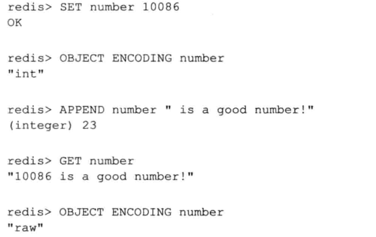
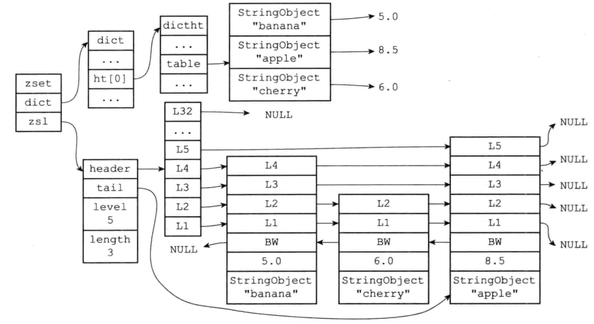

# 简单动态字符串 SDS

- simple dynamic string-----SDS
- 自定义实现简单动态字符串对象

- 用于表示键和值
- 用于保持数据库中的字符串值
- 用作缓冲区
  - AOF模块中的AOF缓冲区

- SDS结构


- 与C字符串对比好处
  - 获取字符串长度复杂度是O(1)—STRLEN
    - 而C字符串是O(N)
  - 防止了调用strcat等方法时出现了缓冲区溢出的问题
    - 在SDS中有sdscat，避免了溢出问题，提前有长度属性
  - SDS有空间预分配
    - 每次对SDS进行修改，扩展时
      - 如果SDS的长度len属性小于1MB，则分配同样大小的预分配空间，即双倍大小+1Byte（保存空格符）
      - 如果len属性值大于1MB，则分配1MB+1Byte大小的预分配空间
      - 通过预分配，redis减少连续执行字符串增长操作所需的内存分配次数
        - 在扩展SDS之前，先判断空间是否足够，足够则直接使用未使用的空间，无须执行内存分配
    - C字符串每次扩展大小需要重新分配内存，耗时

- 惰性空间的释放
  - sdstrim(s,“XY”) // 移除s中的X和Y
  - 空间没有释放，而是作为预分配空间使用


- 可以存储图片，音频等信息
  - SDS中的buf是字节数组，保持二进制数据，而非字符，通过len表示文件的长度
  - C中存储的是字符，同时空字符表示结束，那么对于图片等特殊文件，如果中间含有空字符则会丢失数据

- 为什么SDS最后要有一个空字符？
  - 为了兼容C字符串函数调用


# 链表 LinkedList

- 双端链表

  


# 字典 Map

- HLEN
- HGETALL
- 使用MurmurHash2计算hashCode
- hash碰撞
  - 相同hashCode的不同元素使用链地址法解决键冲突
  - 单向链表
  - 每个hash节点都有一个next指针
  - 将新节点添加到头部位置
    - 由于没有存储链表表尾节点信息，只有头节点

- 负载因子：hash表已存储节点数量/hash表大小
- rehash
  - 负载因子大于一定值，扩表，当前表的2<sup>n</sup>倍
  - 负载因子小于一定值0.1，缩表
  - 2个hash表，ht[0]，ht[1]
    - 将ht[0]中元素重新hash放入ht[1]中
    - ht[0]为空表时，释放ht[0]
    - ht[1]作为ht[0]
    - 重新创建一个空白的hash表为ht[1]

- 渐近式rehash
  - 实际使用
  - 如果要进行rehash，每次对元素的操作，进行一次迁移
  - 避免了集中式rehash对系统性能的影响，分而治之的思想，对rehash的计算工作分到了各个key的添加，查找，删除上
  - 如果在rehash期间查找，先在ht[0]上查找，没有再从ht[1]上查找


# 跳跃表 skiplist

- zset使用跳表实现
- 跳表是有序集合底层实现之一
- 每个跳表节点的层高是1-32之间的随机数
- 时间复杂度是O(logn)-O(n)
- 跳表中的节点按照分值大小进行排序
  - 分值相同，节点按照==成员对象的大小==进行排序


# 整数集合

- set
- SADD

- 集合键底层实现之一
- 底层实现是数组，以有序，无重复的方式保存元素，在有需要时添加元素的类型，改变数组的类型
- 整数集合只支持升级操作，不支持降级操作


# 压缩列表

- HMSET
- 为了节约redis的内存开发的
- 顺序型数据结构
- 用作列表键，哈希键的底层实现之一
- 压缩列表可以包含多个节点，每个节点保持一个字节数组或整数值
- 添加新节点到压缩列表，或从压缩列表中删除节点，可能会引发锁更新操作


# 对象

- 基于之前的数据对象，形成对象系统
- 字符串对象，列表对象，哈希对象，集合对象，有序集合对象
  - 至少使用前面的数据结构对象的一种或多种
  - 针对不同的使用场景，为对象设置不同的数据结构实现，优化使用效率
  - 基于引用计数的内存回收机制
    - 不在使用某个对象时，对象所占用的内存自动释放
  - 通过引用实现了对象共享
- redis对象带有访问时间记录信息，计算数据库键的空转时长
  - 在服务器使用了maxmemory功能下，空转时长大的会先比服务器删除


## 对象的类型与编码

- 使用对象表示数据库的键和值
- SET msg “helloworld”
  - key是包含了字符串值“msg”
  - value包含了字符串值“helloworld”
- redis对象的数据结构redisObject


- type
  - 记录对象的类型
    - REDIS_STRING
    - REDIS_LIST
    - REDIS_HASH
    - REDIS_SET
    - REDIS_ZSET
  - 使用TYPE命令查看value的类型

- encoding


- 使用OBJECT ENCODING 查看value的编码


- redis在不同的场景对一个对象value使用不同的编码，提升性能

  - 如在列表对象包含元素较少时，redis使用压缩列表作为列表的底层实现

    - 压缩列表比双端链表更节约内存，在元素数量较少时，在内存中以连续块方式保存压缩列表比双端列表可以更快的写入到缓存中

    - 列对象增加时，对象将底层实现转换为适合保存大量元素的双端链表


## 字符串对象 String

- 编码可以是 int，raw，embstr


### int

- SET num 11
- OBJECT ENCODING num
  - int

- 如果value是整数值，且可以用Long表示，则保存在字符串对象结构prt属性中，编码设置为int
  - 使用时将ptr属性转换为long


### raw

- 如果value保存的是字符串，且长度大于32字节，使用SDS保存，编码设置为raw


### embstr

- 专门用于短字符串的优化编码方式

- 与raw一样，使用redisObject和sdshdr结构表示字符串对象

  - raw会调用2次内存分配创建redisObject结构和sdshdr结构
  - embstr会调用一次内存分配一块连续的空间，包含redisObject和sdshdr结构

  

- 如果value是一个字符串，长度小于32字节，编码是embstr
- 优势
  - 分配内存比raw少一次
  - 释放内存比raw少一次
  - embstr存储在一块连续内存中，访问速度更快
- 注意
  - long double 类型表示的浮点数在redis中作为字符串保持
  - 先转换为字符串值再保持
  - 在操作long double 类型时，转换为long类型，操作完成后再转换为string类型存储
    - 如INCRBYFLOAT操作


### 编码的转换时机

- int—> raw
  - 执行APPEND命令


- embstr—> raw
  - embstr是只读的，一旦操作，embstr会转换为raw，然后再执行修改命令
  - 只要修改，总会变为raw，无论是否超过了32字节


## 列表对象 List

- 注意：字符串对象是唯一被其他四种对象嵌套使用的对象，简化称为StringObject

- 示例
  - RPUSH numbers 1 “three” 5

### ziplist


### linkedlist


### 编码转换

- 使用ziplist必须同时满足
  - 列表中元素所有字符串长度小于64Byte
  - 列表对象保存的元素个数小于512个

- 不满足则使用–>linkedlist

- 注意可以通过配置文件中list-max-ziplist-value和list-max-ziplist-entries进行修改上面的2个转换条件的值


## 哈希对象 Hash

- 示例

```redis
HSET profile name “TOM"
HSET profile age 25
HSET profile career "Programmer"
```

### ziplist


- 存储在ziplist是紧挨在一起

### hashtable


### 编码转换

- 同列表对象，为ziplist的条件同时满足
  - 键值对个数小于512
  - 所有的键和值的字符串长度都小于64Byte
- 可通过参数hash-max-ziplist-value和hash-max-ziplist-entries修改


## 集合对象 Set

- 示例

```redis
SADD numbers 1 3 5
```


### intset


### hashtable


### 编码转换

- 同时满足使用intset
  - 集合对象所有元素都是整数值
  - 对象元素个数不超过512个
- 参数配置set-max-intset-entries


## 有序集合对象 ZSet

- 示例

```redis
ZADD price 8.5 apple 5.0 banana 6.0 cherry
```


### ziplist

- 2个紧挨的压缩节点表存储成员member和分值score

- 压缩表内按照分值从小到大


### skiplist&map

- 同时使用跳表和字典表实现




- 注意：绘图为了便于查看结构，其实上图中StringObject在内存中是共享的，因此较少的内存浪费
- 为什么同时使用跳表和字典实现？
  - 只用字典实现，查找O(1)复杂度
    - 字典是无序的
    - 使用ZRANK，ZRANGE 对字典内元素进行排序
      - 时间复杂度至少O(nlogn)
      - 空间复杂度增加O(n)内存空间
  - 只使用跳表，执行范围操作优点保留
    - 查找时间复杂度O(logn)
  - 两者结合，得到最优时间复杂度


### 编码转换

- 同时满足如下，使用ziplist
  - 元素个数不超过128
  - 所有元素大小都小于64byte
- 参数配置zset-max-ziplist-value 和 zset-max-ziplist-entries


## 多态命令

- 命令在执行前通过redisObject中的type进行判断，如果不能执行抛出异常


# 内存回收

- C没有内存回收
- Redis自己实现了引用计数 reference counting 实现内存回收机制
- 在redisObject中有一个int refcount属性用于计数
- 创建一个对象时，该对象的refcount = 1
- 该对象被一个新程序引用时，refcount += 1
- 当对象不再被一个程序引用，refcount -= 1
- 当refcount == 0，对象占用的内存会被释放


# 对象共享


## 共享数值，数值常量池

- 提前创建0-9999范围的数值对象
- 没有字符串常量池，不共享字符串对象
  - 因为字符串太多，每次查找验证耗费资源大，复杂度是O(n)，如果是hash表内字符串那么就是O(n*n)


# 对象的空转时长

- redisObject 包含lru属性
  - 记录最后依次被访问的时间
- OBJECT IDLETIME 打印空转时长
  - 当前时间减去lru时间
  - 该命令特殊，执行不会更改lru
- 用处
  - 在服务器内存超过maxmemory，进行回收时，找到空转时长最高的进行回收，释放内存
  - 要求回收算法是volatile-lru 或者allkeys-lru