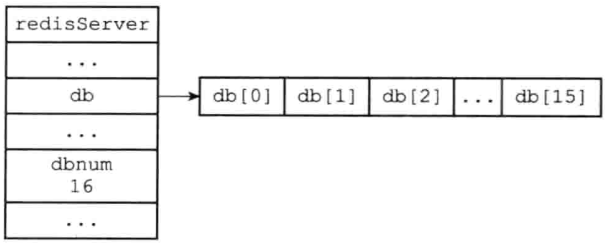
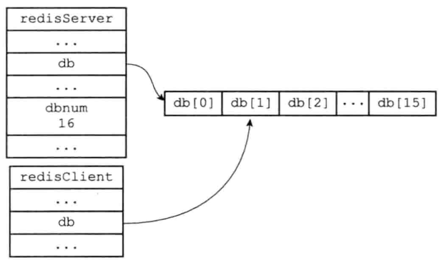
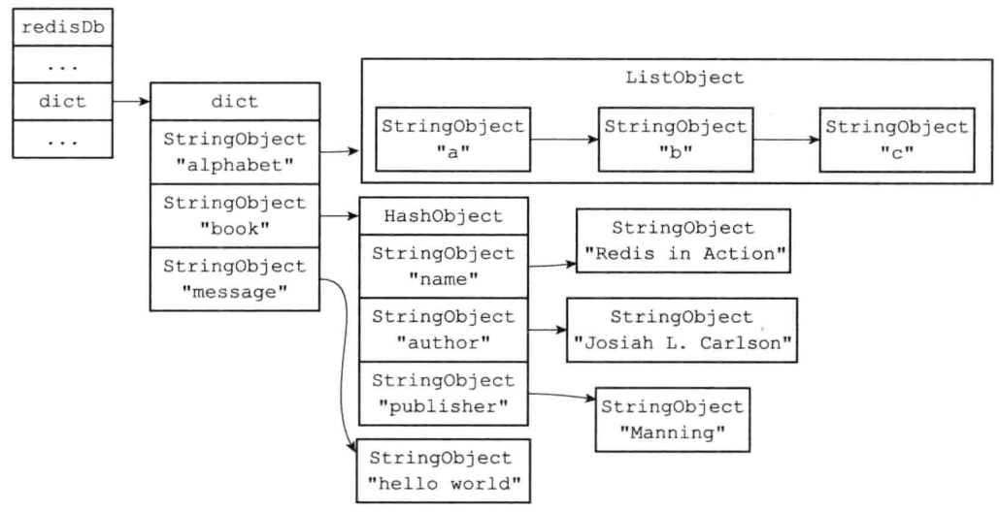
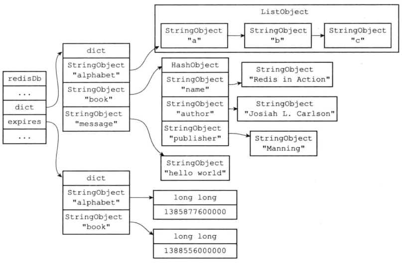
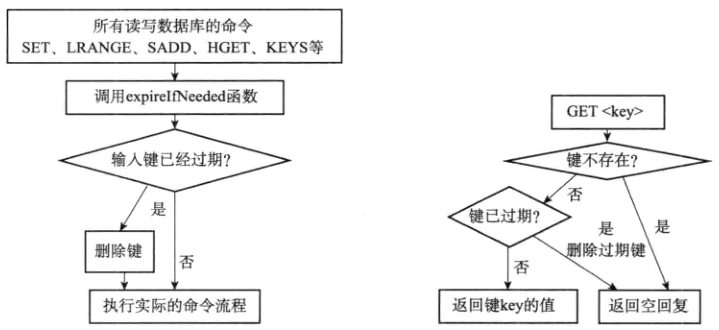
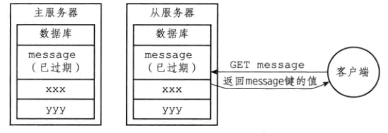
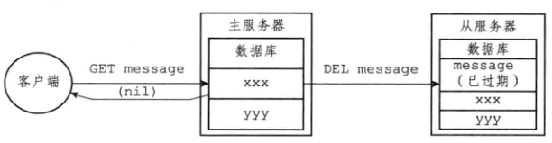

## server端数据库

- 保存在redis.sh/redisServer中的db数组中
  - db数组每一个元素都是redis.sh/redisDb结构
  - 每个redisDb代表一个数据库
  - dbnum 由服务器配置的database选项决定
    - 默认16，默认创建16个数据库

```c
struct redisServer{
    ...
    // 一个数组，保存服务器中的所有数据库
    redisDb *db;
    // 服务器的数据库数量
    int dbnum;
}
```





## client端

```c
typedef struct redisClient{
    // 记录客户端当前正在使用的数据库
    redisDb *db;
} redisClient
```

- 使用SELECT 切换数据库
  - 通过修改redisClient.db指针，让它指向服务器中的不同数据库
- 如切换到1号数据库




## 数据库键空间

```c
typeof struct redisDb{
    // 数据库键空间，保存数据库中所有键值对
    dict *dict;
    // 过期字典，保存键的过期时间
    dict *expires;
    ...
}redisDb
```

- 键空间的键是数据库的键，每个键都是一个字符串对象
- 键空间的值是数据库的值，每个值可是字符串对象，列表对象，哈希对象等

- 对键的操作，如增删改查都是基于dict结构的
  - FLUSHDB 是删空键空间中所有键值对
  - DBSIZE 返回键空间中包含键值对的数量
  - EXISTS，RENAME，KEYS等都是对键空间进行操作


- 示例

```redis
SET message "hello world"
RPUSH alphabet "a" "b" "c"
HSET book name "Redis in Action"
HSET book author "Josiah L.Carlson"
HSET publisher "Manning"
```




### 读写键空间的维护操作

- 读取一个键，服务器依据键是否存在更新键空间的hit，或者miss
  - 在INFO stats命令的keyspace_hits 和 keyspace_miss查看
- 读取一个键，服务器更新键的LRU时间，最后一次使用时间，用于计算键的空闲时间
- 读取一个键，发现已经过期，服务器删除该过期键
- watch该键，服务器对该键进行修改后，标记dirty，让事务程序注意
- 每次修改一个键，对该键计数器+1
  - 计数器触发持久化与复制操作
- 如果服务开启通知功能，键修改后服务器按配置发送通知


## 键的过期时间

- 客户端以s，ms为精度在数据库中的某个键设置生存时间TTL
- 在指定时间后，服务器自动删除生存时间为0的键

- 命令
  - EXPIRE <key> <ttl> 
    - key的生存时间是ttl秒
  - PEXPIRE <key> <ttl>
    - key的生存时间是ttl毫秒
  - EXPIREAT <key><timestamp>
    - key的过期时间设置为timestamp指定的秒数时间戳
  - PEXPIREAT <key><timestamp>
    - 同上，不过是ms时间戳
  - PERSIST <key>
    - PEXPIREAT  的反操作，解除键的过期时间
  - TTL <key>
    - 判断该键是否过期，大于等于0说明没有过期
- SETEX与EXPIRE原理类似，但是只能用于字符串类型
- 通过 PEXPIREAT 实现了EXPIRE ，PEXPIRE ，EXPIREAT


### 保存过期时间

- redisDb结构的expires字典保存了数据库中所有键的过期时间
  - 字典的键是一个指针，指向某个数据库键
  - 字典的值是long类型，保存了过期时间，精度ms的UNIX时间戳



- 注意：dict和expires中的键都是同一个对象，该图是为了方便画了2个


### 过期键删除策略

- 定时删除
  - 给每个键创建一个定时器，当键过期时删除
  - 对内存友好，内存立刻释放，没有垃圾数据
  - 对cpu时间不友好，键过多，对服务器的响应时间和吞吐量有影响
- 惰性删除
  - 每次取键是判断，如果过期，删除键
  - 对cpu时间友好，对内存不友好，如果一直不访问，那么键一直存在内存中
- 定期删除
  - 每隔一段时间，对数据库进行检查，删除过期的键
  - 前面2种策略的折中和整合
  - 难点
    - 指定删除操作执行时长和频率
    - 设置时长太长，频率过高，退化成定时删除
    - 设置时长短，频率过低，退化成惰性删除


#### redis过期键删除策略

- 使用惰性删除和定期删除结合

  

##### 惰性删除策略实现

- 对键操作都会进行expireIfNeed函数
  - 过期则删除，否则继续
- 当键存在，按照存在的情况执行
- 键不存在，获取键过期被expireIfNeed函数删除，命令按照不存在执行



##### 定期删除策略实现

- redis服务器周期性操作redis.c/serverCron函数时执行redis.h/activeExpireCycle函数实现
  - 在规定时间内分多次遍历服务器中的各个数据库
  - 从expires字典中随机检查一部分键的过期时间，删除过期键
    - 默认16个库，20个键
    - 全局变量current_db记录当前清理的数据库编号，下次清理从该编号数据库下一个继续


## AOF,RDB,复制功能对过期键的处理


### RDB

- 执行SAVE或者BGSAVE创建一个RDB文件，对数据库中的键进行检查，过期的键不存
- 载入RDB文件
  - 作为主服务器，载入RDB时，对保持的键进行判断是否过期，过期不载
  - 作为从服务器，载入RDB时，所有键载入，主从同步时，从服务器清空


### AOF

- 文件写入：当过期键被惰性删除，或者定期删除，程序在AOF文件中追加一条DEL命令
- AOF重写：对数据库中的过期的键进行检查，过期不会保存在新的AOF文件中


### 复制

- 服务器在复制模式下，主服务器删除过期键后，发送一个DEL命令给从服务器删除
- 从服务器在执行客户端发送的读命令，不会对过期键进行处理，==依然返回该键的值==
- 通过主服务器控制从服务器的过期键，保证数据的一致性





## 数据库通知

- 2.8版本添加
- 键空间通知
  - 某个键执行了什么命令

```redis
SUBSCRIBE _ _keyspace@0_ _:message
```

- 键事件通知
  - 某个命令被什么键执行

```redis
SUBSCRIBE _ _keyevent@0_ _:del
```
