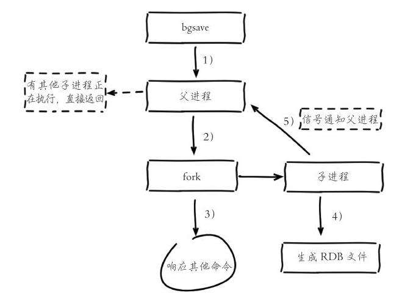
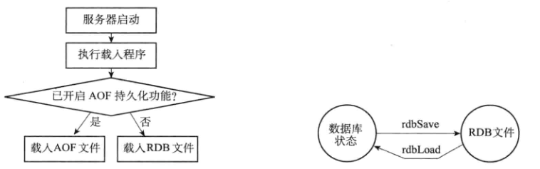
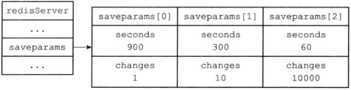
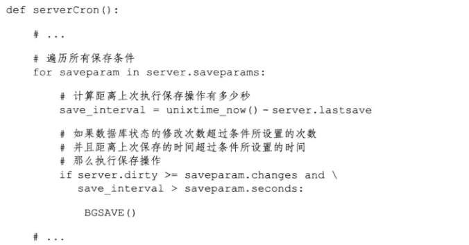
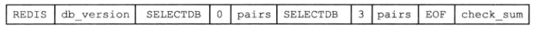
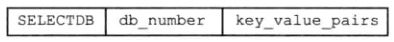
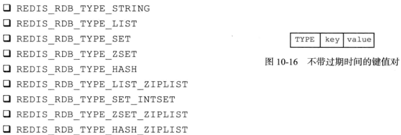
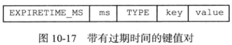
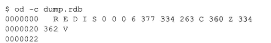

- RDB 可以在指定时间间隔内生成数据集的==时间点快照==
- 优点
  - 非常紧凑文件，保存某个时间点上的数据
  - 适合用于备份数据
  - RDB恢复大数据的速度比AOF快
- 缺点
  - 至少5分钟保存一次RDB文件，发生故障丢失数据多
  - 每次保存RDB时，需要fork一个==子进程==，当数据比较大，fork非常耗时，服务器会暂停一段时间用于fork


# RDB创建

- SAVE命令创建
  - 阻塞Redis进程，直到RDB创建完成，期间不处理任何请求
- BGSAVE
  - 派生一个==子进程==进行创建RDB
  - 在执行期间如果有SAVE命令，会忽略，避免父子进行同时进行rdbSave操作
  - 执行期间BGSAVE会拒绝，避免2个BGSAVE操作产生竞争条件
  - 在执行期间BGREWRITEAOF操作会在BGSAVE结束之后进行，避免2个进程对IO操作，性能下降
- rdb.c/rdbSave函数完成创建


# RDB载入

- 服务器启动时自动检测，RDB存在就进行载入操作
- 在载入过程中会一直阻塞
- 如果开启了AOF持久化，服务器优先使用AOF还原数据库状态
  - AOF更新频率比RDB高
- AOF关闭才会使用RDB




# 自动间隔性保存

- 服务器每隔一段时间自动执行一次BGSAVE命令
- 配置save的触发条件（可以自定义设置任意个），达到一个就触发，默认设置如下
  - save 900 1 ( 在900 秒内 1次修改就触发) 
  - save 300 10
  - save 60 10000

```c
struct redisServer{
    ...
    // 记录保存触发条件的数组
    struct saveparam *saveparam;
    // 修改计数器，记录上次BGSAVE到现在执行的操作数
    long long dirty;
    // 上次执行保存的时间 UNIX时间戳，记录上次成功执行SAVE或BGSAVE命令的时间
    time_t lastsave;
    ...
}
```

- saveparam

```c
struct saveparam{
    // 秒数
    time_t seconds;
    // 修改数
    int changes;
}
```



## 检查条件是否满足

- redis默认的serverCron默认每隔100ms执行一次
  - 用于对正在运行的服务器进行维护
  - 检查save选项设置的保存条件是否满足，满足就执行BGSAVE




# RDB结构

- REDIS

  - 常量
  - 5字节，保存了REDIS这5个字符
  - 用于标识是否是RDB文件

- db_version

  - 4字节
  - 字符串表示的整数
  - RDB的版本号
  - 0006表示第6版本

- databases

  - 包含0个或多个数据库
  - 以及各个数据库的键值对数据，如果所有数据库为空，那么长度0字节

- EOF

  - 1字节
  - 表示正文结束
  - 读取到该字节表示文本正文读取完成

- check_sum

  - 8字节无符号整数

  - 保存前面所有数据的检验和

  - 确认是否有损坏

    

## databases

- 保存任意多个非空数据库

- 示例 0 和 3 号数据库



- database 内部结构
  - SELECTDB 常量
    - 长度为1字节
    - 表示下一个读取的位置是数据库编码
  - 读取db_number后会执行SELECT命令切换数据库
  - key_value_pairs
    - 保存数据库中所有键值对，包含带有过期时间的键值对




## key_value_pairs

- TYPE的所有类型如下图左



- EXPIRETIME_MS
  - 1字节常量



- value表示存储的数据
  - 不同的数据类型，存储在value中的表现形式也不一样
  - value中的数据可以配置压缩redis.conf/rdbcompression


# 分析RDB文件

- 命令

```bash
od -c dump.rdb
```

