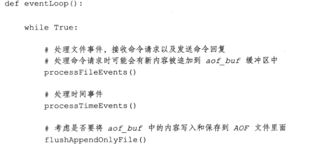
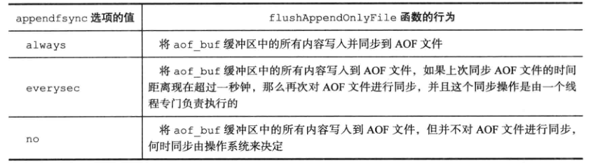
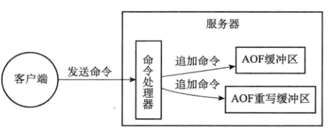

# 概述

- Append Only File

- 通过保存服务器执行的写命令记录数据状态


# AOF实现

- 命令追加 Append
- 文件写入
- 文件同步 sync


## 命令追加

- 将执行的命令放入aof缓冲区末尾

```c
struct redisServer{
    // AOF缓冲区
    sds aof_buf;
    ...
}
```


## 文件写入

- redis服务进程是一个事件循环
  - 时间事件负责执行serverCron等时间事件
  - 服务器每次结束一个事件循环后会执行flushAppendOnlyFile，判断是否将aof缓冲区内存写入到AOF文件中



- 参数配置
  - 默认everysec，服务器停机最多丢失1s的数据，效率较高
    - 每隔1s进行写入AOF文件中，进行同步
  - always效率最慢，数据安全性最高
    - 出现停机，只丢失一个事件循环中的所有命令数据
    - 每个事件循环，将命令写入到AOF中，并进行同步
  - no
    - 每个循环事件，将命令写入到AOF中，同步需要操作系统控制
    - 写入AOF速度最快
    - 单次同步时间最长
    - 出现故障则丢失上次同步AOF文件之后的写命令数据
  
  




### 问题

- 有aof缓冲区，在满足一定条件时（缓冲区满，或者超过执行时间），写入到磁盘
  - 好处，提高写入磁盘的效率
  - 不足，数据安全问题，出现停机，则aof缓冲区数据丢失
- 提供fsync，fdatasync同步函数
  - 强制操作系统立刻将缓冲区数据写入到磁盘，保证数据安全
  - 性能上有下降


### 关于同步

- 这里的同步是指的系统的同步，在系统的磁盘写入文件调用写函数时，系统首先将数据写入到内存缓冲区内，缓存区满了或者时间到了再写入到磁盘，持久化完成
- always，everysec是写入到内存缓冲区后，强制系统同步到磁盘上
- 而no则是只写入到内存缓冲区，至于何时同步由系统决定


# AOF文件的载入和数据还原

- 创建一个伪客户端，读取AOF中的命令，重新执行一遍
  - 伪客户端没有网络连接


# AOF重写

- AOF文件会随着操作越多而越来越大，在恢复时耗费的时间越长
- AOF重写将AOF文件进行优化，创建一个新的AOF文件，将命令进行缩减
- 重写不是重新读取AOF文件进行整理，而是直接从数据库中读取键现在的值，用一条命令记录键值对，代替之前的键值对的多条命令

- aof_rewrite 生成新的AOF文件只包含还原当前数据库所需的命令，新AOF不会浪费磁盘空间
- 如果重写在处理有序集合，hash表，集合等，元素超过阈值则使用多条语句记录键值对的值
  - 阈值 redis.h/REDIS_AOF_REWRITE_ITEMS_PER_CMD = 64
  - 每条命令设置的元素数量也不超过64

- 使用子进程进行AOF重写操作，好处是父进程可以避免在使用锁的情况下数据的安全性
- 问题
  - 当AOF重写时，因为是子进程，那么父进程进行键的新写入命令与当前AOF已重写的键的数据不一致，有安全性问题
- 解决
  - 在进行AOF重写那一刻，创建一个AOF重写缓存区，将该时刻之后的写命令写入到该缓存区
  - 当AOF重写结束，将缓冲区的内容追加到AOF重写文件中，再通过原子重命名AOF重写文件，替换原先的AOF文件
    - 猜测，AOF重写记录开始重写的时间戳，针对每个集合，读取在该时间戳之前的数据
  - 保证了不影响写入效率的情况下完成重写工作（2个进程），同时还保证了数据的安全

