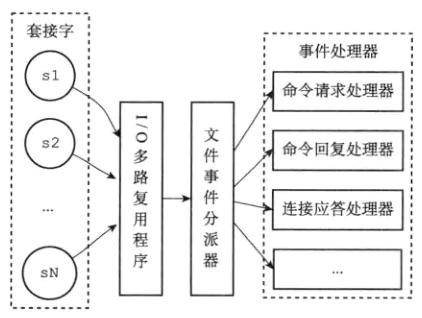
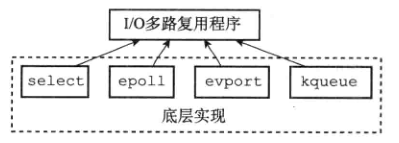
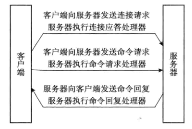

# 概述

- redis服务器是一个事件驱动程序
- 事件类型
  - 文件事件 file event
    - 与其他服务器或客户端进行数据的传递，通过socket
  - 时间事件 time event
    - 定时类的抽象，如serverCron的执行

# 文件事件

- 基于Reactor模式开发自定义网络事件处理器----文件事件处理器
- 使用IO多路复用监听多个套接字

- Redis的IO多路复用程序有多个IO多路复用库实现可选

## 事件处理器

### 连接应答处理器

- network.c/acceptTcpHandler

- AE_READABLE 事件

### 命令请求处理器

- network.c/readQueryFromClient

### 命令回复处理器

- network.c/sendReplyToClient
- AE_WRITABLE 事件

# 时间事件

- 类型
  - 定时事件
    - 程序在指定的时间之后执行一次
  - 周期性事件
    - 程序每隔指定的时间执行一次
- 组成
  - id：服务器为时间创建全局唯一ID，从小到大递增
  - when：ms精度的时间戳，记录了时间事件到达的时间
  - timeProc：时间处理器，一个函数，时间到达时，调用相应的处理器处理

## serverCron函数

- 更新服务器各类统计信息
  - 如时间，内存占用，数据库占用
- 清理数据库中过期的键值对
- 关闭和清理连接失效的客户端
- 尝试进行AOF或RDB持久化操作
- 服务器是主服务器，则对从服务器进行定期同步
- 处于集群模式，对集群进行定期同步和连接测试
- 通过hz设置每秒serverCron执行次数

