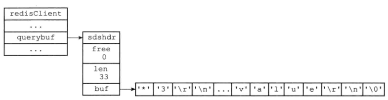

# 介绍

- 一个服务器可以和多个客户端建立连接
- 使用IO多路复用实现文件事件处理器，服务器使用单线程单进程的方式处理命令请求
- 客户端数据结构
  - 客户端名称，描述
  - 标志值 flag
  - 指向客户端正在使用的数据库指针，数据库号码
  - 客户端当前要执行的命令，命令参数，命令参数个数，指向命令实现函数的指针
  - 客户端输入输出缓冲区
  - 客户端的复制状态信息，复制所需的数据结构
  - 执行BRPOP，BLPOP等阻塞命令时使用的数据结构
  - 客户端事务状态，WATCH时的数据结构
  - 发布订阅功能用到的数据结构
  - 身份验证标识
  - 创建时间，与服务端最近一次通信时间
  - 客户端输出缓冲区大小超过软性限制的时间
- 服务端结构

```c
struct redisServer{
    // 一个链表
    list *clients;
    ...
}
```


# 客户端属性

- 通用属性
- 特定功能相关的属性
  - 如db属性，dictid属性，事务需要的mstate属性，watch需要的watched_keys属性


```c
typedef struct redisClient{
    ...
	// 可以是-1或者大于-1的整数
    int fd;
    // 名称
    robj *name;
    // 角色
    int flags;
    // 输入缓冲区
    sds querybuf;
    // 命令参数，数组
    robj *argv;
    // 命令参数个数
    int argc;
    // 命令执行的函数
    struct redisCommand *cmd;
    // 固定大小输出缓冲区，默认16KB
    char buf[REDIS_REPLY_CHUNK_BYTES];
    // 已用固定大小输出缓冲区位置
    int bufpos;
    // 可变大小输出缓冲区
    list *reply;
    // 身份验证
    int authenticated;
    ...
} redisClient;
```


## 套接字描述符

- fd
  - 伪客户端 fake client
    - -1
    - 处理的命令请求来源于AOF或者Lua脚本，不是网络，不需要套接字
  - 普通客户端
    - 大于-1的整数

```redis
// 罗列出连接的客户端，输出使用的fd以及ip和端口
CLIENT list
```


## 名字

- 默认情况下没有名字
- 使用CLIENT setname 设置名称


## 标志

- flags
- 记录客户端的角色，可以是单个标志，也可以是多个标志的二进制，或者用 | 分割
  - flags = <flag>
  - flags = <flag> | <flag> | …
- flags值
  - 主从服务器进行复制操作，主服务器称为从服务器的客户端，从服务器成为主服务器的客户端
    - REDIS_MASTER 表示客户端代表的是一个主服务器
    - REDIS_SLAVE 表示客户端代表的是一个从服务器
  - REDIS_PRE_PSYNC 表示客户端代表一个版本低于Redis2.8的从服务器
  - REDIS_LUA_CLIENT 表示客户端是处理lua脚本的伪客户端
  - REDIS_MONITOR 表示客户端正在进行MONITOR命令
  - REDIS_UNIX_SOCKET 表示服务器使用UNIX套接字进行连接客户端
  - REDIS_BLOCKED 表示客户端被BRPOP，BLPOP等命令阻塞
  - REDIS_UNBLOCKED 表示客户端接触阻塞
  - ….


## 输入缓冲区

- 客户端状态的输入缓冲区用于保存客户端发送的命令请求
- querybuf
  - sds类型
- 输入缓冲区大小会依据输入的内容动态扩展
- 最大大小1G
  - 超过则关闭客户端
- 缓冲一个命令




## 命令与命令参数

- 命令请求在输入缓冲区后，进行解析得到命令参数argv和命令参数的个数argc


## 命令执行函数

- cmd


## 输出缓冲区

- 执行命令的结果保存在输出缓冲区内

- 2个输出缓冲区

  - 固定大小缓冲区，保存长度比较小的回复，如OK，简单字符串值，整数值，错误恢复等
  - 可变大小缓冲区，保存长度较大的回复，非常长的字符串值，集合元素等

- buf

  - 固定大小缓冲区
  - 大小是REDIS_REPLY_CHUNK_BYTES字节的字节数组
  - 默认16*1024，16KB

- bufpos

  - 记录了buf数组目前已使用的字节数量

  

- reply

  - 可变大小缓冲区


## 身份验证

- authenticated

- 默认值0，表示未通过验证
- 1表示通过验证


## 时间

- time_t ctime
  - 创建时间，用于统计客户端与服务器已经连接了多长时间
- time_t  lastinteraction
  - 与服务器最后一次交互时间

- obuf_soft_limit_reached_time
  - 输出缓冲区第一次到达软性限制的时间


# 客户端的创建&关闭


## 创建普通客户端

- 客户端使用connect函数连接到服务器时，服务端使用链表结构存储客户端信息


## 关闭

- 客户端进程被杀死，连接关闭造成服务端的客户端关闭
- 客户端发送不符合协议的请求，客户端被关闭
- 服务端执行CLIENT KILL命令，客户端关闭
- 服务端设置timeout，客户端空转时间超过timeout，客户端被关闭
  - 主服务器连接从服务器，且阻塞，则会不被timeout
- 客户端命令超过输入缓冲区1G到小，客户端关闭
- 服务器返回给客户端的回复超过输出缓冲区大小，客户端关闭


## lua脚本伪客户端

```c
struct redisServer{
    ...
    redisClient *lua_client;
    ...
}
```

- lua_client在服务器运行整个生命周期都在，直到服务器关闭


## AOF文件伪客户端

- 服务器在载入AOF文件时，会创建执行AOF文件包含的Redis命令的伪客户端，完成载入后，关闭伪服务端


