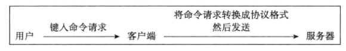
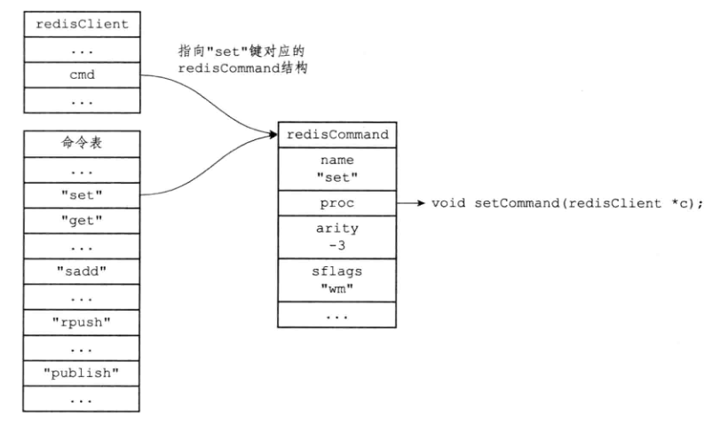

# 介绍

- 负责与多个客户端建立网络连接，处理客户端发送的命令请求


# 命令请求执行过程

- 以SET命令为例

```redis
redis> SET KEY VALUE
OK
```

- 客户端向服务器发送命令请求SET KEY VALUE
- 服务器接收处理客户端的命令请求，在数据库中进行操作，返回OK
- 服务器将OK发送给客户端
- 客户端收到OK，打印在控制台


## 发送命令请求

- 客户端将执行的命令转换为redis要求的协议格式给服务端




## 读取命令请求

- 服务器接收到请求，保存到输入缓冲区内
  - querybuf
- 解析命令，保存到参数列表中
  - argv argc
- 调用执行器，执行命令
  - ==命令忽略大小写==



## 执行命令

## 将结果返回给客户端


# serverCron函数

- 100ms执行一次


```c
struct redisServer{
    // 保存秒级的精度时间戳
    time_t unixtime;
    // 保存ms级精度时间戳
    long long mstime;
    // 计算键的空转时间
    unsigned lruclock:22;
}
```


## 更新服务器时间缓存

- redis服务需要获取当前系统时间，不过不能频繁读取系统时间
  - 读取存储的系统时间用于精度不高的功能，对于键的过期时间，慢查询日志还需要高精度的系统时间
- 使用serverCron每次执行更新本地存储的系统时间
  - 读取本地存储的时间，效率高


## 更新LRU时间

- serverCron每10s更新一次redisServer的lruclock
- 作用：计算redisObject的LRU时间差
  - 每个redisObject有一个LRU时间，unsigned lru
  - 计算redisServer.lruclcok -redisObject.lru得到结果


## 更新服务器每秒的执行命令次数

- 每100ms估算出1s内的命令次数
- 调用trackOperationsPerSecond方法
  - 抽样的方式


## 检查持久化操作状态


## 将AOF缓冲区中的内容写入AOF文件中


## 关闭异常客户端


# 初始化服务器