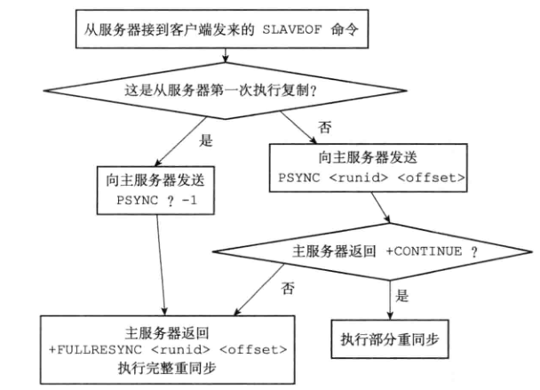

# 介绍

- 通过SAVEOF命令，或者设置saveof选项
- 让一个服务器复制另一个服务器
- 从服务器从主服务器上复制数据
  - 对主机上的增删改会影响到在从机读取的数据

```redis
slaveof 127.0.0.1 6379
# 表示本机从127.0.0.1上复制redis服务
```


# 2.8版本之前的实现（旧版本）

复制分为如下2个步骤

- 同步 sync
- 命令传播 command propagate


## 同步（初始化）

- 将从服务器的数据库状态更新到主服务器当前所处的数据库状态
- 将主机的状态同步到从机

- 使用时机
  - 当客户端向从服务器发送SLAVEOF命令，要求从服务器复制主服务器时，从服务器首先要执行同步操作
  - 将从服务器的数据库状态更新至主服务器的数据库状态
- 步骤
  - 从服务器向主服务器发送SYNC命令
  - 主服务器收到命令后执行BGSAVE命令，后台生成一个RDB文件，使用一个缓冲区记录到开始RDB的所有写命令
  - 主服务器BGSAVE执行完毕后，将RDB文件发送给从服务器，从服务器接收RDB载入数据库
  - 主服务器将缓冲区内的写命令发送给从服务器，从服务器接收写命令同步当前数据库状态与主服务器一致


## 命令传播

- 同步完成之后，主服务的数据更改如何通知到从服务器？命令传播

- 主服务器的数据库命令被修改，从服务器的数据状态不一致时，让主从服务器处于状态一致
- 主服务收到写命令，也发送给从服务器，保持数据的一致


## 不足

- 复制情况分类
  - 初次复制
    - 从服务之前没有和主服务器进行过复制操作，第一次复制
  - 再次复制
    - 从服务器和主服务器复制过，但是网络中断，宕机等，从服务器再次和主服务器进行复制连接操作
- 在再次复制时效率低
  - 中断后，重新复制，执行SYNC命令，主服务器会将数据库所有的数据生成RDB发送给从服务器
  - 但是从服务器中与主服务器有大量相同数据，只有少部分差异数据，重新发送全部RDB导致效率低下
- 一般主服务器与从服务器断线时间断，那么因为过短的断线时间，造成少部分数据差异，造成SYNC以及RDB发送，效率太低
- SYNC命令耗费资源多，执行的操作如下
  - 主服务器执行BGSAVE生成RDB，耗费cpu以及IO
  - 主服务器发送RDB，耗费网络带宽，对主服务器的对其他客户端的命令请求有影响
  - 从服务器得到RDB载入数据，会阻塞，从而无法响应客户端的读操作命令请求


# 2.8版本的实现（新实现）

- 使用PSYNC代替SYNC进行复制时的同步操作
- PSYNC的2种模式
  - 完整重同步
    - full resynchronization
    - 用于处理初次复制的情况
    - 与执行SYNC的步骤一致
      - 创建发送RDB
      - 主服务器含有写命令缓冲
      - 从服务器载入RDB读取后续的写命令
  - 部分重同步
    - partial resynchronization
    - 从服务重新连接主服务，主服务器将从服务器断开连接期间执行的写命令发送给从服务器
    - 从服务器重新发送PYSNC，主服务器返回CONTINUE命令，然后发送后序的写命令


- 好处
  - 不用传输整个RDB
  - 减少网络带宽
  - 提高双方响应速度


# 部分重同步实现


## 偏移量

- 主从双方都维护一个偏移量，用于判断是否数据状态一致


- 通过偏移量从服务器判断数据不一致，发送PSYNC给主服务器，主服务器通过复制积压缓冲区进行同步


## 复制积压缓冲区

- 固定长度的FIFO队列
- 默认1MB
- 将命令复制一份到队列中


- 每个字节对应一个偏移量
- 从服务器重新从主服务器获取数据，缓存区有该偏移量，主服务器返回CONITINUE，再返回从服务器当前的偏移量到主服务器当前的偏移量为止的数据

- 由于缓存区缓存有限，如果缓存区没有响应偏移量的值，那么执行==完整重同步操作==


## 服务器运行ID

- 每个服务器都有一个runID
- 40个随机16进制字符
- 初次复制，从服务器发送runID给主服务器，主服务器存储
- 断线重连，会再次发送runID
  - 主服务器发现之前连接过，尝试部分重同步
  - 主服务器发现之前没有连接过，则进行完整重同步


# PSYNC 实现




# 复制的实现

```redis
SLAVEOF 127.0.0.1 6379
```

- 设置主服务器的端口和地址
  - 客户端给从服务器发送命令后，从服务器对象中的masterhost和masterport字段赋值
- 建立套接字连接
  - 从服务器根据主服务器的ip和端口与主服务器建立网络连接
  - 从服务器是主服务器的客户端
- 发送ping命令
  - 从服务器作为主服务器客户端之后，发送ping命令
  - 检查双方连接的套接字是否正常
  - 判断主服务器是否可以正常处理请求


- 身份验证

  - 

- 发送端口消息
  - 从服务器发送监听端口号信息给主服务器（存储在主服务器客户端对象的slave_listening_port字段）

- 同步
- 命令传播


# 心跳检测

- 命令传播阶段，每秒一次，发送REPLCONF ACK <replication_offset>
  - replication_offset当前的偏移量

- 作用
  - 检测主从服务器的网络连接状态
    - 主从通过该命令判断连接是否正常
  - 辅助实现min-slaves选项，防止主服务器不在安全的情况下执行写命令
    - min-slaves-to-write 3
      - 从服务器少于3个
    - min-slaves-max-lag 10
      - 3个从服务器的延时大于等于10s
    - 主服务器在上面2个条件一个不满足则不执行写命令
  - 检测命令丢失
    - 主服务器发现ack返回的偏离量数据丢失，则在复制的积压缓存区找到数据，重新发送，补发
      - 补发的过程与重同步类似，不同的是重同步时断线重连，补发是网络没有中断只是震荡

