# 概述

- Sentinel
- redis高可用解决方案
- 一个或多个Sentinel实例监控任意多个==主服务器==
- 监视主服务器下线时，自动将主服务器下的某个从服务器升级为主服务器

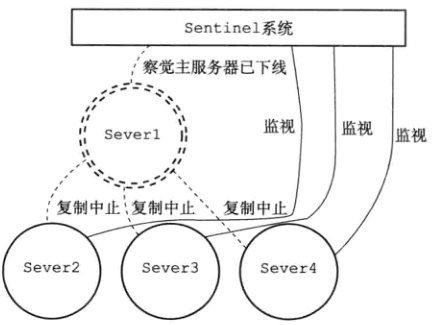

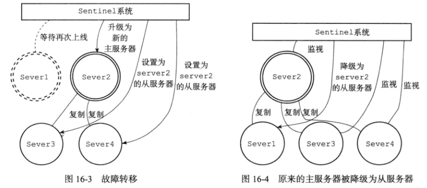


# 启动并初始化Sentinel

```redis
redis-sentinel /path/to/your/sentinel.conf
```

执行步骤

- 初始化服务器
- 将普通redis服务器使用的代码切换成sentinel专用代码
  - 转换为sentinel服务器
- 初始化sentinel状态
- 根据给定的配置文件，初始化sentinel的监视服务器列表
- 创建连向主服务器的网络连接


## 初始化服务器

- Sentinel本质上是一个运行在==特殊模式下的redis服务器==
  - 不会载入RDB和AOF


## 使用sentinel专用代码

- 使用sentinel.c/REDIS_SENTINEL_PORT 常量值作为服务端口
  - 26379
- 使用sentinel.c/sentinelcmds作为服务器的命令表


## 初始化sentinel状态


## 初始化sentinel的masters属性

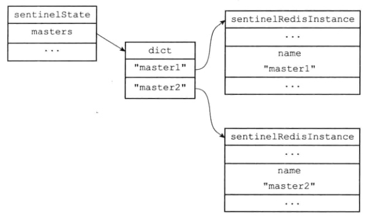


## 创建连接主服务器的网络连接

- 创建2个异步网络连接
  - 命令连接，用于向主服务器发送命令，接收命令回复
  - 订阅连接，订阅主服务器的`_sentinel_:hello` 频道
- 为什么2个连接
  - redis的发布和订阅功能中，被发送的消息不保存在redis服务器中，如果消息发送后，接收的客户端掉线，则会丢失消息
  - 为了不丢失`_sentinel_:hello` 频道的消息，sentinel用一个订阅连接接收该频道消息
  - sentinel必须要向主服务器发送命令，又是一个连接

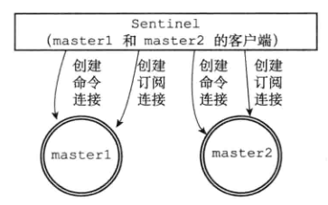

## 获取主服务器信息

- 10s一次，sentinel发送给主服务器INFO命令

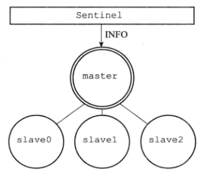

- 返回的info信息

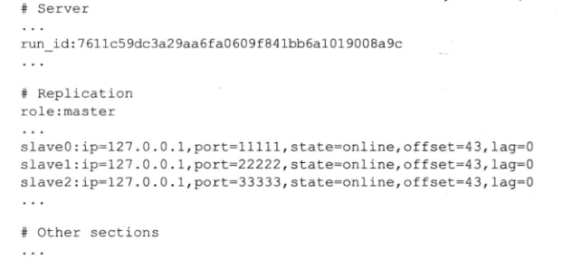

- sentienl分析返回信息，通过ip:port形成key，对slaves字典的value进行更新，value是每个redis服务节点的信息

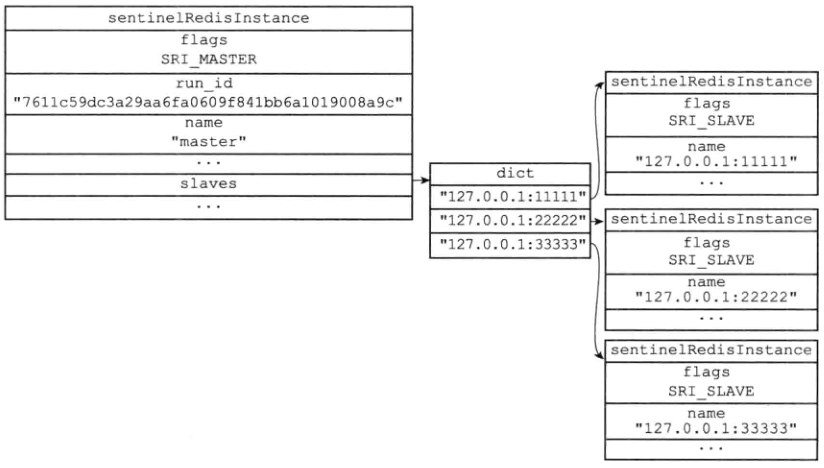


## 获取从服务器信息

- sentinel从主服务器获取从服务器信息，当从服务器信息更新，如增加节点，sentinel创建连接到从服务器进行连接和订阅
- 10s一次发送给从服务器命令INFO，获取信息，更新实体数据

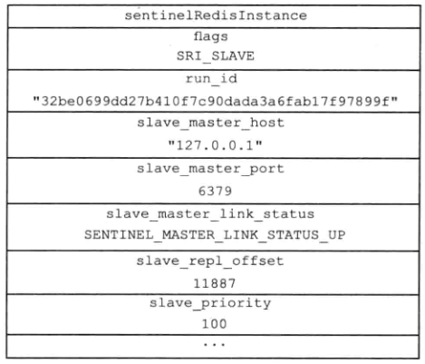


## 向主服务器和从服务器发送消息与接收

- 默认情况下2s一次，等于是心跳
- 通过命令`PUBLISH __sentienl__:hello “<s_ip><s_port>...”`


# sentinel的高可用

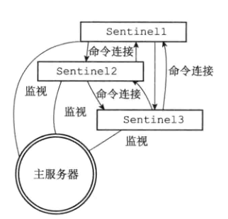

- 每个sentinel维护一个sentinels的字典表，记录其他的sentinel节点

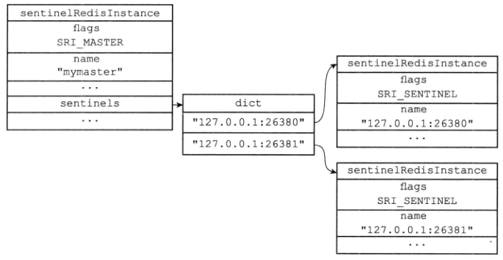

- sentinel之间不会创建订阅连接
  - sentinel在连接主服务器和从服务器时，会同时创建命令连接和订阅连接
    - 需要通过订阅连接发现新的节点
  - 连接其他sentinel时，只有创建命令连接，不创建订阅连接
    - 各个sentinel之间已知，只需要使用命令进行连接通信即可


# 检测主观下线状态

- 频率1s，sentinel给所有连接的节点，包括其他sentinel发送PING命令，通过实例返回PING命令判断是否在线
- down-after-milliseconds master 50000
  - 表示检测50s后没有应答，在该sentinel中判断为主观下线
  - 注意不同的sentinel的该配置可能不同


# 检查客观下线状态

- 当sentinel判断一个master节点主观下线后，会询问其他sentinel节点该master的状态，足够数量的确认后，认定该master为客观下线


# 选举领头Sentinel

- 当一个主服务器被判断为客观下线，监视该下线的主服务器的各个Sentinel会协商选举一个领头Sentinel进行下线主服务器的故障转移工作

- 使用Raft算法实现


# 故障转移

- 在已下线的主服务器的从服务器中选择一个，转换为主服务器
- 让已下线主服务器的所有从服务改为复制slaveof 新的主服务器
- 将已下线的主服务器设置为新主服务器的从服务器


## 选出新主服务器

- 进行过滤
  - 删除列表中处于下线或者断线状态的从服务器
    - 保证剩下的是正常的从服务器
  - 删除列表中最近5s内没有回复领头Sentinel的INFO命令的从服务器
    - 保证最近都能正常通行的从服务器
  - 删除列表中与主服务器连接超过down-after-milliseconds*10ms的从服务器
    - 保证从服务器数据比较新，与主服务器接近
- 对剩下的进行优先级排序，得到最高的从服务器
  - 优先级相同，找从服务器的==复制偏移量==最大的
    - 保证数据最新
  - 依然相同对runID进行排序，得到ID最小的


## 修改从服务器的复制目标

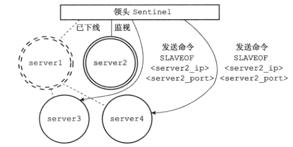

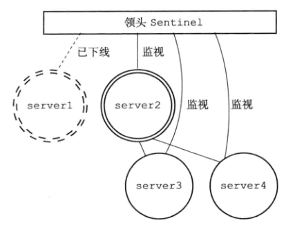

## 将旧的主服务器边为从服务器

- 原主服务器重新上线，sentinel发送slaveof命令，让它成为slave节点

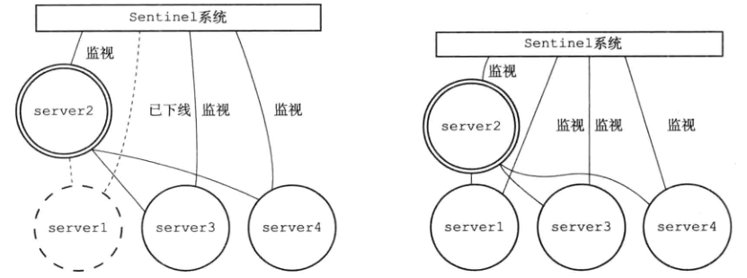