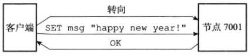
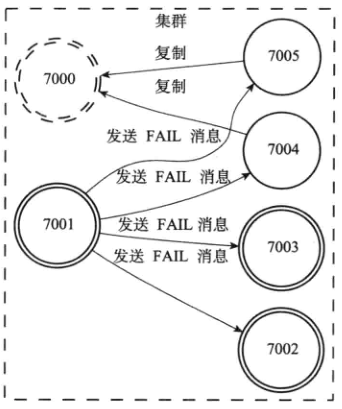

# 概述

- redis提供的分布式数据库方案
- 通过分片sharding的方式进行数据的共享


# 节点

- redis集群由多个节点node组成
- 使用命令

```redis
# 将ip节点进行连接进入集群，节点之间进行握手操作
CLUSTER MEET <ip> <port>

# 查看集群中的node节点
CLUSTER NODES
```


## 启动节点


- 节点继续使用文件事件处理器处理命令请求和返回命令回复
- 节点继续使用时间事件处理器执行serverCron函数，该函数调用clusterCron函数
  - 检查节点是否断线
  - 向集群中其他节点发送Gossip信息
  - 检查是否对下线节点进行故障转移

- 节点继续使用数据库保存键值对，使用AOF和RDB进行持久化工作
- 使用复制模块进行节点的复制工作slave，从节点工作


## 集群数据结构

- clusterNode 保存了一个节点的当前状态
  - 节点的创建时间，节点的名称，ip，端口等
- 每个节点有一个clusterNode结构记录自己的状态，对集群的其他节点也创建一个clusterNode用于记录（包括从节点）
- clusterNode含有一个clusterLink的结构
  - 链表结构，包含下一个clusterNode
  - 与redisClient类似，都有自己的套接字描述符和输入，输出缓冲区
  - 不同点
    - redisClient 是面向连接客户端，客户端可能是其他节点
    - clusterLink 是面向连接节点的

- clusterState
  - 当前节点观察集群
  - 集群处于的状态
    - 在线
    - 下线
  - 集群包含多少个节点
  - 集群当前的配置纪元


## CLUSTER MEET 命令

- 节点握手过程


- A节点与B完成握手之后，A通过Gossip协议，将B的信息给其他节点，完成其他节点与B的握手


## 槽的分配

- 整个数据库分配为16384个slot
- 每个节点可以处理0-16384个slot
- 所有槽都有节点处理，集群处于ok状态
- 任何一个槽没有节点处理，集群处于fail状态

- 通过CLUSTER ADDSLOTS 进行指派


- 完成后查看信息


## 记录槽分配的信息

```c
struct clusterNode{
    // ...
    unsigned char slots[16384/8];
    int numslots;
    // ...
}
```

- slots是二进制数组，包含2018个字节，共16384个二进制位，二进制位为1，表示处理该slot
- 判断是否处理该槽，使用slots[i] == 1判断，复杂度O(1)
- numslots表示处理槽的个数
  - 不是每次计算为slots为1的个数，在redis中，要的是性能，能用存储代替就代替，不每次使用时计算


## 传播节点槽分配信息

- 每个节点向其他节点发送自己节点分配的槽信息


## 记录集群所有槽的分配信息

- 每个节点记录其他节点槽的信息
  - 直接存储每个槽分配的clusterNode的引用
  - slots[i] == null ; 表示没有指派任何节点
  - 这么设计的好处是，提高访问效率
    - 如果只将slots信息存放在各个clusterNode节点中，要判断某个slot位于哪个节点，需要遍历所有的clusterNode进行判断，复杂度是O(n)
      - n是clusterState.nodes字典保存的clusterNode结构的数量
      - 但是clusterNode节点中也会存储slot信息，用于发送给其他节点slot分配的信息，用于在本需求下的访问速度
    - 存放在clusterState 的slots字段，访问的复杂度是O(1)
  - 注意
    - clusterNode.slots 数组记录了该node的槽分配信息
    - clusterState.slots 数组记录了所有槽分配的信息

```c
struct clusterState{
    //...
    clusterNode *slots[16384];
    //...
}
```


## CLUSTER ADDSLOTS 命令


# 在集群中执行命令


- 客户端向node发送执行的键值命令，如果该node不负责该键的slot，返回一个moved错误信息，并含有真确的slot的node地址，客户端向正确的node重新发送执行该键值命令

- 首先会计算键值命令中的key属于哪个slot
  - 执行与操作，得到一个介于0到16383之间的一个整数，作为slot槽号

```c
def slot_number(key):
	return CRC16(key) & 16383;
```


## `CLUSTER KEYSLOT <key> `查看属于哪个槽


## MOVED 错误

- 格式
  - MOVED <slot> <IP> <Port>
    - slot 表示槽号
    - ip 表示目标node的ip
    - port 表示目标node的port
- 客户端收到moved后，依据ip和port访问对应的node，再通过slot找到该槽





## 错误


# 节点数据库

- 集群模式下，只能使用0号数据库
- 键与槽的关系使用跳表实现

```c
struct clusterState{
    // ...
    zskiplist *slots_to_keys;
    // ...
}
```


# 重新分片

- 可以在集群在线的情况下重新分片，同时键值数据也会转移


## 实现原理


## ASK 错误


- 当源节点正在迁移slot的数据，此时查询该slot的数据，可能会有ASK 错误产生
  - 如一个slot含有2个key，一个key1在node1，而另一个key2的数据以及迁移到了node2
  - 那么在node1上查询key2的数据时，先在本地的slot中查询，没有找到，说明可能发生了迁移，返回ASK错误，指引客户端转向正在导入槽的目标节点，客户端重新在node2上查询


### 与 moved 区别

- moved错误
  - 代表槽不在本node中，通知客户端跳转到正确的node上查询，下次查询同样的slot时，由于有缓存，会直接到正确的node上查询
- ask 错误
  - 2个节点在迁移的槽过程中的临时措施
  - 客户端收到槽i的ask错误后，跳转到正确node进行查询，下次收到槽i的查询请求，依然会走错误的node，直到槽转移完成，收到moved错误后
  - 每次查询相同的key都会通过ask进行跳转


# 复制与故障转移

- 复制与单节点的复制功能一致，设置从服务器，主服务下线后，从服务设置为主服务器，旧主服务器成为从服务器
- 与单节点不同的是没有sentinel
  - 当主服务器下线，集群中其他的主服务器节点从旧主服务器的从节点中选出一个作为新主节点
- 原先单节点的sentinel的功能被集群中其他主节点代替


## 故障检测

- 集群中每个节点定期向集群中的其他节点发送ping消息，检测是否在线

  - 在规定的时间内没有收到PONG消息，则标记疑似下线

  

- 集群中会通过交换消息得到集群中各个节点的状态，如果有节点下线，则存储在clusterNode中的fail_reports中


- 集群中半数主节点判断x节点下线，则x主节点标记为下线，进行广播



## 故障转移

- 从下线主节点的从节点列表中选择一个从服务器
- 被选中的从节点执行SLAVEOF on one 命令，称为新主节点
- 新主节点会将原先主节点的槽分配信息指向自己
- 新主node向集群广播pong消息，通知其他主node新node的信息
- 新主node开始接受自己负责slot的命令，转移完成


### 选举新的主节点

- 使用raft算法
- 集群的配置纪元有一个自增计数器，初始值为0
- 集群内节点开始一次故障转移时，计数器+1
- …


