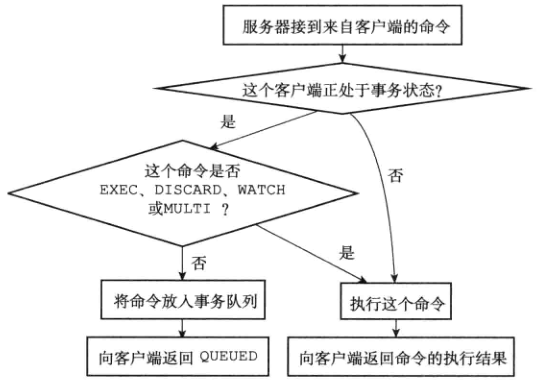
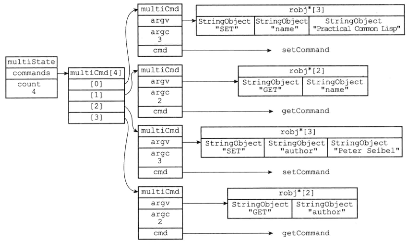
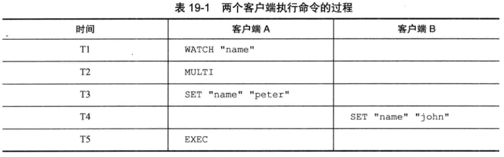
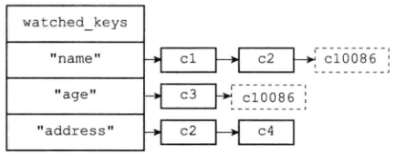
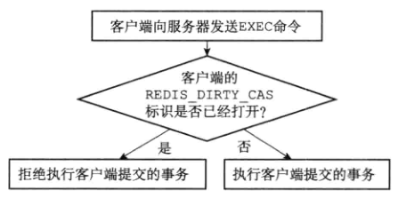

# 事务

- redis通过multi,exec,watch等命令实现事务
  - 实现了部分事务
- 将多个命令打包，一次性，按照顺序执行多个命令
- 在执行事务期间，不会执行其他客户端请求，直到事务结束

```redis
MULTI # 事务开始
SET "name" "redis"
GET "name"
SET "author" "wangwu"
GET "author"
EXEC # 事务提交
```


命令	说明	备注
multi	开启事务命令，之后的命令会进入队列，而不会马上被执行	在事务生存期间，所有的Redis关于数据结构的命令都会入队
watch key1 [key2….]	监听某些键，当被监听的键在事务执行前被修改，则事务会被回滚	使用乐观锁
unwatch key1 [key2….]	取消监听某些键	-
exec	执行事务，如果被监听的键没有被修改，则执行命令，否则回滚命令	在执行事务队列存储命令前，Redis会检测被监听的键值对有没有发生变化，如果没有则执行命令，否则回滚事务
discard	回滚事务	回滚进入队列的事务命令，之后就不能再用exec命令提交了


## 事务的实现 [MULTI]

- 阶段
  - 事务开始
  - 命令入队
  - 事务执行


### 事务开始

- MULTI
- 将执行该命令的客户端切换到事务状态
  - 客户端状态 flags属性打开REDIS_MULTI 标识切换的

```c
def multi():
	# 打开事务标识
	client.flags != REDIS_MULTI
        
    # 返回OK
    replyOK()
```


### 命令入队

- 当客户端处于非事务状态时，输入的普通命令会立刻执行
- 当客户端处于事务状态时
  - 客户单发送EXEC，DISCARD，WATCH，MULTI这些命令，服务器会立刻执行
  - 非上4个命令，则会将命令放入命令队列中，向客户端返回QUEUED回复




### 事务队列结构

- 每个redis客户端有自己的事务状态，保存在客户端的mstate属性中

```c
typedef struct redisClient{
    // ...
    // 事务状态
    multiState mstate;
}redisClient
```

- 事务状态结构
  - 事务队列FIFO
  - 已入队的命令计数器，即队列的长度

```c
typedef struct multiState{
    // 事务队列，FIFO
    multiCmd *commands;
    // 已入队计数
    int count;
}
```

- 命令结构

```c
typedef struct multiCmd{
    // 参数
    robj **argv;
    // 参数数量
    int argc;
    // 命令指针
    struct redisCommand *cmd;
}multiCmd
```



### 执行事务

- 当客户端处于事务状态，发送EXEC命令，服务器执行事务
- 服务器遍历事务队列，执行队列中的所有命令，将执行的结果全部返还客户端
- 执行完后，清空事务队列


## WATCH 命令 （乐观锁）

- watch命令是一个乐观锁
  - 执行事务过程中，某key没有修改才会继续执行
- 在EXEC执行之前，监视任意数量的数据集键，在执行EXEC时，检查被监视的键是否至少有一个已经被修改过
  - 如果有修改，服务器拒绝执行，向客户端返回事务执行失败

- 语法

```redis
WATCH "name"
MULTI
SET "name" "lisi"
EXEC
```



- 说明并发执行时，事务不是原子性的，会有其他执行语句执行
  - 因此使用WATCH作为乐观锁进行判断，尝试重新执行


### 实现

#### 结构

- 每个redis数据库保存一个watched_keys字典
  - 字典的键是被某个WATCH命令监视的数据库键
  - 字典的值是一个链表
    - 链表值记录了所有监视该键的客户端

```c
typedef struct redisDb {
    //...
    // 正在被WATCH监视的key
    dict *watched_keys;
    // ...
} redisDb;
```

- 通过watched_keys字典，服务器可以知道哪些数据库键被监视，以及被哪些客户端监视

- 示例
  - 客户端c10086执行watch后

```redis
WATCH "name" "age"
```

 

 

#### 监视机制触发

- 所有对数据库的修改命令，执行后会调用multi.c/touchWatchKey 函数对watched_keys字典进行检查
  - 如SET，LPUSH，SADD，ZREM，DEL，FLUSHDB等
- 如果有客户端监视key，则touchWatchKey函数会修改客户端的REDIS_DIRTY_CAS标识，表示事务安全性已经破坏


#### 判断事务是否安全




## ACID性质

- 原子性有限度的保证

  - 使用watch配合实现原子性，可以保证该事务处理时，当前没有其他客户端操作指定的数据
    - 有其他客户端处理同一数据则在EXEC处理是判断，从而返回失败

- 一致性保证

  

### 原子性

- redis事务==不支持回滚机制==
- redis的原子性有限
- 不支持事务回滚这一复杂机制与redis追求简单高效设计不符，出现场景应在生产中不该出现
  - 从开发者的编程角度和设计功能上避免
- 在EXEC处理时，使用WATCH之后，判断是否REDIS_DIRTY_CAS打开
  - 打开了则拒绝执行，在外部程序使用while循环不断尝试
  - 没有则执行队列中的所有命令，保证了原子性
- ==在命令入队时，会有其他客户端并发执行命令==
- 在执行EXEC时，会独占redis


#### 命令拼写错误不执行事务

- redis事务具有原子性，事务要么都执行，要么都不执行

- 在命令入队时，进行语法检查，==命令入队出错==，整个事务不执行

- 即有一个命令书写错误，或拼写错误，事务不执行

  

#### 命令执行错误继续执行事务

- 当命令拼写正确，但是执行出现问题，redis会继续执行事务
- 对==之前和之后的命令执行没有影响==
- redis没有回滚


### 一致性


#### 入队错误

- 入队命令会检查格式语法等，出现错误拒绝执行
- 2.6.5 版本之前会执行正确的入队命令，该版本之后就都不执行了


#### 执行错误

- 在执行过程中发生错误，会继续执行剩下的语句，事务不中断
- 错误命令不会被执行，正确的命令被执行


#### 服务器停机

- 在无持久化的内存模式下运行，停机重启，数据总是一致的
- 在RDB或AOF模式下，事务的中断，数据库可以通过RDB或AOF恢复数据，也是一致的


### 隔离性

- 使用单线程的方式执行事务，执行期间不会对事务进行中断
  - 在并发访问的情况下，其他语句操作会对事务进行暂停
  - 猜测并发事务的情况下事务是串行执行的
- 事务是已串行执行的，保证了事务之间的隔离性
- 事务与事务之间是串行执行的
- 并发状态下执行的事务与串行下执行的事务的结果是一样的


### 持久性

- 依据配置的AOF和RDB保证一定的持久性