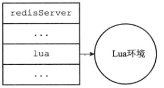
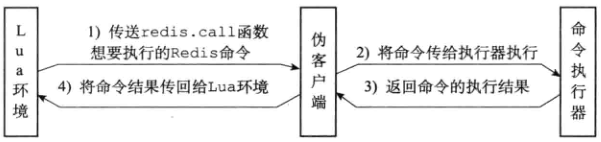
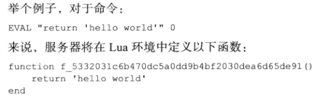
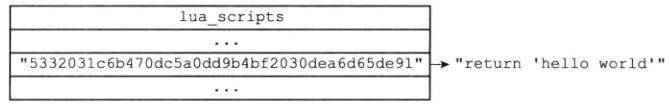
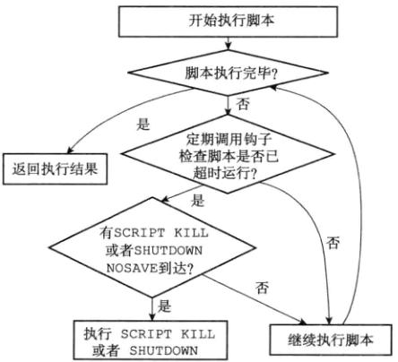
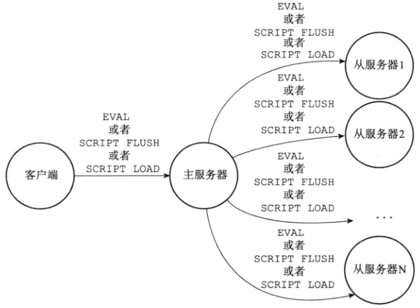

# Lua脚本

- 2.6引入
- 在服务端原子性执行多个redis命令

- 示例

```redis
EVAL "return 'hello world'" 0
EVAL "return 1+1" 0
# 可以将 执行命令转换为SHA1编码，然后执行，要求EVEL “retrun 1+1” 0 被执行过一次
EVALSHA "(return 1+1)的SHA编码" 0
# 生成SHA1 编码
SCRIPT LOAD "return 1+1"

```


# 创建并修改Lua环境

- redis内嵌一个lua执行环境
- 加载多个函数库到lua执行环境
- 创建全局表格redis，含有对redis进行操作的函数
  - 如redis.call执行redis命令
- redis自制随机函数
- 创建排序辅助函数


## 载入函数库

- 基础库
  - lua 的核心函数
    - assert，error，pairs，tostring，pcall等
    - loadfile函数被去除
  - 表格库
    - 通用处理表格
    - table，concat，table.insert，table.remove，table.sort等
  - 字符串库
    - string.find，string.format，string.len，string.reverse等
  - 数学库
    - c语言数学库
    - math.abs
    - math.max
    - math.min
    - math.sqrt
    - math.log等
  - 调试库
    - 程序设置钩子和获取钩子
      - debug.sethook
      - debug.gethook
    - 返回函数的信息
      - debug.getinfo
    - 对象设置元数据
      - debug.setmetatable
    - 获取对象元数据
      - debug.getmetatable
  - lua CJSON库
    - 处理UTF8格式的json
      - json转lua
        - cjson.decode
      - lua值转json字符串
        - cjson.encode
  - Struct库
    - lua结构和c的struct转换
  - Lua cmsgpack库
    - 处理MessagePack格式的数据


## 创建redis全局表格

- 创建redis table （全局变量）

- 包括以下函数

  - redis.call
  - redis.pcall

  - redis.log
  - redis.shalhex
  - redis.error_reply
  - redis.status_reply

```redis
> EVAL "return redis.call('PING')" 0
PONG
```


## 保护lua的全局环境

- 在redis的lua中不能创建全局变量
- 可修改已存在的全局变量




# Lua环境协作组件


## 伪客户端

- 执行redis命令必须有客户端
- lua脚本中可能包含redis命令，redis服务器单独给lua创建一个伪客户端，用于lua脚本执行redis命令使用
- lua脚本调用redis.call 或 redis.pcall 函数传递要执行的命令给伪客户端
  - 伪客户端将要执行的命令传递给命令执行器
  - 命令执行器执行伪客户端命令，将结果返回给伪客户端
  - 伪客户端收到结果返回给lua




## lua_scripts 字典

```c
struct redisServer{
    // ....
    dict *lua_scripts;
    // ...
}
```

- 存放lua脚本，key是该脚本的sha1校验和
- 存在的意义，用于复制执行命令给集群其他节点


# EVAL 命令实现

eval命令的执行过程

- 客户端指定的lua脚本，在lua环境中定义一个lua脚本函数，用于调用客户端传递的lua脚本
- 将客户端指定的脚本保存到lua_scripts
- 执行刚才在lua环境中定义的函数


## 定义脚本函数

 

- 函数体是要执行的lua脚本
- 好处
  - 执行脚本方式比较简单，直接调用sha1校验码
  - 函数的局部性，保证了lua环境的清洁，利于垃圾回收，避免使用全局变量
  - 通过evalsha可以直接调用该函数


## 将脚本函数保存到lua_scripts




## 执行脚本函数

- 将eval命令中传入的key name 参数 和 脚本参数==分别保存==到keys数组和argv数组，作为全局变量传入lua环境中
- 添加lua环境装载时的超时钩子函数
  - 脚本运行超时时，客户端通过script kill 停止脚本，或shutdown 命令直接关闭服务器
- 执行脚本函数
- 移除之前装载超时的钩子函数
- 函数执行的结果保存到客户端状态的输出状态缓冲区，等待服务器返回给客户端

- 对lua环境执行垃圾回收


# 脚本管理命令


## script flush

- 清除服务器中所有和lua脚本有关的信息，释放重建lua_scripts字典
- 关闭现有的lua环境并重新创建一个新的lua环境


## script exists

- 依据输入的sha1校验和，检查校验和对应的脚本是否在服务器中
- 存在返回1，否则返回0

```redis
SCRIPT EXISTS "sha1校验和1" “sha1校验和2”
```


## script load

- 与eval的前2步一样，不过不执行，将lua脚本保存到lua_scripts字典中


## script kill

- lua-time-limit设置超时时长

 


# 脚本复制

- 主从模式下，主机将脚本复制给从机
- 从机收到脚本后，保存到各自的lua_scripts中，并执行



