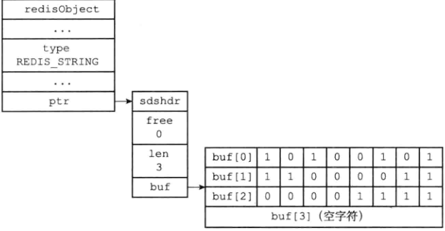
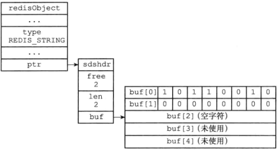
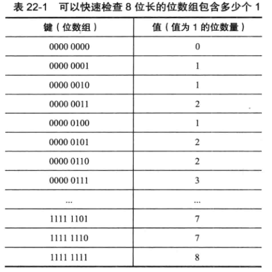

# 位数组的使用

- SETBIT

  - 在位数组指定偏移量上设置二进制位置

  ```redis 
  > SETBIT bit 0 1 # 0000 0001 表示key为bit的位数组在第0位设置1，返回前一个值
  (integer) 0
  > SETBIT bit 3 1 # 0000 1001 再在第三位设置1，返回前一个值
  (integer) 0
  > SETBIT bit 0 0 # 0000 1000 将第0位设置为0
  (integer ) 1
  ```

- GETBIT

  - 读取位数组指定偏移量的二进制值

  ```redis
  GETBIT bit 0 
  ```

- BITCOUNT

  - 统计位数组中，值为1的二进制位的数量

  ```redis
  BITCOUNT bit
  ```

- BITOP

  - 对偏移量上的值进行按位与，按位或，按位异或运算

  ```redis
  BITOP AND and_result x y z # 将key为x，y，z的位数组分别按位与操作，结果存储与and_result中
  BITOP OR or_result x y # 按位或
  BITOP XOR xor_result x y # 按位异或
  BITOP NOT not_result x # 对x位数组按位取反
  ```

  

# 位数组的表示

- redis使用字符串对象表示位数组
  - SDS结构
  - 是二进制安全的
  - 使用SDS结构的操作函数处理位数组



- len为1表示存储了一个字节长的位数组
- buf[0…n-1]，保存一字节长的数组
  - 保存位的顺序和使用的顺序相反
  - 使用逆序可以简化SETBIT操作
- buf[n]，保存末尾空字符‘\0’


# GETBIT 实现

- getbit <bitarray> <offset>
- 计算byte=offset / 8 得到存储在哪个buf中
- 计算bit=(offset mod 8) + 1 得到在buf中第几位二进制值
- 复杂度是O(1)


# SETBIT 实现

- setbit <bitarray> <offset> <value>
- 计算len=(offset / 8 ) + 1
  - 得到位数组需要多少字节
- 如果bitarrary键保存的位数组的长度小于len，将SDS扩展至len，将新扩展的位二进制值设置为0
- 计算byte=offset / 8 得到存储在哪个buf中
- 计算bit=(offset mod 8) + 1 得到在buf中第几位存储二进制值value
- 返回该位的旧的二进制值oldValue



- 在扩展的时候，SDS空间预分配策略，会预先多分配2个字节未使用的空间
- 使用SETBIT逆序书写，在扩展时，不需要将原先的buf进行复制移动到扩展的buf，可以直接在扩展的buf写上高位二进制，提升效率


# BITCOUNT实现

- 二进制位统计算法：遍历算法
- 二进制位统计算法：查表法
  - 遍历次数少了8倍
  - 空间换时间
  - 适合创建8位或16位的表，32位占用内存过多



- 二进制位统计算法：SWAR算法
- redis使用了查表法和SWAR算法结合