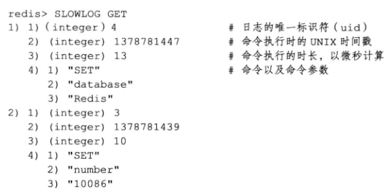

# 慢查询日志

- 用于记录执行时间超过给定时长的命令请求
- 通过这个功能产生的日志监视和优化查询速度
- slowlog-log-slower-than
  - 指定执行时间超过多少微秒的命令请求会被记录到日志上
- slowlog-max-than
  - 指定服务器最多保存多少条慢查询日志
  - 先进先出保存
  - 内部存储一个链表保存操作命令的记录

- 示例

```redis
> CONFIG SET slowlog-log-slower-than 0
OK
> CONFIG SET slowlog-max-len 5
OK
... 输入查询等redis命令
# 查询慢日志
> SLOWLOG GET
```



