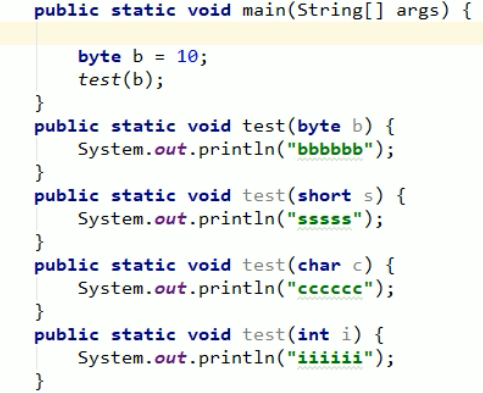
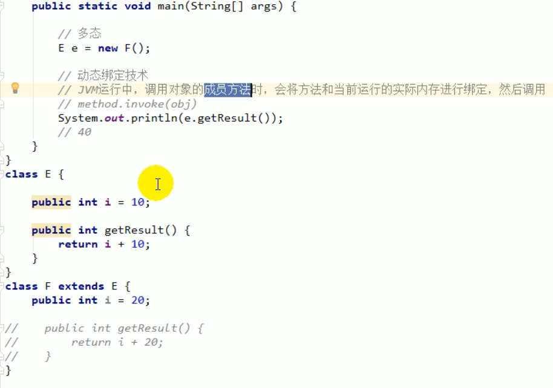
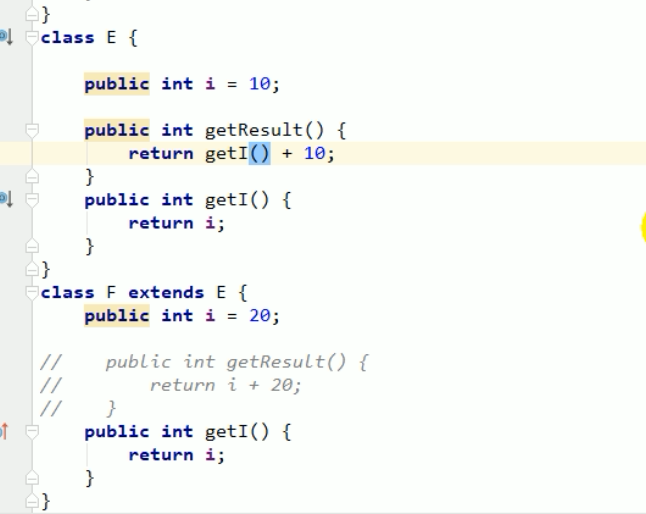

# 基础知识点补充


## 关于方法的重载

- 与参数列表的类型有关系



- 分析

  - byte b重载方法不存在

    - 使用short s的重载方法
    - 含byte参数的重载方法没有找到，会扩大字节数，扩大精度，从8位到16位，再从16位到32位，在增加到16位的时候，判断short s复合条件

  - short s重载方法也不存在

    - 使用int i的重载方法

    - 不使用char c的重载方法

      - char 是16位的，但是不能代替数字，因为取值范围是0~65535，不能代替负数
      - byte是-128~127的，char不能替代

      

- 关于即时编译器

  - 如果变量只声明了，没有使用，那么编译后该变量不会存在

```java
byte b = 10+10;
在编译器转换为class文件时
bipush 20
直接将结果计算得出
```

```java
byte a = 127;
byte b = 127+1;// 编译报错，超过byte范围
byte c = a ++;// 不报错，一元运算符不提升数据类型,此时c的值是-128
// 上一行等价于
byte d = (byte)(a+1);
```


## 关于方法的重写

- 调用对象方法时，看该方法的对象的实际内存



- 这里F类中没有了getResult方法，那么调用getResult方法所绑定的是父类的对象的实际内存
- 如果继续修改代码如下，分析
  - 此时 E的getI()来源于子类的F的getI()




