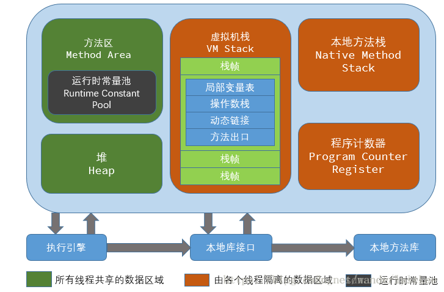

# 介绍

- 查看java版本
  - 通过java版本查看虚拟机

```bash
$ java -version
java version "1.8.0_101"
Java(TM) SE Runtime Environment (build 1.8.0_101-b13)
Java HotSpot(TM) 64-Bit Server VM (build 25.101-b13, mixed mode)
```


## jvm发展史


- Sun Classic /Exact VM


## 关于常量池

  

Java6和6之前，常量池是存放在方法区中的

Java7，将常量池是存放到了堆中，常量池就相当于是在永久代中，所以永久代存放在堆中

- Java8之后，取消了整个永久代区域，取而代之的是元空间 meta space
  - 没有再对常量池进行调整

对常量池的垃圾回收

- 在较新的JVM中,使用**WeakReferences**来引用池中的字符串
- 受约束的字符串实际上可以进行GC处理
- 仅限于Full Garbage收集期间 


