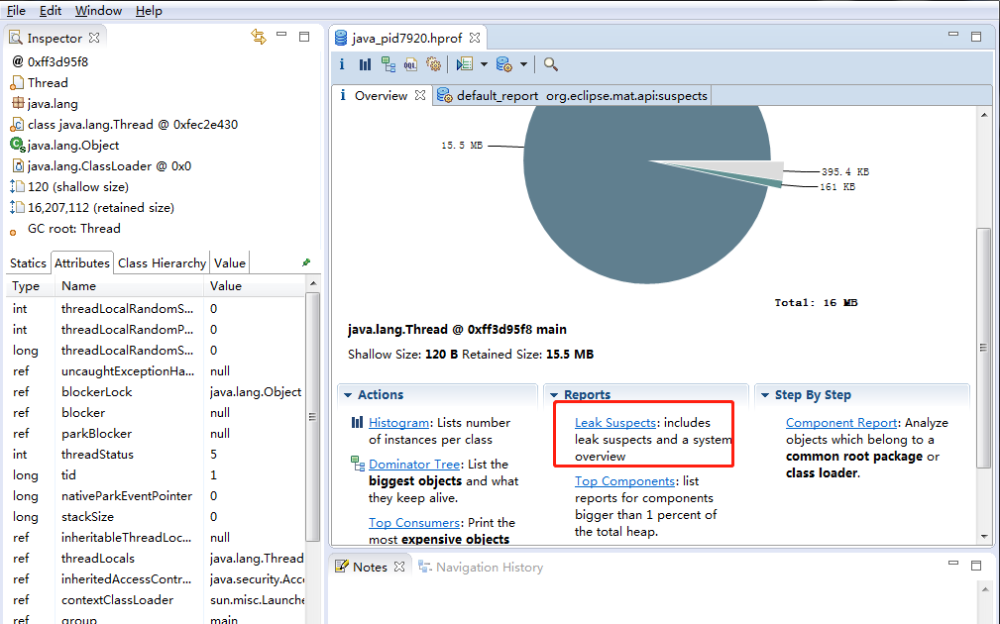
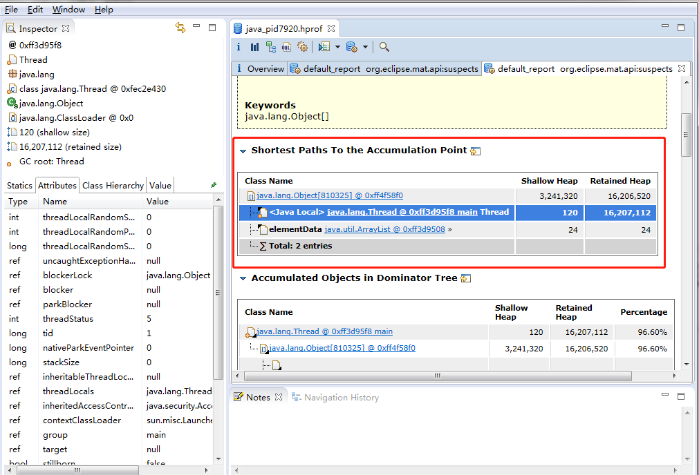

# OOM


## java 堆溢出


### OutOfMemoryError: Java heap space

- VM参数

```vm
-Xms20M -Xmx20M -XX:+HeapDumpOnOutOfMemoryError
```

- 代码

```java
package com.stt.jvm.P01_OOM;

import java.util.ArrayList;
import java.util.List;

/**
 * 实践：OutOfMemoryError
 *
 * 限制java堆大小为20MB，不可扩展，将堆最小值Xms和最大值Xmx设置一样，避免堆自动扩展
 * 设置HeapDumpOnOutOfMemoryError 在虚拟机出现异常时，Dump出当前的内存堆快照
 *
 * VM args : -Xms20M -Xmx20M -XX:+HeapDumpOnOutOfMemoryError
 *
 */
public class C01_HeapOOM {

	static class OOMObject{ }

	public static void main(String[] args) {
		List<OOMObject> list = new ArrayList<>();
		while (true){
			list.add(new OOMObject());
		}
	}
}
```

- 结果
  - 在项目外部E:\study\java\code\base-demo生成一个java_pid7920.hprof的文件，大小26.9M

```bash
java.lang.OutOfMemoryError: Java heap space
Dumping heap to java_pid7920.hprof ...
Heap dump file created [28242483 bytes in 0.185 secs]
Exception in thread "main" java.lang.OutOfMemoryError: Java heap space
	at java.util.Arrays.copyOf(Arrays.java:3210)
	at java.util.Arrays.copyOf(Arrays.java:3181)
	at java.util.ArrayList.grow(ArrayList.java:261)
	at java.util.ArrayList.ensureExplicitCapacity(ArrayList.java:235)
	at java.util.ArrayList.ensureCapacityInternal(ArrayList.java:227)
	at java.util.ArrayList.add(ArrayList.java:458)
	at com.stt.jvm.P01_OOM.C01_HeapOOM.main(C01_HeapOOM.java:24)
```


### 分析

- 使用内存映像分析工具
  - Eclipse Memory Analyzer
  - MAT
  - 下载地址 https://www.eclipse.org/mat/downloads.php



- 选择泄露检测
- 查看线程占用堆内存情况




### 思路

- 分清内存泄露（memory leak）和内存溢出（memory overflow）
- 内存泄露
  - 通过工具查看泄露对象到GC roots的引用链
  - 找到泄露对象通过如何的路径与GC roots相关联并导致GC无法回收
- 内存溢出
  - 内存中的对象必须存活
  - 检查虚拟机的堆参数 Xms Xmx与物理机内存对比是否可以调大
  - 从代码上检查某些对象的生命周期是否过长，尝试减少程序运行期间内存的消耗


## 虚拟机栈和本地方法栈溢出


### StackOverflowError

- hotspot 不区分虚拟机栈和本地方法栈
- 设置本地方法栈参数Xoss在hotspot中无效
- 设置栈容量参数Xss在hotspot中有效

```java
package com.stt.jvm.P01_OOM;

/**
 * vm args: -Xss128k
 */

public class C02_JavaVMStackSOF {

	int stackLength = 1;

	void stackLeak(){
		stackLength += 1;
		stackLeak();
	}

	public static void main(String[] args) {
		C02_JavaVMStackSOF oom = new C02_JavaVMStackSOF();
		try{
			oom.stackLeak();
		}catch (Exception e){
			System.out.println("stackLength:"+oom.stackLength);
			throw e;
		}
	}
}
```

- 结果

```text
stackLength:992
Exception in thread "main" java.lang.StackOverflowError
	at com.stt.jvm.P01_OOM.C02_JavaVMStackSOF.stackLeak(C02_JavaVMStackSOF.java:12)
	at com.stt.jvm.P01_OOM.C02_JavaVMStackSOF.stackLeak(C02_JavaVMStackSOF.java:13)
	at com.stt.jvm.P01_OOM.C02_JavaVMStackSOF.stackLeak(C02_JavaVMStackSOF.java:13)
	...
```

- 每个线程一个方法栈，在单线程情况下，无论是栈帧太大，或者虚拟机栈容量太小，内存无法分配时都会导致stackOverflowError


### OutOfMemoryError: unable to create new native thread

- 多个线程，固定了堆大小，去除最大方法区容量，剩下的近似于可分配的虚拟机栈空间
- 当大量线程创建申请虚拟机栈内存时，会导致内存溢出异常

```java
package com.stt.jvm.P01_OOM;

/**
 * vm args: -Xss2M
 */
public class C03_JavaVMStackOOM {

	private void dontStop(){
		while (true){}
	}

	public static void main(String[] args) throws Throwable{
		C03_JavaVMStackOOM oom = new C03_JavaVMStackOOM();
		oom.stackLeakByThread();
	}

	public void stackLeakByThread(){
		while(true){
			new Thread(()->{
				dontStop();
			}).start();
		}
	}
}
```

- 结果

```text
OutOfMemoryError: unable to create new native thread
```


## 方法区和运行时常量池溢出


### String.intern


- String.intern是一个native方法
  - 如果字符串常量池中已经包含一个等于string对象的字符串，返回池中该字符串
  - 如果没有，则将此string对象添加到常量池中，返回该对象的引用
    - 不同版本jdk在添加对象的方式操作不同

- 关于字符串常量池

```java
package com.stt.jvm.P01_OOM;


public class C04_RuntimeConstantPoolOOM {

	public static void main(String[] args) {
		String str1 = new StringBuilder("ss").append("oom").toString();
		// true
		System.out.println(str1.intern() == str1);

		String str2 = new StringBuilder("ja").append("va").toString();
		// false
		System.out.println(str2.intern() == str2);
	}
}
```

- 在jdk1.6版本是2个false
  - intern复制string对象到永久代，返回永久代实例的引用，都是false
- 在jdk1.7版本中
  - intern不再复制实例，直接使用创建的对象的引用，放入常量池中，弱引用
- 在上例子中“java”字符串已经在常量池中了，故是false


### OutOfMemoryError: Metaspace | OutOfMemoryError: PermGen space

- 使用CGLib字节码技术实现溢出

```java
package com.stt.jvm.P01_OOM;


import org.springframework.cglib.proxy.Enhancer;
import org.springframework.cglib.proxy.MethodInterceptor;
import org.springframework.cglib.proxy.MethodProxy;

import java.lang.reflect.Method;

/**
 * -XX:MaxPermSize=10M -XX:PermSize=10M
 * jdk1.8 更改为 -XX:MaxMetaspaceSize=10M -XX:MetaspaceSize=10M
 */
public class C05_JavaMethodAreaOOM {

	public static void main(String[] args) {
		while (true){
			Enhancer enhancer = new Enhancer();
			enhancer.setSuperclass(OOMObject.class);
			enhancer.setUseCache(false);
			enhancer.setCallback(new MethodInterceptor() {
				@Override
				public Object intercept(Object o, Method method, Object[] objects, MethodProxy methodProxy) throws Throwable {
					return methodProxy.invokeSuper(objects,args);
				}
			});
			enhancer.create();
		}
	}

	static class OOMObject{}
}
```

- 结果

```text
Exception in thread "main" org.springframework.cglib.core.CodeGenerationException: java.lang.reflect.InvocationTargetException-->null
	at org.springframework.cglib.core.AbstractClassGenerator.generate(AbstractClassGenerator.java:345)
	at org.springframework.cglib.proxy.Enhancer.generate(Enhancer.java:492)
	at org.springframework.cglib.core.AbstractClassGenerator$ClassLoaderData.get(AbstractClassGenerator.java:114)
	at org.springframework.cglib.core.AbstractClassGenerator.create(AbstractClassGenerator.java:291)
	at org.springframework.cglib.proxy.Enhancer.createHelper(Enhancer.java:480)
	at org.springframework.cglib.proxy.Enhancer.create(Enhancer.java:305)
	at com.stt.jvm.P01_OOM.C05_JavaMethodAreaOOM.main(C05_JavaMethodAreaOOM.java:27)
Caused by: java.lang.reflect.InvocationTargetException
	at sun.reflect.GeneratedMethodAccessor1.invoke(Unknown Source)
	at sun.reflect.DelegatingMethodAccessorImpl.invoke(DelegatingMethodAccessorImpl.java:43)
	at java.lang.reflect.Method.invoke(Method.java:498)
	at org.springframework.cglib.core.ReflectUtils.defineClass(ReflectUtils.java:459)
	at org.springframework.cglib.core.AbstractClassGenerator.generate(AbstractClassGenerator.java:336)
	... 6 more
Caused by: java.lang.OutOfMemoryError: Metaspace
	at java.lang.ClassLoader.defineClass1(Native Method)
	at java.lang.ClassLoader.defineClass(ClassLoader.java:763)
	... 11 more
```


## 本机直接内存溢出

- 直接内存 DirectMemory
- 通过-XX:MaxDirectMemorySize指定
  - 默认与-Xmx一样


### OutOfMemoryError

- 使用unsafe分配本机内存

```java
package com.stt.jvm.P01_OOM;
import sun.misc.Unsafe;
import java.lang.reflect.Field;

/**
 * -Xmx20M -XX:MaxDirectMemorySize=10M
 */
public class C06_DirectMemoryOOM {

	public static void main(String[] args) throws IllegalAccessException {
		Field unsafeField = Unsafe.class.getDeclaredFields()[0];
		unsafeField.setAccessible(true);
		Unsafe unsafe = (Unsafe) unsafeField.get(null);
		while (true){
			unsafe.allocateMemory(1024*1024); // 1MB
		}
	}
}
```

- 结果

```text
Exception in thread "main" java.lang.OutOfMemoryError
	at sun.misc.Unsafe.allocateMemory(Native Method)
	at com.stt.jvm.P01_OOM.C06_DirectMemoryOOM.main(C06_DirectMemoryOOM.java:18)
```

- 明显特征
  - HeapDump 文件没有明显的异常，OOM后的dump文件比较小
  - 如果程序间接使用了NIO，则要考虑是否是直接内存溢出


