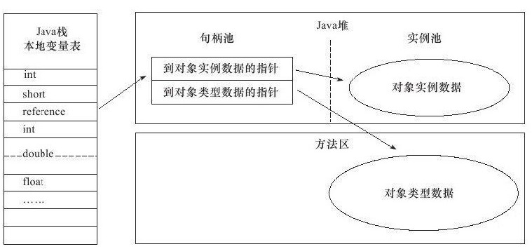
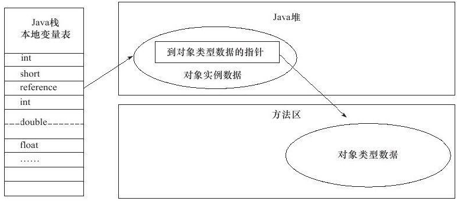

# 介绍


## 查看java版本

- 通过java版本查看虚拟机

```bash
$ java -version
java version "1.8.0_101"
Java(TM) SE Runtime Environment (build 1.8.0_101-b13)
Java HotSpot(TM) 64-Bit Server VM (build 25.101-b13, mixed mode)
```


## jvm发展史


- Sun Classic /Exact VM


# 虚拟机组成

 


## 程序计数器

- 当前线程执行字节码的行号指示器

- 每一个线程含一个独立的程序计数器，切换到该线程，会读取当前程序执行的位置


## 虚拟机栈 vm stack

- 每个线程都各自含有一个独立的虚拟机栈
- 线程私有的
- 生命周期与线程相同
- 描述java执行程序的内存模型
- 每个方法的调用等于是栈帧的入栈和出栈的过程


### 栈帧

- 每个方法执行时产生
- 含局部变量表
- 操作数栈
- 动态链接
- 方法出口


#### 局部变量表

- 存放编译期间可知的基本数据类型，对象引用
  - double和long类型占用2个slot（局部变量空间），其他类型占用一个
    - 在多线程调用同一个double类型操作会有数据错误问题
- 变量表的大小在编译期间确定


### 异常

#### StackOverflowError

- 线程请求的栈的深度大于虚拟机允许的深度
- 虚拟机栈大小有限，当产生大量栈帧可能会导致该异常

- 随着java栈中的帧的增多，最终导致这个线程的栈中的所有栈帧的大小的总和大于-Xss设置的值


#### OutOfMemoryError

- 虚拟机可以动态扩展
- 虚拟机允许设置固定长度的虚拟机栈

- 扩展时无法申请到足够的内存，抛出该异常
- 启动一个新线程时，没有足够空间给该线程分配java栈，也会抛出该异常


## 本地方法栈

- Native Method Stack
- 与虚拟机栈功能类似
- 为虚拟机使用到native方法服务
- Sun HotSpot将本地方法栈和虚拟机方法栈合二为一
- 也会抛出StackOverflowError和OutOfMemoryError


## java 堆

- java heap
- 虚拟机管理内存中最大的一块
- 所有线程共享的内存区域
- 存放对象实例
- 所有对象和数组都在堆上分配
  - JIT编译器的发展+逃逸分析，有些变量会在stack上分配空间，便于快速回收
- 垃圾回收的主要区域
- 也称为GC heap
- 关于回收
  - 收集器基于分代收集法
  - heap细分为新生代，老生代等
- 注意：会有每个线程各自私有的分配缓冲区
  - Thread Local Allocation Buffer
  - TLAB
- 通过参数Xms Xmx进行控制大小
- 如果没有内存完成实例的空间分配，也会有OutOfMemoryError的出现


## 方法区

- Non-heap
- 有些虚拟机将方法区划分为永久代Permanent Generation
  - 便于 GC 分代收集扩展到方法区的回收逻辑
  - 通过XX:MaxPermSize设置
  - 容易遇到内存溢出问题
  - 在java8中去除永久代，使用元空间，直接将类的元数据信息存储在本地内存区域
    - 降低了对方法区的调优难度
    - 系统最大内存是元空间可用的内存空间
    - 避免永久代的内存溢出问题

- 各个线程共享的内存区域
- 存储虚拟机加载的类信息，常量，静态变量，即时编译器编译后的代码等数据


### 运行时常量池

- Runtime Constant Pool

- 方法区的一部分
- 存放编译期间生成的各种==字面量==和==符号引用==


## 直接内存

- Direct Memory
- jdk1.4引入NIO，使用native函数库直接分配堆外内存，使用java堆中的DirectByteBuffer对象作为该内存的引用进行操作
  - 避免了java 对和native堆中来回复制数据，kafka使用了该方式实现零拷贝
- 内存的分配不会受到java 堆大小的限制


## 关于常量池

 

Java7之前，常量池是存放在方法区中

Java7，将常量池是存放到了堆中，常量池就相当于是在永久代中，所以永久代存放在堆中

- Java8之后，取消了整个永久代区域，取而代之的是元空间 meta space
  - 没有再对常量池进行调整


对常量池的垃圾回收

- 在较新的JVM中,使用**WeakReferences**来引用池中的字符串
- 受约束的字符串实际上可以进行GC处理
- 仅限于Full Garbage收集期间 
- full gc进行回收


# 对象的创建

- 执行new指令
- 检查该指令的参数是否在常量池中定位一个类的符号引用
- 检查这个符号引用是否被加载，解析，初始化过
  - 没有，进行相应的类加载
- 分配对象内存空间方式
  - 指针碰撞
    - Bump the Pointer
    - 设定java堆内存绝对规整
    - 移动指针，在空闲内存中挪动到对象大小的距离
  - 空闲列表
    - Free List
    - 设定java堆内存不是规整的
    - 虚拟机维护一个列表，记录可用的内存块

- java堆内存是否规整，由采用的垃圾收集器是否带有压缩规整功能决定
- 多线程创建对象分配空间的方式
  - 分配内存空间的动作进行同步处理
    - 采用CAS+失败重试，保证更新操作的原子性
  - 内存分配动作按照线程划分在不同的空间中进行
    - 每个线程在java堆中预先分配一小块内存TLAB
    - 分配独立的在各自的TLAB上创建对象分配内存
    - 当TLAB使用完，需要新的TLAB时，才需要进行锁同步处理
    - 通过`-XX:+/-UseTLAB`参数设定


# 对象的内存布局

- 对象头（Header）
  - 总共32bit或64bit---Mark Word
  - 如在32bit中
    - hashCode ---25bit
    - GC分代年龄--4bit
    - 锁状态标志---2bit
    - 线程持有的锁
    - 偏向线程ID
    - 偏向时间戳
  - 对于数组，对象头还要含有数组的长度
  - VM可以通过普通java对象的元数据信息确定java对象的大小，从数组元数据不行
- 实例数据（Instance Data）
  - 对象存储的有效信息
- 对齐填充（Padding）


# 对象的访问定位

通过栈上的reference数据操作堆上的具体对象

访问方式

- 使用句柄

  - java堆中创建一个句柄池
  - reference存储的是对象的句柄地址
  - 句柄中包含对象的实例数据与类型数据的具体地址
  - 好处：reference中存储的是稳定的句柄地址，对象移动（垃圾回收时），不会改变句柄地址，而改变句柄中的实例数据指针

  

- 直接指针

  - reference存储对象地址

  

  - 好处：访问速度快，节省了一次指针定位的开销
  - HotSpot 使用该方式