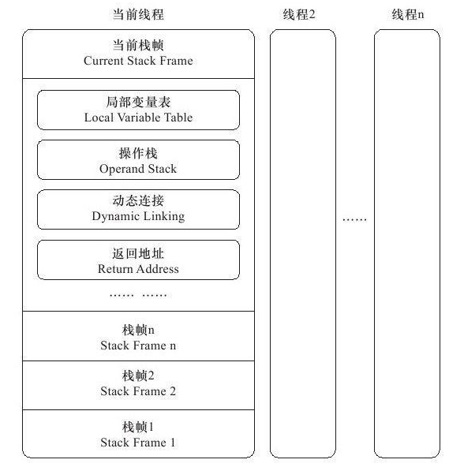
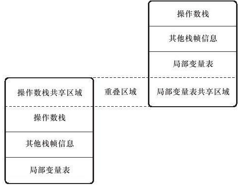

# 运行时栈帧结构

- 栈帧
  - stack frame
  - 支持虚拟机进行方法调用和方法执行的数据结构
  - 是虚拟机运行时数据区中虚拟机栈的栈元素
  - 每个方法的执行都对应着一个栈帧在虚拟机的入栈到出栈的过程
  - 在编码时，栈帧分配的内存已经确定
  - 位于栈顶的栈帧是当前线程有效的执行栈帧
    - 当前栈帧 Current Stack Frame
    - 关联的方法 当前方法 Current Method



## 局部变量表

- Local Variable Table
- 一组变量值存储空间
- 存放方法参数和方法内局定义的局部变量
- 编程class文件时，在方法的Code属性的max_locals数据项中确定了方法需要分配局部变量表的最大容量
- 最小单位：变量槽，Variable Slot
  - 存放8种数据类型
    - 可存放一个boolean，byte，char，short，int，float，reference，returnAddress类型数据
  - 不同的操作系统slot大小不同，如32位系统大小32位
  - 对于64位数据类型，jvm会以高位对齐的方式分配连续2个slot空间
    - long，double
    - ==非原子协定，把数据读写分割为2次32位读写==

- jvm通过索引定位使用局部变量表
  - 索引范围从0到局部变量表slot的最大数量

- jvm使用局部变量表完成参数值到参数变量列表的传递过程
- 局部变量表的slot可以重用
  - 会影响系统的垃圾回收行为
- 示例：solt重用对垃圾回收的影响

```java
/**
 * 测试 栈帧中局部变量表slot分配后垃圾回收情况
 * -verbose:gc
 */
public class SlotTest {
	public static void main(String[] args) {
		{
			byte[] placeholder = new byte[64*1024*1024];
		}
		System.gc();
	}
}
// 结果 基本上没有变化，没有回收掉
[GC (System.gc())  69530K->66352K(151552K), 0.0016555 secs]
[Full GC (System.gc())  66352K->66258K(151552K), 0.0152834 secs]
```

```java
public static void main(String[] args) {
    {
        byte[] placeholder = new byte[64*1024*1024];
    }
    int a = 0;
    System.gc();
}
// 结果，回收成功
[GC (System.gc())  69530K->66336K(151552K), 0.0014937 secs]
[Full GC (System.gc())  66336K->722K(151552K), 0.0083921 secs]
```

- 说明：代码placeholder已经离开了作用域，如果没有读写操作，那么GC roots依然保留关联，placeholder占用的solt没有被其他变量占用，因此暂时没有回收，如果有个变量赋值，更改了局部变量表中的slot，那么会被回收掉，一般用设置为null来提前回收
- 注意：当前的示例在本地运行时与JIT编码优化后不同，编码优化后执行可以回收，这里只是示例slot的复用，同时如果后期设置为null，可能在JIT编码优化后会去除
- 局部变量与类变量的不同在于
  - 类变量有准备阶段（赋初始值），初始化阶段（赋自定义值）
  - 局部变量没有准备阶段，因此需要手动赋初始值


## 操作数栈

- Operand Stack
- 操作栈
- 先入后出 LIFO，Last In First Out
- 最大深度在编译时写入Code属性的max_stacks数据项中
- 32位数据栈容量1，64位数据类型栈容量2
- 方法执行时，字节码指令在操作栈上写入和提取内容，出栈/入栈操作
- ==如算术运算时是通过操作数栈进行==
  - iadd操作时，在操作栈顶取出2个元素进行加法操作后，结果再入栈
- 在调用其他方法时，通过操作数栈进行参数传递
- 操作栈中的数据类型需要与字节码指令的序列匹配，在类校验阶段和编辑阶段严格保证
  - 如iadd指令，执行时位于操作栈顶的2个数据类型必须是int
- 虚拟机的优化
  - 在一般情况下2个栈帧是独立的，优化后将栈帧出现一部分重叠，公用一部分数据，提升性能



## 动态连接

- Dynamic Linking
- 每个栈帧包含一个指向运行时常量池中该栈帧所属方法的引用
  - 支持方法调用
- class的文件的常量池有大量的符号引用
- 静态解析
  - 字节码方中的方法调用指令以常量池中指向方法的符号引用作为参数
  - 在类加载阶段或第一次使用时转化为直接引用
- 动态连接
  - 每一次==运行期间转化==为直接引用，懒加载


## 方法返回地址

- 正常完成出口
  - 执行引擎遇到方法返回指令，有返回值则返回给上层调用者
- 异常完成出口
  - 方法遇到异常，没有匹配到异常处理器
  - 不会给上层调用者返回值

- 方法退出等同于该栈帧出栈
  - 恢复上层方法的局部变量表和操作数栈
  - 有返回值则压如调用者栈帧的操作数栈
  - 调整pc计数器指向方法调用指令的后一条指令


# 方法调用

```java
package com.stt.jvm.P0x;

import java.lang.invoke.MethodHandle;
import java.lang.invoke.MethodType;

import static java.lang.invoke.MethodHandles.lookup;

/**
 * 使用methodHandle代替反射调用其他类方法
 */
public class MethodHandleTest {
	public static void main(String[] args) {
		(new MethodHandleTest().new Son()).thinking();
	}

	class GrandFather{
		void thinking(){
			System.out.println("grand father"); // jdk1.7执行结果
		}
	}

	class Father extends GrandFather{
		@Override
		void thinking(){
			System.out.println("father"); //  jdk 1.8执行结果 lookup 调用者敏感
		}
	}

	class Son extends Father{
		@Override
		void thinking(){
			try {
				MethodType mt = MethodType.methodType(void.class);
				MethodHandle mh = lookup().findSpecial(GrandFather.class, "thinking", mt, getClass());
				mh.invoke(this);
			} catch (NoSuchMethodException e) {
				e.printStackTrace();
			} catch (IllegalAccessException e) {
				e.printStackTrace();
			} catch (Throwable throwable) {
				throwable.printStackTrace();
			}
		}
	}
}
```


# 基于栈的字节码解释执行引擎

- jvm的执行引擎在执行时有
  - 解释执行，通过解释器执行
  - 编译执行，通过即时编译器产生本地代码执行


## 解释执行

- 