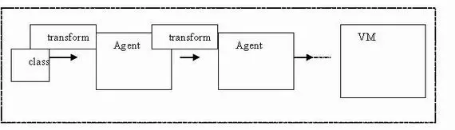

# 介绍

- java.lang.instrument 包的实现，是基于JVMTI机制的
  - JVMTI（Java Virtual Machine Tool Interface）是一套由 Java 虚拟机提供的，为 JVM 相关的工具提供的本地编程接口集合
    - jdk1.5引入
  - 实现一个JVMTI的代理程序，通过调用JVMTI当中的java类相关的函数完成java类的动态操作

https://www.jianshu.com/p/b72f66da679f

# 使用示例


## 运行前类文件替换

- 对 Java 类文件的操作，可以理解为对一个 byte 数组的操作（将类文件的二进制字节流读入一个 byte 数组）
- 在“ClassFileTransformer”的 transform 方法当中得到该数组，操作并最终返回一个类的定义（一个 byte 数组）


### test-demo

- main

```java
package com.stt.demo;

/**
 * @author Terrell She
 * @date 2020/4/7 13:37
 * @Email terrell.she@zoom.us
 * @Description 用于java agent的测试工作
 */
public class App {
	public static void main(String[] args) {
		System.out.println("APP start");
		System.out.println(new TargetClass().getNumber());
	}
}
```

- class

```java
package com.stt.demo;

public class TargetClass {
	public int getNumber(){
		return 111;
	}
}
```


### agent

- pom

```xml
<?xml version="1.0" encoding="UTF-8"?>
<project xmlns="http://maven.apache.org/POM/4.0.0"
         xmlns:xsi="http://www.w3.org/2001/XMLSchema-instance"
         xsi:schemaLocation="http://maven.apache.org/POM/4.0.0 http://maven.apache.org/xsd/maven-4.0.0.xsd">
    <modelVersion>4.0.0</modelVersion>

    <groupId>com.stt.demo</groupId>
    <artifactId>java-agent-instrument</artifactId>
    <version>1.0-SNAPSHOT</version>
    <packaging>jar</packaging>


    <dependencies>
        <dependency>
            <groupId>com.sun</groupId>
            <artifactId>tools</artifactId>
            <version>1.8.0</version>
            <scope>system</scope>
            <systemPath>${java.home}/../lib/tools.jar</systemPath>
        </dependency>
    </dependencies>
    <build>
        <plugins>
            <plugin>
                <groupId>org.apache.maven.plugins</groupId>
                <artifactId>maven-jar-plugin</artifactId>
                <version>2.3.1</version>
                <configuration>
                    <archive>
                        <index>true</index>
                        <manifestFile>
                            src/main/resources/META-INF/MANIFEST.MF
                        </manifestFile>
                        <manifest>
                            <addDefaultImplementationEntries/>
                        </manifest>
                    </archive>
                </configuration>
            </plugin>
        </plugins>
    </build>

</project>
```

- 编写agent

```java
package com.stt.demo;

import java.lang.instrument.Instrumentation;

/**
 * @author Terrell She
 * @date 2020/4/7 13:43
 * @Email terrell.she@zoom.us
 * @Description
 */
public class Premain {
	/**
	 * 在主程序main方法之前运行
	 * @param agentArgs 传递的参数
	 * @param inst agent技术主要使用的api，可以用来改变和重新定义类的行为
	 */
	public static void premain(String agentArgs, Instrumentation inst) {
		System.out.println("premain");
		// main方法执行之前，每装载一个类，就会调用该transformer一次，判断是否要进行类的转换
		inst.addTransformer(new Transformer());
	}
}
```

- transform

```java
package com.stt.demo;

import java.io.File;
import java.io.FileInputStream;
import java.io.IOException;
import java.lang.instrument.ClassFileTransformer;
import java.lang.instrument.IllegalClassFormatException;
import java.security.ProtectionDomain;

/**
 * @author Terrell She
 * @date 2020/4/7 13:44
 * @Email terrell.she@zoom.us
 * @Description
 */
public class Transformer implements ClassFileTransformer {

	/**
	 * 参数：
		 * loader - 定义要转换的类加载器；如果是引导加载器，则为 null
		 * className - 完全限定类内部形式的类名称和 The Java Virtual Machine Specification 中定义的接口名称。例如，"java/util/List"。
		 * classBeingRedefined - 如果是被重定义或重转换触发，则为重定义或重转换的类；如果是类加载，则为 null
		 * protectionDomain - 要定义或重定义的类的保护域
		 * classfileBuffer - 类文件格式的输入字节缓冲区（不得修改）
	 * 返回：
	    * 一个格式良好的类文件缓冲区（转换的结果），如果未执行转换,则返回 null
    * 抛出：
	    * IllegalClassFormatException - 如果输入不表示一个格式良好的类文件
	 */
	@Override
	public byte[] transform(ClassLoader loader, String className, Class<?> classBeingRedefined, ProtectionDomain protectionDomain, byte[] classfileBuffer) throws IllegalClassFormatException {
		// 针对该类进行转换
		if(className.equals("com/stt/demo/TargetClass")){
			byte[] b= getBytesFromFile("/TargetClass.class.2");
			System.out.println(b);
			return b;
		}
		return null;
	}

	private byte[] getBytesFromFile(String path) {

		try{
			File file = new File(path);
			FileInputStream inputStream = new FileInputStream(file);
			byte[] bytes = new byte[(int)file.length()];

			int offset = 0;
			int numRead = 0;
			// 读取文件，没有读完会继续读取，read 返回-1 表示读取完毕
			while(offset < bytes.length && (numRead = inputStream.read(bytes,offset,bytes.length-offset)) >= 0){
				offset += numRead;
			}
			if(offset < bytes.length){
				// 读取结束但是没有读取完整
				throw new IOException("could not completely read file"+file.getName());
			}
			inputStream.close();
			return bytes;
		}catch (Exception e){
			System.out.println("ERROR"+e.getClass().getName());
			return null;
		}
	}
}
```

- resources/META-INF/MANIFEST.MF

```txt
Manifest-Version: 1.0
Premain-Class: com.stt.demo.Premain

```

### 测试

- 修改，并使用javac 进行编译成class文件，改名为TargetClass.class.2，放在与agent.jar相同的路径下

```java
package com.stt.demo;

public class TargetClass {
	public int getNumber(){
		return 222;
	}
}
```

- test-demo的vm options配置为

```bash
-javaagent:d/agent.jar
```

- 注意：如果配置在agent项目的target目录下的jar包，可以进行debug调试


### 说明

- 多个代理可以同时执行，按照代理指定的顺序被依次调用

 


## 运行后类文件替换


**VirtualMachine 代表一个 Java 虚拟机**，也就是程序需要监控的目标虚拟机，提供了 JVM 枚举，**Attach 动作和 Detach 动作（Attach 动作的相反行为，从 JVM 上面解除一个代理）等等** ;

VirtualMachine类，该类允许我们 **通过给attach方法传入一个jvm的pid（进程id），远程连接到jvm上** 。然后我们可以 **通过loadAgent方法向jvm注册一个代理程序agent，在该agent的代理程序中会得到一个Instrumentation实例**，该实例可以 **在class加载前改变class的字节码，也可以在class加载后重新加载**。在调用Instrumentation实例的方法时，这些方法会使用ClassFileTransformer接口中提供的方法进行处理。

**VirtualMachineDescriptor 则是一个描述虚拟机的容器类**，配合 VirtualMachine 类完成各种功能。


### agent

```java
package com.stt.demo;

import java.lang.instrument.ClassDefinition;
import java.lang.instrument.Instrumentation;
import java.lang.instrument.UnmodifiableClassException;

/**
 * @author Terrell She
 * @date 2020/4/7 10:34
 * @Email terrell.she@zoom.us
 * @Description
 */
public class Agentmain {

	public static void agentmain(String args, Instrumentation inst) throws UnmodifiableClassException, ClassNotFoundException, InterruptedException {
		System.out.println("agent main start");
//		inst.addTransformer(new Transformer());
//		inst.retransformClasses(TargetClass.class); // 没有生效

		ClassDefinition def = new ClassDefinition(TargetClass.class, Transformer.getBytesFromFile(Transformer.path));
		inst.redefineClasses(new ClassDefinition[] { def });
		System.out.println("Agent Main Done");
	}
}
```

- MANIFEST.MF

```bash
Manifest-Version: 1.0
Agent-Class: com.stt.demo.Agentmain
Can-Redefine-Classes: true
Can-Retransform-Classes: true

```


### 被代理方

```java
package com.stt.demo;

import java.util.concurrent.TimeUnit;

/**
 * @author Terrell She
 * @date 2020/4/7 13:37
 * @Email terrell.she@zoom.us
 * @Description 用于java agent的测试工作，启动后attach agent测试
 */
public class App2 {
	public static void main(String[] args) throws InterruptedException {
		System.out.println("APP start");
		System.out.println(new TargetClass().getNumber());

		while (true) {
			System.out.println(new TargetClass().getNumber());
			TimeUnit.SECONDS.sleep(3);
		}
	}
}
```


### 测试

- 先启动attachMain，然后再启动app2

```java
package com.stt.demo;

import com.sun.tools.attach.*;

import java.io.IOException;
import java.util.List;

/**
 * @author Terrell She
 * @date 2020/4/7 15:28
 * @Email terrell.she@zoom.us
 * @Description 负责检测jvm的启动并挂载agent
 */
public class AttachMain {

	public static void main(String[] args) throws IOException, AgentLoadException, AgentInitializationException, AttachNotSupportedException {
		new AttachThread(
				"D:\\note\\java-study\\code\\java-agent-demo\\java-agent-instrument\\target\\java-agent-instrument-1.0-SNAPSHOT.jar",
				VirtualMachine.list()).start();
	}

}

class AttachThread extends Thread {

	private final List<VirtualMachineDescriptor> listBefore;

	private final String jar;

	AttachThread(String attachJar, List<VirtualMachineDescriptor> vms) {
		listBefore = vms;  // 记录程序启动时的 VM 集合
		jar = attachJar;
	}

	public void run() {
		VirtualMachine vm = null;
		List<VirtualMachineDescriptor> listAfter = null;
		try {
			int count = 0;
			while (true) {
				listAfter = VirtualMachine.list();
				for (VirtualMachineDescriptor vmd : listAfter) {
					if (!listBefore.contains(vmd)) {
						// 如果 VM 有增加，我们就认为是被监控的 VM 启动了
						// 这时，我们开始监控这个 VM
						System.out.println(vmd);
						vm = VirtualMachine.attach(vmd);
						break;
					}
				}
				Thread.sleep(500);
				count++;
				System.out.println(count);
				if (null != vm || count >= 30) {
					break;
				}
			}
			// 加载agent，执行完成后，释放
			vm.loadAgent(jar);
			vm.detach();
		} catch (Exception e) {
			e.printStackTrace();
		}
	}
}
```