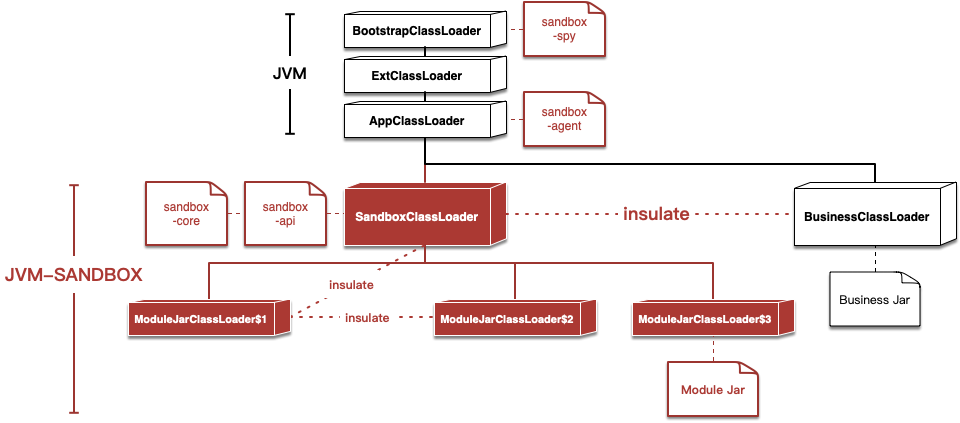
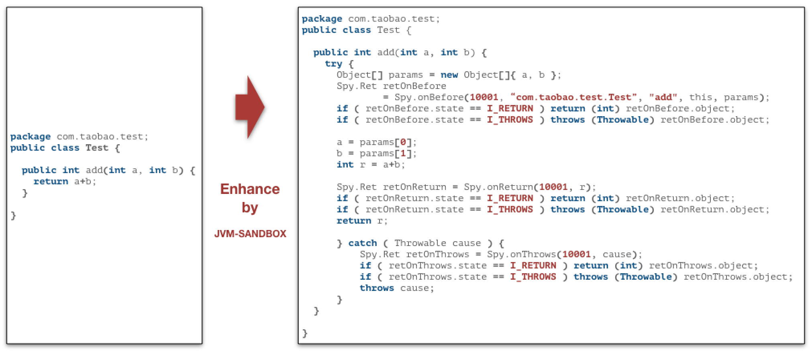
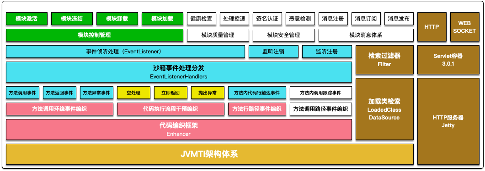

# 事件驱动

在沙箱的世界观中，任何一个Java方法的调用都可以分解为`BEFORE`、`RETURN`和`THROWS`三个环节，由此在三个环节上引申出对应环节的事件探测和流程控制机制。

```java
// BEFORE
try {

   /*
    * do something...
    */

    // RETURN
    return;

} catch (Throwable cause) {
    // THROWS
}
```

基于`BEFORE`、`RETURN`和`THROWS`三个环节事件分离，沙箱的模块可以完成很多类AOP的操作。

1. 可以感知和改变方法调用的入参
2. 可以感知和改变方法调用返回值和抛出的异常
3. 可以改变方法执行的流程
   - 在方法体执行之前直接返回自定义结果对象，原有方法代码将不会被执行
   - 在方法体返回之前重新构造新的结果对象，甚至可以改变为抛出异常
   - 在方法体抛出异常之后重新抛出新的异常，甚至可以改变为正常返回

# 类隔离策略

沙箱通过自定义的SandboxClassLoader破坏了双亲委派的约定，实现了和目标应用的类隔离。所以不用担心加载沙箱会引起应用的类污染、冲突。各模块之间类通过ModuleJarClassLoader实现了各自的独立，达到模块之间、模块和沙箱之间、模块和应用之间互不干扰




# 类增强策略

沙箱通过在BootstrapClassLoader中埋藏的Spy类完成目标类和沙箱内核的通讯




# 整体架构

