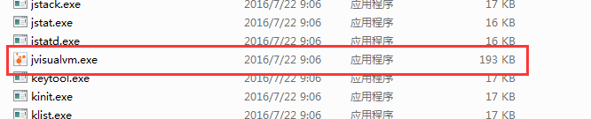

## 多线程基础


### 上下文切换

> cpu通过时间片分配算法来循环执行任务，当前任务执行一个时间片后，会切换到下一个任务的时候，需要保存上一个任务的状态，用于下次执行该任务时恢复状态。
>
> 任务从保存到加载的过程，就是一次上下文切换。

- 创建和切换上下文是有开销的，如果频繁切换上下文，有时候串行比并行效率高
- 使用Lmbench3（性能分析工具）测量上下文切换时长
- 使用vmstat测量上下文切换次数
- 如何减少上下文切换
  - 无锁并发编程
    - 使用其他方式避免使用锁，将数据的id通过hash取模，分配到得到不同的数据给不同的线程，避免线程操作相同的数据。
  - cas算法
    - java的Atomic包使用cas算法更新数据，不需要加锁
  - 使用最小线程
    - 避免创建不需要的线程
  - 使用协程
    - 在单线程中实现多任务调度，在单线程中维持多个任务的切换


// todo 关于线程调试缺失


### 死锁

死锁的产生：多个线程相互等待对方释放锁资源

#### 示例

死锁示例：2个线程分别获取2个锁

```java
package com.stt.thread.part01_base;
import java.util.concurrent.TimeUnit;
/**
 * 死锁示例
 * Created by Administrator on 2019/4/28.
 */
public class Ch01_DeadLockDemo {

	private static final String lock1 = "lock1";
	private static final String lock2 = "lock2";

	public static void main(String[] args) {
		// 线程1
		Thread t1 = new Thread(new Runnable() {
			@Override
			public void run() {
				synchronized (lock1){
					System.out.println("t1 obtain lock1");
					try {
						TimeUnit.SECONDS.sleep(1);
					} catch (InterruptedException e) {
						e.printStackTrace();
					}
					synchronized (lock2){
						System.out.println("t1 obtain lock2");
					}
				}
			}
		});
		// 线程2
		Thread t2 = new Thread(new Runnable() {
			@Override
			public void run() {
				synchronized (lock2){
					System.out.println("t2 obtain lock2");
					synchronized (lock1){
						System.out.println("t2 obtain lock1");
					}
				}
			}
		});
		t1.start();
		t2.start();
	}
}
// 输出
t1 obtain lock1
t2 obtain lock2
// 已经产生死锁
```


#### dump文件分析

使用在..\jdk1.8.0_101\bin目录下使用visualVM工具检测dump文件
 


##### 使用方式1

通过生成dump文件分析死锁

```shell
# 查找当前pid
E:\java\code\base-demo\practise>jps
15936 Jps
13352 Ch01_DeadLockDemo
# 生成dump文件
E:\java\code\base-demo\practise>jmap -dump:format=b,file=deadLock.dump 13352
Dumping heap to E:\java\code\base-demo\practise\deadLock.dump ...
Heap dump file created
```
点击文件->装入


装载成功后，可以看到线程死锁的情况


##### 使用方式2

在visualVM中选择死锁的进程，可以看到提示死锁产生，点击线程dump，可以看到死锁的细节


```shell
"Thread-1" #12 prio=5 os_prio=0 tid=0x0000000019880800 nid=0x3a00 waiting for monitor entry [0x000000001a5af000]
   java.lang.Thread.State: BLOCKED (on object monitor)
	at com.stt.thread.part01_base.Ch01_DeadLockDemo$2.run(Ch01_DeadLockDemo.java:39)
	- waiting to lock <0x000000078d427e10> (a java.lang.String)#此处可以看到等待锁的对象lock2
	- locked <0x000000078d427e48> (a java.lang.String) # 表示已经获得到锁lock1
	at java.lang.Thread.run(Thread.java:745)

   Locked ownable synchronizers:
	- None

"Thread-0" #11 prio=5 os_prio=0 tid=0x000000001987f800 nid=0x4090 waiting for monitor entry [0x000000001a87e000]
   java.lang.Thread.State: BLOCKED (on object monitor)
	at com.stt.thread.part01_base.Ch01_DeadLockDemo$1.run(Ch01_DeadLockDemo.java:27)
	- waiting to lock <0x000000078d427e48> (a java.lang.String)
	- locked <0x000000078d427e10> (a java.lang.String)
	at java.lang.Thread.run(Thread.java:745)

   Locked ownable synchronizers:
	- None
```


 参考

https://blog.csdn.net/hemin1003/article/details/71425209

jvm参考

https://www.cnblogs.com/happy-rabbit/p/6232581.html


### 避免死锁的方法

- 避免同一个线程同时获取多个锁
- 避免在一个线程在锁内同时占用多个资源，尽量保证每个锁只占用一个资源，防止多个锁嵌套
- 尝试使用定时锁，使用lock.tryLock(timeout)来代替内部锁机制
- 对于数据库锁，加锁和解锁必须在一个数据库连接中，否则会解锁失败


### 关于资源限制

> 在并发情况下，程序的运行速度受到计算机硬件资源和软件资源的限制，如网络访问的带宽限制，数据库访问IO限制等

- 资源限制引发的问题

  将串行执行的部分转换为并行执行，但是当并行的代码执行的是资源受限制的部分，依然会变成串行执行，如果并发量大的话（增加了上下文切换和资源调度时间），反而会执行变慢。

- 硬件资源限制解决

  增加机器，使用集群进行处理，多台机器，每台机器处理一块数据，处理完成后进行合并

- 软件资源限制解决

  使用资源连接池，将连接资源进行复用。


## 并发机制底层原理


### volatile 实现与原理

> 轻量级的synchronized，多线程中保证了共享变量的可见性
> 可见性：当一个线程修改一个共享变量时，另一个线程可以读取到这个修改的值
> 使用volatile变量修饰符不会引起线程上下文的切换和调度，比synchronized性能更高，如何正确的使用volatile是关键

- 定义：为了保证共享变量可以被其他线程准确，一致的更新，线程要通过排他锁单独获取这个变量，当一个字段被声明为volatile，java内存模型确保所有线程看到这个变量是一致的

参考：https://blog.csdn.net/qq_26222859/article/details/52235930


#### 原理分析

```java
// instance 使用 volatile 修饰
instance = new Singleton();
// 编译之后
0x01a3de1d: movb $0×0,0×1104800(%esi);0x01a3de24: lock addl $0×0,(%esp);
```

重点是0x01a3de24: lock addl $0×0,(%esp); 作用在cpu中如下：

- **当前**==处理器缓存行==的数据写回到==系统内存==中
- 写回操作导致其他cpu里缓存行缓存该内存的地址无效，需要重新获取，从而保证可见性


##### 关于cpu缓存行和内存

- 为了提高cpu处理速度，处理器不直接和内存进行数据交互，而是先将内存的数据缓存到cpu的缓存（cpu缓存行 ，cpu有多个缓存行， 如L1 L2 L3等）
- cpu对缓存行中的数据进行交互
- 如果声明了变量为volatile修饰，那么对该变量进行==写操作==，那么JVM会增加一个lock#指令，导致该变量在cpu的缓存行的数据写回到系统内存中。
- cpu有缓存一致性协议
  - 每个cpu通过嗅探在总线上传播的数据检查自己的缓存值是否过期，缓存值发现对应的内存地址被修改，会将该缓存行的数据设置为无效
  - cpu对缓存行的无效的数据，访问时，会重新从内存中拉取到缓存行中，保证是最新的。


##### volatile实现原则

- 汇编lock前缀指令会使cpu缓存行中的数据写回到内存中
  - 使用lock#前缀时，处理器==独占==任何共享内存
  - lock#前缀在不同cpu的锁的方式不同
    - 锁缓存
    - 锁总线，开销大

	> 在修改内存操作时，使用LOCK前缀去调用加锁的读-修改-写操作，这种机制用于多处理器系统中处理器之间进行可靠的通讯，具体描述如下：
（1）在Pentium和早期的IA-32处理器中，LOCK前缀会使处理器执行当前指令时产生一个LOCK#信号，这种总是引起显式总线锁定出现
（2）在Pentium4、Inter Xeon和P6系列处理器中，加锁操作是由高速缓存锁或总线锁来处理。如果内存访问有高速缓存且只影响一个单独的高速缓存行，那么操作中就会调用高速缓存锁，而系统总线和系统内存中的实际区域内不会被锁定。同时，这条总线上的其它Pentium4、Intel Xeon或者P6系列处理器就回写所有已修改的数据并使它们的高速缓存失效，以保证系统内存的一致性。如果内存访问没有高速缓存且/或它跨越了高速缓存行的边界，那么这个处理器就会产生LOCK#信号，并在锁定操作期间不会响应总线控制请求

- 一个处理器缓存回写到内存会导致其他处理器缓存无效

  - 通过嗅探一个处理器来检测其他处理器打算写内存的地址，当该地址处于共享状态，那么嗅探处理器将使他的缓存行无效，下次访问时，强行执行缓存行填充。


##### 流程分析

工作内存Work Memory其实就是对CPU寄存器和高速缓存的抽象，或者说每个线程的工作内存也可以简单理解为CPU寄存器和高速缓存。

那么当写两条线程Thread-A与Threab-B同时操作主存中的一个volatile变量i时，Thread-A写了变量i，那么：

- Thread-A发出LOCK#指令
- 发出的LOCK#指令锁总线（或锁缓存行），同时让Thread-B高速缓存中的缓存行内容失效
- Thread-A向主存回写最新修改的i

Thread-B读取变量i，那么：

- Thread-B发现对应地址的缓存行被锁了，等待锁的释放，缓存一致性协议会保证它读取到最新的值

由此可以看出，volatile关键字的读和普通变量的读取相比基本没差别，差别主要还是在变量的写操作上。


### synchronized 实现与原理

> 重量级锁，每个对象都可以作为锁

- 对于普通同步方法，锁是当前实例对象
- 对于静态同步方法，锁是当前类的Class对象
- 对于同步方法块，锁是Synchronized括号中配置的对象


#### JVM使用monitor对象实现方法和代码块同步

- monitorenter指令在编译后插入到同步代码块开始的位置
- monitorexit指令在编译后插入到同步代码块结束和异常的位置
- monitorenter和monitorexit必须配对
- 每个对象都有一个对应的monitor对象
- 当一个monitor对象被持有时，线程执行到monitoreneter会尝试获取该monitor的所有权---尝试获取对象锁


#### java对象头存储synchronized锁信息

- java对象头有一个Mark Word存储HashCode，分代年龄，锁标记位，如果jvm是32位，那么Mark Word大小是32bit，64位是64bit

- 以32位为例，Mark Word组成与状态如下

| 锁状态   | 29bit                    | 1bit 是否偏向锁 | 2bit 锁标志位 |
| -------- | ------------------------- | --------------- | ------------- |
| 无锁状态 | 对象的hashCode(25bit)对象的分代年龄(4bit) | 0 | 01            |
| 轻量级锁 | 指向栈中锁记录的指针 |  | 00            |
| 重量级锁 | 指向互斥量(重量级锁)的指针 |  | 10            |
| GC标记   | 空 |  | 11            |
| 偏向锁   | 线程ID(23bit),Epoch(2bit)对象的分代年龄(4bit) | 1 | 01            |


#### 锁的升级

JDK1.6 为了减少获取和释放锁的性能消耗，增加偏向锁和轻量级锁

锁升级

- 从低到高：无锁状态 –> 偏向锁 –>轻量级 –>重量级
- 锁可以升级，但不能降级


#### 偏向锁

- 大多情况下，锁的竞争不是特别激烈，同一个线程可以获取到多次锁，为了减少获取锁的代价，引入偏向锁
- 当一个线程第一次访问同步代码块获取锁时，会在MarkWord中记录线程ID
- JDK7默认开启，如果关闭需要使用：-XX:- UseBiasedLocking=false，则程序会默认进入轻量级锁状态


##### 锁的获取

当该线程再次访问同步代码块的时候，如果MarkWord中的记录线程ID是当前线程，可以直接获取到锁，如果不是，那么判断偏向锁标志位是否是1，是0则需要进行CAS操作竞争锁，如果是1，则将使用CAS将对象头的偏向锁指向当前线程


##### 锁的撤销

等到==锁竞争==才进行锁的释放，否则一直记录原先线程持有，提升了性能

撤销操作：等到全局安全点（该时间片没有代码执行），暂停有偏向锁的线程，检查该线程是否存活，如果该线程不存活，修改锁为无锁状态；如果线程存活，==遍历偏向对象的锁记录==，通过记录判断是偏向其他线程还是重置为无锁状态或者升级为其他锁，然后唤醒暂停的线程。

 


#### 轻量级锁


##### 锁的获取

线程在执行同步代码块之前，JVM会在==当前线程==的栈帧中创建==存储锁记录==的空间，将对象头的MarkWord复制到当前线程的锁记录空间中（DisplacedMarkWord）；线程尝试使用==CAS==将对象头中的MarkWord替换为指向锁记录的指针，如果成功，表示获取到锁，如果失败，尝试使用==自旋锁==来获取锁。


##### 锁的撤销

解锁时，使用CAS将DisplacedMarkWord替换回对象头，成功，表示没有锁竞争，如果失败，锁升级为重量级锁


 

由于自旋锁会消耗cpu，为了避免无效的自旋锁，一旦升级为重量级锁，就不会恢复为轻量级锁。在重量级锁情况下，如果锁被占用，当前线程会进行==阻塞，等待唤醒==。


#### 锁对比

| 锁       | 优点                                                       | 缺点                                              | 场景                               |
| -------- | ---------------------------------------------------------- | ------------------------------------------------- | ---------------------------------- |
| 偏向锁   | 加锁和解锁不需要额外的开销，和执行非同步方法只有纳秒的差别 | 如果线程间存在锁竞争，会有额外的锁撤销资源        | 只有一个线程访问同步块信息         |
| 轻量级锁 | 锁竞争不会阻塞，提高了程序响应速度（因为自旋）             | 如果始终得不到锁，那么会一直自旋操作，消耗cpu资源 | 追求响应时间，同步块执行速度非常快 |
| 重量级锁 | 线程竞争不使用自旋锁，不会消耗cpu资源                      | 线程阻塞，响应时间慢                              | 追求吞吐量，同步代码块执行时间长   |


### 原子操作实现原理

> 不可中断的一个或者一系列操作

术语解释

| 名称         | 英文                   | 解释                                                         |
| ------------ | ---------------------- | ------------------------------------------------------------ |
| 缓存行       | cache line             | 缓存最小操作单位                                             |
| 比较并交换   | compare and swap       | CAS操作，一个旧值，一个新值，操作期间比较旧值有没有变化，没有变化则更换，有变化则不更换 |
| cpu流水线    | cpu pipeline           | cpu在一个时钟周期内完成一条指令，该指令含有多个操作          |
| 内存顺序冲突 | memory order violation | 一般由假共享引起，多个cpu同时修改同一个缓存行的不同部分而引起其中一个cpu操作无效，出现冲突时，清空cpu流水线操作 |


#### 如何实现原子操作

> 前提：cpu保证内存操作的原子性，从内存中读取和写入==一个字节==是原子操作
> 最新的处理器可以保证对一个缓存行进行16/32/64bit操作是原子性的
> 但是复杂的内部操作是不能保证原子性的（跨总线宽度，跨多个缓存行，跨页表访问）
>
> 因此cpu使用总线锁和缓存锁来保证原子性操作


##### 总线锁 Lock#

多个线程同时操作共享变量，改写的操作不是原子性的，得到值与期望值可能不一致
可能多个线程从各自的缓存中读取变量，分别操作，分别写入到内存中
此时就需要提供一个总线锁使用处理器提供的Lock#信号给来处理，当一个cpu在总线上输出此信号，其他的处理请求被==阻塞==，该共享内存被cpu独占


##### 缓存锁

总线锁的问题：把cpu和内存之间的通信锁住了，锁定期间，其他cpu不能与内存进行通信，开销较大
从而在某些场合使用缓存锁代替总线锁，而缓存锁是保证==某个内存地址操作==是原子性的

内存区域如果被缓存在处理器缓存行中，并且在Lock操作期间被锁定，当执行锁操作写回到内存时，处理器不会执行总线锁，而是修改该数据的内存地址，使用缓存一致性机制保证原子性操作（缓存一致性机制阻止同时由2个线程修改该内存数据）。当缓存行回写内存数据，另一个线程的缓存行数据会失效，再次访问需要重新拉取数据。

###### 缓存锁切换总线锁场景

- 当操作的数据没有从内存中缓存到cpu缓存行中
- 操作的数据跨过多个缓存行
- 有些处理器不支持


#### java如何实现原子操作

> 通过锁和循环CAS实现原子操作


##### 使用循环CAS实现原子操作

- JVM的CAS使用处理器的CMPXCHG指令实现

- 循环CAS的基本思路：循环进行CAS操作，直到成功为止

示例：一个使用自旋CAS的安全计数器和非安全计数器

```java
package com.stt.thread.part01_base;

import java.util.ArrayList;
import java.util.List;
import java.util.concurrent.atomic.AtomicInteger;

/**
 * 循环调用cas操作
 * Created by Administrator on 2019/5/18.
 */
public class Ch02_SimpleCASDemo{

	private AtomicInteger atomicInteger = new AtomicInteger(0);
	private int i = 0;

	public void safeCount(){
		for(;;){
            // 不断获取最新值，并进行更新操作，直到操作成功为止，自旋操作
            
			int k = atomicInteger.get();
			// 进行cas操作，放入旧值和新值，乐观锁
			// 不断循环的调用
			boolean success = atomicInteger.compareAndSet(k,++k);
			if(success){
				break;
			}
		}
	}
	public void count(){
		i++;
	}
	public static void main(String[] args) {

		final Ch02_SimpleCASDemo cas = new Ch02_SimpleCASDemo();
		// 600个线程
		List<Thread> ts = new ArrayList<>(100);
		long start = System.currentTimeMillis();
		for(int j=0 ; j<100 ; j++){
			Thread t = new Thread(()->{
				for(int i=0;i<1000;i++){
					cas.safeCount();
					cas.count();
				}
			});
			ts.add(t);
		}
		for(Thread t:ts){
			t.start();
		}
		for(Thread t:ts){
			try {
				// 判断t线程是否结束，结束则继续，否则main进行阻塞
				t.join();
			} catch (InterruptedException e) {
				e.printStackTrace();
			}
		}
		System.out.println(cas.i);
		System.out.println(cas.atomicInteger.get());
		System.out.println(System.currentTimeMillis() - start);
	}
}
```

##### CAS实现原子操作的问题

- ABA问题
  - 如果一个线程修改A的值为B，然后有一个线程修改B为A，那么再有一个线程发现是A，但实际上该A是从B中更新而来的，这个线程的A已经算是过期了。
  - 添加版本号来解决该问题，版本号一直递增
- 循环时间长开销大
  - 如果自旋长时间不成功，会给cpu带来非常大的执行开销
  - 如果JVM支持处理器的pause指令，会有性能上的提升，避免在退出循环因内存顺序冲突导致cpu流水线被清空，延迟流水线执行指令
- 只能保证一个共享变量的原子操作
  - 多个共享变量时，循环CAS无法保证原子性
  - 可以将多个共享变量合并成一个共享变量进行处理
  - 从JDK1.5增加了AtomicReference类保证引用对象之间的原子性


##### 使用锁机制来实现原子操作

锁机制保证了只有获得锁的线程才能操作指定的内存区域，JVM内部有偏向锁，轻量级锁，互斥锁

处理偏向锁，JVM实现锁的方式使用循环CAS

- 当一个线程想进入同步块的使用使用循环CAS的方式获取锁，退出时使用循环CAS的方式释放锁。
- 操作系统对锁的操作如下，c编写的一个CAS处理，JVM调用此方法获取锁

```java
／／操作系统承诺，这个函数会被原子地执行
／／如果lock 初始值为false ，则会被置为true 函数返回false ，意味 抢到锁
／／如果lock 初始值为true ，则仍然被置为true 返回值也是 rue ，意 没抢到锁
boolean test_and_set(*lock){ 
    boolean rv = *lock; 
    *lock = true; 
    return rv; 
}
／／具体的使用办法如下
//1. 试图获得锁
while(test_and_set(&lock)){ 
／／ 只要test_and_set 函数返回true （没抢到锁），那就什么也不干，无限循
} 
//2. 获得锁了，可以干活儿了
x = x + 1; 
//3. 记着释放锁，让别的进程可以获得锁
lock = false;
```


## Java内存模型

内存抽象模型


JMM表示java内存管理

线程A和线程B之间相互通信


- 线程A把内存地址A中更新过的共享变量刷新到主内存中
- 线程B从主内存中读取线程A之前更新过的共享变量

- 从整体上来看这个2个步骤上是线程A向线程B==发送消息==（上锁或者刷新工作内存），而这个通信过程必须要经过主内存
- JMM通过控制主内存和每个线程本地内存之间的交互保证内存的可见性。


### 内存交互

JVM内存模型


- 所有变量存储在主内存中

- 每个线程有自己的工作内存

- 工作内存保存了该线程使用到的变量的主内存拷贝

- 线程对变量的所有操作，读取，赋值都在工作内存中执行

- 不能直接写主内存变量，线程间变量值的传递需要主内存完成

  

#### JVM的对内存的8种原子性操作

8种操作


- 读取
  - read：读取内存中的变量，传送到工作内存中
  - load：把刚读到的变量，放入到工作内存变量的副本中
- 修改
  - use：把工作内存变量的值传递给执行引擎
  - assign：把执行引擎收到的值赋值给工作内存的变量
- 写入
  - store：把工作内存的变量传送给主内存中
  - write：把刚store的变量写入到主内存中
- 锁定
  - lock：把主内存的一个变量锁定
  - unlock：把主内存的一个lock的变量释放解锁，释放后可以被其他线程访问

如果把变量从主内存复制到工作内存中，就需要顺序执行read ，load操作，如果要把工作内存同步到主内存中，就需要顺序执行store和write，不允许read和load，store和write单独出现，也不允许任意一个线程丢弃assign操作，改变后必须==回到主内存中==


- 当线程要引用字段的值
  - 将值从主内存拷贝到工作内存中（read-load）
  - 拷贝完成后，线程使用工作内存中的拷贝
  - 当同一个线程再次引用同一个字段的值时
    - 使用刚才的拷贝（use）
    - 重新从主内存拷贝到工作内存（read-load-use）
    - 上述2种情况，有JMM做决定
- 当线程要给指定字段的值
  - 将值指定给工作内存上的拷贝（assign）
  - 指定完成后，工作拷贝会将内容映射到主内存中（store-write）
    - ==注意：什么时候映射到主存储器，也是由JMM执行系统决定的==

- 当同一个线程反复指定至同一字段时
  - 可能只对工作内存中的副本进行指定（assign）
    - 只有在最后一次指定，才会将结果store-write到主内存中
  - 可能在每次进行指定时，进行拷贝到主内存的操作（assgin-store-write）
  - ==上述2中情况出现的情况也是由JMM决定的==


### 关于重排序

> 执行程序时，为了提高性能，编译器和处理器会对指令进行重排序
> 在不改变程序运行的结果情况下，尽可能提高并行度。

- 编译器优化重排序
  - 编译器在不改变单线程程序语义的前提下，重新排列语句的执行顺序
- 指令级并行重排序
  - cpu使用指令集并行技术，将多条指令重叠执行
- 内存系统的重排序
  - cpu使用缓存和IO缓冲区，加载和存储上可能是乱序执行


由于有重排序的机制，会导致多线程在执行时产生各种问题，对于重排序JMM处理器（语言级内存模型，会在不同处理器和平台上可以确保操作达到同样的效果）在要求java编译器生成指令的时候==插入特定类型的内存屏障，禁止重排序==


#### 遵守数据依赖性

> 2 个操作同时访问==同一个变量，且有一个操作是写操作==，那么这2个操作就存在依赖性，编译器和处理器在重排序操作时，会遵守数据依赖性不会更改这2个操作的执行顺序，不过只针对单个线程和单个处理器执行而言。

访问==同一个变量==只要有一个写操作，就有顺序依赖性，不会被重排序

- 写后写
- 读后写
- 写后读

会重拍序的有

- 读后读


#### 遵守as-if-serial

> 无论如何重排序，单线程的执行结果不能被改变，编译器，runtime和处理器都必须遵守
> 如果不存在数据依赖性的操作，处理器会执行重排序，但是一旦存在依赖性，就要按顺序执行

A 数据依赖C，B数据依赖C，那A和B可以重排序，但是C不能在A和B之前执行。

as-if-serial保证了单线程对调用者而言是顺序执行的，但实际上没有数据依赖的操作是重排序的。


#### happens-before概念

JMM中一个操作要对另一个操作可见，那么2个操作必须存在happens-before关系，这2个操作可以是一个线程，或者多个线程操作

规则如下：

- 程序顺序规则：A happens-before B，A 执行在B之前
- 锁规则：解锁 happens-before 加锁
- volatile变量规则：volatile写 happens-before volatile读
- 传递性：A happens-before B，B happens-before C => A happens-before C


JMM在使用happens-before的基础上，在返回的执行结果不变的情况下，为了提升性能，会进行重排序操作。

#### 对多线程的影响

A 线程执行writer，B线程执行reader

```java
class ReorderExample {
	int a = 0;
	boolean flag = false;
	public void writer() {
		a = 1; 				// 1
		flag = true; 		// 2
	}
	Public void reader() {
		if (flag) { 		// 3
			int i = a * a; 	// 4
			……
		}
	}
}
```

- 操作1和操作2没有数据依赖关系，操作3和操作4没有数据依赖关系，那么就存在操作1和操作2进行重排序，操作3和操作4进行重排序，如果操作1和操作2重排序，那么逻辑如下


- 此时多线程的语义被重排序破坏了。如果是操作3和操作4重排序，逻辑如下

  

  当存在控制依赖时，会影响指令序列执行的并行度，编译器和处理器会猜测执行，预先计算好存储在重排序缓冲ROB中，等条件为真时赋值。

  在单线程中，对控制依赖进行重排序不会影响结果，也是遵守as-if-serial；但在多线程中的重排序就会导致问题。

  

### 顺序一致性

- 一个线程所有操作必须按照程序的顺序执行
- 无论程序是否同步，所有线程都只能看到一个单一的操作执行顺序，在顺序一致性内存模型中，每个操作都必须原子执行并且立刻对所有线程可见。


顺序一致性模型有一个单一的全局内存，该内存有一个开关量，同时只有一个线程可以访问内存，从而达到多个线程执行的串行化。

- 未同步的顺序一致性效果


- 同步的顺序一致性效果

  

#### 如何同步顺序一致性

通过添加锁的方式同步

```java
class SynchronizedExample {
    int a = 0;
    boolean flag = false;
    public synchronized void writer() { // 获取锁
    	a = 1;
    	flag = true;
    } // 释放锁
    public synchronized void reader() { // 获取锁
    	if (flag) {
    	int i = a;
    	……
    	} // 释放锁
    }
}
```

临界区域内的代码可以重排序，JMM在退出临界区和进入临界区的会进行线程内存和主内存的信息更新。线程B无法察觉线程A的重排序，保证了程序的执行结果。


JMM的基本方针，在不影响程序的执行结果情况下，尽可能的为编译器和处理器进行优化操作。


#### 未同步程序的执行特性

顺序一致性模型和JMM的未同步执行的差异

|                      | 顺序一致性模型                         | JMM                                        |
| -------------------- | -------------------------------------- | ------------------------------------------ |
| 单线程内操作         | 保证单线程内的操作按顺序执行           | 不保证单线程内的操作按顺序执行，有重排序   |
| 线程可见顺序         | 保证所有线程只能看到一致的操作执行顺序 | 不保证所有线程能看到一致的操作执行顺序     |
| 64位Long和Double操作 | 保证对所有内存的读写有原子性           | 不保证Long类型和Double类型的写操作的原子性 |


关于最后一个64位Long和Double类型的写操作不是原子性原因的描述

- 总线事务机制：每个事务会读/写内存一个或多个物理上连续的字。

  - 读事务：从内存传送数据给处理器
  - 写事务：从处理器传送数据给内存
  - 一个处理器在执行总线事务（读/写）期间，总线会禁止其他处理器和IO设备执行内存的读/写
  - 多线程竞争总线的事务执行
  - 总线处理机制把所有处理器对内存的访问以串行化执行，保证了单个总线事务之中内存读/写操作具有原子性。

  

- 在32位处理器上对64位数据的写操作具有原子性，cpu会有较大的开销，JVM允许对64位的long类型和double类型操作可以没有原子性，JVM在处理64位long类型的写操作会拆分为2个32位的写操作来执行，那这2个32位操作会在不用的总线中执行。

  - 如下图处理器B读取的变量就是一个无效的变量，只有高32位的值。

  -

- JDK5开始，所有的读都是原子性的，针对64位操作也是一样。


### volatile的内存语义

volatile有可见性，但是==复合操作不具有写原子性==

```java
// 写法1
static class VolatileExample1{
    volatile long v = 0L;
    public void set(long l){ // 单个volatile的写操作，具有原子性
        v = l;
    }
    public void increment(){ // 复合多个volatile变量的读/写操作，不具有原子性
        v++;
    }
    public long get(){	 // 单个volatile的变量的读操作
        return v;
    }
}
// 写法2
static class VolatileExample2{
    long v = 0L;
    public synchronized void set(long l){
        v = l;
    }
    public void increment(){ 	// 和上个类的increment等价
        long tmp = get();		// 从主同步到线程内存
        tmp += 1;				// 普通操作
        set(tmp);				// 从线程内存中写到主内存
    }
    public synchronized long get(){
        return v;
    }
}
```

上述2个类对象在多线程执行下在程序语义上是等价的，特别在increment方法上可以体现出来，写不具有原子性。

- 写法2：锁的happens-before保证释放锁和获取锁的2个线程之间的内存可见性
- 写法1：volatile修饰的变量保证了，任意线程的读的值是该变量最后的写入
- 2者在实际使用效果上是一致的，但是volatile性能更高。
- 原子性：对任意单个volatile变量的读和写具有原子性，单类似于volatile++操作不具有原子性
- ==从语义的角度而言，volatile的写与锁的释放有相同语义，volatile的读与锁的获取有相同的语义==


#### volatile的happens-before关系

```java
class VolatileExample {
    int a = 0;
    volatile boolean flag = false;
    public void writer() {
        a = 1; // 1
        flag = true; // 2
    }
    public void reader() {
        if (flag) { // 3
        	int i = a; // 4
        	……
        }
    }
}
```

执行顺序


共享变量内存状态


#### JMM如何实现volatile的语义

首先是在含有volatile变量的重排序的定义

- 第二个操作是volatile写时，无论前面是普通读写还是volatile读写，都不能重排序
- 第一个操作是volatile读时，无论前面是普通读写还是volatile读写，都不能重排序
- 第一个操作和第二个操作都是volatile读写时，都不能重排序

其次使用在编译时插入屏障保证volatile的语义

- 在volatile的写操作前插入StoreStore
- 在volatile的写操作后插入StoreLoad
- 在volatile的读操作后插入LoadLoad和LoadStore

  

示意图


StoreStore将上面的普通操作的读写的工作内存变量刷新到主内存中

StoreLoad将避免与之后的Volatile读写操作重排序


#### 适用场景

- 状态标志：使用volatile变量控制线程的启停状态

```java
volatile boolean shutdownRequested;
...
public void shutdown() { 
    shutdownRequested = true; 
}
public void doWork() { 
    while (!shutdownRequested) { 
        // do stuff
    }
}
```

使用synchronized块编写循环比volatile复杂，且性能不高

该应用场景通常只有一种使用状态，从false转换为true，然后终止，当然可以扩展，不过需要状态转换机制来支持。

##### 双重检查锁定与延时初始化

- 一次性安全发布：单例懒汉式

```java
//注意volatile  
private volatile static Singleton instace;   
public static Singleton getInstance(){   
    //第一次null检查     
    if(instance == null){            
        synchronized(Singleton.class) {    //1     
            //第二次null检查       
            if(instance == null){          //2  
                instance = new Singleton();//3  
            }  
        }           
    }  
    return instance; 
}
```

解决某个线程可能会获取一个完全未初始化的实例，原因是双重检查锁定的破坏
1. 线程1进入getInstance()，由于null，在1处获取进入synchronized块
2. 线程1，进入3处，==在构造函数之前，使instance称为非null==
3. 线程1被线程2预占
4. 线程2判断instance非null，直接获取instance对象引用返回，返回一个==构造完成但部分初始化的Singleton对象==
5. 线程2被线程1预占
6. 线程1通过运行Singleton对象的构造函数并返回引用完成初始化。

- 独立观察：定期发布结果给其他线程读取

```java
public class UserManager {
    public volatile String lastUser; //发布的信息
 
    public boolean authenticate(String user, String password) {
        boolean valid = passwordIsValid(user, password);
        if (valid) {
            User u = new User();
            activeUsers.add(u);
            lastUser = user;
        }
        return valid;
    }
}
```

- volatile bean

```java
@ThreadSafe
public class Person {
    private volatile String firstName;
    private volatile String lastName;
    private volatile int age;
 
    public String getFirstName() { return firstName; }
    public String getLastName() { return lastName; }
    public int getAge() { return age; }
 
    public void setFirstName(String firstName) { 
        this.firstName = firstName;
    }
 
    public void setLastName(String lastName) { 
        this.lastName = lastName;
    }
 
    public void setAge(int age) { 
        this.age = age;
    }
}
```

javabean的所有成员都是volatile类型，并且getter和setter不包含任何约束，操作该对象必须是线程安全的。

- 开销较低的读写策略

如果读取操作远远超过写，那么可以使用内部锁和volatile变量减少公共代码的开销，如果更新特别少，那么性能优于一个无竞争的锁获取的开销

```java
@ThreadSafe
public class CheesyCounter {
    // Employs the cheap read-write lock trick
    // All mutative operations MUST be done with the 'this' lock held
    @GuardedBy("this") private volatile int value;
 
    //读操作，没有synchronized，提高性能
    public int getValue() { 
        return value; 
    } 
 
    //写操作，必须synchronized。因为x++不是原子操作
    public synchronized int increment() {
        return value++;
    }
}
```


### 锁的内存语义

#### 锁的happens-before关系

- 临界区互斥执行
- 释放锁的线程向获取锁的线程发送消息

```java
class MonitorExample {
    int a = 0;
    public synchronized void writer() { // 1
   	 	a++; // 2
    } // 3
    public synchronized void reader() { // 4
        int i = a; // 5
        ……
    } // 6
}
```

1 happens-before 2，2 happens-before 3 ， 3 happens-before 4 ， 4 happens-before 5， 5 happens-before 6


#### 内存语义分析

使用ReentrantLock 进行分析

```java
public class Ch05_ReentrantLockDemo {
	int a = 0;
	ReentrantLock lock = new ReentrantLock();
	public void read(){
		lock.lock();
		try{
			int i = a;
			System.out.println(i);
		}finally {
			lock.unlock();
		}
	}
	public void write(){
		lock.lock();
		try{
			a ++;
		}finally {
			lock.unlock();
		}
	}
}
```

ReentrantLock 依赖AbstractQueuedSynchronizer（AQS），使用一个volatile变量state维护同步状态。简单类图如下


##### ReentrantLock 

###### 公平锁

使用公平锁加锁过程

- ReentrantLock:lock()

- FairSync:lock()

- AbstractQueuedSynchronizer:acquire(int args)

- ReentrantLock:tryAcquire(int acquires)

```java
protected final boolean tryAcquire(int acquires) { // 公平锁，这里参数是1
    final Thread current = Thread.currentThread();
    int c = getState(); // 获取锁的开始，首先读volatile变量state
    if (c == 0) {
        if (!hasQueuedPredecessors() && compareAndSetState(0, acquires)) { // 使用cas设置为1，其他线程获取失败
            setExclusiveOwnerThread(current);
            return true;
        }
    } else if (current == getExclusiveOwnerThread()) { // 如果当前线程就是自己，则给c+1,不会再次去竞争锁
        int nextc = c + acquires;
        if (nextc < 0) throw new Error("Maximum lock count exceeded");
        setState(nextc);
        return true;
    }
    return false;
}
--------------------------------------------------------
public final boolean hasQueuedPredecessors() {
    // The correctness of this depends on head being initialized
    // before tail and on head.next being accurate if the current
    // thread is first in queue.
    Node t = tail; // Read fields in reverse initialization order
    Node h = head;
    Node s;
    return h != t &&
        ((s = h.next) == null || s.thread != Thread.currentThread());
}
```

  使用公平锁解锁过程

- ReentrantLock:unlock()
- AbstractQueuedSynchronizer:release(int args)
- Sync:tryRelease(int releases)

```java
protected final boolean tryRelease(int releases) { // 入参是1
    int c = getState() - releases; // 每次-1 ，因为是可重入锁，需要层层解锁
    if (Thread.currentThread() != getExclusiveOwnerThread())
        throw new IllegalMonitorStateException();
    boolean free = false;
    if (c == 0) {// 表示所有的锁都释放了
        free = true;
        setExclusiveOwnerThread(null); 
    }
    setState(c);
    return free; // false 说明有重入锁
}
```

  

###### 非公平锁

非公平锁在释放锁和公平锁一致，但不同的是锁的获取，也是可重入锁

- ReentrantLock:lock()
- NonfairSync:lock()
- AbstractQueuedSynchronizer:compareAndSetState(int expect,int update)

```java
final void lock() {
    if (compareAndSetState(0, 1))
        setExclusiveOwnerThread(Thread.currentThread());
    else
        acquire(1); // 这里是可重入锁
}

protected final boolean compareAndSetState(int expect, int update) {
    // See below for intrinsics setup to support this
    return unsafe.compareAndSwapInt(this, stateOffset, expect, update);
}
```

###### 小结

|                       | 公平锁                                                       | 非公平锁                                              |
| --------------------- | ------------------------------------------------------------ | ----------------------------------------------------- |
| 对volatile的state处理 | 先去读取volatile，然后再CAS修改state为1                      | 直接使用CAS更新state值为1                             |
| 释放锁                | 对state进行-1处理<br />当调用unlock后,会唤醒等待队列中的头节点的下一个节点,被唤醒的线程重新请求获取锁 | 对state进行-1处理<br />其余线程继续进行资源竞争获取锁 |
| 是否可重入            | 可重入                                                       | 可重入                                                |
| 获取锁的机制          | 线程获取锁的顺序和调用lock顺序一致，FIFO<br />在代码hasQueuedPredecessors中，如果当前线程是线程队列的第一个，或者队列为空，则可以获取锁 | 与锁的调用顺序无关，竞争                              |
| 默认使用              | 非默认                                                       | 默认                                                  |
| 性能                  | 需要进行线程获取锁排队，性能没有非公平锁高                   | 性能高，但是可能有些线程会一直得不到执行              |
| 使用                  | new ReentrantLock(true);                                     | new ReentrantLock(false);                             |


##### concurrent包的实现

java的CAS同时具有volatile读和写的内存语义，java线程之间的通信可以有

- A线程写volatile变量，B线程读取volatile变量
- A线程写volatile变量，B线程使用CAS更新volatile变量
- A线程使用CAS更新volatile变量，B线程也使用CAS更新volatile变量
- A线程使用CAS更新volatile变量，B线程读取volatile变量

concurrent实现步骤

- 声明共享变量为volatile
- 使用CAS的原子条件更新实现线程之间的同步
- 配合volatile的读写和CAS所具有的volatile读和写的内存语义实现线程之间的通信。


### final内存语义

#### final的重排序

- 构造函数内对一个final域的写入，与随后将该构造的对象赋值给一个引用变量，不能重排序
- A第一次读取一个包含final域的引用，然后B第一次读取一个final域的引用，不能重排序

```java
public class FinalExample {
    int i; // 普通变量
    final int j; // final变量
    static FinalExample obj;
    public FinalExample () { // 构造函数
        i = 1; // 写普通域
        j = 2; // 写final域
    }
    public static void writer () { // 写线程A执行
    	obj = new FinalExample ();
    }
    public static void reader () { // 读线程B执行
        FinalExample object = obj; // 读对象引用
        int a = object.i; // 读普通域
        int b = object.j; // 读final域
    }
}
```

A线程进行writer操作，B线程进行reader操作

- final的写重排序只能在构造器中
- 编译器会在final域之后，构造器return之前，插入一个StoreStore屏障，禁止将final域的写重排序到构造器之外
- 但是普通变量依然会重排序

