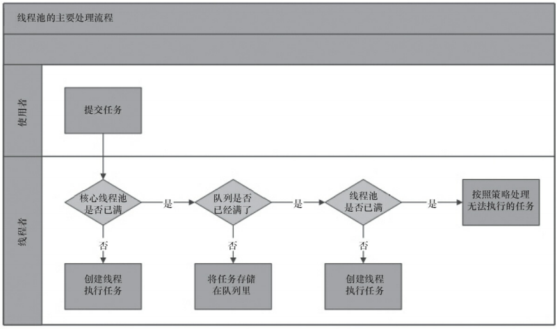

# 好处

- 降低资源消耗
- 提高响应速度
- 提高线程的可管理性


# 处理流程

- 线程池判断核心线程是否都在执行任务
  - 否，创建一个核心线程执行任务，线程个数<corePoolSize（需要全局加锁）
  - 是，说明核心线程数已满，下一流程，线程个数>=corePoolSize
- 判断工作队列是否已满
  - 否，当前任务放入BlockingQueue
  - 是，进入下一个流程
- 判断线程池的线程是否都处于工作状态
  - 没有，创建一个新线程执行任务，线程个数<maximumPoolSize（需要全局加锁）
  - 是，表示线程池线程个数已满，交给抛弃策略执行任务。
- 为什么任务要放入队列中，然后队列满再判断线程个数<maximumPoolSize
  - 由于扩展线程个数需要添加全局锁，会导致性能下降，因此会超过核心线程个数会放入阻塞队列中，减少全局锁的使用




ThreadPoolExecutor执行示意图
 

在execute方法中创建一个线程，执行完任务后，会反复从队列中拉取任务执行


### 使用

- 线程池的创建

  ```java
  new ThreadPoolExecutor(
      corePoolSize, 
      maximumPoolSize, 
      keepAliveTime,
      milliseconds,
      runnableTaskQueue, 
      handler);
  ```

  - corePoolSize

    - 线程池基本大小，一旦有新的任务请求，就会创建一个线程（在没有达到核心线程个数的情况下）
    - 调用prestartAllCoreThreads ，线程池会提前创建并启动所有核心线程

  - maximumPoolSize

    - 线程池最大数量，允许线池创建的最大线程数
    - 如果队列满了，并且已创建的线程数小于最大线程数，线程池会再次创建新的线程执行任务
    - ==注意：如果使用无界任务队列，该参数无效==

  - keepAliveTime

    - 线程活动保持时间
    - 线程池的工作线程空闲后，保持存活的时间
    - 如果任务较多，并且执行时间较短，那么可以调大时间，提高线程利用率

  - runnableTaskQueue

    - 任务队列，保存等待执行的任务阻塞队列
    - ArrayBlockingQueue
      - 基于数组有界阻塞队列，FIFO
    - LinkedBlockingQueue
      - 基于链表结构的阻塞队列，FIFO
      - 吞吐量高于ArrayBlockingQueue
      - Executors.newFixedThreadPool使用该队列
    - SynchronousQueue
      - 不存储元素的阻塞队列
      - 每个插入操作必须要有另一个线程调用移除操作，否则插入操作一致阻塞
      - 吞吐量高于LinkedBlockingQueue
      - Executors.newCacheThreadPool使用该队列
    - PriorityBlockingQueue
      - 具有优先级的无限阻塞队列

  - ThreadFactory

    - 给每个创建的线程设置名称
    - 使用guava可快速添加名称 new ThreadFactoryBuilder().setNameFormat("XX-task-%d").build();

  - RejectedExecutionHandler

    - 拒绝策略，当队列和线程池都满了的时候使用

    - AbortPolicy

      - 无法接收新的任务，抛出异常，默认

    - CallerRunsPolicy

      - 只用调用者所在线程来运行任务

    - DiscardOldestPolicy

      - 丢弃队列里最近的一个任务，并执行当前任务

    - DiscardPolicy

      - 不处理，丢弃

        

- 任务的提交

  - execute

    - 提交的任务没有返回值
    - 输入的是Runnable的实例

    ```java
    threadsPool.execute(new Runnable() {
        @Override
        public void run() {
        	// TODO Auto-generated method stub
        }
    });
    ```

  - submit

    - 提交的任务有返回值
    - 返回一个future类型的对象
      - future的get方法获取结果，会阻塞当前线程直到任务完成

    ```java
    Future<Object> future = executor.submit(harReturnValuetask);
    try {
        Object s = future.get();
    } catch (InterruptedException e) {
        // 处理中断异常
    } catch (ExecutionException e) {
        // 处理无法执行任务异常
    } finally {
        // 关闭线程池
        executor.shutdown();
    }
    ```

  

- 关闭线程池

  - 遍历线程池中的线程，然后一个个调用interrupt方法中断线程
    - 无法响应中断的任务会无法终止
  - shutdown
    - 将线程池的状态设置为SHUTDOWN
    - ==中断空闲==线程
    - 需要等待有任务的线程执行完成后关闭
  - shutdownNow
    - 先将线程池的状态设置为STOP
    - 尝试==停止正在执行和暂停==的线程
    - 适用于线程不需要执行完就终止的场景


- 配置线程池

  - 获取cpu个数：Runtime.getRuntime().availableProcessors()

  - 任务性质

    - CPU密集型任务
      - 配置尽可能小的线程，如配置Ncpu+1个线程
    - IO密集型任务
      - 由于在执行IO操作，不是一直在执行任务
      - 配置尽可能多的线程，如2Ncpu
    - 混合型任务
      - 如果可以拆分，可以拆分为CPU和IO线程池
      - 如果2种任务执行的相差时间很大，那么建议拆分
      - 如果相差时间不大，可以不拆分

  - 任务优先级

    - 有优先级的任务可以使用PriorityBlockingQueue
    - 如果一直有优先级高的任务提交到队列中，那么优先级低的会一直无法执行
    - 可以考虑将时间因素作为优先级选项

  - 执行时长

  - 任务的依赖性

    - 是否依赖其他系统资源，如数据库连接
    - 依赖数据库连接池的任务，由于线程提交SQL需要等待数据库返回结果，等待时间越长，CPU空闲时间越长，线程数设置的越大，可以更好的利用CPU

  - ==建议使用有界队列==

    - 增加系统的稳定性

    - 增加预警能力

    - 线程池可以设置大一点

      

- 线程池的监控

  - taskCount
    - 线程池执行的任务数量
  - completedTaskCount
    - 线程池在运行过程中完成的任务数量，小于等于taskCount
  - largestPoolSize
    - 线程池里面曾经最大线程数量
    - 可以了解该线程池是否满过
  - getPoolSize
    - 线程池线程的数量
  - getActiveCount
    - 获取活动的线程数
  - 重写线程池的一些方法提供其他的监控参数
    - beforeExecute 任务执行前
    - afterExecute 任务执行后
    - terminated 线程池关闭后
    - 可以实现任务的平均执行时间，最大执行时间，最小执行时间的计算

