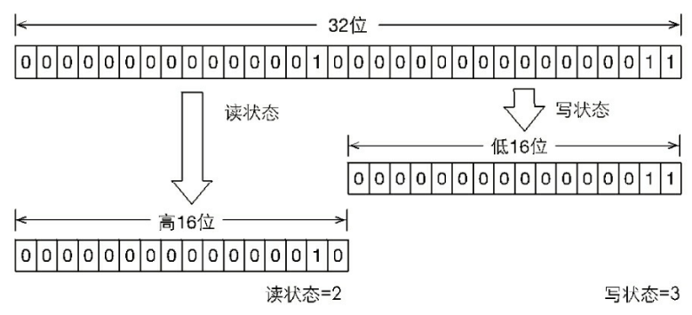

# Concurrent并发学习

## 锁

### lock

> 锁

- synchronized
  - 隐式获取锁和释放锁
- lock接口
  - 显式的获取锁和释放锁
  - 可中断的获取锁和超时获取锁等多种操作
  - 尝试非阻塞获取锁，如果一个时刻获取锁，如果没有其他线程获取锁，则成功获取并持有锁
  - 可以被中断的获取锁，与synchronized不同，获取到锁的线程可以被响应中断，当获取到锁的线程被中断时，中断异常会被抛出，同时，锁会被释放。
  - 超时获取锁，指定的截止时间之前获取锁，如果超时仍旧无法获取锁，则返回。

```java
Lock lock = new ReentrantLock();
lock.lock(); // 获取锁的操作不要放在try中，如果获取锁失败抛出异常，会导致锁无故释放
try {
} finally {
	lock.unlock();
}
```

- api

| 名称                        | 描述                                                         |
| --------------------------- | ------------------------------------------------------------ |
| void lock()                 | 获取锁，调用该方法当前线程会获取锁，当锁获取后，从该方法返回 |
| void lockInterruptibly()    | 可中断的获取锁，响应中断，获取锁的时候，可以中断当前线程     |
| boolean tryLock()           | 尝试非阻塞的获取锁，调用该方法后，会立刻返回，返回true表示获取到锁 |
| boolean tryLock(time ,unit) | 超时获取锁，1 当前线程在超时时间内获取锁，2当前线程在超时时间内被中断，3超时时间结束，返回false |
| void unlock()               | 释放锁                                                       |
| Condition newCondition()    | 获取等待通知组件，该组件和当前的锁绑定，当前线程获取到锁可以调用该组件的wait方法，调用后，当前线程释放锁 |


### AbstractQueuedSynchronizer

> 队列同步器

- 使用模板方法模式实现

- 使用一个int成员变量表示同步状态（state）

- 内置FIFO队列完成线程的排队工作

- 子类继承同步器进行管理同步状态，定义若干同步状态获取和释放来实现自定义同步组件

  - 共享或独占获取同步状态，不同类型的同步组件
    - ReentrantLock
    - ReentrantReadWriteLock
    - CountDownLatch

- 锁：面向使用者，隐藏实现细节

- 同步器：面向锁的实现者，简化锁的实现方式，屏蔽同步状态管理、线程排队，等待和唤醒等

  - 同步队列，同步器有首节点和尾节点，没有成功获取同步状态的线程会成为节点加入到队列的尾部，加入队列的过程必须是线程安全的
  - compareAndSetTail是一个CAS方法，将当前节点设置为尾部节点

  


- ==同步队列中节点==获取锁的过程
  - 在acquireQueued方法中，当前线程自旋尝试获取同步状态
  - head节点是成功获取状态的节点，head在释放锁之后，唤醒队列中的其他节点
  - 后续节点自旋判断是否是head节点，是head节点，则获取同步状态，而不是同步状态的则==继续自旋（阻塞节点的线程）==
  - 遵守同步队列的FIFO原则


- 独占式同步状态获取流程


- 独占与共享式访问资源对比


写操作独占式访问，而读取是共享式访问。


### ReentrantLock

> 重入锁

- ReentrantLock(re-entrant-lock)
  - 支持一个线程对资源的重复加锁
  - 支持获取锁的公平锁和非公平锁的选择
    - 默认非公平锁
    - 公平锁：等待时间最长的线程先获取锁，FIFO
    - 非公平锁：非FIFO
      - 效率高，但是有些场景需要公平锁
      - 非公平锁会使得其他线程”饥饿“，同一个线程获取锁的机会大，只要锁处于同步状态，再次请求锁就获取得到锁，刚释放的锁再次获取得到锁的几率大。
      - 上下文切换消耗少
- Mutex中的lock是非重入锁，再次调用lock方法会再次阻塞
- synchronized是隐式支持重入锁

#### 锁的重入

- 线程再次获取锁
  - 锁识别获取的线程是否是占用锁的线程，如果是则再次获取锁，并计数锁的获取次数
- 锁的最终释放
  - 线程重复n次获取锁，每次释放锁对字数n进行-1操作，n为0表示锁已经释放


##### 非公平锁的获取

- ReentrantLock 的 nonfairTryAcquire方法，acquires的值是1

```java
final boolean nonfairTryAcquire(int acquires) {
    final Thread current = Thread.currentThread();
    int c = getState();
    if (c == 0) { // 表示没有线程获取锁
    if (compareAndSetState(0, acquires)) {
        setExclusiveOwnerThread(current);
        return true;
    }
    } else if (current == getExclusiveOwnerThread()) { // 有线程获取锁，且当是当前锁，c+1
        int nextc = c + acquires;
        if (nextc < 0) throw new Error("Maximum lock count exceeded");
        setState(nextc);
        return true;
    }
    return false;
}
```

##### 锁的最终释放

- ReentrantLock的tryRelease方法

```java
protected final boolean tryRelease(int releases) {
    // 每次释放锁进行-1操作
    int c = getState() - releases;
    if (Thread.currentThread() != getExclusiveOwnerThread())
    	throw new IllegalMonitorStateException();
    boolean free = false;
    if (c == 0) {
        // 如果是0 表示最终释放
    	free = true;
    	setExclusiveOwnerThread(null);
    }
    setState(c);
    return free;
}
```


##### 公平锁的获取

- ReentrantLock的tryAcquire方法
  - hasQueuedPredecessors 
    - 同步队列中当前节点释放有前驱节点的判断
      - true，表示当前线程前面有其他线程等待获取锁，当前线程需要排队，需要等待前驱节点的锁的释放

```java
protected final boolean tryAcquire(int acquires) {
    final Thread current = Thread.currentThread();
    int c = getState();
    if (c == 0) {
        if (!hasQueuedPredecessors() && compareAndSetState(0, acquires)) {
        	setExclusiveOwnerThread(current);
            return true;
        }
    } else if (current == getExclusiveOwnerThread()) {
        int nextc = c + acquires;
        if (nextc < 0) throw new Error("Maximum lock count exceeded");
        setState(nextc);
        return true;
    }
    return false;
}
```


### ReentrantReadWriteLock

> 读写重入锁

- Mutex，ReentrantLock排他锁
  - 同一时刻只能有一个线程访问
- ReentrantReadWriteLock 读写锁
  - 同一时刻允许多个线程访问
  - 写线程访问时，所有读和写线程被阻塞
  - 维护一对锁
    - 读锁：读读共享
    - 写锁：读写互斥，写写互斥
  - 性能比排他锁好
    - 大多数场景读比写多，读多于写的情况下使用
  - 公平性选择
    - 支持非公平锁和公平锁的获取，还是非公平性能好于公平锁
  - 重进入
    - 支持重进入，读线程在获取了读锁之后，可再次获取读锁
    - 写线程在获取写锁之后，可再次获取写锁，也可获取读锁
  - 锁降级
    - 获取写锁=> 再获取读锁=> 释放写锁=>写锁降级为读锁
  - 锁升级
    - 不支持锁升级（把持读锁，获取写锁，释放读锁）
      - 为了保证数据的可见性
      - 如果读锁被多个线程获取，其中一个线程成功获取了写锁并更新，其他获取到读锁的线程是不可见的
  - 方法
    - getReadLockCount 返回==当前读锁==被获取的次数，2个线程获取（重进入）n次读锁，那么此时的值是n
    - getReadHoldCount 返回==当前线程==获取读锁的次数
    - isWirteLocked 判断写锁是否被获取
    - getWriteHoldCount 返回==当前写锁==被获取的次数

- 示例

```java
class Cache{
    static Map<String,Object> map = new HashMap();
    static ReentrantReadWriteLock rwl = new ReentrantReadWriteLock();
    // 声明读锁
    static Lock r = rwl.readLock();
    // 声明写锁
    static Lock w = rwl.writeLock();
	// 不会被阻塞
    public static final Object get(String key){
        r.lock();
        try{
            return map.get(key);
        }finally {
            r.unlock();
        }
    }

    public static final Object put(String key,Object value){
        w.lock();
        try{
            return map.put(key,value);
        }finally {
            w.unlock();
        }
    }

    public static final void clear(){
        w.lock();
        try{
            map.clear();
        }finally {
            w.unlock();
        }
    }
}
```


#### 实现分析

- 读写状态设计
  - 依赖同步器AQS实现同步，读写状态就是其同步器的同步状态
  - ReentrantLock中的同步状态state是一个整型
  - ReentrantReadWriteLock的同步状态维护多个度线程和一个写线程的状态
    - 将整型变量按位切割state变量，高16位表示度，低16位表示写
    - 一个线程获取写锁，再重入2次读锁，通过位运算
      - 当前状态s
        - 写状态ws获取：s与0x0000FFFF进行==与==操作
        - 读状态rs获取：s>>16，将s右移16位
        - 写状态+1：s+1,
        - 读状态+1：s+(1<<16)，等价于s+0x00010000
        - 判断锁的获取，s!=0，写状态ws==0,rs>0，表示读锁获取



- 写锁
  - 支持重入
  - 排他锁
  - 如果当前线程已经获取到写锁，再次获取，增加写状态
  - 如果当前线程已经获取读锁，再获取写锁，则进入等待状态
  - 写锁的获取
    - ReentrantReadWriteLock的tryAcquire
    - 如果读锁存在，则写锁不能获取

```java
protected final boolean tryAcquire(int acquires) {
    Thread current = Thread.currentThread();
    int c = getState();
    int w = exclusiveCount(c);
    if (c != 0) {// 表示有锁
        // 存在读锁或者当前获取线程不是已经获取写锁的线程
        if (w == 0 || current != getExclusiveOwnerThread())
        	return false;
        if (w + exclusiveCount(acquires) > MAX_COUNT)
        	throw new Error("Maximum lock count exceeded");
        setState(c + acquires);
        return true;
    }
    if (writerShouldBlock() || !compareAndSetState(c, c + acquires)) {
    	return false;
    }
    setExclusiveOwnerThread(current);
    return true;
}
```

- 读锁

  - 可重入的共享锁
  - 写状态为0，或者没有写锁，那么读锁始终会成功获取，增加读状态
  - 如果锁已经被其他线程获取写锁，那么进入等待
  - 读锁的获取
    - ReentrantReadWriteLock的tryAcquireShared

  ```java
  protected final int tryAcquireShared(int unused) {
      for (;;) int c = getState();
          int nextc = c + (1 << 16);
          if (nextc < c)
          	throw new Error("Maximum lock count exceeded");
          if (exclusiveCount(c) != 0 
              && owner != Thread.currentThread())
          	return -1;
          if (compareAndSetState(c, nextc))
          	return 1;
      }
  }
  ```

- 锁的释放

  - 写锁与ReentrantLock的释放过程类似

  - 读锁每次减少1<<16

    

- 锁的降级

  - 写锁降级为读锁'
  - 在写锁获取之前释放读锁，才能获取读锁，==在获取写锁之后，获取读锁，再释放写锁==

  ```java
  public void processData() {
      readLock.lock();
      if (!update) {
      	// 必须先释放读锁
      	readLock.unlock();
      	// 锁降级从写锁获取到开始
      	writeLock.lock();
      	try {
      		if (!update) {
      			// 准备数据的流程（略）
      			update = true;
      		}
              // 必须要获取读锁，防止其他线程又进行了写处理，当前线程完成读操作之后，才能给其他线程进行写操作
      		readLock.lock();
      	} finally {
      		writeLock.unlock();
      	}
      // 锁降级完成，写锁降级为读锁
      }
      try {
          // 使用数据的流程（略）
      } finally {
      	readLock.unlock();
      }
  }
  ```

  

### LockSupport

- 阻塞和唤醒一个线程
- 构建同步组件的基本工具类
- park：阻塞当前线程
- parkNanos(long)：阻塞当前线程，不超过指定时间
- parkUtil(long deadline)：阻塞当前线程，直到指定时间戳
- unpark(Thread)：唤醒阻塞线程


### Condition

> 条件


## 并发容器

## 框架

## 原子操作

## 工具类