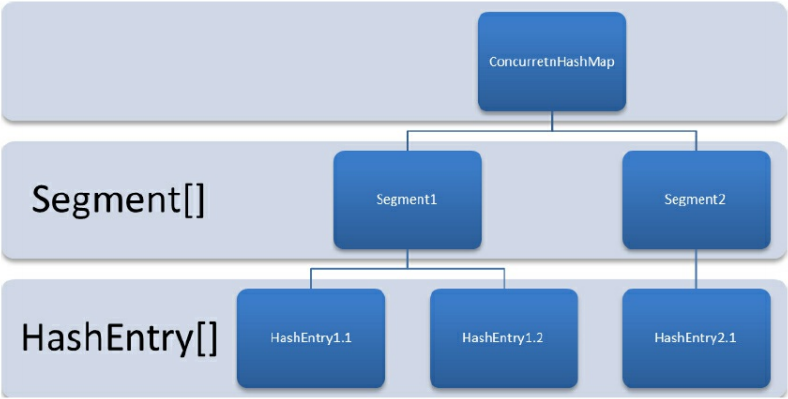

# Concurrent并发学习

## 锁

### lock

> 锁

- synchronized
  - 隐式获取锁和释放锁
- lock接口
  - 显式的获取锁和释放锁
  - 可中断的获取锁和超时获取锁等多种操作
  - 尝试非阻塞获取锁，如果一个时刻获取锁，如果没有其他线程获取锁，则成功获取并持有锁
  - 可以被中断的获取锁，与synchronized不同，获取到锁的线程可以被响应中断，当获取到锁的线程被中断时，中断异常会被抛出，同时，锁会被释放。
  - 超时获取锁，指定的截止时间之前获取锁，如果超时仍旧无法获取锁，则返回。

```java
Lock lock = new ReentrantLock();
lock.lock(); // 获取锁的操作不要放在try中，如果获取锁失败抛出异常，会导致锁无故释放
try {
} finally {
	lock.unlock();
}
```

- api

| 名称                        | 描述                                                         |
| --------------------------- | ------------------------------------------------------------ |
| void lock()                 | 获取锁，调用该方法当前线程会获取锁，当锁获取后，从该方法返回 |
| void lockInterruptibly()    | 可中断的获取锁，响应中断，获取锁的时候，可以中断当前线程     |
| boolean tryLock()           | 尝试非阻塞的获取锁，调用该方法后，会立刻返回，返回true表示获取到锁 |
| boolean tryLock(time ,unit) | 超时获取锁，1 当前线程在超时时间内获取锁，2当前线程在超时时间内被中断，3超时时间结束，返回false |
| void unlock()               | 释放锁                                                       |
| Condition newCondition()    | 获取等待通知组件，该组件和当前的锁绑定，当前线程获取到锁可以调用该组件的wait方法，调用后，当前线程释放锁 |


### AbstractQueuedSynchronizer

> 队列同步器

- 使用模板方法模式实现

- 使用一个int成员变量表示同步状态（state）

- 内置FIFO队列完成线程的排队工作

- 子类继承同步器进行管理同步状态，定义若干同步状态获取和释放来实现自定义同步组件

  - 共享或独占获取同步状态，不同类型的同步组件
    - ReentrantLock
    - ReentrantReadWriteLock
    - CountDownLatch

- 锁：面向使用者，隐藏实现细节

- 同步器：面向锁的实现者，简化锁的实现方式，屏蔽同步状态管理、线程排队，等待和唤醒等

  - 同步队列，同步器有首节点和尾节点，没有成功获取同步状态的线程会成为节点加入到队列的尾部，加入队列的过程必须是线程安全的
  - compareAndSetTail是一个CAS方法，将当前节点设置为尾部节点

  


- ==同步队列中节点==获取锁的过程
  - 在acquireQueued方法中，当前线程自旋尝试获取同步状态
  - head节点是成功获取状态的节点，head在释放锁之后，唤醒队列中的其他节点
  - 后续节点自旋判断是否是head节点，是head节点，则获取同步状态，而不是同步状态的则==继续自旋（阻塞节点的线程）==
  - 遵守同步队列的FIFO原则


- 独占式同步状态获取流程


- 独占与共享式访问资源对比


写操作独占式访问，而读取是共享式访问。


### ReentrantLock

> 重入锁

- ReentrantLock(re-entrant-lock)
  - 支持一个线程对资源的重复加锁
  - 支持获取锁的公平锁和非公平锁的选择
    - 默认非公平锁
    - 公平锁：等待时间最长的线程先获取锁，FIFO
    - 非公平锁：非FIFO
      - 效率高，但是有些场景需要公平锁
      - 非公平锁会使得其他线程”饥饿“，同一个线程获取锁的机会大，只要锁处于同步状态，再次请求锁就获取得到锁，刚释放的锁再次获取得到锁的几率大。
      - 上下文切换消耗少
- Mutex中的lock是非重入锁，再次调用lock方法会再次阻塞
- synchronized是隐式支持重入锁

#### 锁的重入

- 线程再次获取锁
  - 锁识别获取的线程是否是占用锁的线程，如果是则再次获取锁，并计数锁的获取次数
- 锁的最终释放
  - 线程重复n次获取锁，每次释放锁对字数n进行-1操作，n为0表示锁已经释放


##### 非公平锁的获取

- ReentrantLock 的 nonfairTryAcquire方法，acquires的值是1

```java
final boolean nonfairTryAcquire(int acquires) {
    final Thread current = Thread.currentThread();
    int c = getState();
    if (c == 0) { // 表示没有线程获取锁
    if (compareAndSetState(0, acquires)) {
        setExclusiveOwnerThread(current);
        return true;
    }
    } else if (current == getExclusiveOwnerThread()) { // 有线程获取锁，且当是当前锁，c+1
        int nextc = c + acquires;
        if (nextc < 0) throw new Error("Maximum lock count exceeded");
        setState(nextc);
        return true;
    }
    return false;
}
```

##### 锁的最终释放

- ReentrantLock的tryRelease方法

```java
protected final boolean tryRelease(int releases) {
    // 每次释放锁进行-1操作
    int c = getState() - releases;
    if (Thread.currentThread() != getExclusiveOwnerThread())
    	throw new IllegalMonitorStateException();
    boolean free = false;
    if (c == 0) {
        // 如果是0 表示最终释放
    	free = true;
    	setExclusiveOwnerThread(null);
    }
    setState(c);
    return free;
}
```


##### 公平锁的获取

- ReentrantLock的tryAcquire方法
  - hasQueuedPredecessors 
    - 同步队列中当前节点释放有前驱节点的判断
      - true，表示当前线程前面有其他线程等待获取锁，当前线程需要排队，需要等待前驱节点的锁的释放

```java
protected final boolean tryAcquire(int acquires) {
    final Thread current = Thread.currentThread();
    int c = getState();
    if (c == 0) {
        if (!hasQueuedPredecessors() && compareAndSetState(0, acquires)) {
        	setExclusiveOwnerThread(current);
            return true;
        }
    } else if (current == getExclusiveOwnerThread()) {
        int nextc = c + acquires;
        if (nextc < 0) throw new Error("Maximum lock count exceeded");
        setState(nextc);
        return true;
    }
    return false;
}
```


### ReentrantReadWriteLock

> 读写重入锁

- Mutex，ReentrantLock排他锁
  - 同一时刻只能有一个线程访问
- ReentrantReadWriteLock 读写锁
  - 同一时刻允许多个线程访问
  - 写线程访问时，所有读和写线程被阻塞
  - 维护一对锁
    - 读锁：读读共享
    - 写锁：读写互斥，写写互斥
  - 性能比排他锁好
    - 大多数场景读比写多，读多于写的情况下使用
  - 公平性选择
    - 支持非公平锁和公平锁的获取，还是非公平性能好于公平锁
  - 重进入
    - 支持重进入，读线程在获取了读锁之后，可再次获取读锁
    - 写线程在获取写锁之后，可再次获取写锁，也可获取读锁
  - 锁降级
    - 获取写锁=> 再获取读锁=> 释放写锁=>写锁降级为读锁
  - 锁升级
    - 不支持锁升级（把持读锁，获取写锁，释放读锁）
      - 为了保证数据的可见性
      - 如果读锁被多个线程获取，其中一个线程成功获取了写锁并更新，其他获取到读锁的线程是不可见的
  - 方法
    - getReadLockCount 返回==当前读锁==被获取的次数，2个线程获取（重进入）n次读锁，那么此时的值是n
    - getReadHoldCount 返回==当前线程==获取读锁的次数
    - isWirteLocked 判断写锁是否被获取
    - getWriteHoldCount 返回==当前写锁==被获取的次数

- 示例

```java
class Cache{
    static Map<String,Object> map = new HashMap();
    static ReentrantReadWriteLock rwl = new ReentrantReadWriteLock();
    // 声明读锁
    static Lock r = rwl.readLock();
    // 声明写锁
    static Lock w = rwl.writeLock();
	// 不会被阻塞
    public static final Object get(String key){
        r.lock();
        try{
            return map.get(key);
        }finally {
            r.unlock();
        }
    }

    public static final Object put(String key,Object value){
        w.lock();
        try{
            return map.put(key,value);
        }finally {
            w.unlock();
        }
    }

    public static final void clear(){
        w.lock();
        try{
            map.clear();
        }finally {
            w.unlock();
        }
    }
}
```


#### 实现分析

- 读写状态设计
  - 依赖同步器AQS实现同步，读写状态就是其同步器的同步状态
  - ReentrantLock中的同步状态state是一个整型
  - ReentrantReadWriteLock的同步状态维护多个度线程和一个写线程的状态
    - 将整型变量按位切割state变量，高16位表示度，低16位表示写
    - 一个线程获取写锁，再重入2次读锁，通过位运算
      - 当前状态s
        - 写状态ws获取：s与0x0000FFFF进行==与==操作
        - 读状态rs获取：s>>16，将s右移16位
        - 写状态+1：s+1,
        - 读状态+1：s+(1<<16)，等价于s+0x00010000
        - 判断锁的获取，s!=0，写状态ws==0,rs>0，表示读锁获取


- 写锁
  - 支持重入
  - 排他锁
  - 如果当前线程已经获取到写锁，再次获取，增加写状态
  - 如果当前线程已经获取读锁，再获取写锁，则进入等待状态
  - 写锁的获取
    - ReentrantReadWriteLock的tryAcquire
    - 如果读锁存在，则写锁不能获取

```java
protected final boolean tryAcquire(int acquires) {
    Thread current = Thread.currentThread();
    int c = getState();
    int w = exclusiveCount(c);
    if (c != 0) {// 表示有锁
        // 存在读锁或者当前获取线程不是已经获取写锁的线程
        if (w == 0 || current != getExclusiveOwnerThread())
        	return false;
        if (w + exclusiveCount(acquires) > MAX_COUNT)
        	throw new Error("Maximum lock count exceeded");
        setState(c + acquires);
        return true;
    }
    if (writerShouldBlock() || !compareAndSetState(c, c + acquires)) {
    	return false;
    }
    setExclusiveOwnerThread(current);
    return true;
}
```

- 读锁

  - 可重入的共享锁
  - 写状态为0，或者没有写锁，那么读锁始终会成功获取，增加读状态
  - 如果锁已经被其他线程获取写锁，那么进入等待
  - 读锁的获取
    - ReentrantReadWriteLock的tryAcquireShared

  ```java
  protected final int tryAcquireShared(int unused) {
      for (;;) int c = getState();
          int nextc = c + (1 << 16);
          if (nextc < c)
          	throw new Error("Maximum lock count exceeded");
          if (exclusiveCount(c) != 0 
              && owner != Thread.currentThread())
          	return -1;
          if (compareAndSetState(c, nextc))
          	return 1;
      }
  }
  ```

- 锁的释放

  - 写锁与ReentrantLock的释放过程类似

  - 读锁每次减少1<<16

    

- 锁的降级

  - 写锁降级为读锁'
  - 在写锁获取之前释放读锁，才能获取读锁，==在获取写锁之后，获取读锁，再释放写锁==

  ```java
  public void processData() {
      readLock.lock();
      if (!update) {
      	// 必须先释放读锁
      	readLock.unlock();
      	// 锁降级从写锁获取到开始
      	writeLock.lock();
      	try {
      		if (!update) {
      			// 准备数据的流程（略）
      			update = true;
      		}
              // 必须要获取读锁，防止其他线程又进行了写处理，当前线程完成读操作之后，才能给其他线程进行写操作
      		readLock.lock();
      	} finally {
      		writeLock.unlock();
      	}
      // 锁降级完成，写锁降级为读锁
      }
      try {
          // 使用数据的流程（略）
      } finally {
      	readLock.unlock();
      }
  }
  ```

  

### LockSupport

- 阻塞和唤醒一个线程
- 构建同步组件的基本工具类
- park：阻塞当前线程
- parkNanos(long)：阻塞当前线程，不超过指定时间
- parkUtil(long deadline)：阻塞当前线程，直到指定时间戳
- unpark(Thread)：唤醒阻塞线程


### Condition

> 条件

- Object对象的监视器方法，实现synchronized同步关键字配合使用
  - 实现等待/通知模式
  - wait
  - notify
  - notifyAll

- Condition提供类似Object的监视方法
  - 与Lock配合使用实现等待/通知模式
  - await
    - 当前线程进入等待状态
    - 解除await
      - 其他线程调用该condition的signal或signalAll方法
      - 当前线程中断，其他线程调用interrupt方法
    - 当前线程从await返回，说明已经获取到锁
  - awaitUninterruptibly
    - 当前线程进入wait状态，对中断不敏感
  - awaitNanos(long)
    - 进入wait状态后，中断或者被通知，返回剩余时间，如果是负数，说明超时
  - awaitUtil(Date)
    - 进入wait直到某个时间点
  - signal
    - 唤醒一个等待condition上的线程
  - signalAll
    - 唤醒所有等待condition上的线程

Object和Condition的对比

| 对比项                                               | Object                 | Condition                                                    |
| ---------------------------------------------------- | ---------------------- | ------------------------------------------------------------ |
| 前置条件                                             | synchronized对象获取锁 | Lock.lock()获取锁<br />Lock.newCondition() 获取Condition对象 |
| 调用方式                                             | object.wait()          | condition.await()                                            |
| 等待队列个数                                         | 一个                   | 多个                                                         |
| 当前线程释放锁并进入等待状态                         | 支持                   | 支持                                                         |
| 当前线程释放锁并进入等待状态，在等待状态中不响应中断 | 不支持                 | 支持                                                         |
| 当前线程释放锁并进入超时等待状态                     | 支持                   | 支持                                                         |
| 当前线程释放锁并进入等待状态到某个时间               | 不支持                 | 支持                                                         |
| 唤醒等待队列的一个线程                               | 支持                   | 支持                                                         |
| 唤醒等待队列的全部线程                               | 支持                   | 支持                                                         |
|                                                      |                        |                                                              |

示例

```java
package com.stt.thread.part01_base;

import java.util.concurrent.locks.Condition;
import java.util.concurrent.locks.Lock;
import java.util.concurrent.locks.ReentrantLock;

public class Ch13_ConditionDemo {

    Lock lock = new ReentrantLock();
    Condition condition = lock.newCondition();

    public void conditionWait() throws InterruptedException {
        lock.lock();
        try{
            // 当调用await后，当前线程会释放锁在此等待
            condition.await();
        }finally {
            lock.unlock();
        }
    }
    public void conditionSignal(){
        lock.lock();
        try{
            // 其他线程调用signal方法，通知当前线程从await返回
            // 注意：在返回前已经获取得到锁
            condition.signal();
        }finally {
            lock.unlock();
        }
    }
}
```

阻塞队列示例

```java
package com.stt.thread.part01_base;

import java.util.concurrent.locks.Condition;
import java.util.concurrent.locks.Lock;
import java.util.concurrent.locks.ReentrantLock;

public class Ch14_BoundedQueueByConditionDemo {

    // 一个环形的阻塞队列
    static class BoundedQueue<T>{
        private Object[] items;
        private int addIndex;
        private int removeIndex;
        // 用于边界条件判断是否满了，或者空了
        private int count;
        private Lock lock = new ReentrantLock();
        private Condition notEmpty = lock.newCondition();
        private Condition notFull = lock.newCondition();

        public BoundedQueue(int size){
            items = new Object[size];
        }

        public void add(T t) throws InterruptedException {
            lock.lock();
            try{
                // 判断是否可以添加
                // 如果满了，当前线程进入等待队列
                // 这里使用while，表示唤醒后需要再次判断
                while(count == items.length){
                    notFull.await();
                }
                items[addIndex] = t;
                addIndex ++;
                if(addIndex == items.length){
                    addIndex = 0;
                }
                count ++;
                // 唤醒等待队列中的remove的线程
                notEmpty.signal();
            }finally {
                lock.unlock();
            }
        }

        public T remove() throws InterruptedException {
            lock.lock();
            try{
                while(count == 0){
                    notEmpty.await();
                }
                Object t = items[removeIndex];
                // 使用下标进行标识删除的位置，类似于一个环形队列
                // 从头部开始删除
                removeIndex ++;
                if(removeIndex == items.length){
                    removeIndex = 0;
                }
                count --;
                // 唤醒等待的add的线程
                notFull.signal();
                return (T) t;
            }finally {
                lock.unlock();
            }
        }
    }
}
```


#### 实现分析

ConditionObject是同步器AbstractQueueSynchronizer的内部类

==每个Condition对象包含一个等待队列==

##### 等待队列

- FIFO队列，每个节点存储一个线程引用
- 每个节点就是Condition对象上等待的线程
- 调用await方法，该线程释放锁，构造成节点加入等待队列，从尾部节点插入
- 等待队列和同步队列中的节点类型一致


- Condition含有首尾节点引用，增加节点直接在尾部节点修改引用
  - 修改节点引用==没有CAS保证==，前提是已经获取得到锁


- Lock有同步队列和等待队列
- 调用await方法
  - 同步队列的首节点生成一个新节点放入Condition的等待队列中
  - 释放同步状态
  - 唤醒同步队列中的后继节点
  - 当前线程进入等待状态

```java
public final void await() throws InterruptedException {
    if (Thread.interrupted()) throw new InterruptedException();
    // 当前线程生成一个新的节点，放入等待队列
    Node node = addConditionWaiter();
    // 释放同步状态，也就是释放锁
    int savedState = fullyRelease(node);
    int interruptMode = 0;

    while (!isOnSyncQueue(node)) {
   	 	LockSupport.park(this);
    	if ((interruptMode = checkInterruptWhileWaiting(node)) != 0)
    		break;
    }
    if (acquireQueued(node, savedState) && interruptMode != THROW_IE)
    	interruptMode = REINTERRUPT;
    if (node.nextWaiter != null)
    	unlinkCancelledWaiters();
    if (interruptMode != 0)
    	reportInterruptAfterWait(interruptMode);
}
```


- 调用signal方法
  - 将等待队列中的首节点移动到同步队列中
  - 移动完成后，当前线程调用LockSupport唤醒该节点的线程
  - 唤醒之后，isOnSyncQueue返回true，调用同步器的acquireQueued方法加入获取同步状态竞争中
  - 获取锁之后，从await方法返回
  - signalAll方法等于每个节点都执行一次signal方法，都移动到同步队列中，唤醒每个线程

```java
public final void signal() {
    if (!isHeldExclusively())
    	throw new IllegalMonitorStateException();
    Node first = firstWaiter;
    if (first != null)
    	doSignal(first);
}
```


## 并发容器

### ConcurrentHashMap

> 线程安全高效的HashMap

- 并发编程中使用HashMap会死循环
  - 多线程情况下，put方法会导致HashMap的Entry链表形成环形数据结构，会产生死循环获取Entry
- 使用线程安全的HashTable效率低
  - 使用synchronized保证线程安全
  - 其他线程会进入阻塞或轮询状态
- concurrentHashMap
  - 使用锁分段提升并发效率
  - 对数据进行分段，每个分段一个锁
  - 访问不同分段的数据，线程不会存在锁竞争
  - 容器锁的个数的是16，即16个分段




- 操作
  - get
    - 通过再散列定位到对应的segment，再通过散列定位到元素
    - 不需要加锁
    - 读取的值为空，需要加锁重读
    - 将使用的共享变量都定义为volatile类型（写入操作先于读操作）
  - put
    - 操作会加锁
    - 定位添加元素的位置，放入HashEntry数组中
    - 添加后，判断是否要扩容
      - 创建一个容量是原先容量2倍的数组，将原数组的元素散列后插入新数组
      - 只对某个segement进行扩容
  - size
    - 使用不加锁的方式统计各个segment的size大小2次
    - 如果统计中容器大小有变化，则加锁进行统计
    - 容器大小modCount，在每次put，remove，clean操作都会+1
    - 前后比较modCount大小判断容器大小变化


### ConcurrentLinkedQueue

> 线程安全队列

- 阻塞队列
  - 出队入队用同一把锁，或者出队入队不同的锁实现
- 非阻塞队列
  - 循环CAS实现
- ConcurrentLinkedQueue
  - 无界线程安全队列
  - 先进先出
  - 使用wait-free，CAS算法实现
  - 有head节点和tail节点表示头部节点和尾部节点，节点间通过next节点引用组成链表结构


- 入队列

  - 将节点添加到队列尾部

    

  - 将入队节点设置tail节点的next节点
  - 将tail的next节点设置为tail节点

  ```java
  public boolean offer(E e) {
      if (e == null) throw new NullPointerException();
      // 入队前，创建一个入队节点
      Node<E> n = new Node<E>(e);
      retry:
      // 死循环，入队不成功反复入队。
      for (;;) {
      	Node<E> t = tail;
      	// p用来表示队列的尾节点，默认情况下等于tail节点。
      	Node<E> p = t;
      	for (int hops = 0; ; hops++) {
      		// 获得p节点的下一个节点。
     		 	Node<E> next = succ(p);
      		// next节点不为空，
              //说明p不是尾节点，需要更新p后在将它指向next节
              if (next != null) {
      			// 循环了两次及其以上，并且当前节点还是不等于尾节点
      			if (hops > HOPS && t != tail) continue retry;
      			p = next;
      		}else if (p.casNext(null, n)) {
             		 // 如果p是尾节点，则设置p节点的next节点为入队节点
      			/*如果tail节点有大于等于1个next节点，则将入队节点设置成tail节点，
      			更新失败了也没关系，因为失败了表示有其他线程成功更新了tail节点*/
      			if (hops >= HOPS) casTail(t, n); // 更新tail节点，允许失败
      			return true;
      		}else {
          		 // p有next节点,表示p的next节点是尾节点，则重新设置p节点
      			p = succ(p);
      		}
      	}
      }
  }
  ```

  - 多个线程进行插入操作，可能会导致尾部节点插队的情况，需要用CAS不断重试将节点设置为尾节点的next节点

  - 使用HOPS可以减少tail节点更新的CAS操作，如果没有HOPS则需要不断的CAS
    - HOPS默认值为1
    - 当tail节点和尾节点的距离>=HOPS时才更新tail节点，减少CAS，但是需要再次循环定位tail节点，总体上依然有效率的提升 
    - 不断CAS更新tail节点如下操作

  ```java
  public boolean offer(E e) {
      if (e == null) throw new NullPointerException();
      Node<E> n = new Node<E>(e);
      for (;;) {
          Node<E> t = tail;
          if (t.casNext(null, n) && casTail(t, n)) {
          	return true;
          }
      }
  }
  ```

  - 入队方法始终返回true

    

- 出队列

  - 当head节点有元素时，直接弹出head节点的元素，而不更新head节点
  - 当head节点没有元素，更新head节点
  - 也使用HOPS减少CAS更新head节点的开销，提升出队效率

  

  ```java
  public E poll() {
  	Node<E> h = head;
  	// p表示头节点，需要出队的节点
      Node<E> p = h;
  	for (int hops = 0;; hops++) {
  		// 获取p节点的元素
  		E item = p.getItem();
  		// 如果p节点的元素不为空，使用CAS设置p节点引用的元素为null,
  		// 如果成功则返回p节点的元素。
  		if (item != null && p.casItem(item, null)) {
  			if (hops >= HOPS) {
  				// 将p节点下一个节点设置成head节点
  				Node<E> q = p.getNext();
  				updateHead(h, (q != null) q : p);
  			}
  			return item;
  		}
      	// 如果头节点的元素为空或头节点发生了变化，这说明头节点已经被另外
  		// 一个线程修改了。那么获取p节点的下一个节点
  		Node<E> next = succ(p);
  		// 如果p的下一个节点也为空，说明这个队列已经空了
  		if (next == null) {
  			// 更新头节点。
  			updateHead(h, p);
  			break;
  		}
  		// 如果下一个元素不为空，则将头节点的下一个节点设置成头节点
  		p = next;
  	}
  	return null;
  }
  ```

  - 先判断head是否为空
    - 为空，另一个线程已经进行一次出队操作
    - 不为空，CAS将头节点设置为null
      - 设置成功，返回head原先指引的元素
      - 没有成功，表示另一个线程更新了head节点，重新获取head节点

  

### 阻塞队列

- 队列满时，队列阻塞插入元素的线程
- 队列为空，获取元素进入等待队列

- 操作方式

| 方法 | 抛出异常                           | 有返回值                         | 阻塞                                                   | 超时退出                                           |
| ---- | ---------------------------------- | -------------------------------- | ------------------------------------------------------ | -------------------------------------------------- |
| 插入 | add(e)<br />队列满：插入抛出异常   | offer(e)<br />成功返回true       | put(e)<br />队列满，阻塞生产者(直到队列可用或响应中断) | offer(e,time,unit)<br />阻塞一段时间，超时线程退出 |
| 移除 | remove()<br />队列空：移除抛出异常 | poll()<br />有则返回，无返回null | take()<br />队列空，阻塞消费者                         | poll(time,unit)                                    |
| 检查 | element()                          | peek()                           | 无                                                     | 无                                                 |

- 无界队列，put，offer不会阻塞，offer方法始终返回 true

  

####   ArrayBlockingQueue

- 数组实现
- 有界阻塞队列
- FIFO进行排序
- 默认不保证线程公平访问
  - 公平性会降低吞吐量，最先阻塞的线程可能最后才能访问
  - 公平性使用ReentrantLock实现

```java
ArrayBlockingQueue fairQueue = new ArrayBlockingQueue(1000,true);

public ArrayBlockingQueue(int capacity, boolean fair) {
    if (capacity <= 0) throw new IllegalArgumentException();
    this.items = new Object[capacity];
    lock = new ReentrantLock(fair);
    notEmpty = lock.newCondition();
    notFull = lock.newCondition();
}
```


#### LinkedBlockingQueue

- 链表实现
- 有界阻塞队列
- 默认大小：Integer.MAX_VALUE
- FIFO


#### PriorityBlockingQueue

- 使用堆实现排序

- 支持优先级
- 无界阻塞队列
- 默认升序
- 定义compareTo指定排序规则，不保证同级元素的顺序


#### DelayQueue

- 支持延时获取

- 无界阻塞队列

- 使用PriorityQueue实现

- 场景
  - 缓存系统的设计
    - 一个线程循环查询DelayQueue
    - 一旦获取到元素，表示缓存有效期到了
  - 定时任务调度
    - 保存当天执行的任务和执行时间
    - 一旦从DelayQueue中获取得到任务就开始执行
    - TimerQueue使用DelayQueue实现的

 - 元素需要实现Delayed接口
     - 指定多少时间才能 队列中获取元素
     - 实现getDelay方法，返回当前元素还需要延时多长时间，单位ns
       - 使用uint.convert(xx,TimeUnit.NANOSECONDS)
         - 第二个参数表示xx的值的单位是多少
         - 一般xx如果是ms，那么第二个参数就要是MILLISECONDS
     - 实现compareTo方法指定元素的顺序
       - 如让延时最长的放在队列末尾

- 如何实现延时队列

  - 当消费者从队列中获取元素，如果元素没有到达延时时间，阻塞当前线程

    

#### SynchronousQueue

- 阻塞队列
- 不存储元素
- 每一个put操作，必须等待一个take操作
- 可以看成队列大小是1
- 支持公平访问队列，默认非公平

- 将生产者的数据直接传递给消费者线程
- 本身不存储任何元素
- 适合传递性场景
- 吞吐量高于LinkedBlockingQueue和ArrayBlockingQueue


#### LinkedTransferQueue

- 链表结构
- 无界阻塞队列
- 特殊方法
  - transfer
    - 当消费者等待接收元素，使用take或者poll(time)方法时，transfer可以直接将新元素给消费者
    - 如果没有消费者在等待接收元素，将该元素放入tail节点
    - ==等到该元素被消费者消费了才返回==
  - tryTransfer
    - 如果消费者没有等待接收元素，返回false
    - 无论消费者是否接收，立刻返回


#### LinkedBlockingDeque

- 由链表结构组成
- 双向阻塞队列
- 增加的操作
  - addFirst，addLast
  - offerFirs，offerLast
  - peekFirst，peekLast
- 可以用于==工作窃取==模式中


- 


## 原子操作

如果多线程对于一个值的更新使用synchronized性能会比较差，而使用原子操作类提供的方法，可以避免使用synchronized，从而提升性能

### AtomicBoolean

### AtomicInteger

### AtomicLong

> 以上基本类型更新方法一致，使用AtomicInterger举例

- int addAndGet(int delta)
  - 以原子方式将输入的数组与实例中的值相加，并返回结果
- boolean compareAndSet(int old,int update)
  - 乐观锁，如果old和当前值一致，原子的方式进行更新
- int getAndIncrement()
  - 以原子的方式+1，返回==自增前==的值
- void lazySet(int newValue)
  - 最终会设置为newValue
- int getAndSet(int newValue) 
  - 以原子的方式设置newValue值，并返回旧值

源码分析

```java
public final int getAndIncrement() {
    // 使用自旋操作进行更新
    for (;;) {
        int current = get();
        int next = current + 1;
        if (compareAndSet(current, next))
        	return current;
    }
}
public final boolean compareAndSet(int expect, int update) {
	return unsafe.compareAndSwapInt(this, valueOffset, expect, update);
}
```


### AtomicIntegerArray

### AtomicLongArray

### AtomicReferenceArray

> 以原子方式更新数组的值

- int addAndSet(int i ,int delta)
  - 以原子的方式将索引i的值+delta
- compareAndSet(int i ,int expect,int update)
  - 以原子的方式更新索引i的值
- getAndSet(int i ,int value)

使用

```java
public class AtomicIntegerArrayTest {
    static int[] value = new int[] { 1， 2 };
    static AtomicIntegerArray ai = new AtomicIntegerArray(value);
    public static void main(String[] args) {
        ai.getAndSet(0， 3);
        System.out.println(ai.get(0));
        System.out.println(value[0]);
    }
}
```

- 注意，传值value会被复制一份，原先的引用的value不会改变

> 原子更新基本类型AtomicInteger 只能更新一个变量，如果要原子更新多个变量，需要使用如下原子操作类

### AtomicReference

原子更新引用类型

### AtomicReferenceFieldUpdater

原子更新引用类型的字段

### AtomicMarkableReference

原子更新带有标记位的引用类型

可以原子更新一个boolean类型的标记位和引用类型

```java
public class AtomicReferenceTest {
    public static AtomicReference<user> atomicUserRef = new AtomicReference<user>();
    public static void main(String[] args) {
    	User user = new User("conan"， 15);
    	atomicUserRef.set(user);
    	User updateUser = new User("Shinichi"17);
        atomicUserRef.compareAndSet(user， updateUser);
    	System.out.println(atomicUserRef.get().getName());
        System.out.println(atomicUserRef.get().getOld())
    }
    static class User {
    	private String name;
    	private int old;
    	public User(String name， int old) {
    		this.name = name;
    		this.old = old;
    	}
    	public String getName() {
    		return name;
    	}
    	public int getOld() {
    		return old;
        }
    }
}
```


> 更新某个类中的某个字段，可以使用如下方式

### AtomicIntegerFieldUpdater

原子更新整型字段的更新器

### AtomicLongFieldUpdater

### AtomicStampedReference

原子更新带有版本号的引用类型，用于解决CAS进行原子更新出现的ABA问题


## 工具类

### CountDownLatch

> 允许一个或多个线程等待其他线程操作完成
> 一个线程等待其他线程完成后执行

- 设定CountDownLatch计数器大小
- 每次执行countDown()方法后计数器-1
- 当计数器值为0，调用await()阻塞的线程开始执行

```java
package com.stt.thread.part02_concurrent;
import java.util.concurrent.CountDownLatch;

public class Ch16_CountDownLatchDemo {

    public static void main(String[] args) throws InterruptedException {
        joinDemo();
        countDownLatchDemo();
    }
    /**
     * 主线程等待前2个线程执行完成后再执行
     */
    public static void joinDemo() throws InterruptedException {
        Thread t1 = new Thread(() -> System.out.println("t1 run ..."));
        Thread t2 = new Thread(() -> System.out.println("t2 run ..."));
        t1.start();
        t2.start();
        t1.join();
        t2.join();
        System.out.println("t1 t2 finish");
    }
    /**
     * 使用countDownLatch实现joinDemo的功能
     */
    public static void countDownLatchDemo() throws InterruptedException {
        // 设定计数器的值为2
        CountDownLatch c = new CountDownLatch(2);
        Thread t1 = new Thread(() -> {
            System.out.println("t1 run ...");
            // 计数器的值-1
            c.countDown();
        });
        Thread t2 = new Thread(() -> {
            System.out.println("t2 run ...");
            c.countDown();
        });
        t1.start();
        t2.start();
        // 阻塞当前线程，如果计数器的值为0，则解除阻塞
        c.await();
        System.out.println("t1 t2 finish");
    }
}
```

### CyclicBarrier

> 同步屏障
> 所有的线程都达到一个同步点后一起执行，否则都阻塞

- 设置CyclicBarrier计数器大小
- 线程调用await()方法后阻塞，计数器-1
- 当计数器值为0，所有调用await()方法的线程开始执行

```java
package com.stt.thread.part02_concurrent;
import java.util.concurrent.CyclicBarrier;

public class Ch17_CyclicBarrierDemo {

    public static void main(String[] args) throws InterruptedException {
        cyclicBarrierDemo();
    }
    public static void cyclicBarrierDemo() throws InterruptedException {
        // 定义计数器带大小为2
//        CyclicBarrier c = new CyclicBarrier(2);
        CyclicBarrier c = new CyclicBarrier(2,()->{
            // 计数器达到0，在所有线程还没有解除阻塞之前执行
            System.out.println("CyclicBarrier run");
        });

        Thread t1 = new Thread(()->{
            System.out.println("t1 start");
            try {
                // 阻塞，计数器-1
                c.await();
            } catch (Exception e) {
                e.printStackTrace();
            }
            System.out.println("t2 finish");
        });

        Thread t2 = new Thread(()->{
            System.out.println("t2 start");
            try {
                // 当计数器的值为0，解除阻塞
                c.await();
            } catch (Exception e) {
                e.printStackTrace();
                // 判断阻塞线程是否被中断
                System.out.println(c.isBroken());
            }
            System.out.println("t2 finish");
        });
        t1.start();
        t2.start();
        t1.join();
        t2.join();
    }
}
//结果
//t1 start
//t2 start
//CyclicBarrier run
//t2 finish
//t2 finish
```

#### 应用场景

- 多线程计算数据，最后合并结果

Excel的Sheet保存一个账户一年的流水，统计用户的日均流水

- 多线程处理每个sheet的流水

- 执行完成后，每个sheet的日均银行流水

- 调用barrierAction用这些线程的计算结果，计算整个Excel的日均银行流水

- 使用CountDownLatch也能实现

  

#### 与CountDownLatch区别

- CountDownLatch的计数器只能使用一次
- CyclicBarrier的计数器使用reset方法重置
  - getNumberWaiting 获取阻塞的线程数量
  - isBroken 判断阻塞的线程是否被中断


### Semaphore

> 信号量
> 控制同时访问特定资源的线程数量
> 协调各个线程

方法

- 构造方法，先设定计数器大小
- acquire：获取一个许可证
- release：释放归还许可证
- tryAcquire：尝试获取许可证
- intavailablePermits：当前信号量可用许可证个数
- intgetQueueLength：返回正在等待获取许可证的线程数
- booleanhasQueuedThreads：是否有正在等待获取许可证的线程
- reducePermits：减少许可证
- getQueuedThreads：返回等待许可证的线程集合

```java
package com.stt.thread.part02_concurrent;

import java.util.concurrent.ExecutorService;
import java.util.concurrent.Executors;
import java.util.concurrent.Semaphore;
import java.util.concurrent.TimeUnit;

public class Ch18_SemaphoreDemo {

    // 定义线程数是30
    private static final int THREAD_COUNT=30;
    private static ExecutorService threadPool =
            Executors.newFixedThreadPool(THREAD_COUNT);
    // 定义信号量的计数器大小是10
    private static Semaphore s = new Semaphore(10);
    public static void main(String[] args) {
        for(int i = 0;i< THREAD_COUNT;i++){
            int finalI = i;
            threadPool.execute(()->{
                try {
                    // 获取信号量，没有获取到信号量的阻塞
                    System.out.println("thread "+ finalI +" start");
                    s.acquire();
                    System.out.println("thread "+ finalI +" run");
                    TimeUnit.SECONDS.sleep(10);
//                     释放信号量
                    s.release();
                } catch (InterruptedException e) {
                    e.printStackTrace();
                }
            });
        }
        threadPool.shutdown();
    }
}
```


### Exchanger

> 交换线程间的数据
> 提供一个同步点用于2个线程进行数据的交换
> 第一个线程执行exchange方法，等待第二个线程执行exchange方法

场景：

- 用于遗传算法
- 用于校对工作
  - 2个线程同时加载2个数据，进行2个数据的校对

```java
package com.stt.thread.part02_concurrent;

import java.util.concurrent.Exchanger;
import java.util.concurrent.ExecutorService;
import java.util.concurrent.Executors;

public class Ch19_ExchangerDemo {

    private static final Exchanger<String> exch = new Exchanger<>();
    private static ExecutorService threadPool = Executors.newFixedThreadPool(2);

    public static void main(String[] args) {

        threadPool.execute(()->{
            String a = "a";
            try {
                String b = exch.exchange(a);
                System.out.println("a=="+b);
            } catch (InterruptedException e) {
                e.printStackTrace();
            }
        });

        threadPool.execute(()->{
            String b = "b";
            try {
                // exchange可以设置超时时间
                String a = exch.exchange("b");
                System.out.println("b=="+a);
            } catch (InterruptedException e) {
                e.printStackTrace();
            }
        });

        threadPool.shutdown();
    }
}
```


## 线程池

好处

- 降低资源消耗
- 提高响应速度
- 提高线程的可管理性

处理流程

- 线程池判断核心线程是否都在执行任务
  - 否，创建一个核心线程执行任务，线程个数<corePoolSize（需要全局加锁）
  - 是，说明核心线程数已满，下一流程，线程个数>=corePoolSize
- 判断工作队列是否已满
  - 否，当前任务放入BlockingQueue
  - 是，进入下一个流程
- 判断线程池的线程是否都处于工作状态
  - 没有，创建一个新线程执行任务，线程个数<maximumPoolSize（需要全局加锁）
  - 是，表示线程池线程个数已满，交给抛弃策略执行任务。
- 为什么任务要放入队列中，然后队列满再判断线程个数<maximumPoolSize
  - 由于扩展线程个数需要添加全局锁，会导致性能下降，因此会超过核心线程个数会放入阻塞队列中，减少全局锁的使用


ThreadPoolExecutor执行示意图


在execute方法中创建一个线程，执行完任务后，会反复从队列中拉取任务执行


### 使用

- 线程池的创建

  ```java
  new ThreadPoolExecutor(
      corePoolSize, 
      maximumPoolSize, 
      keepAliveTime,
      milliseconds,
      runnableTaskQueue, 
      handler);
  ```

  - corePoolSize

    - 线程池基本大小，一旦有新的任务请求，就会创建一个线程（在没有达到核心线程个数的情况下）
    - 调用prestartAllCoreThreads ，线程池会提前创建并启动所有核心线程

  - maximumPoolSize

    - 线程池最大数量，允许线池创建的最大线程数
    - 如果队列满了，并且已创建的线程数小于最大线程数，线程池会再次创建新的线程执行任务
    - ==注意：如果使用无界任务队列，该参数无效==

  - keepAliveTime

    - 线程活动保持时间
    - 线程池的工作线程空闲后，保持存活的时间
    - 如果任务较多，并且执行时间较短，那么可以调大时间，提高线程利用率

  - runnableTaskQueue

    - 任务队列，保存等待执行的任务阻塞队列
    - ArrayBlockingQueue
      - 基于数组有界阻塞队列，FIFO
    - LinkedBlockingQueue
      - 基于链表结构的阻塞队列，FIFO
      - 吞吐量高于ArrayBlockingQueue
      - Executors.newFixedThreadPool使用该队列
    - SynchronousQueue
      - 不存储元素的阻塞队列
      - 每个插入操作必须要有另一个线程调用移除操作，否则插入操作一致阻塞
      - 吞吐量高于LinkedBlockingQueue
      - Executors.newCacheThreadPool使用该队列
    - PriorityBlockingQueue
      - 具有优先级的无限阻塞队列

  - ThreadFactory

    - 给每个创建的线程设置名称
    - 使用guava可快速添加名称 new ThreadFactoryBuilder().setNameFormat("XX-task-%d").build();

  - RejectedExecutionHandler

    - 拒绝策略，当队列和线程池都满了的时候使用

    - AbortPolicy

      - 无法接收新的任务，抛出异常，默认

    - CallerRunsPolicy

      - 只用调用者所在线程来运行任务

    - DiscardOldestPolicy

      - 丢弃队列里最近的一个任务，并执行当前任务

    - DiscardPolicy

      - 不处理，丢弃

        

- 任务的提交

  - execute

    - 提交的任务没有返回值
    - 输入的是Runnable的实例

    ```java
    threadsPool.execute(new Runnable() {
        @Override
        public void run() {
        	// TODO Auto-generated method stub
        }
    });
    ```

  - submit

    - 提交的任务有返回值
    - 返回一个future类型的对象
      - future的get方法获取结果，会阻塞当前线程直到任务完成

    ```java
    Future<Object> future = executor.submit(harReturnValuetask);
    try {
        Object s = future.get();
    } catch (InterruptedException e) {
        // 处理中断异常
    } catch (ExecutionException e) {
        // 处理无法执行任务异常
    } finally {
        // 关闭线程池
        executor.shutdown();
    }
    ```

  

- 关闭线程池

  - 遍历线程池中的线程，然后一个个调用interrupt方法中断线程
    - 无法响应中断的任务会无法终止
  - shutdown
    - 将线程池的状态设置为SHUTDOWN
    - ==中断空闲==线程
    - 需要等待有任务的线程执行完成后关闭
  - shutdownNow
    - 先将线程池的状态设置为STOP
    - 尝试==停止正在执行和暂停==的线程
    - 适用于线程不需要执行完就终止的场景


- 配置线程池

  - 获取cpu个数：Runtime.getRuntime().availableProcessors()

  - 任务性质

    - CPU密集型任务
      - 配置尽可能小的线程，如配置Ncpu+1个线程
    - IO密集型任务
      - 由于在执行IO操作，不是一直在执行任务
      - 配置尽可能多的线程，如2Ncpu
    - 混合型任务
      - 如果可以拆分，可以拆分为CPU和IO线程池
      - 如果2种任务执行的相差时间很大，那么建议拆分
      - 如果相差时间不大，可以不拆分

  - 任务优先级

    - 有优先级的任务可以使用PriorityBlockingQueue
    - 如果一直有优先级高的任务提交到队列中，那么优先级低的会一直无法执行
    - 可以考虑将时间因素作为优先级选项

  - 执行时长

  - 任务的依赖性

    - 是否依赖其他系统资源，如数据库连接
    - 依赖数据库连接池的任务，由于线程提交SQL需要等待数据库返回结果，等待时间越长，CPU空闲时间越长，线程数设置的越大，可以更好的利用CPU

  - ==建议使用有界队列==

    - 增加系统的稳定性

    - 增加预警能力

    - 线程池可以设置大一点

      

- 线程池的监控
  - taskCount
    - 线程池执行的任务数量
  - completedTaskCount
    - 线程池在运行过程中完成的任务数量，小于等于taskCount
  - largestPoolSize
    - 线程池里面曾经最大线程数量
    - 可以了解该线程池是否满过
  - getPoolSize
    - 线程池线程的数量
  - getActiveCount
    - 获取活动的线程数
  - 重写线程池的一些方法提供其他的监控参数
    - beforeExecute 任务执行前
    - afterExecute 任务执行后
    - terminated 线程池关闭后
    - 可以实现任务的平均执行时间，最大执行时间，最小执行时间的计算


## 框架

### Executor框架

2层调度模型


- Executor框架控制上层调度
  - 将任务映射为固定数量的线程
- 操作系统控制下层调度
  - 内核将线程映射到硬件处理器上

#### 结构

- 任务，需要实现接口
  - Runnable
  - Callable
  - Executors.callable（Runnable task） 可以将Runnable转换为Callable，但是返回的是null
- 执行
  - 执行任务的核心接口Executor，框架的基础，==将任务提交和执行分离==
    - 继承自Executor的ExecutorService接口
      - ThreadPoolExecutor，核心实现类，执行被提交的任务
      - ScheduledThreadPoolExecutor，延时或定期执行任务
- 结果
  - 接口Future，异步计算的结果
  - 实现类FutureTask
  - 主线程可以使用FutureTask.get等待任务执行完成，也可以使用FutureTask.cancel取消任务的执行


#### ThreadPoolExecutor

> 使用工厂类Executors创建


##### FixedThreadPool

> 创建使用固定线程数的FixedThreadPool
> 用于资源管理的需求，需要限制当前线程数量，适用于负载比较重的服务器

```java
public static ExecutorService newFixedThreadPool(int nThreads)
public static ExecutorService newFixedThreadPool(
    int nThreads, ThreadFactorythreadFactory)
```

源码

```java
public static ExecutorService newFixedThreadPool(int nThreads) {
    return new ThreadPoolExecutor(
        nThreads, 
        nThreads,
    	0L, TimeUnit.MILLISECONDS,
    	new LinkedBlockingQueue<Runnable>()
    );
}
```
执行图


- 当前运行线程数少于corePoolSize，则创建新线程执行任务
- 当线程池预热完成，corePoolSize达到设置值，任务加入LinkedBlockingQueue
- 线程执行完成任务后，从LinkedBlockingQueue中获取任务
- LinkedBlockingQueue的容量为Integer.MAX_VALUE
- 使用无界队列，不会拒绝任务


##### SingleThreadExecutor

> 需要保证顺序的执行各个任务，并且任意时间点，不会有多个线程活动
> 与FixedThreadPool类似，只是核心线程数设置为1

```java
public static ExecutorService newSingleThreadExecutor()
public static ExecutorService newSingleThreadExecutor(ThreadFactory threadFactory)
```

源码

```java
public static ExecutorService newSingleThreadExecutor() {
    return new FinalizableDelegatedExecutorService(new ThreadPoolExecutor(
        1, 
        1,
    	0L, TimeUnit.MILLISECONDS,
    	new LinkedBlockingQueue<Runnable>()));
}
```


##### CachedThreadPool

> 大小无界的线程池，适用于执行很多的短期异步任务的小程序，负载比较轻的服务器

```java
public static ExecutorService newCachedThreadPool()
public static ExecutorService newCachedThreadPool(ThreadFactory threadFactory)
```

源码

```java
public static ExecutorService newCachedThreadPool() {
    return new ThreadPoolExecutor(
        0, 
        Integer.MAX_VALUE,
    	60L, TimeUnit.SECONDS,
    	new SynchronousQueue<Runnable>());
}
```

- 核心线程数是0，最大线程个数MAX_VALUE

- 说明一个任务一个线程，60s后线程空闲则销毁

- 使用SynchronousQueue表示只缓存一个任务，由于线程个数没有限制，不需要使用LinkedBlockingQueue

- 风险：可能会有大量线程被创建，耗尽cpu和线程资源

流程


SynchronousQueue使用时，offer和poll的线程是相互阻塞的


#### ScheduledThreadPoolExecutor

功能Timer类似，Timer对应单个后台线程，而ScheduledThreadPoolExecutor可以对应多个后台线程


##### ScheduledThreadPoolExecutor

> 适用于多个后台线程执行周期任务

```java
public static ScheduledExecutorService newScheduledThreadPool(int corePoolSize)
public static ScheduledExecutorService newScheduledThreadPool(
    int corePoolSize,ThreadFactory threadFactory)
```

- 使用DelayQueue，无界队列
  - 封装了一个PriorityQueue，对**ScheduledFutureTask**进行排序
- maximumPoolSize没有意义


- 调用scheduleAtFixedRate和scheduleWithFixedDelay会add一个RunnableScheduledFuture
- 线程池从DelayQueue中获取执行


###### ScheduleFutureTask

- 实现了RunnableScheduledFuture接口

- 成员变量
  - time，任务将要被执行的具体时间
  - sequenceNumber，该任务被添加到ScheduledThreadPoolExecutor中的序号
  - period，任务执行的间隔周期
- DelayQueue会对ScheduleFutureTask进行排序
  - time小的排在前面
  - 如果time相同，则比较sequenceNumber（小的排在前面）
  - 如果2个任务的执行时间相同，那么先提交的先执行

  ScheduleFutureTask流程


- 线程从DelayQueue中获取==已到期==的Task
  - 获取时如果Queue为空，则在Condition中await，放入等待队列中
  - 如果queue的头元素time时间比当前时间大，到Condition中awaitNanos到time时间
  - 如果获得到queue中的头部元素，唤醒Condition中等待的线程

- 执行该Task
- 修改该Task的time，下次执行的时间
- 将该Task放回到DelayQueue


##### SingleThreadScheduledExecutor

> 适用于单个线程周期执行任务，同时保证顺序执行各个任务


#### Future

> 在提交Runnable和Callable对象后，返回FutureTask对象（实现了Future接口）

```java
<T> Future<T> submit(Callable<T> task)
<T> Future<T> submit(Runnable task, T result)
Future<> submit(Runnable task)
```


##### FutureTask

- 实现了Runnable和Future接口
- 状态
  - 未启动
    - 此时执行FutureTask.get，阻塞调用线程
    - 调用FutureTask.cancel()，任务不会被执行
  - 已启动
    - 此时执行FutureTask.get，阻塞调用线程
    - 调用FutureTask.cancel(true)，中断此任务的线程
  - 已完成
    - 此时执行FutureTask.get，返回结果或者异常
    - 调用FutureTask.cancel(...)，返回false，不会对线程有影响


- 使用

  - 当一个线程需要等待另一线程某个任务执行完成后才能继续执行的时候，此时可以使用FutureTask.get

- 实现

  
  - Sync是FutureTask的内部私有类，继承AQS

  - 级联唤醒

  


### Fork/Join框架

- fork将大任务切分为多个子任务并执行
- join将多个子任务执行的结果合并
- 流程
  

#### 工作窃取 work-stealing

- 将任务划分为多个子任务分配给不同的线程，每个线程有一个任务队列存储子任务
- 一个线程如果当前的任务队列结束了，可以从其他任务队列尾部窃取任务执行
- ==每个线程一个双端队列==，减少线程间子任务的资源竞争
- 优点：利用线程的并行计算，减少线程间的竞争
- 缺点：当双端队列只有一个任务，依然有竞争，该算法会消耗更多系统资源，如一个线程就要一个双端队列
- 流程
  

#### 框架设计

- 分割任务
  - fork类将大任务分割成子任务
  - 子任务如果很大，继续分割，直到任务足够小
- 执行任务并合并结果
  - 分割的子任务分别放在双端队列中，启动相应的线程执行任务
  - 任务结果统一放在==一个队列==中，启动==一个线程==从队列中获取数据，并==合并==

#### 使用

- ForkJoinTask 创建一个ForkJoin任务，一般继承该类的子类来实现
  - 方法
    - fork
    - join
  - 子类
    - RecursiveAction：没有返回值的任务
    - RecursiveTask：有返回值的任务
- ForkJoinPool
  - 执行ForkJoinTask

示例：计算1+2+3+4+...100的结果

- 每个子任务最多执行2个数相加
- 然后join2个子任务的结果

```java
package com.stt.thread.part02_concurrent;

import java.util.concurrent.ExecutionException;
import java.util.concurrent.ForkJoinPool;
import java.util.concurrent.Future;
import java.util.concurrent.RecursiveTask;

public class Ch15_ForkJoinDemo {

    static class CountTask extends RecursiveTask<Integer>{

        private static final int THRESHOLD = 2;
        private int start,end;

        public CountTask(int start,int end){
            this.start = start;
            this.end = end;
        }

        @Override
        protected Integer compute() {
            int sum = 0;
            boolean canCompute = (end - start) <= THRESHOLD;
            if(canCompute){
                for(int i = start;i<=end;i++){
                    sum += i;
                }
            }else{
                // 不满足阈值条件，进行拆分计算
                int middle = (start + end) / 2;
                // 生成2个子任务
                CountTask leftTask = new CountTask(start,middle);
                CountTask rightTask = new CountTask(middle + 1,end);
                // 执行子任务
                leftTask.fork();
                rightTask.fork();
                // 等待子任务执行完成，获取结果
                int leftSum = leftTask.join();
                int rightSum = rightTask.join();
                // 合并子任务
                sum = leftSum + rightSum;
            }
            return sum;
        }
    }

    public static void main(String[] args) throws ExecutionException, InterruptedException {
        // 定义一个线程池，默认大小是系统核心数
        ForkJoinPool forkJoinPool = new ForkJoinPool();
        CountTask task = new CountTask(1,100);
        Future<Integer> re = forkJoinPool.submit(task);
        System.out.println(re.get());
    }   
}
```

分析

- 先判断任务是否足够小，如果足够小，直接返回结果
- 如果任务比较大，则继续分割
- 每个任务在调用fork方法时，会进入compute方法，如果不分割则直接返回结果
- 使用join方法等待子任务执行完成并得到结果


#### 原理

ForkJoinPool构成

- ForkJoinTask数组 

  - ForkJoinTask的fork方法

    - 程序会调用ForkJoinWorkerThread的pushTask方法
    - 将当前的的任务放在ForkJoinTask数组队列中
    - 调用ForkJoinPool的signalWork方法唤醒或创建一个工作线程执行

  - ForkJoinTask的join方法

    - 阻塞当前线程并获取结果

    - 调用doJoin判断当前任务状态

      - 已完成，直接返回任务结果

      - 被取消，直接抛出CancellationException

      - 抛出异常，直接抛出对应的异常

      - 没有执行完，从数组中取出任务并执行，任务完成更改状态

        

- ForkJoinWorkerThread数组