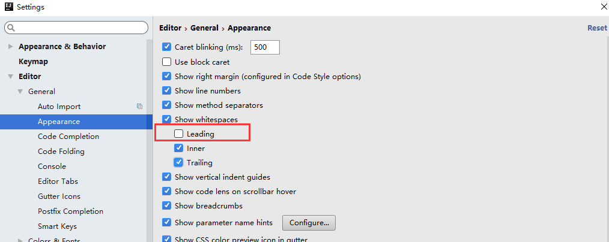
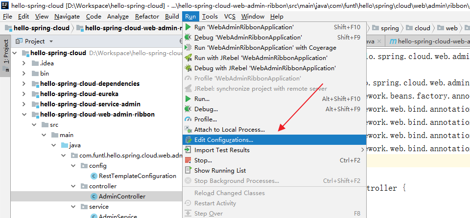
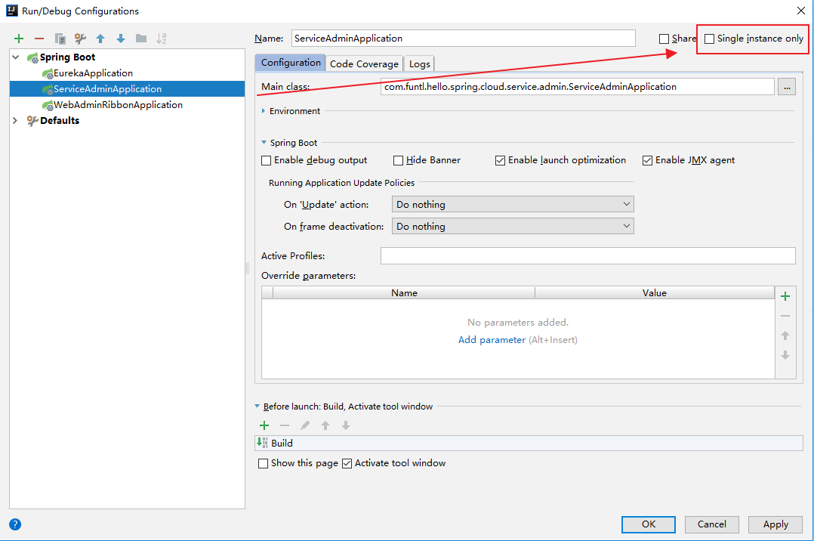
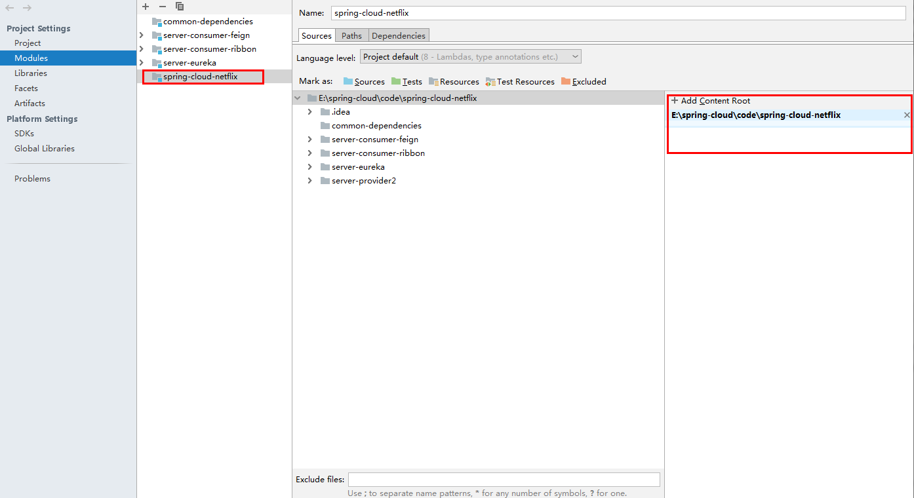

# 使用汇总

## 样式

### 如何去除换行的左侧箭头

去除Leading勾选

## 调试

### 在 IDEA 中配置一个工程启动多个实例

点击 `Run -> Edit Configurations...`

选择需要启动多实例的项目并去掉 `Single instance only` 前面的勾

通过修改 `application.yml` 配置文件的 `server.port` 的端口，启动多个实例，需要多个端口，分别进行启动即可。

## 异常

### 找不到或无法加载主类

<https://blog.csdn.net/bai_bug/article/details/79121109>

- 首先要检查你的编译输出路径File----project struture，判断编译路径是否正确

- 对于多模块而言，在顶层文件夹中Source Folders不能被设置，去除即可

