# 使用汇总


## 样式


### 去除换行的左侧箭头

去除Leading勾选


## 调试


### 配置一个工程启动多个实例

点击 `Run -> Edit Configurations...`


选择需要启动多实例的项目并去掉 `Single instance only` 前面的勾


通过修改 `application.yml` 配置文件的 `server.port` 的端口，启动多个实例，需要多个端口，分别进行启动即可。


### 指定profiles.active启动

- 在启动时可以指定读取的配置文件是prod，或者dev

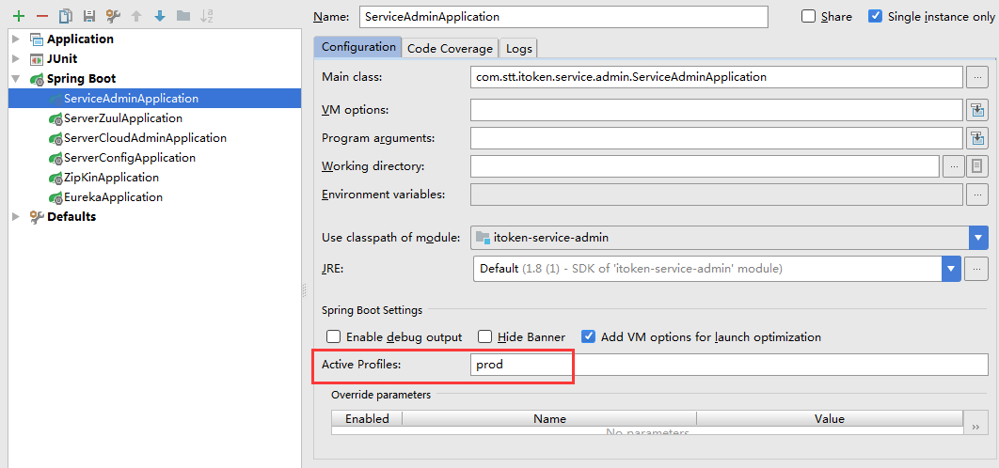


### 远程debug


## 异常


### 找不到/无法加载主类

<https://blog.csdn.net/bai_bug/article/details/79121109>

- 首先要检查你的编译输出路径File----project struture，判断编译路径是否正确

- 对于多模块而言，在顶层文件夹中Source Folders不能被设置，去除即可


## 插件


### JRebel 

JRebel 是一款 Java 虚拟机插件，它使得 Java 程序员能在不进行重部署的情况下，即时看到代码的改变对一个应用程序带来的影响。JRebel 使你能即时分别看到代码、类和资源的变化，你可以一个个地上传而不是一次性全部部署。当程序员在开发环境中对任何一个类或者资源作出修改的时候，这个变化会直接反应在部署好的应用程序上，从而跳过了构建和部署的过程，每年可以省去部署用的时间花费高达 5.25 个星期


#### 安装

IDEA 中依次点击 `File` --> `Settings` --> `Plugins` 搜索 JRebel 安装即可

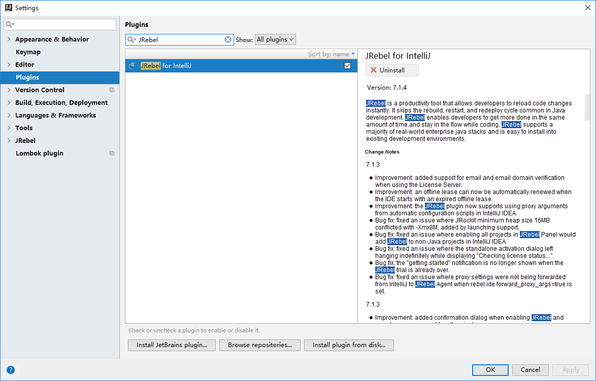


#### 激活

- 确保你可以访问国外网站 [http://www.facebook.com](http://www.facebook.com/)，并确保你有一个 Facebook 账号或者 Twitter 账号
- 访问 [https://my.jrebel.com](https://my.jrebel.com/)，使用自己的 Facebook 账号登录

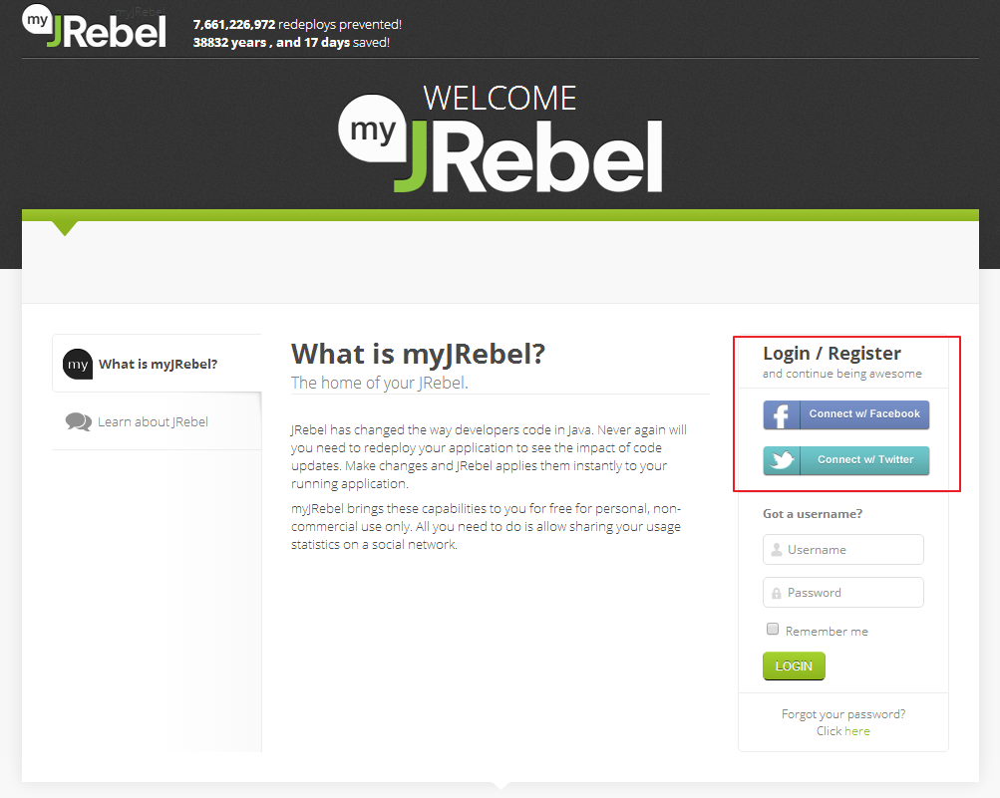

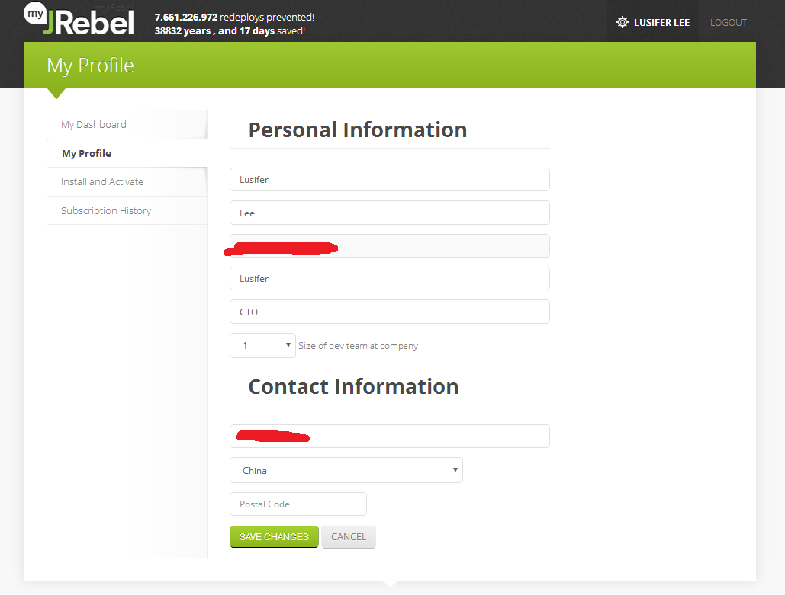

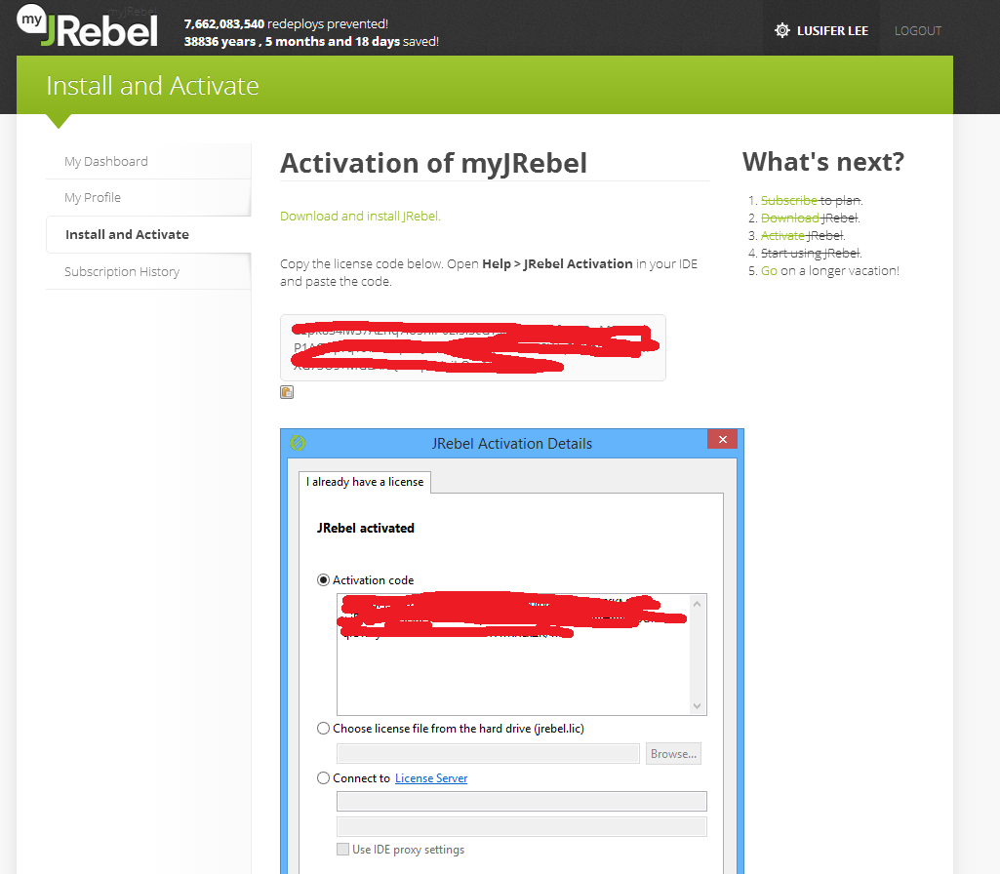


- 将激活码复制到 Intellij IDEA JRebel 激活
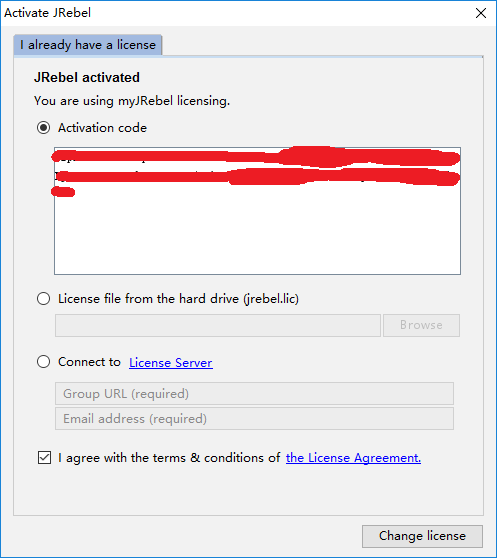


- 查看当前 JRebel 状态，绿色图标表示激活状态

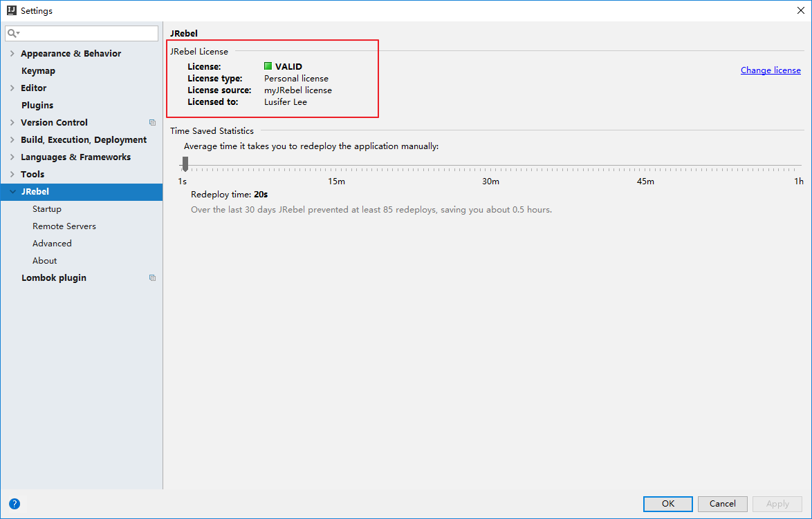

#### 其他

在官网上注册成功后，会返回一个lic码，也可以注册使用


#### 使用

- 选择要热部署的项目
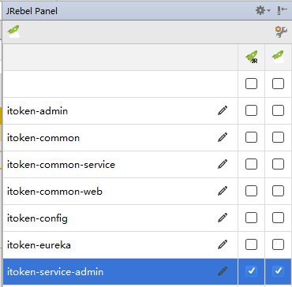

- 关闭自动编译，改为手动

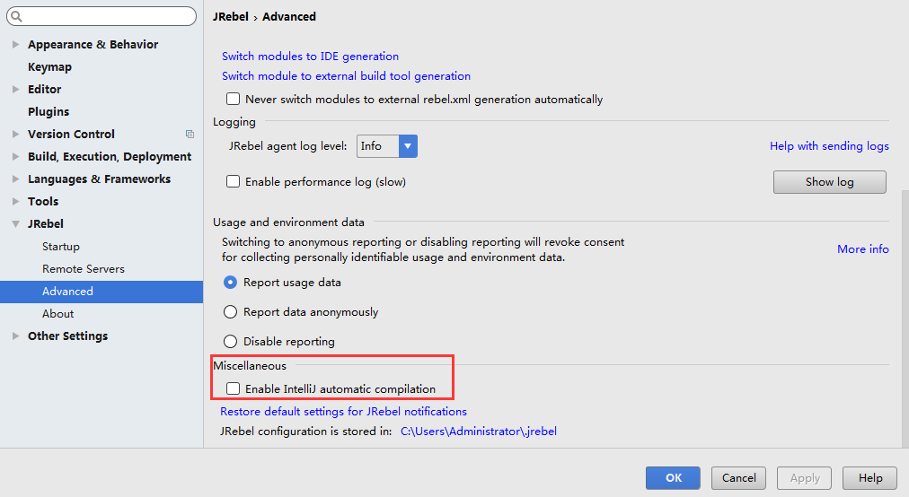

- 当修改完成时，手动编译指定模块
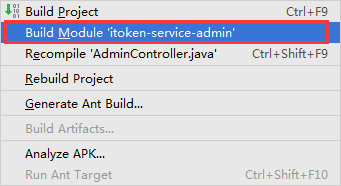


### Lombok

Lombok 是一个可以通过简单的注解形式来帮助我们简化消除一些必须有但显得很臃肿的 Java 代码的工具，通过使用对应的注解，可以在编译源码的时候生成对应的方法。

- 官网地址：https://projectlombok.org/
- GitHub：https://github.com/rzwitserloot/lombok

#### 安装

IDEA 中依次点击 `File` --> `Settings` --> `Plugins` 搜索 Lombok 安装即可

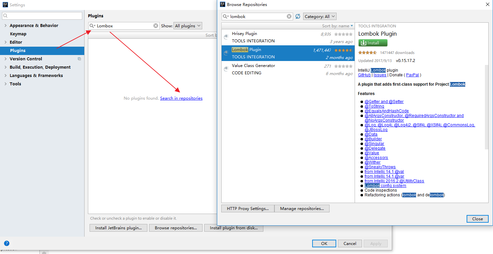

检查是否安装成功

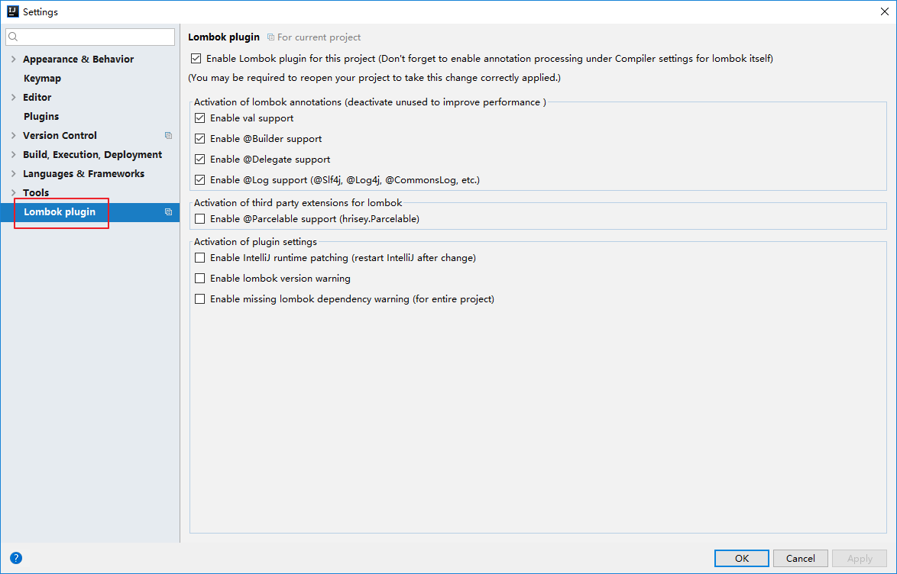

#### 使用

##### pom

`pom.xml` 中增加所需依赖，坐标如下：

```xml
<dependency>
    <groupId>org.projectlombok</groupId>
    <artifactId>lombok</artifactId>
    <version>1.16.18</version>
</dependency>
```

##### 注解

`@Data` 包含了 `@ToString`，`@EqualsAndHashCode`，`@Getter/@Setter` 和 `@RequiredArgsConstructor`的功能

其他相关注解请自行查阅：http://jnb.ociweb.com/jnb/jnbJan2010.html

##### 示例

```java
@Data
@Builder
@AllArgsConstructor
@NoArgsConstructor
@Accessors(chain = true)
public class ItemCatNode implements Serializable {
    @JsonProperty(value = "u")
    private String url;
    @JsonProperty(value = "n")
    private String name;
    @JsonProperty(value = "i")
    private List<?> item;
}
```

