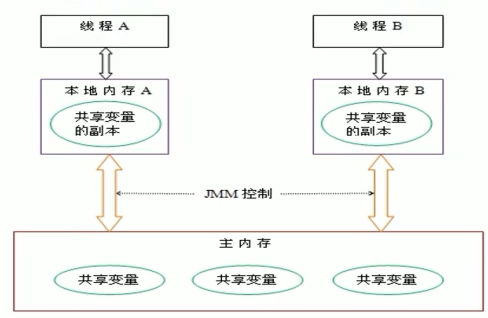
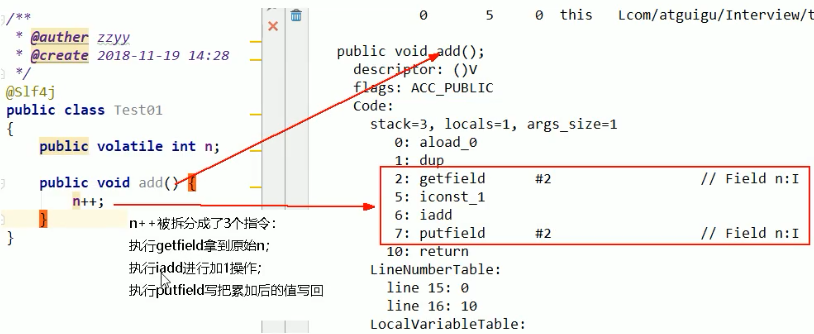
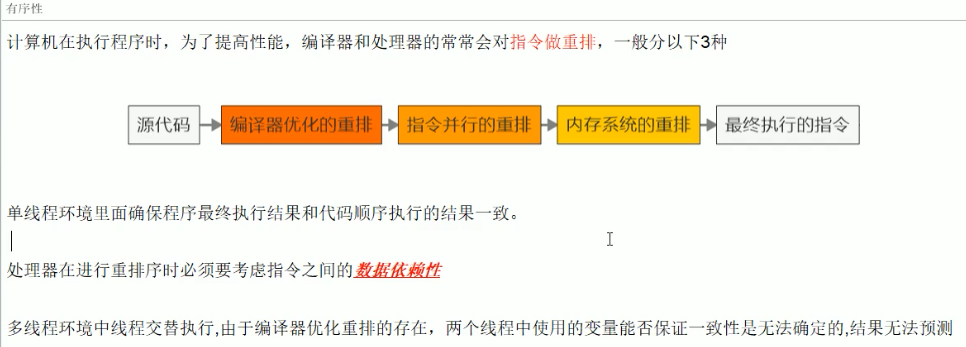
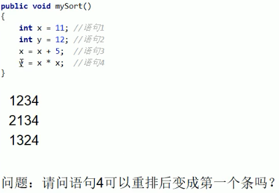
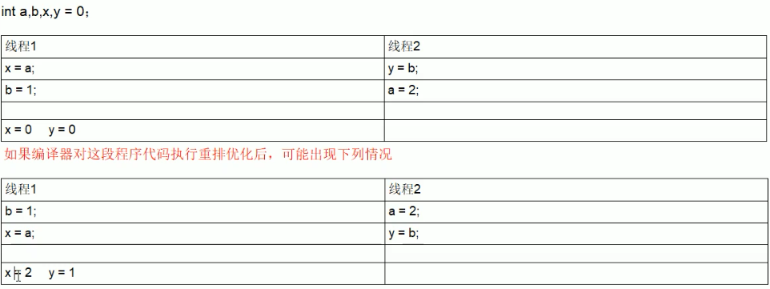
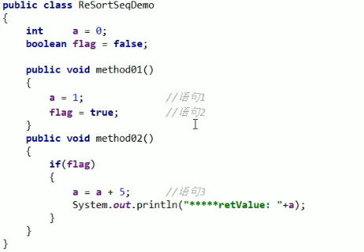
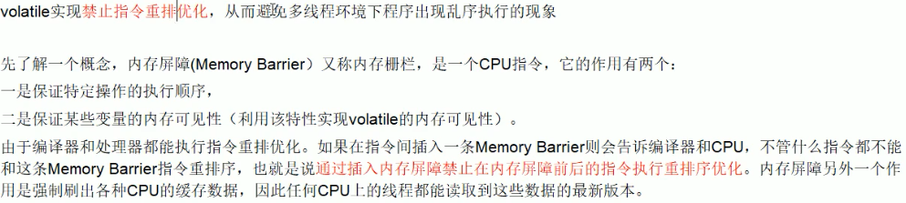
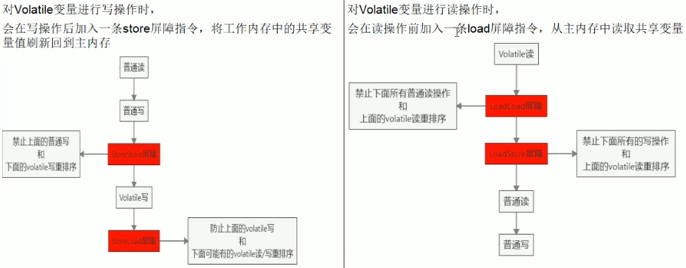

# 关于volatile

- java虚拟机提供的轻量级同步机制 
  - 保证可见性
  - ==不保证原子性==
  - 禁止指令重排序


# java内存模型-JMM

- java memory model
- 抽象概念
- ==不真实存在==
- 一组规范或规则，定义程序中各个变量（字段，静态字段，构成数组对象的元素）的访问方式


## 对于锁的规定

- 线程解锁前，必须把共享变量的值刷新回主内存
- 线程加锁前，必须从主内存读取最新值到自己的工作内存
- 加锁解锁是同一把锁


## 线程通信过程

- 每个线程有各自的工作空间--栈空间
  - JVM程序运行的实体是线程，JVM给每个线程创建一个工作空间，栈空间

- JMM规定所有变量都存储在==主内存（堆）中==
  - 主内存是共享内存区域，所有线程可以访问
- 线程对==变量的操作==（读和写）必须在==工作内存==中
  - 说明线程要将变量从共享内存读取到工作内存中进行操作
  - **首先将变量从主内存拷贝到自己的工作空间，然后对变量进行操作，操作完成后，再将变量写回主内存**
  - 线程中存储着主内存的变量副本拷贝
  - 线程对变量的操作都是对变量的副本进行操作
  - 线程不能直接操作主内存的变量
- 线程间通信必须通过主内存的传值来完成

 


# 数据可见性

- 当一个线程修改工作空间变量副本时并写入到主内存中，立刻通知其他线程该数据已经变化


# volatile保证可见性

示例volatile的可见性

```java
package com.stt.thread;
import java.util.concurrent.TimeUnit;

public class ch01_volatileDemo {
	public static void main(String[] args) {

		MyData d = new MyData();
		// 线程1开启
		new Thread(()->{
			System.out.println(Thread.currentThread().getName()+" start");
			try {TimeUnit.SECONDS.sleep(3);} catch (InterruptedException e) {}

			d.change();
			System.out.println(Thread.currentThread().getName()+" end");
		},"thread01").start();

		// 主线程执行
		while(d.num == 0){
			// 一直阻塞
		}
		System.out.println("finish");
	}
}
class MyData{
	// int num = 0;
    volatile int num = 0;
	public void change(){
		this.num = 1;
	}
}

// 结果：在有volatile修饰符的情况下，main主线程解除阻塞，读取到最新的值
```


# volatile不保证原子性

- 示例

```java
package com.stt.thread;

/**
 * 测试volatile不保证原子性
 */
public class ch02_volatileDemo {

	public static void main(String[] args) {
		MyData2 d = new MyData2();

		// 开20个线程，每个线程执行1000次，如果是原子操作，那么d的值是2万
		for (int i = 0; i < 20; i++) {
			new Thread(()->{
				for (int j = 0; j < 1000; j++) {
					d.addOne();
				}
			},"thread"+i).start();
		}
		// 如果活跃线程超过2个，那么main线程放弃当前cpu执行资源
		// 当创建的20个线程执行完成后剩下main线程和gc线程共2个线程
		while(Thread.activeCount() > 2){
			// 当前线程放弃本次执行
			Thread.yield();
		}
		System.out.println(d.num);
	}
}

class MyData2{
	volatile int num = 0;

	public void addOne(){
		// num ++ 在cpu中是3步操作，拷贝num到工作空间tmp; tmp = tmp + 1; 写入到主内存num = tmp; 多个线程在最后一步存在写覆盖的情况
		num ++;
	}
}
```

- 关于++操作的class码




# 使用AtomicInteger等juc类保证原子性


# JMM特性

- 可见性
  - 各个线程对主内存中共享变量的操作都是各个线程各自拷贝到自己的工作内存进行操作后再写回主内存
    - 可能造成的可见性问题
      - 一个线程A修改了共享变量X但没有写回主内存
      - 一个线程B此时对主内存中的X进行修改
      - 线程A对变量X的修改操作对线程B而言是不可见的
      - 本质上是工作内存和主内存同步延迟的问题
- 原子性
  - 不可分割，完整性，某个线程在做某个具体业务时，中间不可以被加塞或者分割，需要整体完整执行
  - 要么操作同时成功，要么同时失败
  - 同一时刻操作某个业务，只能有一个线程进行
- 有序性


# 有序性

- 避免考虑==数据间的依赖性==
- 编译器会优化源代码，进行指令并行的重排序




## 指令重排

案例1

 

- 4不可以变成第一条，否则违反了数据依赖性


案例2

- 两个线程对a,b,x,y 这4个变量进行操作
- 线程由于指令重排，操作语句的执行顺序不同，从而会有不同的结果

 


案例3

- 当多个线程并行执行，语句1和语句2可能顺序与书写顺序不同，那么method02执行的效果也是不同的

 


# volatile禁止指令重排序 [内存屏障]

 

- 通过插入内存屏障禁止在内存屏障前后的执行指令执行重排序优化

- Memory Barrier
  - StoreStore
  - StoreLoad
  - LoadLoad
  - LoadStore




# 线程安全性得到保证

- 工作内存和主内存同步延时现象导致的可见性问题
- 可以使用synchronized和volatile关键字解决
  - 都可以使用一个线程**修改后的变量立刻对其他线程可见**
- 对于指令重排导致的可见性问题和有序性问题，可以使用volatile关键字解决
  - volatile可以禁止指令重排序优化