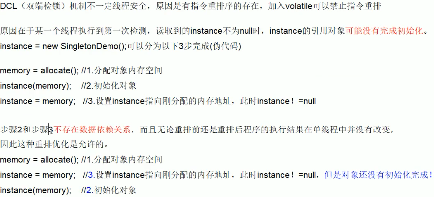

# DCL double check lock 实现

- 使用双重判断
- 懒汉式

```java
public class SingletonDemo{
    private static SingletonDemo instance;
    private SingletonDemo(){}
    private static SingletonDemo getInstance(){
        if(instance == null){
            synchronized(SingletonDemo.class){
                if(instance == null){
                    instance = new SingletonDemo();
                }
            }
        }
        return instance;
    }
}
```


# 问题

- DCL模式的单例模式在极小概率下会有指令重排，导致初始化是线程不安全的



- 由于有指令重排，那么虽然划分了内存空间，但是初始化还没有完成，另一个线程调用则会有线程不安全的问题，导致异常
  - 指令重排只能保证串行语义（单线程中）的执行一致性，但是不关心多线程间的语义一致性
  - **当一条线程访问instance不为null时，由于instance未必已经初始化完成，造成了线程安全问题**
- 解决：给instance增加volatile，禁止指令重排序

```java
public class SingletonDemo{
    private static volatile SingletonDemo instance;
    private SingletonDemo(){}
    private static SingletonDemo getInstance(){
        if(instance == null){
            synchronized(SingletonDemo.class){
                if(instance == null){
                    instance = new SingletonDemo();
                }
            }
        }
        return instance;
    }
}
```

