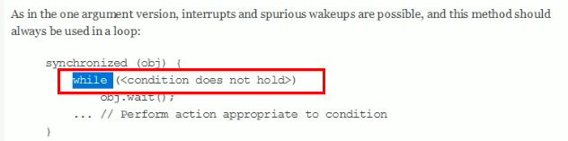

# 阻塞队列

> 在多线程中，阻塞表示在某些情况下会挂起线程，一旦满足条件会自动唤醒
>
> 使用BlockingQueue，不需要关心什么时候需要阻塞线程，什么时候需要唤醒线程，都交给BlockingQueue处理（之前需要自己控制阻塞和释放的细节，考虑线程的安全性）


- 定义
  - 当阻塞队列是空的时候，从队列中==获取==元素的操作将会被阻塞
  - 当阻塞队列是满的时候，往队列中==添加==元素的操作将会被阻塞

 

- BlockingQueue 父类同List父类一样，是Collection的子类接口
  - ==ArrayBlockingQueue==
    - 由数组结构组成的有界阻塞队列
  - ==LinkedBlockingQueue==
    - 由链表结构组成的有界（默认大小Integer.MAX_VALUE=21亿，等于无界）阻塞队列
  - PriorityBlockingQueue
    - 支持优先级排序的无界阻塞队列
  - DelayQueue
    - 使用优先级队列实现的延迟无界阻塞队列
  - ==SynchronousQueue==
    - 不存储元素的阻塞队列，即单个元素的阻塞队列
  - LinkedTransferQueue
    - 由链表结构组成的无界阻塞队列
  - LinkedBlockingDeque
    - 有链表结构组成的双向阻塞队列


## 核心方法

- 队列满时，队列阻塞插入元素的线程
- 队列为空，获取元素进入等待队列

- 操作方式

| 方法 | 抛出异常                           | 有返回值                         | 阻塞                                                   | 超时退出                                           |
| ---- | ---------------------------------- | -------------------------------- | ------------------------------------------------------ | -------------------------------------------------- |
| 插入 | add(e)<br />队列满：插入抛出异常   | offer(e)<br />成功返回true       | put(e)<br />队列满，阻塞生产者(直到队列可用或响应中断) | offer(e,time,unit)<br />阻塞一段时间，超时线程退出 |
| 移除 | remove()<br />队列空：移除抛出异常 | poll()<br />有则返回，无返回null | take()<br />队列空，阻塞消费者                         | poll(time,unit)                                    |
| 检查 | element()                          | peek()                           | 无                                                     | 无                                                 |

- 无界队列，put，offer不会阻塞，offer方法始终返回 true


### 抛出异常组

- 对不满足条件的抛出异常
- add
- remove
- element

```java
package com.stt.thread;

import java.util.concurrent.ArrayBlockingQueue;
import java.util.concurrent.BlockingQueue;
public class ch11_BlockingQueue {
	public static void main(String[] args) {
		BlockingQueue<String> queue = new ArrayBlockingQueue<String>(3);
		// 如下操作不满足条件会抛出异常
		queue.add("1");
		queue.add("2");
		queue.add("3");

		queue.add("4");
	}
}

// Exception in thread "main" java.lang.IllegalStateException: Queue full
```


### 返回值组

- 对于不满足条件的操作，返回false等值

```java
package com.stt.thread;

import java.util.concurrent.ArrayBlockingQueue;
import java.util.concurrent.BlockingQueue;

public class ch11_BlockingQueue {

	public static void main(String[] args) {

		BlockingQueue<String> queue = new ArrayBlockingQueue<String>(3);
		// 如下操作不满足条件会抛出异常
		System.out.println(queue.offer("1"));
		System.out.println(queue.offer("2"));
		System.out.println(queue.offer("3"));

		System.out.println(queue.offer("4"));

		// 获取头部值，不移除
		System.out.println(queue.peek());

		// 获取头部值，并移除
		System.out.println(queue.poll());
		System.out.println(queue.poll());
		System.out.println(queue.poll());
		System.out.println(queue.poll());
	}
}
// 结果
true
true
true
false
1
1
2
3
null
```


### 阻塞组

- put
- take

```java
package com.stt.thread;

import java.util.concurrent.ArrayBlockingQueue;
import java.util.concurrent.BlockingQueue;

public class ch12_BlockingQueue {

	public static void main(String[] args) throws InterruptedException {

		BlockingQueue<String> queue = new ArrayBlockingQueue<String>(3);
		// 如下操作不满足条件会抛出异常
		queue.put("1");
		queue.put("2");
		queue.put("3");
//		System.out.println("=======阻塞1======");
//		queue.put("4");

		queue.take();
		queue.take();
		queue.take();
		System.out.println("=======阻塞2======");
		queue.take();
	}
}
```


### 超时组

- 满足条件执行，不满足条件，阻塞指定单位的时间取消操作

- offer(n,time,timeUnit)
- poll(time,timeUnit)

```java
package com.stt.thread;

import java.util.concurrent.ArrayBlockingQueue;
import java.util.concurrent.BlockingQueue;
import java.util.concurrent.TimeUnit;

public class ch13_BlockingQueue {

	public static void main(String[] args) throws InterruptedException {

		BlockingQueue<String> queue = new ArrayBlockingQueue<String>(3);

		System.out.println(queue.offer("a", 2L, TimeUnit.SECONDS));
		System.out.println(queue.offer("a", 2L, TimeUnit.SECONDS));
		System.out.println(queue.offer("a", 2L, TimeUnit.SECONDS));
		System.out.println(queue.offer("a", 2L, TimeUnit.SECONDS));

	}
}
// 结果
true
true
true
false // 2s后打印
```


## SynchronousQueue

- 不存储元素的BlockingQueue
- 每一个put操作必须要等一个take操作，否则不能添加元素，反之也是
- 可以用于多个线程按序控制

```java
package com.stt.thread;

import java.util.concurrent.BlockingQueue;
import java.util.concurrent.SynchronousQueue;

public class ch14_SynchronousQueue {

	public static void main(String[] args) throws InterruptedException {

		BlockingQueue<String> queue = new SynchronousQueue<>();

		new Thread(() -> {
			for (int i = 0; i < 30; i++) {
				try {
					System.out.println("produce: " + i);
					queue.put("" + i);
				} catch (InterruptedException e) {
					e.printStackTrace();
				}
			}
		}, "p").start();

		for (int i = 0; i < 30; i++) {
			new Thread(() -> {
				try {
					System.out.println(Thread.currentThread().getName()+" take:"+queue.take());
				} catch (InterruptedException e) {
					e.printStackTrace();
				}
			}, "c" + i).start();
			Thread.sleep(1000);
		}
	}
}
// 结果
produce: 0
c0 take:0
produce: 1
c1 take:1
produce: 2
c2 take:2
produce: 3
    ...
```


# 使用场景


## 生产者消费者模式


### 传统版本

- 使用juc多线程工具类替代
  - sync被lock替代
  - wait被await替代
  - notify被singall替换


```java
package com.stt.thread;

import java.util.concurrent.locks.Condition;
import java.util.concurrent.locks.Lock;
import java.util.concurrent.locks.ReentrantLock;

/**
 * 生产者和消费者
 * 使用juc实现，注意边界条件，使用while，防止虚假唤醒
 */
public class ch15_ProducerAndConsumer {
	public static void main(String[] args) {
		Num num = new Num();
		new Thread(()->{
			for (int i = 0; i < 10; i++) {
				num.increment();
			}
		},"t1").start();
		new Thread(()->{
			for (int i = 0; i < 10; i++) {
				num.decrement();
			}
		},"t2").start();
	}
}

class Num {
	private int num = 0;
	private Lock lock = new ReentrantLock();
	private Condition condition = lock.newCondition();

	public void increment() {
		lock.lock();
		try {
            // 防止虚假唤醒
			while (num != 0) {
				condition.await();
			}
			num += 1;
			System.out.println(Thread.currentThread().getName()+" \t"+num);
			condition.signalAll();
		} catch (Exception e) {
			System.out.println(e);
		} finally {
			lock.unlock();
		}
	}

	public void decrement(){
		lock.lock();
		try {
			while (num == 0) {
				condition.await();
			}
			num -= 1;
			System.out.println(Thread.currentThread().getName()+" \t"+num);
			condition.signalAll();
		} catch (Exception e) {
			System.out.println(e);
		} finally {
			lock.unlock();
		}
	}
}
```

- 防止虚假唤醒

 


### 阻塞队列版本

```java
package com.stt.thread;

import java.util.concurrent.ArrayBlockingQueue;
import java.util.concurrent.BlockingQueue;
import java.util.concurrent.TimeUnit;
import java.util.concurrent.atomic.AtomicInteger;

/**
 * 使用阻塞队列实现生产者消费者
 */
public class ch16_ProducerAndConsumer {

	public static void main(String[] args) {
		MySource mySource = new MySource(new ArrayBlockingQueue(10));
		new Thread(()->{
			try {
				mySource.produce();
			} catch (InterruptedException e) {
				e.printStackTrace();
			}
		},"producer").start();

		new Thread(()->{
			try {
				mySource.consumer();
			} catch (InterruptedException e) {
				e.printStackTrace();
			}
		},"consumer").start();
	}
}

class MySource{
	private volatile boolean flag = true;
	private BlockingQueue<String> queue;
	private AtomicInteger atomicInteger = new AtomicInteger(); // 生产的值
	MySource(BlockingQueue queue){
		this.queue = queue;
	}

	public void produce() throws InterruptedException {
		String data;
		while(flag){
			data = atomicInteger.incrementAndGet()+"";
			if(queue.offer(data,2L, TimeUnit.SECONDS)){
				System.out.println(Thread.currentThread().getName()+" producer "+data);
			}
			Thread.sleep(1000);
		}
		System.out.println("producer end");
	}

	public void consumer() throws InterruptedException {
		while(flag){
			String result = queue.poll(2L, TimeUnit.SECONDS);
			if(result == null){
				flag = false;
				System.out.println("consumer timeout exit");
			}else{
				System.out.println("consumer "+result);
			}
		}
		System.out.println("consumer end");
	}

	public void close(){
		flag = false;
	}
}
```


## 线程池


## 消息中间件


# 注意点


##  边界判断使用while，防止虚假唤醒

 