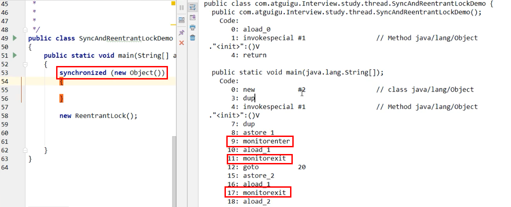

### Lock与Synchronized的不同

- 原始构成不同

  - synchronized

    - 是关键字

    - 属于JVM层面

    - monitorenter

      - 底层是通过monitor对象完成的，其实wait和notify等方法也是依赖于==monitor对象==
      - 只有在同步代码块或方法中才能调用wait/notify等方法

    - monitorexit

      - 在class文件中出现2次，synchronized是可重入锁，有计数器
      - 为了防止出现异常时锁没有释放，多加一个monitorexit，防止死锁

       

  - lock

    - 是java.util.concurrent.locks.lock
    - 是api层面的锁

- 使用方法不同
  - synchronized不需要用户手动释放锁，代码执行完系统自动让线程释放对锁的占用
  - lock需要用户手动释放锁，如果没有释放可能会造成死锁
    - 使用lock()和unlock()方法配合try/finally语句块完成
- 等待是否可中断
  - synchronized 不可中断，除非抛出异常或者正常完成
  - reentrantLock 可以中断
    - 设置超时tryLock(time,unit)
    - lockInterruptibly()放入代码块中，调用interrupt()方法可中断
- 加锁是否公平
  - synchronized 非公平锁
  - reentrantLock 默认非公平锁，可以设置为公平锁
- 锁绑定多个条件Condition
  - synchronized没有，只有一个condition，要么随机唤醒一个notify，要么全部唤醒 notifyall
  - reentrantLock用来实现分组唤醒需要唤醒的线程，可以实现精确唤醒

- lock的精确唤醒示例
  - 多线程之间按顺序调用，实现A->B->C 三个线程启动
  - A打印5次，B打印10次，C打印15次，然后重复10次

```java
package com.stt.thread;

import java.util.concurrent.locks.Condition;
import java.util.concurrent.locks.Lock;
import java.util.concurrent.locks.ReentrantLock;

/**
 * 实现精确唤醒
 */
public class ch16_ConditionDemo {

	
	public static void main(String[] args) {
		SharedPrint sharedPrint = new SharedPrint();
		new Thread(()->{
			for (int i = 0; i < 10; i++) {
				sharedPrint.print5();
			}
		}).start();
		new Thread(()->{
			for (int i = 0; i < 10; i++) {
				sharedPrint.print10();
			}
		}).start();
		new Thread(()->{
			for (int i = 0; i < 10; i++) {
				sharedPrint.print15();
			}
		}).start();

	}
}

class SharedPrint{
	private String name = "A"; //  A B C 三个线程
	private Lock lock = new ReentrantLock();
	private Condition cA = lock.newCondition();
	private Condition cB = lock.newCondition();
	private Condition cC = lock.newCondition();

	public void print5(){
		lock.lock();
		try{
			while(name != "A"){
				cA.await();
			}
			for (int i = 0; i < 5; i++) {
				System.out.println("A");
			}
			name = "B";
			cB.signalAll();
		}catch (Exception e){
		}finally {
			lock.unlock();
		}
	}

	public void print10(){
		lock.lock();
		try{
			while(name != "B"){
				cB.await();
			}
			for (int i = 0; i < 10; i++) {
				System.out.println("B");
			}
			name = "C";
			cC.signalAll();
		}catch (Exception e){
		}finally {
			lock.unlock();
		}
	}
	public void print15(){
		lock.lock();
		try{
			while(name != "C"){
				cC.await();
			}
			for (int i = 0; i < 15; i++) {
				System.out.println("C");
			}
			System.out.println("---------------");
			name = "A";
			cA.signalAll();
		}catch (Exception e){
		}finally {
			lock.unlock();
		}
	}
}
```


