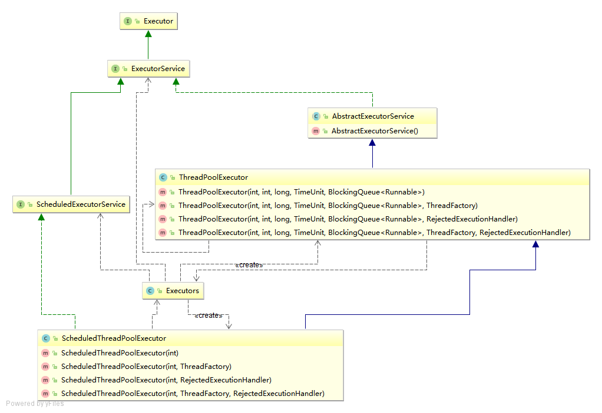
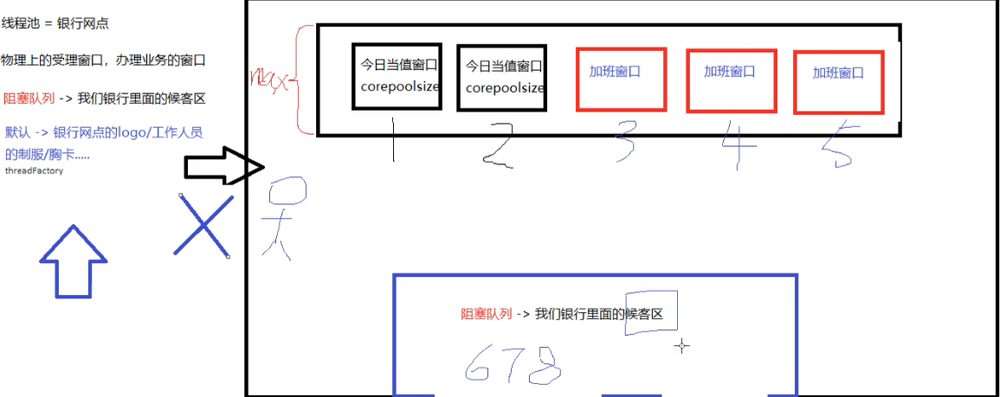
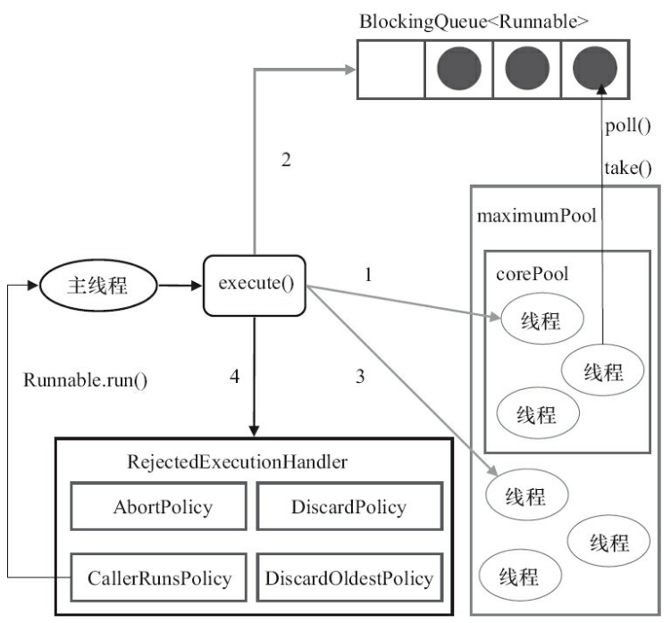

## 为什么使用线程池？优势是什么

- 控制运行线程的数量
- ==处理过程中将任务放入队列==，线程创建后从队列中获取任务执行
- ==如果任务数量超过了线程数量，则排队等候==，等其他线程执行完成，再从队列中获取任务执行
- 主要特点
  - ==线程复用==
  - ==控制最大线程个数==
  - ==管理线程==
- 优势
  - 降低资源消耗
    - 通过重复利用已创建的线程降低线程创建和销毁造成的消耗
  - 提高响应速度
    - 当任务到达时，如果有空闲线程，不需要创建线程直接执行
  - 提高线程的可管理性
    - 线程是稀缺资源，如果无限制的创建，消耗系统资源，降低系统的稳定性
    - 使用线程池可以进行统一的分配，调优和监控


## 线程池如何使用？

java线程池是通过Executor 框架实现的，框架使用

- Executor
- Executors
  - Executor的工具辅助类，类似于Lists对List的作用，Arrays对Array的作用
- ExecutorService
- ThreadPoolExecutor
  - 所有线程池的底层

  

主要有5种线程池

- Executors.newFixedThreadPool(int)

- Executors.newSingleThreadExecutor()
  - 是newFixedThreadPool的特例，线程个数是1
- Executors.newCachedThreadPool()
- Executors.newScheduledThreadPool(int)
- 


### Executors.newFixedThreadPool(int)

- 适合执行长期任务
- 创建一个定长线程池，可控制线程==最大并发数==，超出的线程会在队列中等待
- corePoolSize 和 maxPoolSize是相等的
- 使用LinkedBlockingQueue

```java
public static ExecutorService newFixedThreadPool(int nThreads) {
    return new ThreadPoolExecutor(nThreads, nThreads,
                                  0L, TimeUnit.MILLISECONDS,
                                  new LinkedBlockingQueue<Runnable>());
}
```

- 示例

```java
package com.stt.thread;

import java.util.concurrent.ExecutorService;
import java.util.concurrent.Executors;

public class ch18_ThreadPoolDemo {
    public static void main(String[] args) {

        ExecutorService pool = Executors.newFixedThreadPool(5);

        // 模拟10个用户办理业务，每个用户就是一个来自外部的请求线程
        try{
            //			pool.submit(()->{ // submit用于处理代返回值的，可以传入callable和runnable
            //				System.out.println();
            //			});
            for (int i = 0; i < 10; i++) {
                pool.execute(()->{ // 无返回值，只能传入runnable
                    System.out.println(Thread.currentThread().getName()+" run");
                });
            }
        }catch (Exception e){
            e.printStackTrace();
        }finally {
            pool.shutdown();
        }

    }
}
// 结果：注意结果中始终就只有5个线程处理
pool-1-thread-2 run
pool-1-thread-3 run
pool-1-thread-3 run
pool-1-thread-3 run
pool-1-thread-3 run
pool-1-thread-3 run
pool-1-thread-2 run
pool-1-thread-5 run
pool-1-thread-1 run
pool-1-thread-4 run
```


### Executors.newSingleThreadExecutor()

- 适合执行一个任务一个任务的执行
- 使用唯一的线程执行任务，==保证任务指定的顺序执行==
- corePoolSize 和 maxPoolSize 的值都是1

```java
public static ExecutorService newSingleThreadExecutor() {
    return new FinalizableDelegatedExecutorService
        (new ThreadPoolExecutor(1, 1,
                                0L, TimeUnit.MILLISECONDS,
                                new LinkedBlockingQueue<Runnable>()));
}
```

- 示例

```java
package com.stt.thread;

import java.util.concurrent.ExecutorService;
import java.util.concurrent.Executors;

public class ch19_ThreadPoolDemo {
	public static void main(String[] args) {

		ExecutorService pool = Executors.newSingleThreadExecutor();

		// 模拟10个用户办理业务，每个用户就是一个来自外部的请求线程
		try{
			for (int i = 0; i < 10; i++) {
				pool.execute(()->{ // 无返回值，只能传入runnable
					System.out.println(Thread.currentThread().getName()+" run");
				});
			}
		}catch (Exception e){
			e.printStackTrace();
		}finally {
			pool.shutdown();
		}

	}
}
// 结果 只有一个线程在执行
pool-1-thread-1 run
pool-1-thread-1 run
pool-1-thread-1 run
pool-1-thread-1 run
pool-1-thread-1 run
pool-1-thread-1 run
pool-1-thread-1 run
pool-1-thread-1 run
pool-1-thread-1 run
pool-1-thread-1 run
```


### Executors.newCachedThreadPool()

- 可缓存线程池，如果任务来了，就用线程执行，没有线程则创建线程，线程空闲60s则释放线程
- 适合并行执行多个任务，最大线程个数无上限，超过60s没有执行的线程释放资源
- 合适执行短期异步任务或负载较轻的服务器

```java
public static ExecutorService newCachedThreadPool() {
    return new ThreadPoolExecutor(0, Integer.MAX_VALUE,
                                  60L, TimeUnit.SECONDS,
                                  new SynchronousQueue<Runnable>());
}
```

- 示例

```java
package com.stt.thread;

import java.util.concurrent.ExecutorService;
import java.util.concurrent.Executors;

public class ch20_ThreadPoolDemo {
	public static void main(String[] args) {

		ExecutorService pool = Executors.newCachedThreadPool();

		// 模拟10个用户办理业务，每个用户就是一个来自外部的请求线程
		try{
			for (int i = 0; i < 10; i++) {
				pool.execute(()->{ // 无返回值，只能传入runnable
					System.out.println(Thread.currentThread().getName()+" run");
				});
			}
		}catch (Exception e){
			e.printStackTrace();
		}finally {
			pool.shutdown();
		}

	}
}
// 结果
pool-1-thread-2 run
pool-1-thread-2 run
pool-1-thread-4 run
pool-1-thread-1 run
pool-1-thread-3 run
pool-1-thread-5 run
pool-1-thread-9 run
pool-1-thread-8 run
pool-1-thread-6 run
pool-1-thread-7 run
```


## 线程池的几个重要参数介绍？（7个）

```java
public ThreadPoolExecutor(int corePoolSize,
                          int maximumPoolSize,
                          long keepAliveTime,
                          TimeUnit unit,
                          BlockingQueue<Runnable> workQueue,
                          ThreadFactory threadFactory,
                          RejectedExecutionHandler handler) {
```

- corePoolSize：线程池中的常驻核心线程数
- maximumPoolSize：线程池可以容纳同时执行的最大线程数，必须>1
- keepAliveTime：多余的空闲线程的存活时间
  - 当前线程数超过corePoolSize时，当空闲时间到达keepAliveTime的值时，多余线程会销毁到只剩下corePoolSize个线程为止
- unit：keepAliveTime的单位
- workQueue：任务队列，被提交但是没有被执行的任务
- threadFactory：表示生成线程池中工作线程的线程工厂，用于创建线程
  - ==一般使用默认==
  - 对创建的线程进行定义
- handler：拒绝策略，表示当队列满了并且工作线程大于等于线程池最大线程数时，如何拒绝新来的任务




### 关键点

- 阻塞队列使用有界队列时，核心线程数满->阻塞队列满->线程扩容到maxiumPoolSize
- 阻塞队列使用无界队列时，核心线程数满->阻塞队列，若任务的创建和线程处理任务的速度差异很大，那么无界队列会快速增长，可能会耗尽内存
  - maxiumPoolSize设置是不生效的
- 如果使用的是linkedBlockingQueue，并制定容量大小，那么就是按有界队列处理


## 线程池的底层工作原理？

- 下图标号是放入队列的顺序

 

- 创建线程池之后，等待提交的任务请求
- 当调用execute方法添加一个请求任务时，线程池会有如下判断
  - 如果正在运行的线程数量小于corePoolSize，那么马上创建线程运行这个任务
  - 如果正在运行的线程数量大于等于corePoolSize，那么将任务==放入队列==
  - 如果这时候队列满了且正在运行的线程数量小于maxiumPoolSize，那么创建非核心线程==立刻运行该任务==，该任务不会进入队列
  - 如果队列满了且正在运行的线程数量大于等于maxiumPoolSize，线程池会启动饱和拒绝策略来执行
- 当一个线程完成任务时，会从队列中取下一个任务执行
- 当一个线程无任务可以做超过一定时间keepAliveTime时，线程池会判断，并释放非核心线程，最终缩到核心数大小


## 线程池的拒绝策略

- 是什么

  - 等待队列已经饱和，无法添加新的任务时，线程池中的线程也到达max个数时，无法为新任务提供服务，就需要合适的拒绝策略

- JDK内置的拒绝策略

  - AbortPolicy
    - 默认
    - 直接抛出RejectedExecutionException异常阻止系统正常运行
  
  ```java
  package com.stt.thread;
  
  import java.util.concurrent.*;
  
  public class ch21_ThreadPool_RejectedDemo {
  	public static void main(String[] args) {
  
  		ExecutorService pool = new ThreadPoolExecutor(
  				2,
  				5,
  				1L,
  				TimeUnit.SECONDS,
  				new LinkedBlockingQueue(3),
  				Executors.defaultThreadFactory(),
  				new ThreadPoolExecutor.AbortPolicy()
  		);
  
  		try{
  			// 10个线程，超过了线程池8个任务的处理能力，抛出异常
  			for (int i = 0; i < 10; i++) {
  				pool.execute(()->{ // 无返回值，只能传入runnable
  					System.out.println(Thread.currentThread().getName()+" run");
  				});
  			}
  		}catch (Exception e){
  			e.printStackTrace();
  		}finally {
  			pool.shutdown();
  		}
  	}
  }
  // 结果
  pool-1-thread-3 run
  pool-1-thread-3 run
  pool-1-thread-3 run
  pool-1-thread-3 run
  pool-1-thread-2 run
  pool-1-thread-1 run
  pool-1-thread-5 run
  pool-1-thread-4 run
  java.util.concurrent.RejectedExecutionException: Task com.stt.thread.ch21_ThreadPool_RejectedDemo$$Lambda$1/2093176254@7530d0a rejected from java.util.concurrent.ThreadPoolExecutor@27bc2616[Running, pool size = 5, active threads = 5, queued tasks = 0, completed tasks = 3]
  	at java.util.concurrent.ThreadPoolExecutor$AbortPolicy.rejectedExecution(ThreadPoolExecutor.java:2047)
  	at java.util.concurrent.ThreadPoolExecutor.reject(ThreadPoolExecutor.java:823)
  	at java.util.concurrent.ThreadPoolExecutor.execute(ThreadPoolExecutor.java:1369)
  	at com.stt.thread.ch21_ThreadPool_RejectedDemo.main(ch21_ThreadPool_RejectedDemo.java:21)
  ```
  
  - CallerRunsPolicy
    - 调用者运行一种调节机制
    - 不会抛弃任务，不会抛出异常，将某些任务回退到调用者，从而降低新任务的流量
  
  ```java
  package com.stt.thread;
  
  import java.util.concurrent.*;
  
  public class ch22_ThreadPool_CallerRunsPolicyDemo {
  	public static void main(String[] args) {
  
  		ExecutorService pool = new ThreadPoolExecutor(
  				2,
  				5,
  				1L,
  				TimeUnit.SECONDS,
  				new LinkedBlockingQueue(3),
  				Executors.defaultThreadFactory(),
  				new ThreadPoolExecutor.CallerRunsPolicy()
  		);
  
  		try{
  			// 10个线程，超过了线程池8个任务的处理能力，多余的任务给调用者（main）执行
  			for (int i = 0; i < 10; i++) {
  				pool.execute(()->{ // 无返回值，只能传入runnable
  					System.out.println(Thread.currentThread().getName()+" run");
  				});
  			}
  		}catch (Exception e){
  			e.printStackTrace();
  		}finally {
  			pool.shutdown();
  		}
  
  	}
  }
  // 结果
  pool-1-thread-1 run
  pool-1-thread-3 run
  pool-1-thread-4 run
  pool-1-thread-4 run
  main run
  pool-1-thread-5 run
  pool-1-thread-2 run
  pool-1-thread-5 run
  pool-1-thread-3 run
  pool-1-thread-1 run
  ```
  
  - DiscardOldestPolicy
    
    - 抛弃队列中等待最旧的任务，把当前的任务加入到队列中尝试再次提交当前任务
  - DiscardPolicy
    - 直接丢弃任务，不予以任何处理也不抛出异常
    - 如果允许丢失，该方案最好
    
    

### 自定义拒绝策略


## 工作中单一、固定数目、可变的三种创建线程池方法，使用哪个？

- 都不使用，在生产上只使用自定义的
  - FixedThreadPool，SingleThreadPool中阻塞队列是LinkedBlockingQueue 队列的长度是Integer.MAX_VALUE，堆积大量请求会造成OOM
  - CachedThreadPool，ScheduledThreadPool 允许创建线程的数量为Integer.MAX_VALUE，可能会创建大量线程，导致OOM
- Executors中已经提供自定义的方法，通过new ThreadPoolExecutor的方式


## 工作中如何使用线程池的，是否自定义线程池

- 使用ThreadPoolExecutor进行自定配置
  - 如何配置corePoolSize和maxiumPoolSize？
    - 先获取服务器的cpu核数
      - Runtime.getRuntime().availableProcessors()
    - 依据业务的类型进行配置
      - IO密集型 
        - 线程配多点
        - 不是一直在执行任务的，要配置尽可能多的线程，如CPU核心数*2
        - 任务需要大量IO操作，大量阻塞，在单线程上运行IO密集型的任务会导致浪费大量的CPU运算能力等待，线程在IO阻塞时执行其他大量线程，提高CPU利用率，如CPU核心数/(1-阻塞系数)，阻塞系数0.8-0.9，那么8核cpu，0.9阻塞系数，配置80核线程池
      - CPU密集型
        - 线程少一些：CPU核心数+1
        - 任务需要大量计算，而没有阻塞，cpu一直全速运行
        - 只有在真正多核cpu上才能得到加速，而单核则无论配置多少都是单核

```java
ExecutorService pool = new ThreadPoolExecutor(
    Runtime.getRuntime().availableProcessors(),
    Runtime.getRuntime().availableProcessors()*2,
    1L,
    TimeUnit.SECONDS,
    new LinkedBlockingQueue(3),
    Executors.defaultThreadFactory(),
    new ThreadPoolExecutor.CallerRunsPolicy()
);
```


