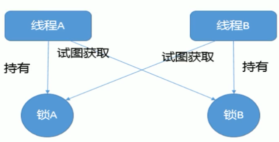

# 什么是死锁

- 2个及以上的线程在执行过程中，因争夺资源而造成的一种==相互等待的现象==

- 若无外力的干涉，线程们将无法继续执行

- 如果系统资源充足，进程的资源请求都能得到满足，死锁出现的可能性会降低，否则会争夺资源而陷入死锁

- 有多个锁的竞争

  

 

# 死锁的主要原因

- 系统资源不足
- 线程运行推进的顺序不合适
- 资源分配不当

```java
package com.stt.thread.part01_base;
import java.util.concurrent.TimeUnit;
/**
 * 死锁示例
 * Created by Administrator on 2019/4/28.
 */
public class Ch01_DeadLockDemo {

	private static final String lock1 = "lock1";
	private static final String lock2 = "lock2";

	public static void main(String[] args) {
		// 线程1
		Thread t1 = new Thread(new Runnable() {
			@Override
			public void run() {
				synchronized (lock1){
					System.out.println("t1 obtain lock1");
					try {
						TimeUnit.SECONDS.sleep(1);
					} catch (InterruptedException e) {
						e.printStackTrace();
					}
					synchronized (lock2){
						System.out.println("t1 obtain lock2");
					}
				}
			}
		});
		// 线程2
		Thread t2 = new Thread(new Runnable() {
			@Override
			public void run() {
				synchronized (lock2){
					System.out.println("t2 obtain lock2");
					synchronized (lock1){
						System.out.println("t2 obtain lock1");
					}
				}
			}
		});
		t1.start();
		t2.start();
	}
}
// 输出
t1 obtain lock1
t2 obtain lock2
// 已经产生死锁
```


## 生产中解决

- 使用jps查询进程号
- 使用jstack打印该进程号的堆栈信息

- 分析死锁

```bash
# 使用jps命令，找到死锁的进程编号
E:\study\java\code\base-demo>jps -l
11076 com.stt.thread.part01_base.Ch01_DeadLockDemo

# 使用jstack 打印该ps指定的堆栈信息
E:\study\java\code\base-demo>jstack 11076
...
Found one Java-level deadlock:
=============================
"Thread-1":
  waiting to lock monitor 0x0000000018729198 (object 0x000000078d362cb0, a java.lang.String),
  which is held by "Thread-0"
"Thread-0":
  waiting to lock monitor 0x000000001872a638 (object 0x000000078d362ce8, a java.lang.String),
  which is held by "Thread-1"

Java stack information for the threads listed above:
===================================================
"Thread-1":
        at com.stt.thread.part01_base.Ch01_DeadLockDemo$2.run(Ch01_DeadLockDemo.java:40)
        - waiting to lock <0x000000078d362cb0> (a java.lang.String)
        - locked <0x000000078d362ce8> (a java.lang.String)
        at java.lang.Thread.run(Thread.java:745)
"Thread-0":
        at com.stt.thread.part01_base.Ch01_DeadLockDemo$1.run(Ch01_DeadLockDemo.java:27)
        - waiting to lock <0x000000078d362ce8> (a java.lang.String)
        - locked <0x000000078d362cb0> (a java.lang.String)
        at java.lang.Thread.run(Thread.java:745)

Found 1 deadlock.
```


## 关于jstack

```bash
jstack [-l] <pid>
(to connect to running process)
jstack -F [-m] [-l] <pid>
(to connect to a hung process)
jstack [-m] [-l] <executable> <core>
(to connect to a core file)
jstack [-m] [-l] [server_id@]<remote server IP or hostname>
(to connect to a remote debug server)

```

