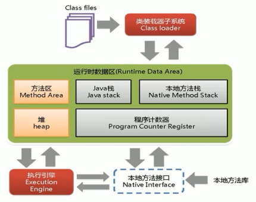
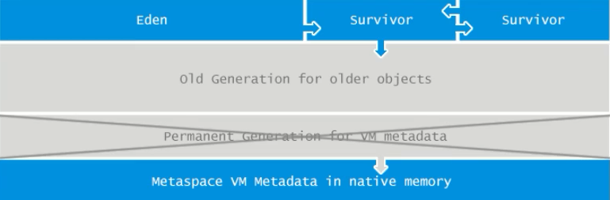
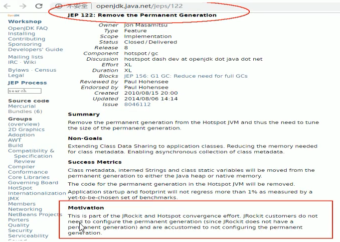

# JVM体系结构

- 灰色部分线程私有，几乎不存在垃圾回收
- 橘黄色：方法区，堆线程共有，存在垃圾回收
  - 也是==垃圾回收的作用域==

 

- java8以后的VM

  - java7的永久代在java8中被元空间取代
    - java7永久代大小是85M（64位系统）
  - java8把类的元数据直接保存在本地内存区域（堆外内存 Non-heap），称之为元空间
    - 没有大小的限制，或者大小的限制比java7要好很多

   

- 更改原因

 

