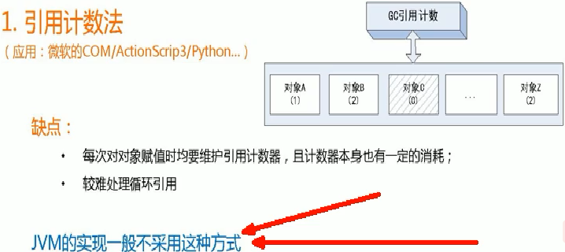
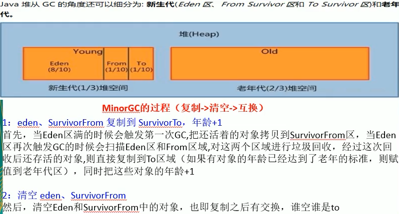
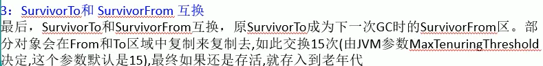
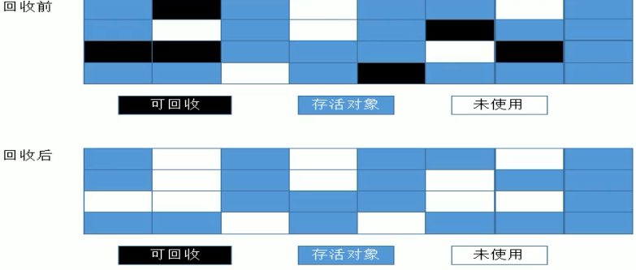
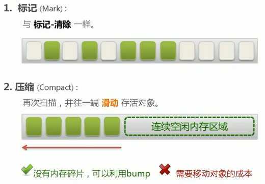

# 引用计数（了解，不使用）

 

# 复制算法（MinorGC的过程，新生代）

- 当Eden区满的时候触发一次MinorGC
  - 将Eden和S1中存活的对象拷贝到S2区，对象年龄+1
  - 将Eden和S1区域内容清空，S1区和S2区角色互换
  - 如果对象年龄到达了15（由jvm参数调整，默认15），则直接放入老年代

 

 

- 优点
  - 没有产生内存碎片，空间连续
- 缺点
  - 浪费了s1区大小的空间
  - 对象复制时有耗时

# 标记清除 （Mark Sweep，老生代）

- 分成标记阶段和清除阶段，先标记要回收的对象，然后统一收回对象
- 好处：没有复制对象的耗时
- 坏处：会产生内存碎片，导致没有连续空间分配，产生FullGC 

 

# 标记整理（标记-压缩，老生代）

- Mark-Compact

 