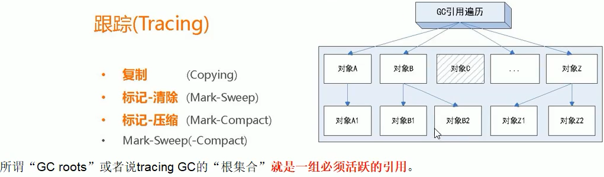
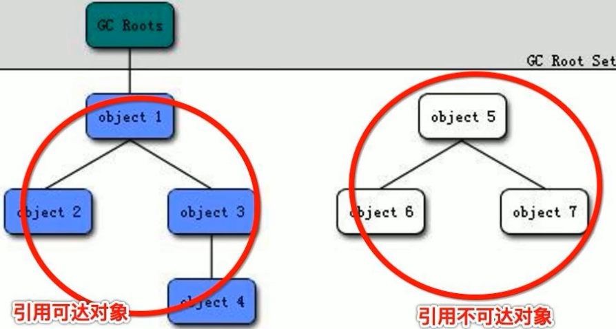
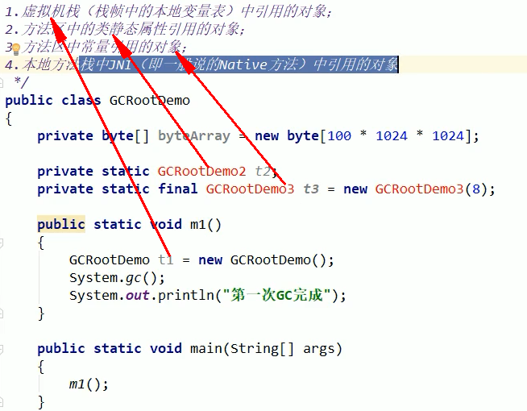

# JVM垃圾回收时如何确定垃圾对象？什么是GC Roots

- 什么是垃圾：内存中已经不再被使用到的内存空间是垃圾
- 要进行垃圾回收，如何判断一个对象可以被回收？
  - 引用计数法
  - 枚举根节点做可达性分析（根搜索路径）

## 引用计数法

- 每个对象有一个计数器，用于统计被引用的次数，如果被引用次数为0，表示没有被任何对象使用，那么就可以被回收
- 缺点
  - 无法解决循环引用的问题，当2个对象相互引用，那么这2个对象又没有被其他对象使用，那么这2个对象都应是垃圾对象，应该被回收，但是引用计数无法做到
- 为了解决引用计数法的循环引用问题，使用可达性分析方法

## 可达性分析法

 

- 通过一系列名为GC roots的对象作为根节点，从这个根节点向下搜索，如果一个对象到GC Roots没有任何引用链相连时，说明此对象不可用
- 给定一个集合的引用作为根出发，通过引用关系遍历对象图，可以被引用到的对象被判定为存活，没有被遍历到的判定为死亡

 

## GC Roots

- 可达性分析的根节点
- ==一组必须活跃的引用==
- 作为GCRoots的对象
  - ==虚拟机栈（栈帧中的本地变量表，局部变量表）中引用的对象==
  - 方法区的类静态属性引用的对象
  - 方法区常量引用的对象
  - 本地方法栈中JNI（Native方法）引用的对象
    - 如线程对象的start方法调用，那么线程属于JNI引用的对象

 