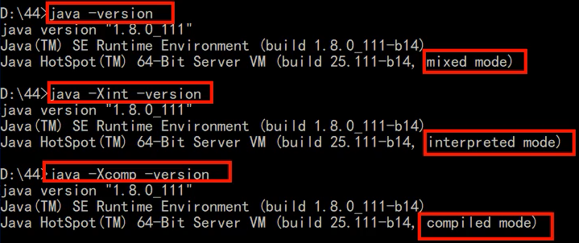

# 对JVM进行调优和参数配置，如何查看JVM系统默认值


## JVM的参数类型


### 标配参数

- 从jdk1.0至今，基本上没有变化过
- -version
- -help
- java -showversion


### X参数

- -Xint：解释执行
- -Xcomp：第一次使用就编译成本地代码
- -Xmixed：混合模式
  - 编译后执行，使用java命令时默认自带

 


### XX参数（重点）


#### boolean类型

- 公式：`-XX:+/-paramName`
  - -表示关闭
  - +表示开启

- 示例
  - 是否打印GC收集细节
    - -XX:-PrintGCDetails 关闭
    - -XX:+PrintGCDetails 开启
  - 是否使用串行垃圾回收器
    - -XX:-UseSerialGC
    - -XX:+UseSerialGC


#### kv设置类型

- 公式：`-XX:属性key=属性值value`

- 示例

  - -XX:MetaspaceSize=128m

    - 设置元空间大小
    - 查看默认值：21M

    ```bash
    E:\study\java\code\base-demo>jinfo -flag MetaspaceSize 4344
    -XX:MetaspaceSize=21807104
    ```

  - -XX:MaxTenuringThreshold=15

    - 在新生代回收次数15以后依然存活的对象进入老年代


#### 关于缩写

- -Xms 等价于-XX:InitialHeapSize
- -Xms 等价于-XX:MaxHeapSize


## 查看JVM配置 [jinfo]


### 查看全部  [jinfo 进程编号 ]

- 先使用jps查看端口号pid
- 再使用jinfo pid查看全部配置

```bash
E:\study\java\code\base-demo>jps -l
4344 com.stt.thread.part01_base.Ch01_DeadLockDemo

E:\study\java\code\base-demo>jinfo 4344
Attaching to process ID 4344, please wait...
Debugger attached successfully.
Server compiler detected.
JVM version is 25.101-b13
Java System Properties:

java.runtime.name = Java(TM) SE Runtime Environment
java.vm.version = 25.101-b13
sun.boot.library.path = D:\java\jdk\jdk1.8.0_101\jre\bin
java.vendor.url = http://java.oracle.com/
java.vm.vendor = Oracle Corporation
path.separator = ;
file.encoding.pkg = sun.io
java.vm.name = Java HotSpot(TM) 64-Bit Server VM
sun.os.patch.level = Service Pack 1
sun.java.launcher = SUN_STANDARD
user.script =
user.country = CN
user.dir = E:\study\java\code\base-demo
java.vm.specification.name = Java Virtual Machine Specification
java.runtime.version = 1.8.0_101-b13
java.awt.graphicsenv = sun.awt.Win32GraphicsEnvironment
os.arch = amd64
java.endorsed.dirs = D:\java\jdk\jdk1.8.0_101\jre\lib\endorsed
line.separator =

java.io.tmpdir = C:\Users\ADMINI~1\AppData\Local\Temp\
java.vm.specification.vendor = Oracle Corporation
user.variant =
os.name = Windows 7
sun.jnu.encoding = GBK
java.library.path = ...
java.specification.name = Java Platform API Specification
java.class.version = 52.0
sun.management.compiler = HotSpot 64-Bit Tiered Compilers
os.version = 6.1
user.home = C:\Users\Administrator
user.timezone =
java.awt.printerjob = sun.awt.windows.WPrinterJob
file.encoding = UTF-8
java.specification.version = 1.8
user.name = Administrator
java.class.path = ...
java.vm.specification.version = 1.8
sun.arch.data.model = 64
sun.java.command = com.stt.thread.part01_base.Ch01_DeadLockDemo
java.home = D:\java\jdk\jdk1.8.0_101\jre
user.language = zh
java.specification.vendor = Oracle Corporation
awt.toolkit = sun.awt.windows.WToolkit
java.vm.info = mixed mode
java.version = 1.8.0_101
java.ext.dirs = D:\java\jdk\jdk1.8.0_101\jre\lib\ext;C:\Windows\Sun\Java\lib\ext
sun.boot.class.path = ...
java.vendor = Oracle Corporation
file.separator = \
java.vendor.url.bug = http://bugreport.sun.com/bugreport/
sun.io.unicode.encoding = UnicodeLittle
sun.cpu.endian = little
sun.desktop = windows
sun.cpu.isalist = amd64

VM Flags:
Non-default VM flags: -XX:CICompilerCount=3 -XX:InitialHeapSize=161480704 -XX:MaxHeapSi
ze=2564816896 -XX:MaxNewSize=854589440 -XX:MinHeapDeltaBytes=524288 -XX:NewSize=5347737
6 -XX:OldSize=108003328 -XX:+UseCompressedClassPointers -XX:+UseCompressedOops -XX:+Use
FastUnorderedTimeStamps -XX:-UseLargePagesIndividualAllocation -XX:+UseParallelGC
Command line:  -javaagent:D:\dev-soft\IntelliJ IDEA 2017.2.5\lib\idea_rt.jar=51291:D:\d
ev-soft\IntelliJ IDEA 2017.2.5\bin -Dfile.encoding=UTF-8
```


###  查看某一项 [jinfo -flag 配置项 进程编号 ]

```bash
E:\study\java\code\base-demo>jinfo -flag PrintGCDetails 4344
-XX:-PrintGCDetails
```


### 查看所有改动的配置 [jinfo -flags 进程编号]

- 查看Non-default的配置

```bash
E:\study\java\code\base-demo>jinfo -flags 4344
Attaching to process ID 6924, please wait...
Debugger attached successfully.
Server compiler detected.
JVM version is 25.101-b13
Non-default VM flags: # 系统修改的配置
-XX:CICompilerCount=3 
-XX:InitialHeapSize=161480704 # 内存的1/64
-XX:MaxHeapSize=2564816896 # 最大堆内存默认占内存的25% 1/4
-XX:MaxNewSize=854589440 # 
-XX:MinHeapDeltaBytes=524288 
-XX:NewSize=53477376 # 新生代
-XX:OldSize=108003328 # 老年代
-XX:+UseCompressedClassPointers 
-XX:+UseCompressedOops 
-XX:+UseFastUnorderedTimeStamps 
-XX:-UseLargePagesIndividualAllocation 
-XX:+UseParallelGC
Command line:  # 人工配置的参数
-javaagent:D:\dev-soft\IntelliJ IDEA 2017.2.5\lib\idea_rt.jar=51424:D:\
dev-soft\IntelliJ IDEA 2017.2.5\bin -Dfile.encoding=UTF-8
```


## 查看JVM配置 [java -XX:+PrintFlags…]


### 查看初始值 [java -XX:+PrintFlagsInitial]

```bash
E:\study\java\code\base-demo>java -XX:+PrintFlagsInitial
[Global flags] # 表示全局变量
    uintx AdaptiveSizeDecrementScaleFactor          = 4                                   {product}
    uintx AdaptiveSizeMajorGCDecayTimeScale         = 10                                  {product}
    uintx AdaptiveSizePausePolicy                   = 0                                   {product}
    uintx AdaptiveSizePolicyCollectionCostMargin    = 50                                  {product}
    uintx AdaptiveSizePolicyInitializingSteps       = 20                                  {product}
...                       
```


### 查看修改更新 [java -XX:+PrintFlagsFinal]

```bash
E:\study\java\code\base-demo>java -XX:+PrintFlagsFinal -version
[Global flags]
    uintx AdaptiveSizeDecrementScaleFactor          = 4                                   {product}
    uintx AdaptiveSizeMajorGCDecayTimeScale         = 10                                  {product}
    uintx AdaptiveSizePausePolicy                   = 0                                   {product}
...
     intx PrintFLSCensus                            = 0                                   {product}
     intx PrintFLSStatistics                        = 0                                   {product}
     bool PrintFlagsFinal                          := true                                {product}
     bool PrintFlagsInitial                         = false                               {product}
     bool PrintGC                                   = false                               {manageable}
     bool PrintGCApplicationConcurrentTime          = false                               {product}
...
```

- 注意
  - :=表示有修改的值，功能被激活，被jvm修改过或认为修改过
  - = 表示没有修改的初始值
- 示例：修改元空间大小执行xxx.class后查看MetaspaceSize是否有变化

```bash
java -XX:+PrintFlagsFinal -XX:MetaspaceSize=128m xxx
```


### 查看常用设置 [java -XX:+PrintCommandLineFlags]

- 可以==查看jdk使用的垃圾回收器==

```bash
E:\study\java\code\base-demo>java -XX:+PrintCommandLineFlags -version
-XX:InitialHeapSize=160173760 
-XX:MaxHeapSize=2562780160 
-XX:+PrintCommandLineFlags 
-XX:+UseCompressedClassPointers 
-XX:+UseCompressedOops 
-XX:-UseLargePagesIndividualAllocation 
-XX:+UseParallelGC # 当前使用的垃圾回收器
java version "1.8.0_101"
Java(TM) SE Runtime Environment (build 1.8.0_101-b13)
Java HotSpot(TM) 64-Bit Server VM (build 25.101-b13, mixed mode)
```

