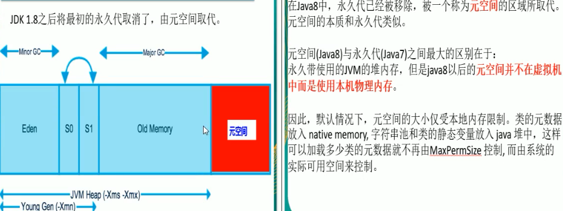
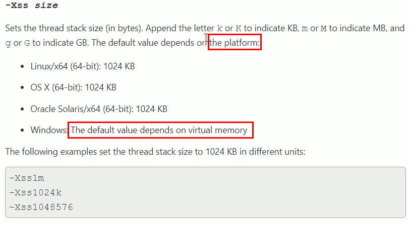
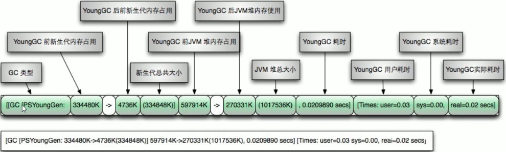
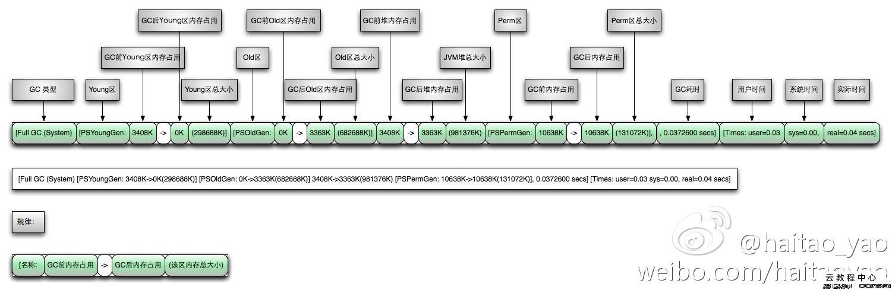
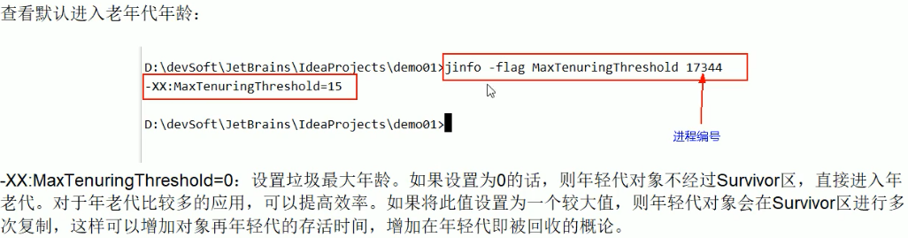
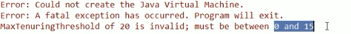

# 平时工作常用的JVM基本配置参数有哪些


## -Xms -Xmx（堆初始大小，堆最大值）

- 标配
  - -Xms
    - 默认是物理内存的1/64
    - 等价于-XX:InitialHeapSize
  - -Xmx
    - 默认是物理内存的1/4
    - 等价于-XX:MaxHeapSize
  - 这2个需要配置相同，防止FullGC

 

- 使用java代码的方式获取

```java
Runtime.getRuntime().totalMemory(); // 获取堆内存大小 Xms
Runtime.getRuntime().maxMemory(); // 返回java虚拟机试图使用的最大内存 Xmx
```


## -Xss（线程栈空间初始大小）

- 设置单个线程的栈空间的初始大小
- 一般默认配置为512K~1024K
  - -Xss512k
- 等价于-XX:ThreadStackSize
- 使用jinfo查看，发现默认值是0

```bash
E:\study\java\code\base-demo>jinfo -flag ThreadStackSize 7444
-XX:ThreadStackSize=0
```

- 查询官网分析
  - https://docs.oracle.com/javase/8/docs/index.html

 

- 默认大小依赖于平台，一般是1024K—1M


## -Xmn（新生代大小）

- 设置新生代大小（默认是堆内存的1/3）
- 一般不用设置，使用默认


## -XX:MetaspaceSize（元空间大小）

- 设置元空间大小
  - 元空间的本质和永久代相似，都是对jvm规范中的方法区的实现
  - 与永久代的区别在于：==元空间不在虚拟机中，直接使用物理内存==
  - 在默认情况下，元空间的大小受限于本地内存限制
- 默认值不到21M
- 在实际生产中可以设置大一些
  - 如-XX:MetaspaceSize=1024m


## 典型设置案例

- 如下参数需要掌握

```bash
-Xms128m -Xmx4096m -Xss1024k -XX:MetaspaceSize=512m -XX:+PrintCommandLineFlags -XX:+PrintGCDetails -XX:+UseSerialGC
```


## -XX:+PrintGCDetails（查看GC明细）

- 在vm中配置-XX:+PrintGCDetails并测试，打印出GC的详细情况，显示堆内存使用情况

```bash
Heap
 PSYoungGen      total 46080K, used 4794K [0x000000078d100000, 0x0000000790400000, 0x00000007c0000000)
  eden space 39936K, 12% used [0x000000078d100000,0x000000078d5ae990,0x000000078f800000)
  from space 6144K, 0% used [0x000000078fe00000,0x000000078fe00000,0x0000000790400000)
  to   space 6144K, 0% used [0x000000078f800000,0x000000078f800000,0x000000078fe00000)
 ParOldGen       total 105472K, used 0K [0x0000000727200000, 0x000000072d900000, 0x000000078d100000)
  object space 105472K, 0% used [0x0000000727200000,0x0000000727200000,0x000000072d900000)
 Metaspace       used 3267K, capacity 4496K, committed 4864K, reserved 1056768K
  class space    used 357K, capacity 388K, committed 512K, reserved 1048576K
```


### MonitorGC 参数解释

 


### FullGC 参数解释




### 小结

- [名称：GC前内存占用 -> GC后内存占用 （该区内存总大小）]


## -XX:SurvivorRatio （设置Survivor区的比例）

- 设置新生代中eden和s0，s1空间的比例
- 默认-XX:SurvivorRatio=8 => eden:s0:s1 = 8:1:1
  - 如-XX:SurvivorRatio=6则eden:s0:s1= 6:1:1
- SurvivorRatio的值就是设置eden区的比例大小，s0和s1相同

案例1

- 注意需要使用UseSerialGC进行测试

- vm配置-XX:+PrintGCDetails -Xms10m -Xmx10m -XX:+UseSerialGC

```java
package com.stt.thread;
public class ch23_GCParamDemo {
	public static void main(String[] args) {
		System.out.println("helloGC");
	}
}
```

- 结果 2752K: 320K：320K=> 8:1:1

```bash
Heap
 def new generation   total 3072K, used 2069K [0x00000000ff600000, 0x00000000ff950000, 0x00000000ff950000)
  eden space 2752K,  75% used [0x00000000ff600000, 0x00000000ff805640, 0x00000000ff8b0000)
  from space 320K,   0% used [0x00000000ff8b0000, 0x00000000ff8b0000, 0x00000000ff900000)
  to   space 320K,   0% used [0x00000000ff900000, 0x00000000ff900000, 0x00000000ff950000)
 tenured generation   total 6848K, used 0K [0x00000000ff950000, 0x0000000100000000, 0x0000000100000000)
   the space 6848K,   0% used [0x00000000ff950000, 0x00000000ff950000, 0x00000000ff950200, 0x0000000100000000)
 Metaspace       used 3286K, capacity 4496K, committed 4864K, reserved 1056768K
  class space    used 359K, capacity 388K, committed 512K, reserved 1048576K
```

案例2

- 配置 -XX:+PrintGCDetails -Xms10m -Xmx10m -XX:+UseSerialGC -XX:SurvivorRatio=4
- 注意比例的变化

```bash
Heap
 def new generation   total 2880K, used 2045K [0x00000000ff600000, 0x00000000ff950000, 0x00000000ff950000)
  eden space 2368K,  86% used [0x00000000ff600000, 0x00000000ff7ff6c0, 0x00000000ff850000)
  from space 512K,   0% used [0x00000000ff850000, 0x00000000ff850000, 0x00000000ff8d0000)
  to   space 512K,   0% used [0x00000000ff8d0000, 0x00000000ff8d0000, 0x00000000ff950000)
 tenured generation   total 6848K, used 0K [0x00000000ff950000, 0x0000000100000000, 0x0000000100000000)
   the space 6848K,   0% used [0x00000000ff950000, 0x00000000ff950000, 0x00000000ff950200, 0x0000000100000000)
 Metaspace       used 3286K, capacity 4496K, committed 4864K, reserved 1056768K
  class space    used 359K, capacity 388K, committed 512K, reserved 1048576K
```


## -XX:NewRatio （配置老年代/新生代比例）

- 默认2，即老年代/新生代=2，老年代占堆内存的2/3，新生代占堆内存1/3
- 如-XX:NewRatio=4，则老年代占堆内存4/5，新生代占堆内存1/5
- 一般不改

案例1：显示默认

- 配置  -XX:+PrintGCDetails -Xms10m -Xmx10m -XX:+UseSerialGC
- eden 3072K : old 6848K = 1:2

```bash
Heap
 def new generation   total 3072K, used 2069K [0x00000000ff600000, 0x00000000ff950000, 0x00000000ff950000)
  eden space 2752K,  75% used [0x00000000ff600000, 0x00000000ff805640, 0x00000000ff8b0000)
  from space 320K,   0% used [0x00000000ff8b0000, 0x00000000ff8b0000, 0x00000000ff900000)
  to   space 320K,   0% used [0x00000000ff900000, 0x00000000ff900000, 0x00000000ff950000)
 tenured generation   total 6848K, used 0K [0x00000000ff950000, 0x0000000100000000, 0x0000000100000000)
   the space 6848K,   0% used [0x00000000ff950000, 0x00000000ff950000, 0x00000000ff950200, 0x0000000100000000)
 Metaspace       used 3286K, capacity 4496K, committed 4864K, reserved 1056768K
  class space    used 359K, capacity 388K, committed 512K, reserved 1048576K
```

案例2：修改为4

- 配置 -XX:+PrintGCDetails -Xms10m -Xmx10m -XX:+UseSerialGC -XX:NewRatio=4

- 结果 1856K：8192K = 1：4

```bash
Heap
 def new generation   total 1856K, used 534K [0x00000000ff600000, 0x00000000ff800000, 0x00000000ff800000)
  eden space 1664K,  20% used [0x00000000ff600000, 0x00000000ff655900, 0x00000000ff7a0000)
  from space 192K,  99% used [0x00000000ff7d0000, 0x00000000ff7ffff8, 0x00000000ff800000)
  to   space 192K,   0% used [0x00000000ff7a0000, 0x00000000ff7a0000, 0x00000000ff7d0000)
 tenured generation   total 8192K, used 493K [0x00000000ff800000, 0x0000000100000000, 0x0000000100000000)
   the space 8192K,   6% used [0x00000000ff800000, 0x00000000ff87b7d8, 0x00000000ff87b800, 0x0000000100000000)
 Metaspace       used 3286K, capacity 4496K, committed 4864K, reserved 1056768K
  class space    used 359K, capacity 388K, committed 512K, reserved 1048576K
```


## -XX:MaxTenuringThreshold（最大年龄设置0-15）

- 设置垃圾的最大年龄
- 默认15
- 一般不进行修改

 

- 注意：必须设置为0-15范围之内

 

