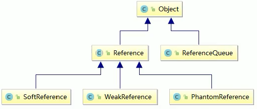
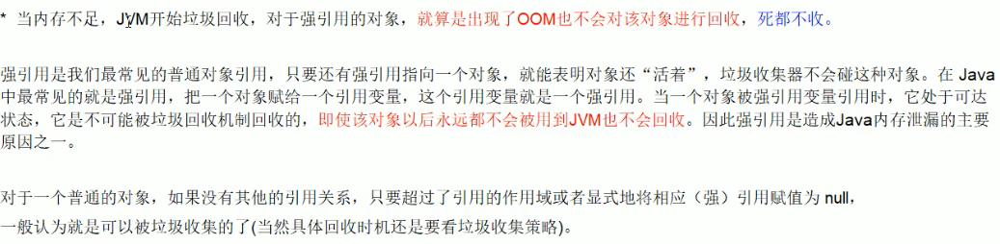
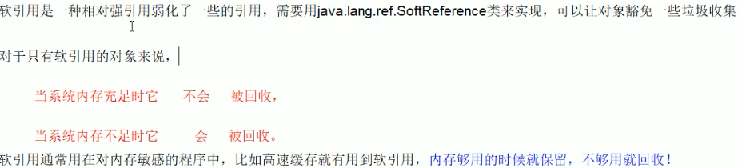
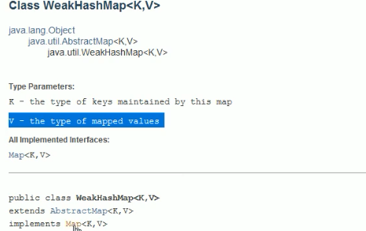
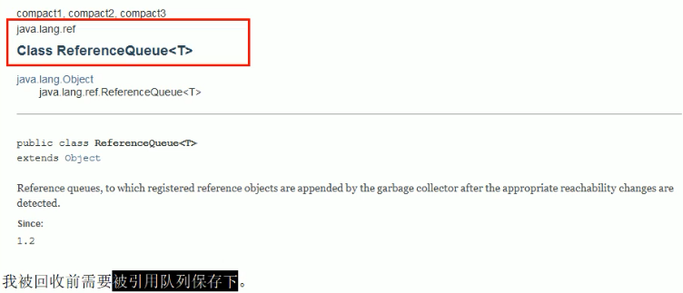
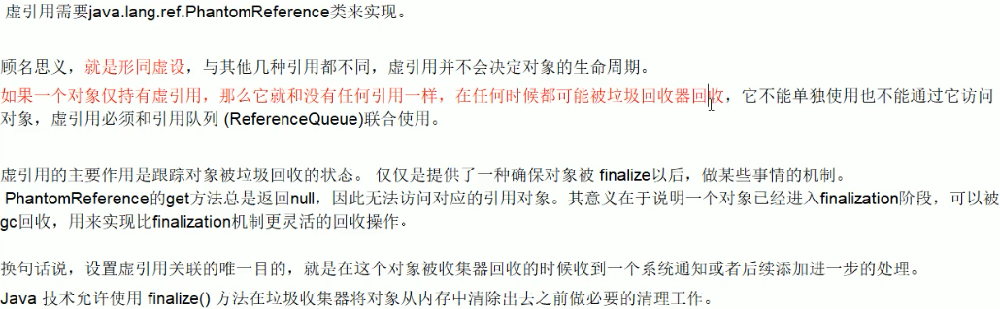
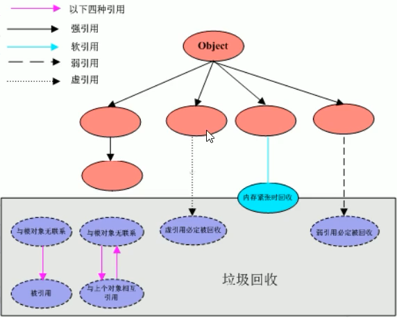

# 整体架构

 


# 强引用 [Reference]（垃圾回收不回收该内存）

- 默认支持的引用
- 只要有强引用的对象，jvm不会对该对象进行回收，属于有GC Roots的可达对象
- 内存泄露的主要原因之一

 

```java
package com.stt.thread;

public class ch24_StrongReferenceDemo {
	public static void main(String[] args) {

		Object obj1 = new Object(); // 默认强引用
		Object obj2 = obj1; // 引用赋值
		obj1 = null; // 置空
		System.gc();
		System.out.println(obj2);
	}
}
```


# 软引用 [SoftReference]（内存不够垃圾回收该内存）

- 内存足够的情况下不进行回收，内存不够的情况下回收
  - 内存不够的情况下会进行Full GC，在FullGC的时候进行回收

 

- 示例

```java
package com.stt.thread;

import java.lang.ref.SoftReference;
/**
 * 内存充足时，不回收
 * 内存不够时，进行回收
 * 配置内存 -Xms2m -Xmx2m -XX:+PrintGCDetails
 */
public class ch25_SoftReferenceDemo {

	public static void MemoryEnough() {
		Object o1 = new Object();
		SoftReference<Object> softReference = new SoftReference<Object>(o1);
		System.out.println(o1);
		System.out.println(softReference.get());

		o1 = null;
		System.gc();

		System.out.println(o1); // null
		System.out.println(softReference.get()); // 可以获取
	}

	public static void MemoryNotEnough() {
		Object o1 = new Object();
		SoftReference<Object> softReference = new SoftReference<Object>(o1);
		System.out.println(o1);
		System.out.println(softReference.get());

		o1 = null;

		try {
			byte[] b = new byte[1 * 512 * 1024]; // 直接申请大对象，到老年代，触发gc
		} catch (Exception e) {
			e.printStackTrace();
		}finally {
			System.out.println(o1); // null
			System.out.println(softReference.get()); // null
		}
	}

	public static void main(String[] args) {
//		MemoryEnough();
		MemoryNotEnough();
	}
}
```


# 弱引用 [WeakReference]（垃圾回收该内存）

- 无论堆空间是否充足，只要有GC，就进行回收
- 使用java.lang.ref.WeakReference类实现，比软引用的生存期更短
- 只要垃圾回收机制一执行，JVM无论内存空间是否充足，都会回收该对象占用内存

```java
package com.stt.thread;

import java.lang.ref.SoftReference;
import java.lang.ref.WeakReference;

/**
 弱引用，垃圾回收机制回收该对象占用的内存
 */
public class ch26_WeakReferenceDemo {

	public static void main(String[] args) {
		Object o1 = new Object();
		WeakReference<Object> ref = new WeakReference(o1);
		System.out.println(o1);
		System.out.println(ref.get());

		o1 = null;
		System.gc();

		System.out.println(o1); // null
		System.out.println(ref.get()); // null
	}
}
```


## 使用场景

- 缓存系统：图片缓存

  - 图片加载到内存中，内存比文本大，一次全部加载到内存中，可能会造成OOM
  - 使用软引用（或弱引用）解决该问题
  - 设计思路：用一个HashMap保存图片的路径和相应图片对象关联的软引用之间的映射关系，在内存不足时，JVM会自动回收这些缓存的图片对象所占用的空间，从而有效的避免OOM问题

  ```java
  Map<String,SoftReference<BitMap>> imageCache = new HashMap<String,SoftReference<BitMap>>();
  ```

  

## WeakHashMap

- key是弱引用，如果key为null，则在下次垃圾回收时，map会删除该key-value对，并垃圾回收内存

 

```java
package com.stt.thread;

import java.util.HashMap;
import java.util.Map;
import java.util.WeakHashMap;

public class ch27_WeakHashMapDemo {
	public static void main(String[] args) {
		hashMapTest();
		weakHashMapTest();
	}

	static void hashMapTest(){
		Map<Integer,String> map = new HashMap();
		Integer key = new Integer(1);
		String value = "value";
		map.put(key,value);
		System.out.println(map);

		key = null;
		System.out.println("======");
		System.out.println(map);

		System.gc();
		System.out.println("======");
		System.out.println(map);
	}

	static void weakHashMapTest(){
		Map<Integer,String> map = new WeakHashMap<>();
		Integer key = new Integer(2);
		String value = "value";
		map.put(key,value);
		System.out.println(map);

		key = null;
		System.out.println("======");
		System.out.println(map);

		System.gc();
		System.out.println("======");
		System.out.println(map);
	}
}
// 结果
{1=value}
======
{1=value}
======
{1=value}
{2=value}
======
{2=value}
======
{} // 已经被回收了	
```


# 引用队列

- gc回收后放在引用队列中

 

```java
package com.stt.thread;

import java.lang.ref.ReferenceQueue;
import java.lang.ref.WeakReference;

public class ch28_ReferenceQueueDemo {
	public static void main(String[] args) {
		Object o1 = new Object();
		ReferenceQueue<Object> referenceQueue = new ReferenceQueue<>();
		WeakReference<Object> ref = new WeakReference<>(o1,referenceQueue);

		System.out.println(o1);
		System.out.println(ref.get());
		System.out.println(referenceQueue.poll());

		o1=null;
		System.gc();
		System.out.println("--------------");

		System.out.println(o1);
		System.out.println(ref.get());
		System.out.println(referenceQueue.poll());
	}
}
// 结果
java.lang.Object@7440e464
java.lang.Object@7440e464
null
--------------
null
null
java.lang.ref.WeakReference@49476842
```


# 虚引用 [PhantomReference]

- 需要和引用队列配合使用
- get总是返回null
- 用于监控对象的回收状态
- 在对象的finalize()中做些后置通知等操作
- 工作不常用

 

```java
package com.stt.thread;

import java.lang.ref.PhantomReference;
import java.lang.ref.ReferenceQueue;

public class ch29_PhantomReferenceDemo {
	public static void main(String[] args) throws InterruptedException {
		Object o1 = new Object();
		ReferenceQueue<Object> referenceQueue = new ReferenceQueue<>();
		PhantomReference<Object> ref = new PhantomReference<>(o1,referenceQueue);

		System.out.println(o1);
		System.out.println(ref.get());
		System.out.println(referenceQueue.poll());

		o1=null;
		System.gc();
		Thread.sleep(500);
		System.out.println("--------------");

		System.out.println(o1);
		System.out.println(ref.get());
		System.out.println(referenceQueue.poll());
	}
}
// 结果
java.lang.Object@7440e464
null
null
--------------
null
null
java.lang.ref.PhantomReference@49476842
```


# 小结

 