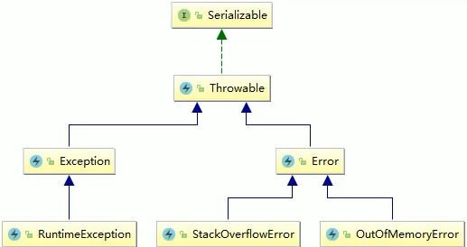
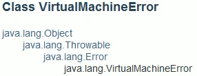
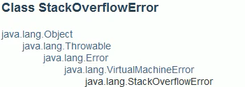
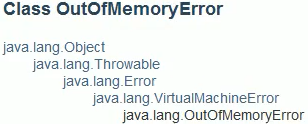

# 谈谈对OOM的认识

- StackOverflowError

- OutOfMemoryError:Java heap space

- OutOfMemoryError:GC overhead limit exceeded

- OutOfMemoryError:Direct buffer memory

- OutOfMemoryError:unable to create new native thread

- OutOfMemoryError:Metaspace


Throwable有2个子类

- Error
- Exception

 

那么上述的都是Error

 


## StackOverflowError

 

- 示例

```java
package com.stt.thread;

public class ch30_StackOverFlowDemo {
	public static void main(String[] args) {
		m(); // 递归调用可能导致栈溢出异常
	}
	static void m(){
		m();
	}
}
// 结果
Exception in thread "main" java.lang.StackOverflowError
```


## OOM:Java heap space

 

- 由于堆内存无法分配空间给新的对象导致OOM

- 示例：配置-Xmx10m -Xms10m

```java
package com.stt.thread;

public class ch31_JavaHeapSpaceDemo {
   public static void main(String[] args) {
      byte[] b = new byte[10*1024*1024];
   }
}
// 结果
Exception in thread "main" java.lang.OutOfMemoryError: Java heap space
```

 

## OOM:GC overhead limit exceeded

- 大部分的工作用于处理FullGC，而且FullGC回收的资源不多，效果不好

 

- GC回收时间过长会抛出OOM:GC overhead limit exceeded
- 超过98%的时间做GC回收，并且回收了不到2%的堆内存
- 连续回收多次，都只回收了2%的内存的极端情况会抛出该异常
- CPU使用率一直100%，而GC没有任何效果
- 示例：-Xms10m -Xmx10m -XX:+PrintGCDetails -XX:MaxDirectMemorySize=5m

```java
package com.stt.thread;

import java.util.ArrayList;
import java.util.List;

public class ch32_GCOverheadDemo {
	public static void main(String[] args) {
		int i = 0;
		List<String> list = new ArrayList<>();
		while(true){
			// 获取常量池中的引用，不断创建对象
			list.add(String.valueOf(++i).intern());
		}
	}
}
// 结果：频繁full GC，每次FullGC回收资源效果不好
...
[Full GC (Ergonomics) [PSYoungGen: 2047K->2047K(2560K)] [ParOldGen: 7136K->7136K(7168K)] 9184K->9184K(9728K), [Metaspace: 3284K->3284K(1056768K)], 0.0531366 secs] [Times: user=0.09 sys=0.00, real=0.05 secs] 
[Full GC (Ergonomics) [PSYoungGen: 2047K->2047K(2560K)] [ParOldGen: 7138K->7138K(7168K)] 9186K->9186K(9728K), [Metaspace: 3284K->3284K(1056768K)], 0.0402036 secs] [Times: user=0.16 sys=0.00, real=0.04 secs]  
Exception in thread "main" java.lang.OutOfMemoryError: GC overhead limit exceeded
```


## OOM:Direct buffer memory

- 堆外内存溢出
- 写NIO程序经常使用ByteBuffer读取或者写入数据，基于通道channel和缓冲区 buffer的IO方式
  - 使用native函数直接分配堆外内存，然后通过一个存储在java堆里面的DirectByteBuffer对象作为这块内存的引用进行操作
  - 在一些场景中显著提高性能，避免在java堆和native堆中来回复制数据
  - ByteBuffer.allocate(capability)：分配jvm堆内存，属于GC管理范围，由于需要拷贝所以速度慢
  - ByteBuffer.allocateDirect(capability)：分配OS本地内存，不属于GC管理范围，需要手动释放，不需要内存拷贝所以速度相对较快
- 如果不断分配本地内存，堆内存很少使用，那么jvm不需要执行gc，DirectByteBuffer对象不会回收，此时堆内存充足，但本地内存已经用完，再次尝试分配本地内存就会出现OutOfMemoryError，程序崩溃

- 获取本地可分配直接内存大小
  - 默认本地内存的1/4

```java
System.out.println("maxDirectMemory:"+sun.misc.VM.maxDirectMemory() / 1024 / 1024 + "mb");
```

- 示例：-Xms10m -Xmx10m -XX:+PrintGCDetails -XX:MaxDirectMemorySize=5m

```java
package com.stt.thread;

import java.nio.ByteBuffer;

/**
使用堆外内存，溢出分析
 -Xms10m -Xmx10m -XX:+PrintGCDetails -XX:MaxDirectMemorySize=5m
 */
public class ch33_DirectMemoryOOMDemo {
	public static void main(String[] args) {
		System.out.println("maxDirectMemory:"+sun.misc.VM.maxDirectMemory() / 1024 / 1024 + "mb");

		ByteBuffer byteBuffer = ByteBuffer.allocateDirect(6*1024*1024);
	}
}
// 结果
maxDirectMemory:5mb
[GC (System.gc()) [PSYoungGen: 2005K->504K(2560K)] 2005K->749K(9728K), 0.0088084 secs] [Times: user=0.00 sys=0.00, real=0.01 secs] 
[Full GC (System.gc()) [PSYoungGen: 504K->0K(2560K)] [ParOldGen: 245K->727K(7168K)] 749K->727K(9728K), [Metaspace: 3281K->3281K(1056768K)], 0.0106170 secs] [Times: user=0.02 sys=0.00, real=0.01 secs] 
Exception in thread "main" java.lang.OutOfMemoryError: Direct buffer memory
	at java.nio.Bits.reserveMemory(Bits.java:693)
	at java.nio.DirectByteBuffer.<init>(DirectByteBuffer.java:123)
	at java.nio.ByteBuffer.allocateDirect(ByteBuffer.java:311)
	at com.stt.thread.ch33_DirectMemoryOOMDemo.main(ch33_DirectMemoryOOMDemo.java:13)
```


## OOM:unable to create new native thread（重点）

- 创建线程过多，超过服务器限制
- 在Linux中，对单个进程的创建线程数有个数限制（1024），如果超过该限制则会报该错误
- 示例：注意非root用户在linux环境下测试

```java
public class ch34_UnableCreateNewThreadDemo {
	public static void main(String[] args) {
		for (int i =0;;i++){
			new Thread(()->{
				System.out.println(Thread.currentThread().getName()+" run");
				try {
					Thread.sleep(Integer.MAX_VALUE);
				} catch (InterruptedException e) { e.printStackTrace(); }
			},"t"+i).start();
		}
	}
}
```

- 解决

  - 从业务的角度出发，降低应用程序创建线程的数量，分析应用是否真的需要创建那么多的线程

  - 对有些业务，确实需要创建很多线程，并且超过linux系统的1024的限制吗，那么需要修改linux服务器的配置，扩大linux的默认限制
    - 查看限制

    ```bash
    ulimit -u
    ```

    - 修改限制

    ```bash
    vim /etc/security/limits.d/90-nproc.conf
    
    *		soft	nproc	1024
    root 	soft	nproc	unlimited
    ttshe	soft 	nproc	2000 # 添加配置
    ```

    

## OOM:Metaspace

- 查看元空间大小：java -XX:+PrintFlagsIntitial 查看本机元空间初始大小--20.8M
- java8使用元空间替代了永久代
- ==使用本地内存==，不使用虚拟机内存
- 元空间存储
  - 虚拟机加载类的信息
  - 常量池
  - 静态变量
  - 即时编译后的代码
- 示例：模拟溢出，不断生成类在元空间中
  - -XX:MetaspaceSize=8m -XX:MaxMetaspaceSize=8m

```java
package com.stt.thread;

import org.springframework.cglib.proxy.Enhancer;
import org.springframework.cglib.proxy.MethodInterceptor;
import org.springframework.cglib.proxy.MethodProxy;

import java.lang.reflect.Method;

public class ch35_MetaspaceOOMDemo {
	static class OOM{}
	public static void main(String[] args) {
		int i =0;
		while(true){
			i++;
			Enhancer enhancer = new Enhancer();
			enhancer.setSuperclass(OOM.class);
			enhancer.setUseCache(false);
			enhancer.setCallback(new MethodInterceptor() {
				@Override
				public Object intercept(Object o, Method method, Object[] objects, MethodProxy methodProxy) throws Throwable {
					return methodProxy.invokeSuper(o,args);
				}
			});
			enhancer.create();
		}
	}
}
// 结果
Exception in thread "main" java.lang.OutOfMemoryError: Metaspace
```

- 解决方法：扩大元空间存储大小


# Exception 和 Error的区别

- Exception 和Error 都是继承了Throwable类，在Java中只有Throwable类型的实例才可以被抛出或者捕获，它是异常处理机制的基本类型
- Exception和Error体现了Java平台设计者对不同异常情况的分类
  - Exception是程序正常运行中，可以预料的意外情况，可能并且应该被捕获，进行相应处理
  - Exception又分为可检查(checked)异常和不可检查(unchecked)异常。可检查异常在源代码里必须显式的进行捕获处理，这是编译期检查的一部分。不可检查时异常是指运行时异常，像NullPointerException、ArrayIndexOutOfBoundsException之类，通常是可以编码避免的逻辑错误，具体根据需要来判断是否需要捕获，并不会在编译期强制要求
- Error是指正常情况下，不大可能出现的情况，绝大部分的Error都会导致程序处于非正常的、不可恢复的状态。既然是非正常情况，不便于也不需要捕获。常见的比如OutOfMemoryError之类都是Error的子类
  - 出现Error之后基本上是不可恢复的
  - 而出现Exception在某些情况下可以预先判断做出处理