# GC算法

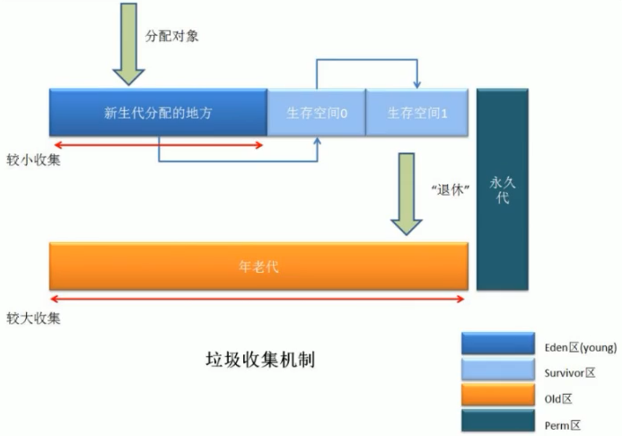 


# GC垃圾回收算法和垃圾回收器的关系

- GC算法是内存回收的方法论，垃圾收集器是算法的落地实现
  - 引用计数
  - 复制
  - 标记清除
  - 标记整理

- 目前没有完美的垃圾收集器，没有万能的收集器，只是针对具体场景使用最合适的收集器，进行==分代收集==


## 4种主要垃圾收集器

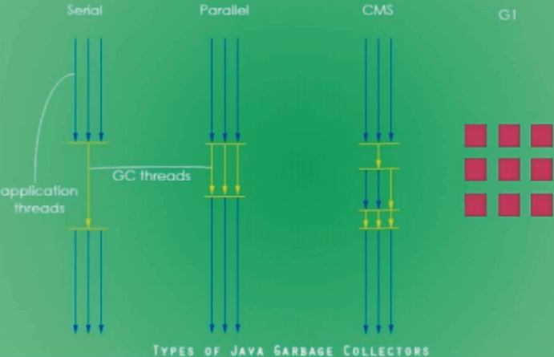 


### 串行垃圾回收器 [Serial]

- 为单线程环境设计且只使用一个线程进行垃圾回收
- 会暂停所有的用户线程
- 不适合服务器环境


### 并行垃圾回收器 [Parallel]

- 串行垃圾回收器的加强版本

- 多个垃圾收集线程并行工作，此时用户线程是暂停的
- 适用于科学计算，大数据处理等弱交互场景
- 有stop the world


### 并发垃圾回收器 [CMS]

- ==用户线程与垃圾收集线程同时执行==
- 不一定是并行，可能是交替执行，不需要停顿用户线程
- 互联网工作经常用，适用对响应时间有要求的场景
- 使用餐厅，顾客，清洁工举例

- 分为4步


### 小结

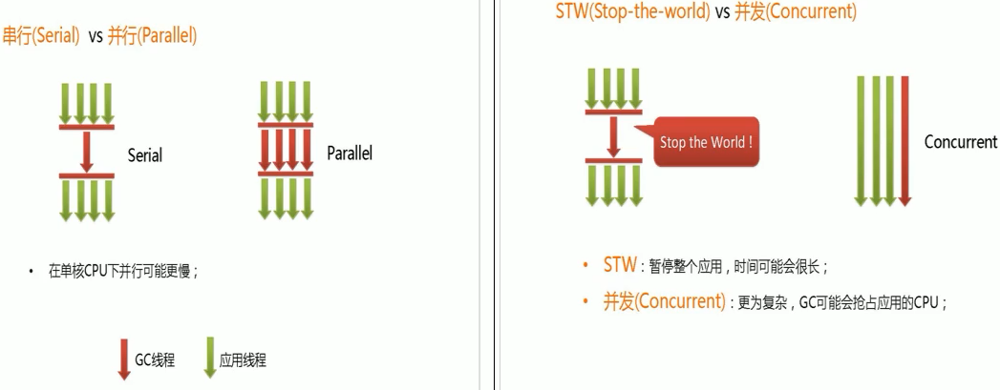


### G1垃圾回收器

- G1垃圾回收器适用于堆内存很大的情况
- 将堆内存分割成不同区域然后并发的对其进行垃圾回收


# 如何查看服务器的默认垃圾回收器配置

```bash
E:\study\java\code\base-demo>java -XX:+PrintCommandLineFlags -version
-XX:InitialHeapSize=160173760
-XX:MaxHeapSize=2562780160 
-XX:+PrintCommandLineFlags 
-XX:+UseCompressedClassPointers 
-XX:+UseCompressedOops 
-XX:-UseLargePagesIndividualAllocation 
-XX:+UseParallelGC
java version "1.8.0_101"
Java(TM) SE Runtime Environment (build 1.8.0_101-b13)
Java HotSpot(TM) 64-Bit Server VM (build 25.101-b13, mixed mode)
```

- java8使用的默认垃圾收集器是：UseParallelGC
- 也可以使用jinfo进行判断是否使用该垃圾回收器

```java
jinfo -flag UseParallelGC xx_pid
```


# 默认的垃圾回收器有哪些

- UseSerialGC
- UseParallelGC
- UseParNewGC
- UseConcMarkSweepGC
- UseSerialOldGC（已去除不使用）
- UseParallelOldGC
- UseG1GC

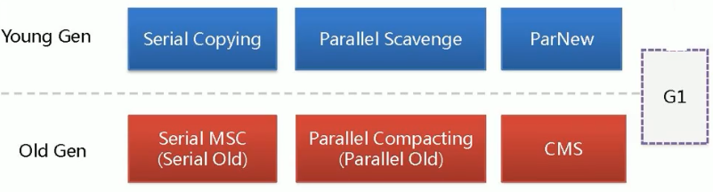 


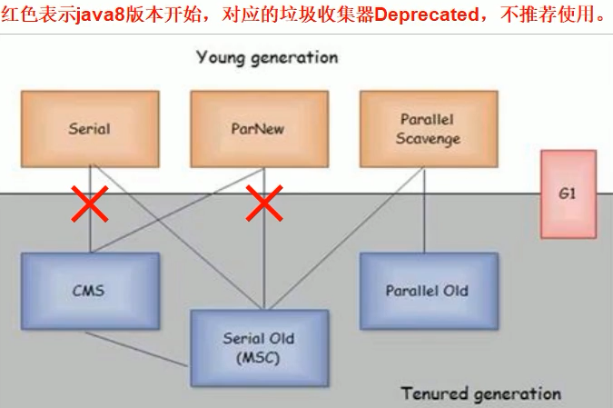 


# 垃圾收集器

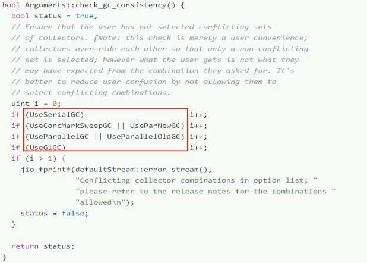 


## 参数

- DefNew：Default New Generation
- Tenured：Old
- ParNew：Parallel New Generation
- PSYoungGen：Parallel Scavenge Young Generation
- ParOldGen：Parallel Old Generation


## server/client模式

- 适用范围：只需要掌握Server模式，Client模式基本不会使用
- 操作系统：
  - 32位windows操作系统，不论硬件如何都使用client的jvm模式
  - 32位其他系统，2G内存同时2个cpu以上使用server模式，低于该配置使用client模式
  - ==64位的都是server模式==


## 新生代


### 串行GC [UseSerialGC:Serial+SerialOld]

- SerialCopying
- 新生代老年代：串串

- 单线程收集器，进行垃圾回收时，必须暂停其他所有工作线程直到它收集结束
- 最古老，最稳定，效率最高的收集器
- 只使用一个线程去回收，单在垃圾收集过程中可能会有较长的停顿（STW），虽然垃圾收集过程中会暂停其他所有工作线程，但是简单高效
- 对于限定单个CPU环境而言，==没有线程交互的开销可以获得最高单线程垃圾收集的效率==
- Serial垃圾收集器是jvm在client模式下默认的新生代垃圾收集器

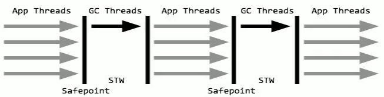 

- jvm参数：-XX:+UseSerialGC
- 开启后会使用：Serial（Young）+ Serial Old（Old）的收集器组合
- ==新生代和老生代都会使用串行回收收集器，新生代使用复制算法，老年代使用标记-整理算法==

```bash
-XX:+UseSerialGC
日志中标识新生代+老年代=DefNew+Tenured
```


### 并行GC [UseParNewGC:ParNew+SerialOld]

- 新生代老年代：并串

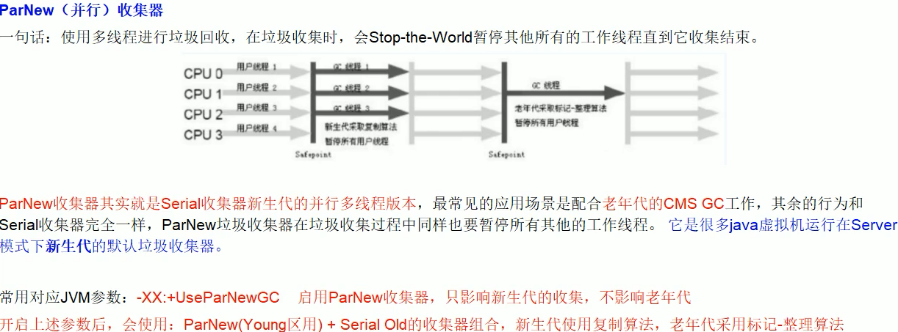 

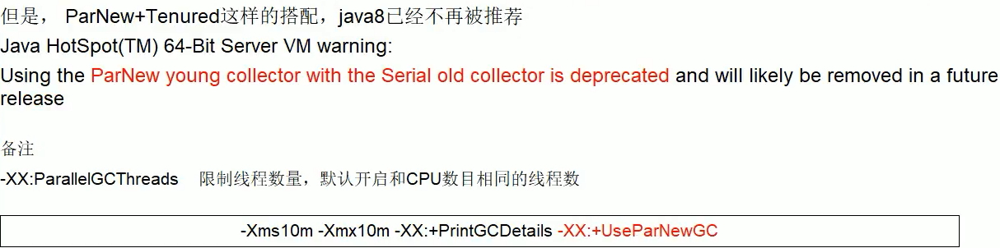

```bash
-XX:+UseParNewGC
日志中标识新生代+老年代=ParNew+Tenured
```


### 并行回收GC [UseParallelGC:ParallelScavenge+ParallelOld]

- java8默认使用
- 新生代老年代：并并

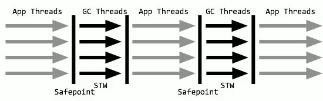 

- Parallel Scavenge 收集器类似==ParNew==，也是一个==新生代==垃圾收集器
  - 使用复制算法
  - 并行的多线程垃圾收集器
  - 吞吐量优先收集器
  - 串行收集器在新生代和老年代的并行化
- Parallel Scavenge重点关注吞吐量
- JVM参数：-XX:+UseParallelGC 或 -XX:+UseParallelOldGC （可互相激活）使用 ParallelScanvenge收集器
- 开启后新生代使用**复制**算法，老年代使用**标记-整理**算法

- 其他参数：-xx:ParallelGCThreads=N 表示启动多少个GC线程
  - CPU>8 ：N=5/8*CPU核数
  - CPU<8：N=实际个数

```bash
XX:+UseParallelGC 或 -XX:+UseParallelOldGC
日志中标识新生代+老年代=PSYoungGen+ParOldGen
```


#### 吞吐量

- 可控制的吞吐量，Thoughput
- 运行用户代码时间/（运行用户代码时间+GC收集时间）
  - 如程序运行100分钟，垃圾收集1分钟，吞吐量99%
- 高吞吐量意味着高效利用cpu的时间
- 多用于后台运算不需要太多交互的任务


#### 自适应调节策略

- ParallelScavenge 收集器与ParNew的一个重要区别在于自适应调节策略
- 虚拟机会根据当前系统的运行情况收集性能监控信息，动态调整参数提供最合适的停顿时间（-XX:MaxGCPauseMillis）或最大吞吐量


## 老年代


### 串行GC [Serial Old/Serial MSC]

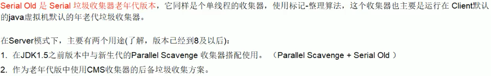 


### 并行GC [Parallel Old/Parallel MSC]

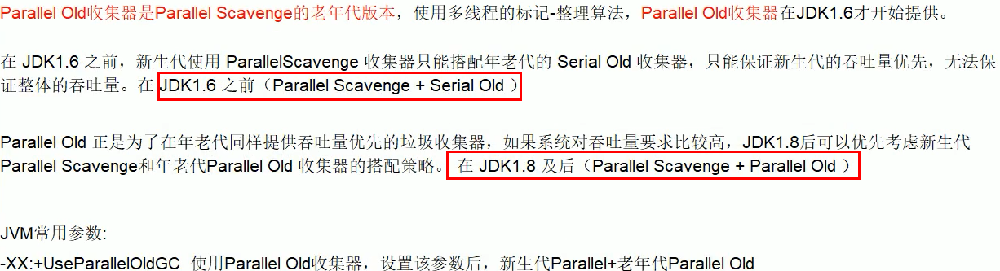


### 并发标记清除GC [CMS]

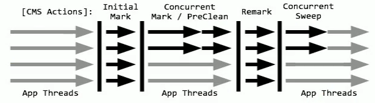 

- Concurrent Mark Sweep
- 并发标记清除
- ==并发收集低停顿，并发是值与用户线程一起执行==
- JVM参数：-XX:+UseConcMarkSweepGC
  - 开启该参数会自动将 -XX:+UseParNewGC打开
  - 开启后使用ParNew（Young）+CMS（Old）+SerialOld收集器组合
    - ==SerialOld将作为CMS出错的后备收集器==


#### 执行过程（3次标记，1次清除）

- 初始标记（CMS initial mark，STW）
  - 只是标记一下GC Roots 能直接关联的对象，速度很快，依然需要暂停所有的工作线程
- 并发标记（CMS concurrent mark） 和 用户线程一起
  - 进行GC Roots跟踪的过程，与用户线程一起工作，不需要暂停用户线程
  - 主要标记过程，标记全部对象
- 重新标记（CMS remark，STW）
  - 为了修正在并发标记期间，因用户程序继续运行而导致标记产生变动的那一部分对象的标记记录，依然需要暂停所有的工作线程
  - 由于并发标记期间，用户线程依然运行，在正式清理前，需要做二次确认
- 并发清除（CMS concurrent sweep）和用户线程一起
  - 清除GC Roots不可达对象，和用户线程一起工作，不需要暂停工作线程
  - 基于标记结果，直接清理对象
  - 由于耗时最长的并发标记和并发清除过程中，垃圾收集线程和用户线程一起并发执行，总体上CMS收集器的内存回收和用户线程是一起并发执行的

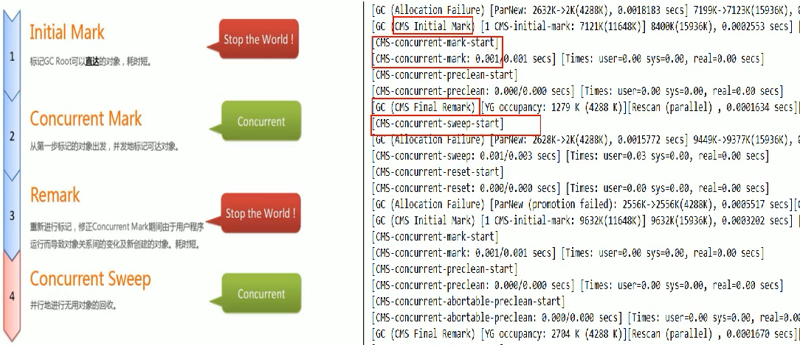 


#### 优缺点

- 优点：==并发收集停顿低==
- 缺点
  - 并发执行对cpu资源压力大
    - 由于是并发执行，cms在收集与应用线程会同时增加对堆内存的占用
    - CMS必须要在老年代堆内存用尽之前完成垃圾回收，否则CMS失败，将触发担保机制，串行老年代收集器会以STW的方式进行一次GC，从而导致较大停顿时间
  - 采用标记清除算法会导致大量的碎片
    -  标记清除无法整理空间碎片
    - 老年代空间会随着应用时长而被逐渐耗尽，最后不得不通过担保机制对堆内存进行压缩
    - CMS提供参数：-XX:CMSFullGCsBeForeCompaction
      - 默认0，每次都进行内存整理
      - 指定多少次CMS收集之后，进行一次压缩的FullGC


## G1

- JVM参数：-XX:+UseG1GC
- 示例：使用G1后，只有garbage-first heap 和metaspace ，没有新生代老年代等


# 生产上如何配置垃圾收集器

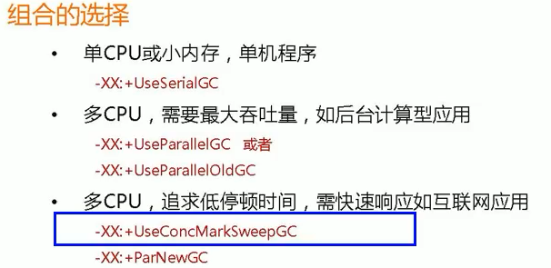 

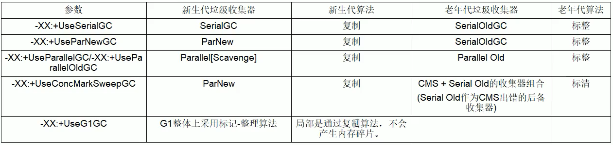 


# 对垃圾收集器的理解

