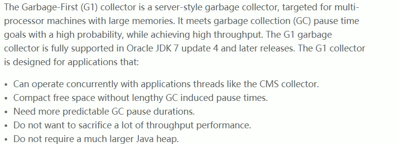
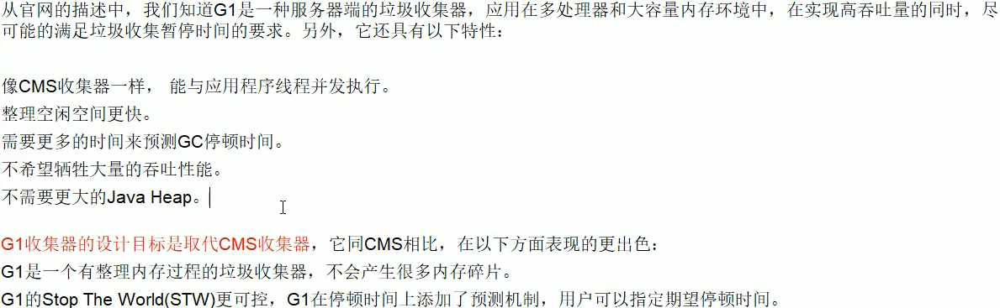
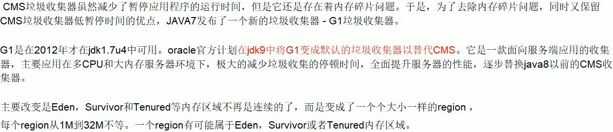
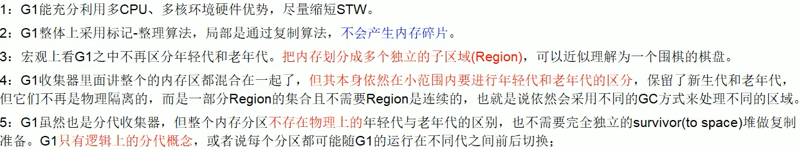
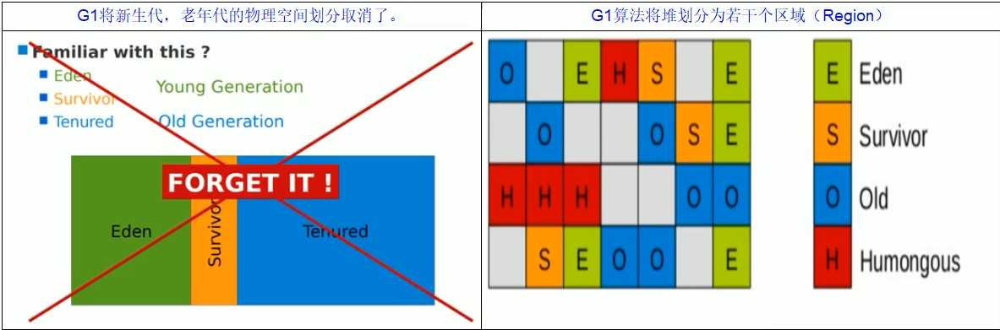
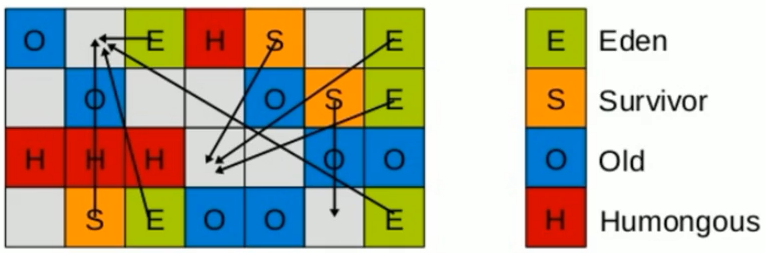
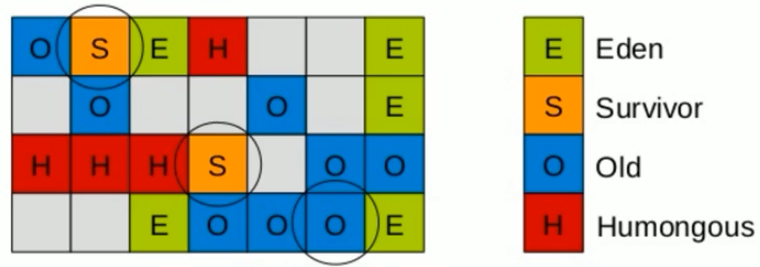
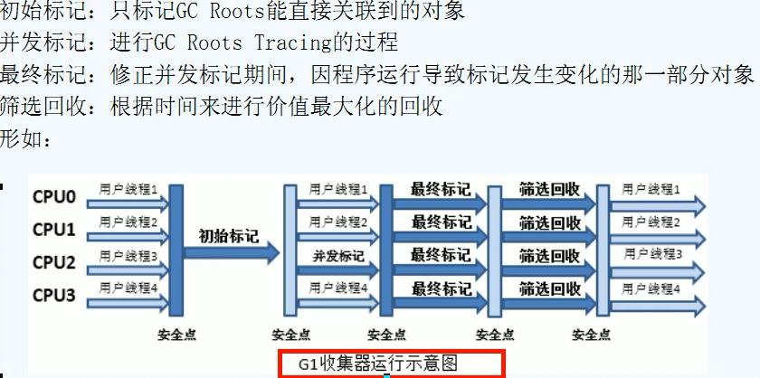

# 以前收集器的特点

- 年轻代和老年代是各自独立且连续的内存块
- 年轻代收集使用单eden+S0+S1进行复制算法
- 老年代收集必须扫描整个老年代区域
- 都是以尽可能少而快速地执行GC为设计原则


# G1是什么

- Garbage-First 收集器，是一款面向服务端应用的收集器

 

 




# G1特点



- G1 中的Region有逻辑上的分代概念，可以相互转换


# 底层原理


## Region区域化垃圾收集器

- 好处是化整为零，避免全表扫描，只需要按照区域进行扫描即可
- 区域化内存碎片region，整体变为了一些不连续的内存区域，避免了全内存区的GC操作
- 核心思想是将整个堆内存区域分成大小相同的子区域（Region），在JVM启动时会自动设置这些子区域的大小
- 在堆的使用上，==G1不要求对象的存储一定是物理上连续的，只要逻辑上连续即可==
- 每个分区不会固定的为某个代服务，可以按需在年轻代和老年代之间转换
- 启动时，通过-XX:G1HeapRegionSize=n可指定分区大小（1M-32M，必须是2的幂）默认将整堆划分为2048个分区
- 大小范围在1M-32M，最多可以设置2048个区，最大支持内存32*2048M=64G



- G1算法将堆划分为若干个区域（Region），它仍然属于分代收集器
- 这些Region的一部分包含新生代，新生代的垃圾收集依然采用暂停所有应用方程的方式，将存活对象拷贝到老年代或者Survivor空间
- 这些Region的一部分包含老年代，G1收集器通过将对象从一个区域复制到另一个区域，完成清理工作，正常处理过程中，==G1完成了堆的压缩（至少是部分堆的压缩），就不会有CMS内存碎片的问题==

- G1中有一种特殊区域：Humongous 巨大的区域
  - 如果一个对象占用的空间超过了分区容量的50%以上，G1收集器认为这是个巨型对象，这些==巨型对象默认直接分配到老年代==，如果是一个短期的巨型对象，会对垃圾收集器造成负面影响，为了解决该问题，G1划分了一个Humongous区，用来专门存放巨型对象，如果一个H区装不下一个巨型对象，G1会寻找连续的H区进行存储，为了找到连续的H区，有时候会启动Full GC


## 回收步骤

- 针对Eden区进行收集，Eden区耗尽后会被触发，主要是小区域收集+形成连续的内存块，避免内存碎片
  - Eden区的数据移动到Survivor区，如果出现Survivor区空间不够，Eden区数据会部分晋升到Old区
  - Survivor区的数据移动到新的Survivor区，部分数据会晋升到Old区
  - 最后Eden区收拾结束，GC结束，用户应用程序继续执行


 

 


## 4个步骤

 


# 常用配置参数

- -XX:+UseG1GC
- -XX:G1HeapRegionSize=n
  - 设置G1区域的大小，值是2的幂，范围是1m-32m
  - 目标是依据最小的java堆大小划分出约2048个区域
- -XX:MaxGCPauseMillis=n
  - 最大GC停顿时间，这个是软目标，JVM尽可能，但不保证停顿小于这个时间
- -XX:InitialHeapOccupancyPercent=n
  - 堆占用了多少时候就触发GC，默认45s
- -XX:ConcGCThreads=n
  - 并发GC使用的线程数
- -XX:G1ReservePercent=n
  - 设置作为空闲空间的预留内存百分比，以降低目标空间溢出的风险
  - 默认值10%


- 示例：使用G1后，只有garbage-first heap 和metaspace ，没有新生代老年代等

```bash
[GC pause (G1 Evacuation Pause) (young), 0.0038348 secs]
   [Parallel Time: 2.5 ms, GC Workers: 4]
      [GC Worker Start (ms): Min: 732.6, Avg: 732.8, Max: 733.0, Diff: 0.4]
      [Ext Root Scanning (ms): Min: 0.4, Avg: 0.7, Max: 1.0, Diff: 0.6, Sum: 2.9]
      [Update RS (ms): Min: 0.0, Avg: 0.0, Max: 0.0, Diff: 0.0, Sum: 0.0]
         [Processed Buffers: Min: 0, Avg: 0.0, Max: 0, Diff: 0, Sum: 0]
      [Scan RS (ms): Min: 0.0, Avg: 0.0, Max: 0.0, Diff: 0.0, Sum: 0.0]
      [Code Root Scanning (ms): Min: 0.0, Avg: 0.1, Max: 0.2, Diff: 0.2, Sum: 0.2]
      [Object Copy (ms): Min: 1.0, Avg: 1.5, Max: 1.7, Diff: 0.6, Sum: 5.8]
      [Termination (ms): Min: 0.0, Avg: 0.0, Max: 0.0, Diff: 0.0, Sum: 0.0]
         [Termination Attempts: Min: 1, Avg: 2.8, Max: 6, Diff: 5, Sum: 11]
      [GC Worker Other (ms): Min: 0.0, Avg: 0.0, Max: 0.1, Diff: 0.0, Sum: 0.2]
      [GC Worker Total (ms): Min: 2.1, Avg: 2.3, Max: 2.5, Diff: 0.4, Sum: 9.2]
      [GC Worker End (ms): Min: 735.1, Avg: 735.1, Max: 735.1, Diff: 0.0]
   [Code Root Fixup: 0.1 ms]
   [Code Root Purge: 0.0 ms]
   [Clear CT: 0.1 ms]
   [Other: 1.2 ms]
      [Choose CSet: 0.0 ms]
      [Ref Proc: 1.0 ms]
      [Ref Enq: 0.0 ms]
      [Redirty Cards: 0.1 ms]
      [Humongous Register: 0.0 ms]
      [Humongous Reclaim: 0.0 ms]
      [Free CSet: 0.0 ms]
   [Eden: 7168.0K(7168.0K)->0.0B(13.0M) Survivors: 0.0B->1024.0K Heap: 7168.0K(154.0M)->1503.5K(154.0M)]
 [Times: user=0.02 sys=0.00, real=0.00 secs] 
[GC pause (G1 Evacuation Pause) (young), 0.0069753 secs]
   [Parallel Time: 2.5 ms, GC Workers: 4]
      [GC Worker Start (ms): Min: 1191.5, Avg: 1191.5, Max: 1191.5, Diff: 0.0]
      [Ext Root Scanning (ms): Min: 0.2, Avg: 0.3, Max: 0.5, Diff: 0.4, Sum: 1.1]
      [Update RS (ms): Min: 0.0, Avg: 0.0, Max: 0.2, Diff: 0.2, Sum: 0.2]
         [Processed Buffers: Min: 0, Avg: 0.3, Max: 1, Diff: 1, Sum: 1]
      [Scan RS (ms): Min: 0.0, Avg: 0.0, Max: 0.0, Diff: 0.0, Sum: 0.0]
      [Code Root Scanning (ms): Min: 0.0, Avg: 0.2, Max: 0.7, Diff: 0.7, Sum: 0.8]
      [Object Copy (ms): Min: 1.5, Avg: 1.9, Max: 2.1, Diff: 0.6, Sum: 7.5]
      [Termination (ms): Min: 0.0, Avg: 0.0, Max: 0.0, Diff: 0.0, Sum: 0.0]
         [Termination Attempts: Min: 1, Avg: 2.3, Max: 4, Diff: 3, Sum: 9]
      [GC Worker Other (ms): Min: 0.0, Avg: 0.0, Max: 0.0, Diff: 0.0, Sum: 0.1]
      [GC Worker Total (ms): Min: 2.4, Avg: 2.4, Max: 2.5, Diff: 0.1, Sum: 9.7]
      [GC Worker End (ms): Min: 1193.9, Avg: 1193.9, Max: 1194.0, Diff: 0.0]
   [Code Root Fixup: 0.2 ms]
   [Code Root Purge: 0.0 ms]
   [Clear CT: 0.1 ms]
   [Other: 4.2 ms]
      [Choose CSet: 0.0 ms]
      [Ref Proc: 2.1 ms]
      [Ref Enq: 0.0 ms]
      [Redirty Cards: 1.9 ms]
      [Humongous Register: 0.0 ms]
      [Humongous Reclaim: 0.0 ms]
      [Free CSet: 0.1 ms]
   [Eden: 13.0M(13.0M)->0.0B(90.0M) Survivors: 1024.0K->2048.0K Heap: 14.5M(154.0M)->2580.0K(154.0M)]
 [Times: user=0.00 sys=0.00, real=0.01 secs] 
[GC pause (Metadata GC Threshold) (young) (initial-mark), 0.0104584 secs]
   [Parallel Time: 7.8 ms, GC Workers: 4]
      [GC Worker Start (ms): Min: 2155.7, Avg: 2156.8, Max: 2157.9, Diff: 2.2]
      [Ext Root Scanning (ms): Min: 0.0, Avg: 1.8, Max: 3.2, Diff: 3.2, Sum: 7.2]
      [Update RS (ms): Min: 0.0, Avg: 0.0, Max: 0.1, Diff: 0.1, Sum: 0.1]
         [Processed Buffers: Min: 0, Avg: 0.3, Max: 1, Diff: 1, Sum: 1]
      [Scan RS (ms): Min: 0.0, Avg: 0.0, Max: 0.0, Diff: 0.0, Sum: 0.1]
      [Code Root Scanning (ms): Min: 0.0, Avg: 0.3, Max: 1.0, Diff: 1.0, Sum: 1.3]
      [Object Copy (ms): Min: 1.8, Avg: 4.0, Max: 5.2, Diff: 3.3, Sum: 16.1]
      [Termination (ms): Min: 0.0, Avg: 0.0, Max: 0.0, Diff: 0.0, Sum: 0.0]
         [Termination Attempts: Min: 1, Avg: 2.8, Max: 7, Diff: 6, Sum: 11]
      [GC Worker Other (ms): Min: 0.0, Avg: 0.1, Max: 0.5, Diff: 0.4, Sum: 0.5]
      [GC Worker Total (ms): Min: 5.1, Avg: 6.3, Max: 7.3, Diff: 2.2, Sum: 25.2]
      [GC Worker End (ms): Min: 2163.0, Avg: 2163.1, Max: 2163.4, Diff: 0.4]
   [Code Root Fixup: 0.3 ms]
   [Code Root Purge: 0.0 ms]
   [Clear CT: 0.0 ms]
   [Other: 2.3 ms]
      [Choose CSet: 0.0 ms]
      [Ref Proc: 2.0 ms]
      [Ref Enq: 0.0 ms]
      [Redirty Cards: 0.0 ms]
      [Humongous Register: 0.0 ms]
      [Humongous Reclaim: 0.0 ms]
      [Free CSet: 0.1 ms]
   [Eden: 83.0M(90.0M)->0.0B(88.0M) Survivors: 2048.0K->4096.0K Heap: 85.5M(154.0M)->4399.4K(154.0M)]
 [Times: user=0.00 sys=0.00, real=0.01 secs] 
[GC concurrent-root-region-scan-start]
[Full GC (Metadata GC Threshold) [GC concurrent-root-region-scan-end, 0.0002187 secs]
[GC concurrent-mark-start]
 4399K->2276K(8192K), 0.0512462 secs]
   [Eden: 0.0B(88.0M)->0.0B(3072.0K) Survivors: 4096.0K->0.0B Heap: 4399.4K(154.0M)->2276.1K(8192.0K)], [Metaspace: 7194K->7194K(1056768K)]
 [Times: user=0.02 sys=0.02, real=0.05 secs] 
Heap
# 横跨新生代和老年代
 garbage-first heap   total 8192K, used 1325K [0x0000000727200000, 0x0000000727300040, 0x00000007c0000000)
  region size 1024K, 1 young (1024K), 0 survivors (0K)
 Metaspace       used 7226K, capacity 8066K, committed 8192K, reserved 1056768K
  class space    used 674K, capacity 681K, committed 768K, reserved 1048576K
```


# G1与CMS相比的优势

- ==G1不会产生内存碎片==
- G1可以精确控制停顿，该收集器把整个堆（新生代，老年代）划分成多个固定大小的区域，每次根据允许停顿的时间去收集垃圾最多的区域